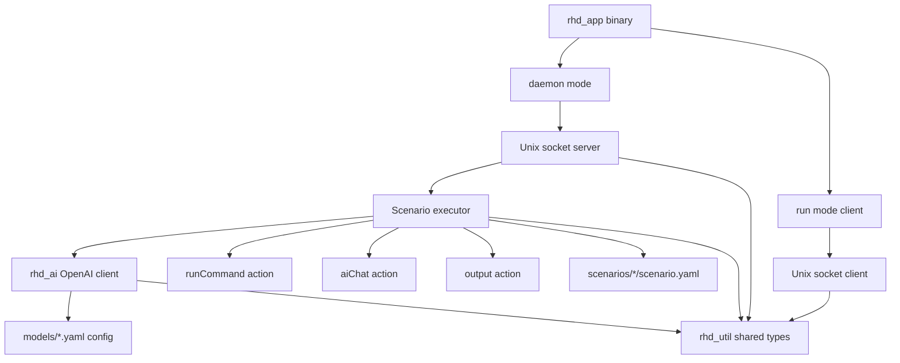

# RHD Bootstrap Implementation Plan

## Overview
Multi-crate Rust workspace for AI-automated task execution via daemon/client architecture.

## Architecture



## Phase 1: Project Structure

### Step 1.1: Initialize Cargo workspace
- Create root `Cargo.toml` with workspace members
- Create `packages/` directory
- Add workspace dependencies: tokio, serde, serde_yaml, rkyv, reqwest, thiserror

### Step 1.2: Create rhd_util crate
- `packages/rhd_util/Cargo.toml`
- Define shared error types using thiserror
- Define common traits (if needed)

### Step 1.3: Create rhd_ai crate
- `packages/rhd_ai/Cargo.toml`
- Dependencies: reqwest, serde, rhd_util

### Step 1.4: Create rhd_app crate
- `packages/rhd_app/Cargo.toml`
- Dependencies: tokio, clap, rhd_ai, rhd_util, serde_yaml, rkyv

## Phase 2: Configuration & Models

### Step 2.1: Define model config structure
- In `rhd_ai`: create `ModelConfig` struct (baseUrl, apiKey, model)
- Implement YAML deserialization with manual validation
- Validate unknown fields, report exact error locations

### Step 2.2: Implement model loader
- Function to load all `models/*.yaml` files
- Validate each config on load
- Return error with file path + line number on failure
- Store in HashMap<String, ModelConfig>

### Step 2.3: Add model validation on daemon startup
- Load all models before socket bind
- Exit with error if any model invalid or missing

## Phase 3: Scenario Definition

### Step 3.1: Define scenario YAML schema
- In `rhd_app`: create `Scenario` struct
- Define action types: RunCommand, AiChat, Output
- Each action has optional `name` field
- Use serde_yaml with manual validation for error reporting

### Step 3.2: Implement scenario loader
- Load `scenarios/<name>/scenario.yaml`
- Validate structure, report errors with line numbers
- Check all referenced models exist in loaded configs
- Check placeholder references are valid (step names exist)

### Step 3.3: Implement placeholder system
- Parse `%stepName.field%` patterns
- Resolve against execution context
- Handle missing values (replace with empty string)
- Special handling: exitCode always available, stdoutStderr empty on failure

## Phase 4: IPC Protocol

### Step 4.1: Define rkyv message types
- Create `IpcRequest` enum: RunScenario { name: String }
- Create `IpcResponse` enum: Success { output: String }, Error { message: String }
- Implement rkyv Archive/Serialize/Deserialize with manual version field

### Step 4.2: Implement protocol framing
- Length-prefixed messages (4-byte big-endian length + rkyv payload)
- Helper functions: write_message, read_message
- Handle partial reads/writes

## Phase 5: AI Integration

### Step 5.1: Implement OpenAI-compatible client
- In `rhd_ai`: create `OpenAiClient` struct
- Method: `chat(model: &str, system: &str, message: &str) -> Result<String>`
- Use reqwest for HTTP POST to `{baseUrl}/chat/completions`
- Parse response, extract `choices[0].message.content`
- Handle API errors, timeouts

### Step 5.2: Add AI error handling
- Return structured errors with provider message
- Distinguish network errors vs API errors
- Include model name in error context

## Phase 6: Action Execution

### Step 6.1: Implement runCommand action
- Execute command with tokio::process::Command
- Capture exit code, stdout+stderr combined
- Never fail scenario on non-zero exit
- Store results in execution context

### Step 6.2: Implement aiChat action
- Resolve model from config
- Resolve placeholders in systemPrompt and message
- Call OpenAI client
- Store response in context as `message` field
- On failure: store error, mark step as failed

### Step 6.3: Implement output action
- Resolve placeholders in output template
- Return final string (no storage in context)

### Step 6.4: Implement scenario executor
- Load scenario, validate
- Execute actions sequentially
- Build context map: step_name -> { exitCode, stdoutStderr, message }
- Return final output or error

## Phase 7: Daemon

### Step 7.1: Implement Unix socket server
- Bind to `./rhd.sock` in current directory
- Accept connections with tokio::net::UnixListener
- Spawn task per connection

### Step 7.2: Implement request handler
- Read IpcRequest from socket
- Match on RunScenario: call executor
- Send IpcResponse back
- Handle errors, send Error response

### Step 7.3: Implement daemon main loop
- Parse CLI args (clap)
- If `daemon`: load models, bind socket, accept loop
- Graceful shutdown on SIGTERM/SIGINT

## Phase 8: Client

### Step 8.1: Implement Unix socket client
- Connect to `./rhd.sock`
- Send IpcRequest::RunScenario
- Read IpcResponse
- Handle connection errors (daemon not running)

### Step 8.2: Implement run command
- Parse CLI: `rhd run <name>`
- Connect to socket, send request
- On Success: print output, exit 0
- On Error: print error, exit 1

## Phase 9: Integration

### Step 9.1: Wire up CLI
- clap argument parsing
- Subcommands: daemon, run
- Validate arguments

### Step 9.2: End-to-end testing
- Create test scenario with all action types
- Start daemon, run scenario, verify output
- Test error cases (missing model, invalid YAML, AI failure)

### Step 9.3: Error reporting
- Ensure all errors include context (file, line, step name)
- Test daemon stays alive on scenario errors
- Verify client exit codes

## Key Design Decisions

1. **IPC**: rkyv with manual version field (4-byte version + 4-byte length + payload)
2. **Error handling**: Daemon never stops; runCommand failures continue; aiChat failures return error to client
3. **Config validation**: Strict YAML parsing with exact error locations
4. **Placeholders**: Always resolve exitCode; empty string for missing values
5. **Models**: Loaded once at startup, validated, cached in memory

## File Structure

```
rhd/
├── Cargo.toml (workspace)
├── packages/
│   ├── rhd_util/
│   │   ├── Cargo.toml
│   │   └── src/lib.rs
│   ├── rhd_ai/
│   │   ├── Cargo.toml
│   │   └── src/
│   │       ├── lib.rs
│   │       ├── client.rs
│   │       └── config.rs
│   └── rhd_app/
│       ├── Cargo.toml
│       └── src/
│           ├── main.rs
│           ├── cli.rs
│           ├── daemon.rs
│           ├── client.rs
│           ├── scenario/
│           │   ├── mod.rs
│           │   ├── loader.rs
│           │   ├── executor.rs
│           │   └── placeholder.rs
│           ├── ipc/
│           │   ├── mod.rs
│           │   └── protocol.rs
│           └── model/
│               ├── mod.rs
│               └── loader.rs
```
