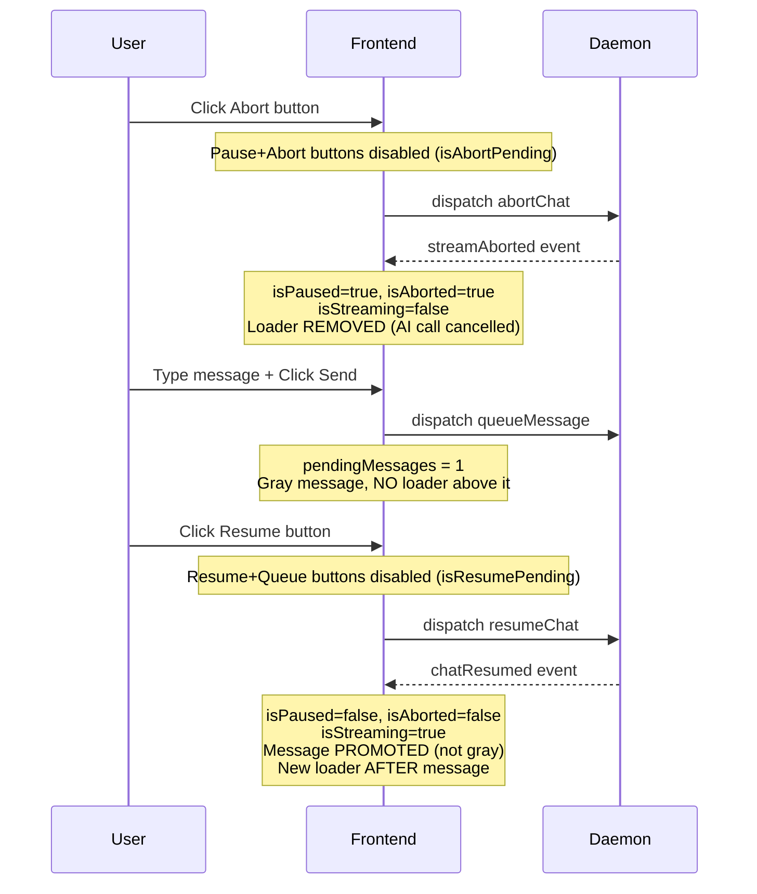

# Plan: Fix Abort During AI Call Story — Button States, Loader Removal, Promotion on Resume

## Problem

The current abort story has several UX and behavioral issues:

1. **Abort button not disabled after click** — user can click abort/pause multiple times before backend responds
2. **Loader stays after abort** — `showLoader` condition includes `isPaused` which is true after abort, but the AI call was cancelled so no loader should show
3. **Unnecessary `streamFinished while aborted` step** — abort cancels the AI call, so there's no stream to finish
4. **All four buttons visible after clicking resume** — `resumeChat()` optimistically sets `isPaused=false` and `isStreaming=true` but NOT `isAborted=false`, causing pause/abort/resume/queue to all appear
5. **Message stays gray after `chatResumed`** — in abort flow, the AI call was cancelled, so on resume the daemon immediately starts a new call with the queued message. The message should be promoted immediately on `chatResumed`, not on `chatStreamFinished`
6. **Unnecessary `streamFinished` and `chatMessageAdded` steps** — the aborted call was cancelled (no stream to finish), and promotion happens on `chatResumed`

## Root Cause

- [`operations.ts:248-264`](frontend/src/lib/chatWs/operations.ts:248) — `resumeChat()` optimistically changes `isPaused` and `isStreaming` without setting `isAborted=false`, and without a pending state to prevent double-clicks
- [`MessageList.svelte:35`](frontend/src/components/MessageList.svelte:35) — `showLoader = ($isStreaming || $isPaused) && !$streamingMessageId` shows loader when `isPaused=true` even after abort
- [`events.ts:357-362`](frontend/src/lib/chatWs/events.ts:357) — `chatResumed` handler doesn't promote pending messages, relying on `chatStreamFinished` instead

## Changes

### 1. Remove optimistic state change from `resumeChat()`

**File**: [`frontend/src/lib/chatWs/operations.ts`](frontend/src/lib/chatWs/operations.ts:248)

Remove the lines that set `isPaused=false` and `isStreaming=true` before sending the request. State should only change when the `chatResumed` event is received from the backend. This prevents the UI from showing pause/abort buttons prematurely and allows the `isResumePending` state to control button disabling.

```typescript
export async function resumeChat(): Promise<WsResponse> {
  const chatId = get(currentChatId);
  if (!chatId) return { id: '', type: 'response', success: false, error: 'No chat selected' };

  const id = generateRequestId();
  const response = await sendRequest({ type: 'resumeChat', id, chatId });
  return response;
}
```

### 2. Add `isAbortPending` and `isResumePending` states to MessageInput

**File**: [`frontend/src/components/MessageInput.svelte`](frontend/src/components/MessageInput.svelte)

Add two local pending states that disable buttons while waiting for backend response:

```typescript
let isAbortPending = false;
let isResumePending = false;

$: if ($isPaused) {
  isPausePending = false;
  isAbortPending = false;
}

$: if (!$isPaused && !$isAborted) {
  isResumePending = false;
}

function abort() {
  isAbortPending = true;
  dispatch({ type: 'abortChat' });
}

function resume() {
  isResumePending = true;
  dispatch({ type: 'resumeChat' });
}
```

Update button disabled attributes:
- Pause button: `disabled={isPausePending || isAbortPending}`
- Abort button: `disabled={isAbortPending}`
- Resume button: `disabled={isResumePending}`
- Send/Queue button: `disabled={!input.trim() || !$currentChatId || hasMcpError || isResumePending}`

### 3. Hide loader when aborted

**File**: [`frontend/src/components/MessageList.svelte`](frontend/src/components/MessageList.svelte:35)

Import `isAborted` and change the `showLoader` condition:

```svelte
$: showLoader = ($isStreaming || ($isPaused && !$isAborted)) && !$streamingMessageId;
```

This hides the loader when `isAborted=true` (the AI call was cancelled), while keeping it visible when `isPaused=true && isAborted=false` (the AI call is still running in the pause flow).

### 4. Promote pending messages on `chatResumed` when aborted

**File**: [`frontend/src/lib/chatWs/events.ts`](frontend/src/lib/chatWs/events.ts:357)

In the abort flow, the AI call was cancelled, so on resume the daemon immediately starts a new call with the queued message. Promote pending messages immediately on `chatResumed` when the previous state was aborted:

```typescript
case 'chatResumed': {
  const wasAborted = get(isAborted);
  isPaused.set(false);
  isAborted.set(false);
  isStreaming.set(true);
  if (wasAborted) {
    promotePendingMessagesToChat();
  }
  break;
}
```

In the pause flow, `wasAborted=false`, so no promotion happens — the message stays gray until `chatStreamFinished` (unchanged behavior).

### 5. Revise story steps

**File**: [`frontend/src/stories/pause-abort/AbortDuringAiCall.stories.ts`](frontend/src/stories/pause-abort/AbortDuringAiCall.stories.ts)

Revised 8-step flow (down from 11):

| Step | Name | Action | Verifies |
|------|------|--------|----------|
| 0 | `setup` | Reset stores, isStreaming=true, isPaused=false, isAborted=false, streamingMessageId=null, 1 user message. Mock WS handlers. | isStreaming=true, isPaused=false, isAborted=false |
| 1 | `click abort` | Click abort button | abortChat dispatched (mocked) |
| 2 | `daemon response: streamAborted` | dispatch streamAborted | isPaused=true, isAborted=true, isStreaming=false, streamingMessageId=null |
| 3 | `type message` | Set textarea value | Input has "Please continue later" |
| 4 | `click send (queue)` | Click send button | pendingMessages.length === 1 |
| 5 | `click resume` | Click resume button | resumeChat dispatched (mocked) |
| 6 | `daemon response: chatResumed` | dispatch chatResumed | isPaused=false, isAborted=false, isStreaming=true, pendingMessages.length === 0 (promoted), promoted message in messages |
| 7 | `verify final state` | Verify final state | isPaused=false, isStreaming=true |

**Removed steps**: `streamFinished while aborted`, `streamFinished` (after resume), `chatMessageAdded` — all unnecessary because abort cancels the AI call and promotion happens on `chatResumed`.

### 6. Revise Playwright spec

**File**: [`frontend/tests/storybook/abort-during-ai-call.spec.ts`](frontend/tests/storybook/abort-during-ai-call.spec.ts)

Key assertions per step:

- **After step 0** (setup): Loader visible, abort button visible
- **After step 1** (click abort): Pause and abort buttons are **disabled** (pending state)
- **After step 2** (streamAborted): Loader **NOT visible** (AI call cancelled). Resume button visible. Abort/pause buttons NOT visible.
- **After step 4** (click send/queue): Pending message visible, gray, `data-pending="true"`. Exactly 1 copy. **No loader** above the pending message (unlike pause flow where loader stays).
- **After step 5** (click resume): Resume button **disabled**. Queue button **disabled**. Only resume and queue visible.
- **After step 6** (chatResumed): Promoted message visible, **NOT gray**, no `data-pending`. Loader visible **after** the promoted message (new AI call). Exactly 1 copy. DOM order: original user → promoted user → loader.
- **After step 7** (verify): "All steps completed" visible.

### 7. Update pause story test for resume button disabled state

**File**: [`frontend/tests/storybook/pause-during-ai-call.spec.ts`](frontend/tests/storybook/pause-during-ai-call.spec.ts)

Since `resumeChat()` no longer optimistically changes state, after clicking resume (step 5 in pause story):
- Resume button is **visible but disabled** (was: not visible)
- Pause/abort buttons are **NOT visible** (was: visible)
- Queue button is **visible but disabled**

Update the assertions at step 13 (after clicking resume):
```typescript
// Resume button is visible but disabled (pending state)
await expect(page.locator('[data-testid="resume-button"]')).toBeVisible();
await expect(page.locator('[data-testid="resume-button"]')).toBeDisabled();
// Pause/abort buttons NOT visible (isStreaming=false, isPaused=true)
await expect(page.locator('[data-testid="pause-button"]')).not.toBeVisible();
```

### 8. Update abort e2e test

**File**: [`frontend/src/tests/e2e/chat-state.test.ts`](frontend/src/tests/e2e/chat-state.test.ts:561)

Update the abort e2e test to reflect promotion on `chatResumed`:
- After `chatResumed`: `pendingMessages.length === 0` (promoted, was: 1)
- After `chatResumed`: `messages` contains the promoted user message
- Remove the second `chatStreamFinished` step (no stream to finish after abort)
- Remove the `chatMessageAdded` step (promotion already happened on `chatResumed`)

Keep the `chatStreamFinished` while aborted step (line 604) as an edge-case guard test — it verifies that `chatStreamFinished` while `isAborted=true` does NOT promote.

### 9. Update test case

**File**: [`tests/cases/pause-abort/abort-during-ai-call.md`](tests/cases/pause-abort/abort-during-ai-call.md)

Update steps to reflect the new behavior:
- Step 17: Remove "below the loader" (no loader after abort)
- Step 29: Change to "System promotes the queued message immediately on `chatResumed` because the aborted AI call was cancelled (no result to wait for)"
- Remove steps 30-31 (no `chatStreamFinished` or `chatMessageAdded` needed for promotion)

## Files to Modify

| File | Change |
|------|--------|
| [`frontend/src/lib/chatWs/operations.ts`](frontend/src/lib/chatWs/operations.ts) | Remove optimistic state from `resumeChat()` |
| [`frontend/src/components/MessageInput.svelte`](frontend/src/components/MessageInput.svelte) | Add `isAbortPending`, `isResumePending`, update disabled attrs |
| [`frontend/src/components/MessageList.svelte`](frontend/src/components/MessageList.svelte) | Import `isAborted`, change `showLoader` condition |
| [`frontend/src/lib/chatWs/events.ts`](frontend/src/lib/chatWs/events.ts) | Promote on `chatResumed` when `wasAborted` |
| [`frontend/src/stories/pause-abort/AbortDuringAiCall.stories.ts`](frontend/src/stories/pause-abort/AbortDuringAiCall.stories.ts) | Revise to 8 steps |
| [`frontend/tests/storybook/abort-during-ai-call.spec.ts`](frontend/tests/storybook/abort-during-ai-call.spec.ts) | Revise assertions |
| [`frontend/tests/storybook/pause-during-ai-call.spec.ts`](frontend/tests/storybook/pause-during-ai-call.spec.ts) | Update resume button assertions |
| [`frontend/src/tests/e2e/chat-state.test.ts`](frontend/src/tests/e2e/chat-state.test.ts) | Update abort e2e test |
| [`tests/cases/pause-abort/abort-during-ai-call.md`](tests/cases/pause-abort/abort-during-ai-call.md) | Update test case steps |

## Flow Diagram


