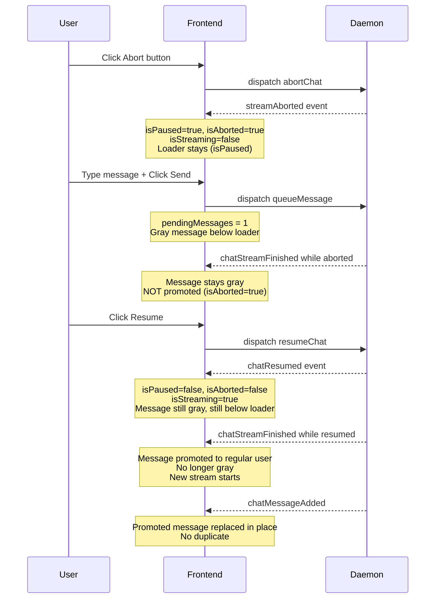

# Plan: Abort During AI Call — Storybook Story & Test

## Goal

Create a Storybook story with interactive step controls and a Playwright spec for the `tests/cases/pause-abort/abort-during-ai-call.md` test case, mirroring the existing `PauseDuringAiCall` story/test pattern. This will allow step-by-step verification of the abort flow in the browser, covering abort → queue → resume → promotion → confirmation.

## Background

The existing `PauseDuringAiCall` story ([`PauseDuringAiCall.stories.ts`](frontend/src/stories/pause-abort/PauseDuringAiCall.stories.ts)) and its Playwright spec ([`pause-during-ai-call.spec.ts`](frontend/tests/storybook/pause-during-ai-call.spec.ts)) provide the template. The abort flow differs in these key ways:

1. **Abort button** instead of pause button — dispatches `abortChat` (not `pauseChat`).
2. **`streamAborted` event** instead of `chatPaused` — sets `isPaused=true`, `isAborted=true`, `isStreaming=false`, removes the optimistic streaming message.
3. **`chatStreamFinished` while aborted does NOT promote** the pending message — it stays gray because `isAborted=true` guards the `promotePendingMessagesToChat()` call in [`events.ts`](frontend/src/lib/chatWs/events.ts:107).
4. After **resume** (`chatResumed`), `isAborted=false`, `isPaused=false`, `isStreaming=true` — the pending message stays gray until the next `chatStreamFinished`.
5. **`chatStreamFinished` while resumed promotes** the queued message into `messages` as a regular user message (no longer gray).
6. **`chatMessageAdded`** replaces the promoted message in place (no duplicate).

## Code Changes

### 1. Add `ABORT_BUTTON` test ID

**File**: [`frontend/src/stories/testIds.ts`](frontend/src/stories/testIds.ts)

Add `ABORT_BUTTON: 'abort-button'` to the `TEST_IDS` object. The abort button currently has no `data-testid`, which makes it impossible to target reliably in Playwright tests.

### 2. Add `data-testid` to abort button

**File**: [`frontend/src/components/MessageInput.svelte`](frontend/src/components/MessageInput.svelte:120)

Change:
```svelte
<button on:click={abort} class="abort-btn">Abort</button>
```
To:
```svelte
<button on:click={abort} class="abort-btn" data-testid={TEST_IDS.ABORT_BUTTON}>Abort</button>
```

### 3. Create Story: `AbortDuringAiCall.stories.ts`

**File**: `frontend/src/stories/pause-abort/AbortDuringAiCall.stories.ts` (new file)

Mirror the structure of [`PauseDuringAiCall.stories.ts`](frontend/src/stories/pause-abort/PauseDuringAiCall.stories.ts) but adapt the steps for the abort flow. Reuse the existing `ChatViewWithControls.svelte` wrapper.

**Story title**: `Pause-Abort/AbortDuringAiCall`
**Story export**: `WithControls`

#### Story Steps (10 steps + verify):

| Step | Name | Action | State After |
|------|------|--------|-------------|
| 0 | `setup` | Reset stores, set `isStreaming=true`, `isPaused=false`, `isAborted=false`, `streamingMessageId=null`, 1 user message. Register mock WS handlers for `abortChat`, `resumeChat`, `queueMessage`. | Loader visible, streaming |
| 1 | `click abort` | Click `[data-testid="abort-button"]` | `abortChat` dispatched |
| 2 | `daemon response: streamAborted` | `dispatch({ type: 'streamAborted' })`. Verify `isPaused=true`, `isAborted=true`, `isStreaming=false`, `streamingMessageId=null`. | Aborted, loader still visible (isPaused=true) |
| 3 | `type message` | Set textarea value to `'Please continue later'`, dispatch input event | Input populated |
| 4 | `click send (queue)` | Click `[data-testid="send-button"]`. Verify `pendingMessages.length === 1`. | Gray pending message below loader |
| 5 | `daemon response: streamFinished while aborted` | `dispatch({ type: 'chatStreamFinished' })`. Verify `isAborted=true`, `pendingMessages.length === 1` (NOT promoted). | Message stays gray, loader still visible |
| 6 | `click resume` | Click `[data-testid="resume-button"]` | `resumeChat` dispatched |
| 7 | `daemon response: chatResumed` | `dispatch({ type: 'chatResumed' })`. Verify `isPaused=false`, `isAborted=false`, `isStreaming=true`. Verify pending message still gray, still below loader. | Resumed, new stream starting, message still gray |
| 8 | `daemon response: streamFinished` | Add AI response message to `messages`, `dispatch({ type: 'chatStreamFinished' })`, set `isStreaming=true` + `streamingMessageId=null` (new call for queued message). Verify `pendingMessages.length === 0`, promoted message in `messages`. | Message promoted (no longer gray), new loader for next call |
| 9 | `daemon response: chatMessageAdded` | `dispatch({ type: 'chatMessageAdded', payload: { message: { id, chatId, role: 'user', content: 'Please continue later', ... } } })`. Verify exactly 1 copy of the message, no pending messages. | Promoted message replaced in place by confirmed message |
| 10 | `verify final state` | Verify `isPaused=false`, `isStreaming=true`. Clear mock handlers. | All steps completed |

### 4. Create Playwright Spec: `abort-during-ai-call.spec.ts`

**File**: `frontend/tests/storybook/abort-during-ai-call.spec.ts` (new file)

Mirror the structure of [`pause-during-ai-call.spec.ts`](frontend/tests/storybook/pause-during-ai-call.spec.ts). Navigate to the story, click step buttons sequentially, and verify UI state after each step.

**Story URL**: `/iframe.html?globals=&id=pause-abort-abortduringaicall--with-controls&viewMode=story`

#### Test Assertions Per Step:

- **After step 0** (setup): Streaming loader (`[data-testid="streaming-message"]`) is visible. Abort button is visible.
- **After step 1** (click abort): Abort button click dispatched. (No immediate state change — waiting for daemon.)
- **After step 2** (streamAborted): Loader still visible (`isPaused=true`). Resume button visible. Abort button no longer visible (`isStreaming=false`). No pending messages yet.
- **After step 3** (type message): Input has value `'Please continue later'`.
- **After step 4** (click send/queue): Pending message visible with `data-pending="true"`, `data-role="user"`, gray background (`rgb(245, 245, 245)`). Exactly 1 copy. Loader is above the pending message (loader y < pending y).
- **After step 5** (streamFinished while aborted): Pending message still visible, still gray, still `data-pending="true"`. Exactly 1 copy. Loader still visible. Message NOT promoted.
- **After step 6** (click resume): Resume dispatched. (No immediate state change — waiting for daemon.)
- **After step 7** (chatResumed): Loader visible (new stream). Pending message still gray, still below loader. Exactly 1 copy. Pause/abort buttons visible again, resume hidden.
- **After step 8** (streamFinished): AI response message visible. Promoted user message visible, no longer `data-pending`, no longer gray. `data-pending="true"` count is 0. Exactly 1 copy of the queued message. New loader visible for the next call. DOM order: original user → AI response → promoted user → loader.
- **After step 9** (chatMessageAdded): Promoted message replaced in place. Exactly 1 copy. No pending messages.
- **After step 10** (verify final state): "All steps completed" button visible.

### 5. Update Test Case Coverage Reference

**File**: [`tests/cases/pause-abort/abort-during-ai-call.md`](tests/cases/pause-abort/abort-during-ai-call.md)

Add a Storybook Tests section under "Covered By":

```markdown
### Storybook Tests
- [`abort-during-ai-call.spec.ts`](../../../frontend/tests/storybook/abort-during-ai-call.spec.ts) - `aborts during AI call and resumes without aborted message` (steps 1-31, incl. ordering, gray styling, aborted-while-finished guard, and promotion) - Line 7
```

## Flow Diagram



## Files to Create/Modify

| File | Action |
|------|--------|
| [`frontend/src/stories/testIds.ts`](frontend/src/stories/testIds.ts) | Modify — add `ABORT_BUTTON` |
| [`frontend/src/components/MessageInput.svelte`](frontend/src/components/MessageInput.svelte) | Modify — add `data-testid` to abort button |
| `frontend/src/stories/pause-abort/AbortDuringAiCall.stories.ts` | Create — new story with 11 steps |
| `frontend/tests/storybook/abort-during-ai-call.spec.ts` | Create — new Playwright spec |
| [`tests/cases/pause-abort/abort-during-ai-call.md`](tests/cases/pause-abort/abort-during-ai-call.md) | Modify — add Storybook test coverage reference |

## Running the Tests

```bash
cd frontend && npm run test-storybook
```

This auto-starts Storybook and runs all Playwright specs in `frontend/tests/storybook/`.
