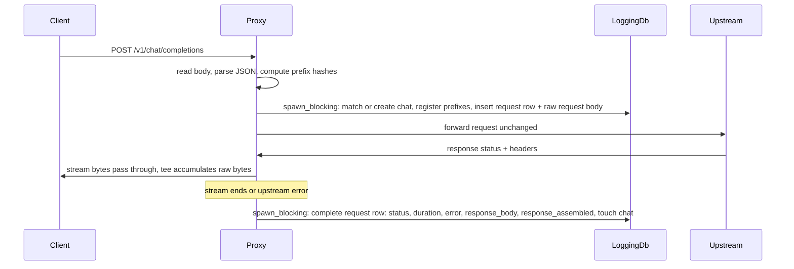

# AI Proxy Chat Logging

## Goal

Add optional chat logging to `rhd_ai_proxy`: when a `logging` section is present in the proxy
config, a standalone SQLite database (not `rhd_db` — different database, separate schema) is
created and every chat-completions request passing through the proxy is recorded. The purpose is
debugging: enable logging, then inspect which chats passed through and exactly what the harness
sent and received.

Decisions confirmed with the user:

- Raw table stores the **original incoming request body** (pre-`extraBody`-injection — injection
  is derivable from config; the question is what the harness sent).
- Streaming responses store the **concatenated raw SSE bytes** *and* an **assembled assistant
  message** (parsed from the SSE deltas).
- Only completions requests (parse as JSON object with a non-empty `messages` array) are logged;
  other endpoints (`/models`, embeddings, GETs) are not logged at all.
- Inspection via **README + example SQL queries** and any SQLite client; no custom UI/subcommand.

## Background / Key Facts

- The OpenAI-compatible completions API is **stateless**: no chat/session identifier exists.
  Every request carries the full `messages` history. Continuation detection must be done by
  prefix matching on that history.
- Workspace `serde_json` does **not** enable `preserve_order` → `Map` is a `BTreeMap` →
  serialization has deterministically sorted keys. `serde_json::to_string` of a message `Value`
  is a stable canonical form within this binary.
- `rusqlite` 0.31 (bundled) and `chrono` are already workspace dependencies. The project's
  established SQLite pattern is `Mutex<Connection>` with plain sync query functions (see
  `rhd_db`) — we replicate the pattern in `rhd_ai_proxy` without depending on `rhd_db`.
- New dependency needed for hashing: `blake3` (fast, no transitive baggage, 32-byte digests).
- Files must stay under 500 lines; strict YAML parsing (`deny_unknown_fields`, camelCase keys).

## Configuration

```yaml
proxy:
  port: 1234
  target:
    path: https://example.org/raw/openrouter/v1
    apiKey: sk-...
  models: { ... }
  logging:
    path: ./proxy-logs   # folder for the SQLite DB; relative to the config file itself
```

- `logging` is optional (`Option<Logging>`), with a single required `path` field (folder).
  When present, the proxy creates the folder if needed (`create_dir_all`) and opens/creates
  `chats.sqlite3` inside it at startup (schema `CREATE TABLE IF NOT EXISTS`, WAL mode,
  `foreign_keys=ON`).
- **Path resolution**: relative `logging.path` values are resolved against the config file's
  parent directory. `Config::load` (which knows the config file location) rewrites
  `logging.path` to the resolved absolute path after parsing; `Config::from_yaml` leaves it as
  written. Tests that construct `ProxyConfig` directly use absolute paths.
- Validation is strict as usual: unknown fields in `logging` are rejected.

## Chat Identity: Rolling Prefix Hashes

The stateless API forces heuristic grouping. Design:

- Canonical form of a message: `serde_json::to_string(&message_value)` (sorted keys).
- Hash chain: `h₀ = blake3("rhd_ai_proxy_chat_seed")`; `hᵢ = blake3(hᵢ₋₁ ‖ canonical(msgᵢ))`.
  Each request with `M` messages computes `h₁..h_M` (all prefix hashes of its history).
- **Matching**: on each logged request, look up prefix hashes longest-first in `prefix_hashes`;
  the first hit assigns that chat. No hit → create a new chat (title from the first `user`
  message content — string or concatenated text parts of the parts-array form — truncated to
  ~100 chars; model from the request body).
- **Registration**: after assignment, register all of the request's prefix hashes → its chat_id
  (`INSERT OR REPLACE`; when two chats share a prefix, the most recently registered chat wins —
  documented behavior).

Behavioral properties:

- Append-only harnesses (the normal case): request *n+1*'s history starts with request *n*'s
  full history (+ assistant reply + new user turn) → longest match chains to the same chat.
- Identical retry of a previous request → same chat (its full-history hash is registered).
- Edited/branched history → hash chain diverges at the edit point → new chat (arguably
  correct: it is a different continuation).
- **Limitation** (documented in README): a harness that mutates earlier messages mid-chat
  (e.g. rewrites the system prompt with changing context) breaks the chain → new chat.
  Unavoidable without client-supplied IDs; acceptable for a debugging tool.
- Storage cost: every request stores its full raw body → O(N²) per chat over its lifetime.
  Fine for a debug tool; the DB is disposable.

## Database Schema

```sql
CREATE TABLE IF NOT EXISTS chats (
    id         INTEGER PRIMARY KEY,
    title      TEXT NOT NULL,
    model      TEXT,
    created_at TEXT NOT NULL,   -- RFC3339 (chrono)
    updated_at TEXT NOT NULL
);

CREATE TABLE IF NOT EXISTS prefix_hashes (
    hash    BLOB PRIMARY KEY,   -- 32-byte blake3 digest of a message-prefix chain
    chat_id INTEGER NOT NULL REFERENCES chats(id)
);

CREATE TABLE IF NOT EXISTS requests (
    id                INTEGER PRIMARY KEY,
    chat_id           INTEGER NOT NULL REFERENCES chats(id),
    ts                TEXT NOT NULL,
    method            TEXT NOT NULL,
    path              TEXT NOT NULL,
    model             TEXT,
    stream            INTEGER NOT NULL DEFAULT 0,
    status            INTEGER,          -- NULL until the response completes
    duration_ms       INTEGER,
    error             TEXT,             -- proxy/upstream failure description, else NULL
    response_assembled TEXT             -- assembled assistant message JSON, when parseable
);

CREATE TABLE IF NOT EXISTS raw (
    request_id   INTEGER PRIMARY KEY REFERENCES requests(id),
    request_body BLOB NOT NULL,         -- original incoming bytes (pre-injection)
    response_body BLOB                  -- full raw response bytes; concatenated SSE when streaming
);

CREATE INDEX IF NOT EXISTS idx_requests_chat ON requests(chat_id, id);
```

## Request Flow With Logging Enabled



Integration details:

- `ProxyState` gains `logging: Option<Arc<LoggingDb>>` (constructed in `ProxyState::new` from
  the already-resolved config; `None` → zero logging overhead, byte-identical behavior).
- **Insert at request time**: after the body is read and parsed (so mid-stream crashes still
  leave the harness's request in the DB), the request row is inserted with `status = NULL` and
  the original incoming bytes go into `raw.request_body`.
- **Tee stream**: the upstream `bytes_stream` is wrapped (via `async_stream::stream!`, promoted
  from dev-dependency) so chunks pass through to the client unchanged while being appended to a
  buffer. When the stream ends (or errors), a `tokio::spawn` + `spawn_blocking` persists the
  accumulated bytes. Pass-through latency is unaffected (no buffering of the client path).
- **Upstream send failure** (currently a 502): the request row is completed with the error text
  and empty response — valuable for debugging.
- **Assembled message**: if the request body had `stream: true` (or response content-type is
  `text/event-stream`), the concatenated bytes are parsed as SSE and the assistant message is
  assembled (below); otherwise the raw response is parsed as JSON and
  `choices[0].message` is stored. Any parse failure → `response_assembled = NULL`; raw bytes
  are always preserved.
- **Failure isolation**: every logging step runs in `spawn_blocking` and its errors are
  reported via `tracing::warn!`/`error!` only. Logging must never break proxying, never delay
  the client path beyond the unavoidable spawn, and never alter responses.
- Single `Mutex<Connection>` is acceptable contention-wise at personal-proxy scale; timestamps
  are `chrono::Utc::now().to_rfc3339()`.

## SSE Assembly

`src/logging/sse.rs` parses concatenated SSE bytes (`data: {...}` lines, blank-line separated,
`data: [DONE]` terminator) and merges OpenAI chunk deltas into one message:

- `role`: from the first chunk carrying it (default `assistant`); `content`: concatenation of
  `choices[0].delta.content` string deltas.
- `tool_calls`: merged by `index` — `id`/`function.name` from the first fragment carrying them,
  `function.arguments` concatenated across fragments.
- `finish_reason`: from the first non-null value.
- Unusual/malformed chunks (refusal-only deltas, missing choices, non-JSON payloads) are
  tolerated: assembly continues; total failure → `NULL`. The same module extracts
  `choices[0].message` for non-streaming JSON responses.

## File Changes

| File | Change |
|------|--------|
| `Cargo.toml` (workspace) | add `blake3` to workspace deps |
| `packages/rhd_ai_proxy/Cargo.toml` | deps: `rusqlite`, `chrono`, `blake3`; move `async_stream` from dev-deps to deps |
| `packages/rhd_ai_proxy/src/config.rs` | `Logging` struct (`path`), resolution in `Config::load`, tests |
| `packages/rhd_ai_proxy/src/logging/mod.rs` | module root; `LoggingDb` open/init (schema, WAL, FK) |
| `packages/rhd_ai_proxy/src/logging/db.rs` | sync query fns: chat match/create, prefix registration, request insert/complete |
| `packages/rhd_ai_proxy/src/logging/chat_match.rs` | canonical form, hash chain, longest-prefix lookup input prep, title extraction |
| `packages/rhd_ai_proxy/src/logging/sse.rs` | SSE parse + assembly, non-stream message extraction |
| `packages/rhd_ai_proxy/src/proxy.rs` | `ProxyState.logging`, handler integration, tee stream wrapper |
| `packages/rhd_ai_proxy/src/main.rs` | open DB when `logging` present, startup log line |
| `packages/rhd_ai_proxy/tests/logging_tests.rs` | integration tests (separate file keeps test files small) |
| `packages/rhd_ai_proxy/tests/proxy_tests.rs` | unchanged expectations; helper updated to construct `ProxyConfig` with `logging: None` |
| `packages/rhd_ai_proxy/README.md` | logging config docs, schema reference, example SQL queries |
| `packages/rhd_ai_proxy/proxy.example.yaml` | add `logging` section |

## Tests

Unit (in-module, following existing patterns):

- `config.rs`: `logging` parses; absent → `None`; unknown field rejected; relative `path`
  resolved against the config file location in `Config::load`.
- `chat_match.rs`: hash determinism; same messages → same hashes; one-message difference →
  diverging chain; title from string content, parts-array content, truncation; empty/missing
  messages → no logging candidate.
- `db.rs`: schema init idempotent; create chat → register prefixes → longest match wins over
  shorter; `INSERT OR REPLACE` gives latest chat on shared prefix; request insert/complete
  lifecycle.
- `sse.rs`: content delta concat; tool_calls merge (id/name once, arguments split across
  chunks); `[DONE]`; malformed JSON chunk tolerated; non-stream `choices[0].message`
  extraction; garbage → `None`.

Integration (`tests/logging_tests.rs`, style of `proxy_tests.rs` — local upstream + spawned
proxy; temp DB dirs via unique folders under `std::env::temp_dir()` + cleanup helper):

- Non-stream request → chat created, raw request/response stored, `response_assembled` equals
  upstream message, status/duration filled.
- Two requests where the second's `messages` extend the first's → same `chat_id`; unrelated
  request → new chat; identical retry → same chat.
- SSE upstream (existing `SseUpstream` pattern) → after the client consumed the full stream,
  `response_body` contains all chunks verbatim and `response_assembled` holds the merged
  message; incremental pass-through still holds.
- Upstream 500 and unreachable-upstream 502 → request row completed with `error`/status set.
- Original body stored pre-injection (configure `extraBody`, assert stored bytes lack injected
  keys while upstream received them).
- No `logging` section → no DB file created, existing behavior.

## Risks / Notes

- O(N²) raw storage per chat (full history per request) — acceptable, disposable DB.
- Prefix-hash collision risk with blake3 is negligible; matches are exact-prefix, not fuzzy.
- Shared-prefix chats resolve to the most recent registration (documented).
- System-prompt mutation mid-chat creates a new chat (documented limitation).
- `rusqlite` bundled adds compile time to this crate only.

## Success Criteria

- Without `logging`: all existing tests pass, zero behavior change, no DB file.
- With `logging`: every completions request appears in the DB with original raw bytes;
  continuations grouped under one chat id; streamed responses captured verbatim after stream
  end plus assembled message; failures recorded with error text; README's SQL examples answer
  "list my chats" and "show everything my harness sent".

## Implementation Order

1. Config section + resolution + tests
2. Dependencies (workspace `blake3`; crate `rusqlite`/`chrono`/`blake3`; `async_stream` move)
3. `logging::db` — open/schema/queries + tests
4. `logging::chat_match` — hashing/matching/title + tests
5. `logging::sse` — SSE assembly + extraction + tests
6. `proxy.rs` integration — tee stream + lifecycle logging
7. `main.rs` wiring
8. Integration tests
9. README + example yaml
10. `mise run check` + `cargo test -p rhd_ai_proxy`
