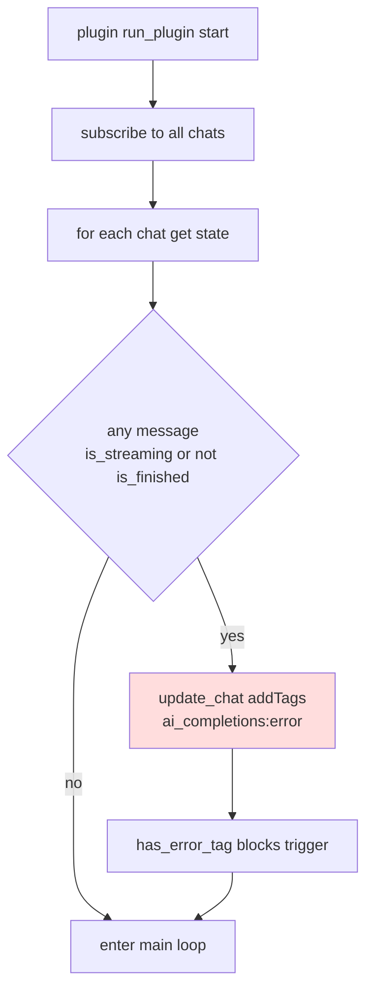
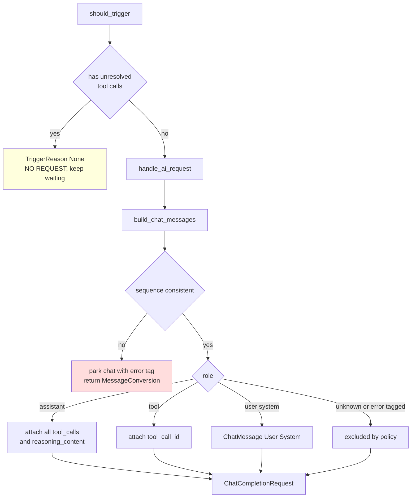
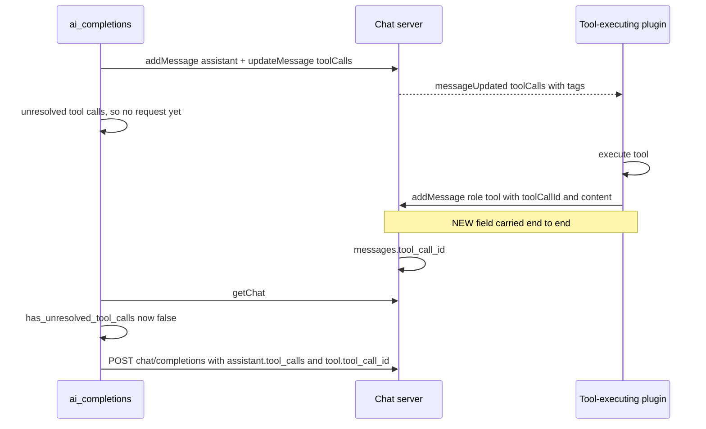

# AI Completions Request Fidelity — Plan

Follows [`tool-call-tags-plan.md`](tool-call-tags-plan.md) (implemented: `Message.tool_calls` + per-call `tags` + `updateToolCallTags`).

## Goal

Make the request the `rhd_plugin_ai_completions` plugin sends to the provider a **faithful** rendering of the stored chat history:

1. **Pass assistant `tool_calls`** to the AI instead of dropping them.
2. **Support `tool_call_id`** end-to-end so a `tool`-role message can be created and replayed correctly. Nobody creates tool messages today — this plan lays the ground so it becomes possible.
3. **Pass `reasoning_content`** for assistant messages when it is present.
4. **Drop messages with unknown roles** instead of coercing them into `user`.

**Core principle: a request is either complete or it is not sent.** We never send a request with tool-call data quietly stripped out of it.

Non-goals: executing tools, the frontend, and **repairing chats corrupted by a plugin crash** (see D6 — detection and parking only).

## Current State (verified)

**The conversion path discards everything but role + content.**

[`convert_to_ai_messages`](../plugins/rhd_plugin_ai_completions/src/ai_request.rs:506) maps only `m.content`:

| Stored on `Message` | Sent to provider | Evidence |
|---|---|---|
| `tool_calls` (assistant) | **dropped** — `tool_calls: None` | [`ai_request.rs:515`](../plugins/rhd_plugin_ai_completions/src/ai_request.rs:515) |
| `tool_call_id` | **does not exist** in the data model | [`mod.rs:35`](../packages/rhd_db/src/chat_db/mod.rs:35), [`common.rs:62`](../packages/rhd_chat_api/src/common.rs:62) |
| `reasoning_content` (assistant) | **dropped** | [`ai_request.rs:513`](../plugins/rhd_plugin_ai_completions/src/ai_request.rs:513) |
| unknown role | **coerced to `user`** | [`ai_request.rs:524`](../plugins/rhd_plugin_ai_completions/src/ai_request.rs:524) |

Supporting facts:

- `tool` messages hardcode `tool_call_id: String::new()` with a TODO ([`ai_request.rs:521`](../plugins/rhd_plugin_ai_completions/src/ai_request.rs:521)) — the provider receives an empty id, which is invalid.
- `messages` / `messages_queue` tables have `tool_calls` and `thinking_content` but **no `tool_call_id`** ([`schema.rs:21`](../packages/rhd_db/src/chat_db/schema.rs:21), [`schema.rs:106`](../packages/rhd_db/src/chat_db/schema.rs:106)).
- `reasoning_content` **already flows** DB → API: `thinking_content` → [`convert_message_to_api`](../packages/rhd_chat_server/src/handlers/message.rs:34). Only the AI-client leg is missing.
- The AI wire type has no place for it either: [`ChatMessage::Assistant`](../packages/rhd_ai_client/src/types.rs:20) has `content` + `tool_calls` only.
- [`ChatMessage::Tool`](../packages/rhd_ai_client/src/types.rs:26) already requires `tool_call_id` — the target shape exists.
- **Latent bug:** error messages are tagged `ai_completions:error` while `role` stays `"assistant"` ([`ai_request.rs:301`](../plugins/rhd_plugin_ai_completions/src/ai_request.rs:301), [`:415`](../plugins/rhd_plugin_ai_completions/src/ai_request.rs:415)), but [`filter_messages_for_ai`](../plugins/rhd_plugin_ai_completions/src/ai_request.rs:495) filters by **role** and its doc claims it excludes role `"ai_completions:error"`. So error text **is** replayed to the model as a normal assistant turn.
- `ai_request.rs` is **635 lines**, above the 500-line cap in [`memory/development.md`](../../memory/development.md:18).
- `tool_resolution.rs` is a heuristic stub returning `false` / `count > 0` ([`:17`](../plugins/rhd_plugin_ai_completions/src/tool_resolution.rs:17), [`:76`](../plugins/rhd_plugin_ai_completions/src/tool_resolution.rs:76)) — it cannot see `tool_calls` yet, so **unresolved tool calls are currently invisible to the trigger logic**.

## Design Decisions

### D1 — `tool_call_id` is a first-class nullable column, not a tag or a blob trick

Rejected alternatives: encoding it as a `tool_call_id:call_abc` message tag (unqueryable, invisible to the API), or stuffing a fake single-element `tool_calls` array onto the tool message (semantically wrong, and `updateToolCallTags` would target it).

Add `tool_call_id: Option<String>` to:

- `messages` and `messages_queue` tables (nullable TEXT, `ALTER TABLE` migration following the existing `pragma_table_info` guard pattern in [`schema.rs:157`](../packages/rhd_db/src/chat_db/schema.rs:157)).
- `rhd_db::Message` and `rhd_chat_api::Message` (`#[serde(default, skip_serializing_if = "Option::is_none")]`).
- `AddMessageParams` / `AddQueueMessageParams` so a plugin can create a tool message carrying the id.

Because `rhd_db::Message` is shared by the queue readers, the compiler forces parity — a queued tool message that loses its id in [`process_queued_messages`](../plugins/rhd_plugin_ai_completions/src/ai_request.rs:470) would fail the D4 integrity check. Both tables get the column.

`tool_call_id` is **immutable after creation** — deliberately *not* added to `UpdateMessageParams`.

### D2 — Assistant `tool_calls` are mapped, and `tags` are stripped on purpose

Map [`rhd_chat_api::ToolCall`](../packages/rhd_chat_api/src/tools.rs:63) → [`rhd_ai_client::ToolCall`](../packages/rhd_ai_client/src/types.rs:87) field by field. The AI-client type has no `tags` field, so per-call tags **cannot leak** to the provider — they are RHD-internal orchestration metadata. Keep it that way; do not add `tags` to the AI-client type.

`call_type` is passed through (already `"function"` as written by the plugin at [`ai_request.rs:348`](../plugins/rhd_plugin_ai_completions/src/ai_request.rs:348)).

### D3 — `reasoning_content` on `ChatMessage::Assistant`, gated per model

Add `reasoning_content: Option<String>` with `#[serde(skip_serializing_if = "Option::is_none")]` to the `Assistant` variant. Internally-tagged enums (`#[serde(tag = "role")]`) serialize extra fields fine, and the mock provider shares these types, so it accepts the new field automatically.

Provider behavior genuinely differs here: DeepSeek's docs say to *ignore* `reasoning_content` on replay, some strict gateways reject unknown fields, Qwen/o-series accept or require it. So add `ModelConfig.send_reasoning_content: Option<bool>` (default **true**) and honor it. Only sent when non-empty.

`content` stays `Some(m.content)` always — never omit it, so we never emit a content-less assistant object.

### D4 — Integrity is a precondition, never a repair

> **Note (review):** if we never send a request while tool calls are unresolved, there is nothing to log or drop. **We must never send a request with something dropped from it.**

The OpenAI contract requires every assistant `tool_calls[].id` to have a matching `tool` message, and every `tool` message to reference a previously-declared id. A half-completed tool loop is not a malformed request to be quietly repaired — it is a **conversation in progress**, and asking the model about it now would be wrong.

So there is exactly one gate, and it sits in the **trigger logic**:

```text
has_unresolved_tool_calls(messages) == true  ->  TriggerReason::None  ->  no request at all
```

The plugin keeps polling until a tool-executing plugin posts the results, then triggers normally. This is why **P5 is a hard prerequisite for P6** — today [`has_unresolved_tool_calls`](../plugins/rhd_plugin_ai_completions/src/tool_resolution.rs:17) always returns `false`, so the guard does not exist yet. Once ids are matched properly, [`should_trigger`](../plugins/rhd_plugin_ai_completions/src/trigger_detection.rs:28) already refuses both branches: the queued-messages branch requires `!has_unresolved_tool_calls`, and `all_tool_calls_resolved` requires a non-empty declared set with nothing left unresolved.

**Invariant to preserve:** every trigger reason must stay gated on resolution. Any new reason added to `should_trigger` must respect it.

The converter therefore does **not** filter, strip, or skip tool-call data. It **validates** the sequence it was handed and refuses to produce a request if the sequence is inconsistent:

```text
assistant tool_calls ids all answered by a following tool message
every tool message has a tool_call_id present in the declared set
every assistant message carries content, tool_calls, or reasoning_content
```

A violation here means the trigger gate was bypassed or raced (another plugin deleted a message between the decision and the build). That is a bug, and it must be loud:

- `build_chat_messages` returns `Result<Vec<ChatMessage>, ConversionError>`.
- On error, `handle_ai_request` **does not send anything**, adds `ai_completions:error` to the chat via [`update_chat`](../plugins/rhd_plugin_ai_completions/src/ai_request.rs:395) — the same parking mechanism used for failed responses — and returns a new `AiRequestError::MessageConversion`.
- The chat then stops triggering via [`has_error_tag`](../plugins/rhd_plugin_ai_completions/src/trigger_detection.rs:50), so we cannot spin against a provider 400 every second.
- The error is logged with the offending `message_id` and tool-call id.

Net effect: **either the full faithful history is sent, or nothing is sent and the chat is parked for a human.** No half-requests, ever.

### D5 — Deliberate filtering vs. corruption

Two kinds of "not included" exist and they must not be confused:

| Case | Handling | Why |
|---|---|---|
| Unknown role | **filtered out** by design | Not part of the chat model; today it is wrongly coerced into `user` |
| `ai_completions:error`-tagged message | **filtered out** by design | Internal bookkeeping text, never model output |
| Unresolved / orphaned tool call | **request refused** | Tool-call data must never be silently removed |

`filter_messages_for_ai` + `convert_to_ai_messages` are two functions whose role lists can drift (and already have — see the error-tag bug in Current State). Replace both with a single `to_chat_message(&Message, &ModelConfig) -> Option<ChatMessage>` used via `.filter_map()`, so "unknown role" means *returns `None`*, not *becomes a user message*. The two policy filters above stay; they are the only permitted exclusions.

### D6 — An unfinished message at startup means the plugin crashed mid-stream

> **Note (review):** handle it this way — if we see a chat that is not finished at the **start** of `rhd_plugin_ai_completions`, add the `ai_completions:error` tag exactly as we do for failed responses, and do not trigger on this chat. Fixing those corrupted chats is implemented later, **not** in this plan.

An assistant message left with `is_streaming == true` or `is_finished == false` can only mean one thing: the plugin died between [`add_message`](../plugins/rhd_plugin_ai_completions/src/ai_request.rs:157) and the [`stream_finish`](../plugins/rhd_plugin_ai_completions/src/ai_request.rs:326) / [`update_message`](../plugins/rhd_plugin_ai_completions/src/ai_request.rs:359) pair. The stored content is a truncated, partial answer that must never be replayed as if the model had said it.

So, **once at startup**, before the main loop begins polling:

- For each monitored chat, if any message is unfinished → `update_chat(add_tags: ["ai_completions:error"])`, reusing the same tag and the same call shape as the existing failure path ([`ai_request.rs:398`](../plugins/rhd_plugin_ai_completions/src/ai_request.rs:398)).
- [`has_error_tag`](../plugins/rhd_plugin_ai_completions/src/trigger_detection.rs:50) then suppresses every future trigger for that chat — no request is built, so the partial content can never reach the provider.

This replaces a per-message streaming guard in the converter: the chat is blocked upstream, so the converter never sees in-flight messages from a live stream. Detection is cheap and reuses existing machinery; the tag is deliberately **not** auto-cleared.

**Out of scope (explicitly deferred):** recovering those chats — deleting the partial message, clearing the tag, resuming or discarding the stream. Until that lands, a crashed chat stays parked with an error tag, which is the safe state.

### D7 — Extract the converter into its own module

New `plugins/rhd_plugin_ai_completions/src/message_conversion.rs` holds `build_chat_messages`, `to_chat_message`, `ConversionError`, and their tests. `ai_request.rs` shrinks below the 500-line cap and the new logic stays testable without a live client.

## Flow

### Startup reconciliation (D6)



### Trigger gate and request build (D4, D5)



## Tool-message lifecycle (what D1 makes possible)



## Implementation Steps

### P1 — Storage: `tool_call_id` column + DB plumbing

- [`schema.rs`](../packages/rhd_db/src/chat_db/schema.rs:157): guarded `ALTER TABLE messages ADD COLUMN tool_call_id TEXT` and same for `messages_queue`.
- [`mod.rs:35`](../packages/rhd_db/src/chat_db/mod.rs:35): `tool_call_id: Option<String>` on `Message`.
- [`messages.rs`](../packages/rhd_db/src/chat_db/messages.rs): `add_message` takes `tool_call_id: Option<&str>`; add the column to both `SELECT` lists and row mappings.
- [`messages_queue.rs`](../packages/rhd_db/src/chat_db/messages_queue.rs): same for `add_queue_message` + both readers.
- [`ChatDb` wrappers](../packages/rhd_db/src/chat_db/mod.rs:118) updated.
- Tests in [`message_tests.rs`](../packages/rhd_db/src/chat_db/tests/message_tests.rs): round-trip a `tool` message with an id; `None` stays `None`; migration on a pre-existing DB (extend [`migration_tests.rs`](../packages/rhd_db/src/chat_db/tests/migration_tests.rs)); queue round-trip.

### P2 — API + protocol types

- [`common.rs:62`](../packages/rhd_chat_api/src/common.rs:62): `tool_call_id: Option<String>` (`#[serde(default, skip_serializing_if)]`); update the JSON doc example + serialization tests.
- [`add_message.rs`](../packages/rhd_chat_api/src/methods/add_message.rs:25) and `add_queue_message.rs`: optional `tool_call_id` param.
- Fix every `Message {` literal the compiler surfaces (~10 sites: `common.rs` tests, `message_added.rs`, `message_updated.rs`, `queue_message_*.rs`, `get_queue_messages.rs`).

### P3 — Server conversion + handlers

- All three converters: [`message.rs:19`](../packages/rhd_chat_server/src/handlers/message.rs:19), [`chat.rs:68`](../packages/rhd_chat_server/src/handlers/chat.rs:68), [`queue_message.rs:30`](../packages/rhd_chat_server/src/handlers/queue_message.rs:30) — pass `tool_call_id` through.
- `add_message` / `add_queue_message` handlers forward the param to the DB.
- Validation: reject `role: "tool"` without `toolCallId` as `invalid_request` — fail fast at the boundary rather than storing an unusable row.

### P4 — AI client: assistant `reasoning_content`

- [`types.rs:20`](../packages/rhd_ai_client/src/types.rs:20): add `reasoning_content: Option<String>` to `Assistant`, skipped when `None`.
- Unit test asserting the serialized JSON contains `reasoning_content` when set and omits it otherwise, and that `role` tagging is unaffected.

### P5 — Real tool-call resolution (the D4 gate — **must land before P6**)

Now that `Message.tool_calls` and `tool_call_id` exist, replace the stubs in [`tool_resolution.rs`](../plugins/rhd_plugin_ai_completions/src/tool_resolution.rs:17):

- `has_unresolved_tool_calls`: ids declared by the **last** assistant message minus ids of subsequent `tool` messages → non-empty means unresolved.
- `all_tool_calls_resolved`: non-empty declared set **and** empty unresolved set.
- Test the D4 gate directly: last assistant has 2 tool calls, only 1 tool result → `TriggerReason::None`.
- Existing heuristic tests in `tool_resolution.rs` and [`trigger_detection.rs`](../plugins/rhd_plugin_ai_completions/src/trigger_detection.rs:63) get **replaced** with real tool-call fixtures, not kept.

### P6 — `message_conversion` module (the core)

New [`plugins/rhd_plugin_ai_completions/src/message_conversion.rs`](../plugins/rhd_plugin_ai_completions/src/message_conversion.rs):

- `build_chat_messages(&[Message], &ModelConfig) -> Result<Vec<ChatMessage>, ConversionError>` — validates pair integrity (D4), then maps every message (D2, D3) with the two policy filters (D5).
- `ConversionError` variants: `UnresolvedToolCall { message_id, tool_call_id }`, `OrphanToolResult { message_id, tool_call_id }`, `MissingToolCallId { message_id }`, `EmptyAssistantMessage { message_id }`.
- **No stripping.** Every tool call present in the history is forwarded, or the whole build fails.
- `to_chat_message` per-role arms: assistant maps `tool_calls` + `reasoning_content`; tool reads `m.tool_call_id`; unknown role → `None`.
- Delete `filter_messages_for_ai` / `convert_to_ai_messages` from `ai_request.rs`; call site at [`ai_request.rs:147`](../plugins/rhd_plugin_ai_completions/src/ai_request.rs:147) becomes one validated call.
- Add `AiRequestError::MessageConversion(String)`; on error `handle_ai_request` tags the chat `ai_completions:error` and returns without sending.
- Unit tests: assistant tool_calls forwarded verbatim; `reasoning_content` sent / suppressed by flag / skipped when empty; unknown role excluded; error-tagged message excluded; full multi-turn tool conversation round-trips; **each** `ConversionError` variant raised with the right id; a consistent history never errors.

### P7 — Startup crash detection (D6)

- In [`run_plugin`](../plugins/rhd_plugin_ai_completions/src/plugin.rs:95), after `subscribe_to_all_chats` and before the main loop: iterate `chat_monitor.get_chat_ids()`, read each chat state, and for any chat containing a message with `is_streaming == true || !is_finished`, call `client.update_chat(UpdateChatParams { add_tags: ["ai_completions:error"], .. })`.
- Log each tagged chat with the offending `message_id` so operators can see what was corrupted.
- Skip chats that already carry the tag (idempotent across restarts).
- Tests: unfinished message → chat gets the tag and `should_trigger` returns `None`; finished messages → no tag; already-tagged chat → no duplicate work.

### P8 — Preserve `tool_call_id` through the queue

- [`process_queued_messages`](../plugins/rhd_plugin_ai_completions/src/ai_request.rs:470): carry `tool_call_id` when promoting a queued message, so a queued tool message passes D4 validation instead of parking the chat.

### P9 — Docs

- [`plugins/rhd_plugin_ai_completions/README.md`](../plugins/rhd_plugin_ai_completions/README.md): request-construction rules, the "no request while tool calls are unresolved" gate, "never send a partial request" + chat parking, startup crash tagging, `sendReasoningContent`, and that corrupted-chat repair is not yet implemented.
- [`plugins/README.md`](../plugins/README.md): how to create a `tool` message (`addMessage` with `role: "tool"` + `toolCallId`), and that `tags` never reach the provider.

## Validation

- `mise run check-cargo`
- `mise run test-cargo`
- `mise run check-large-files` (confirms `ai_request.rs` is back under 500 lines)

## Risks / Notes

- **Ordering matters:** P5 (real resolution) must land with or before P6 (forwarding `tool_calls`). Shipping P6 alone would let the plugin attempt to send assistant `tool_calls` the trigger logic cannot yet guard, and every mid-loop chat would be parked with an error tag instead of simply waiting.
- **Parking is aggressive by design.** A chat whose history is inconsistent stops making progress until a human intervenes. That is intentional — the alternative is a silently lossy request, which is worse.
- **No tool-executing plugin exists yet**, so after this plan a chat whose assistant message has tool calls will simply stop triggering (nothing posts results). That is correct, safe behavior — and it is the ground the next plugin builds on.
- **Strict providers reject `reasoning_content`** on assistant messages → mitigated by the D3 per-model flag; set `sendReasoningContent: false` for DeepSeek-R1.
- **Enabling assistant `tool_calls` is a behavior change**: requests grow and models that see their own past tool calls may re-issue them. This is the correct context for a tool loop, but needs a smoke test against a real provider.
- **`tools: None`** at [`ai_request.rs:177`](../plugins/rhd_plugin_ai_completions/src/ai_request.rs:177) is still a TODO. Sending assistant `tool_calls` without declaring the tool schemas is accepted by providers but incomplete; wiring `getTools` → `ToolDefinition` is a follow-up, out of scope.
- **Corrupted chats are parked, not fixed** (D6): the error tag is never auto-cleared in this plan.
- **Wire compatibility**: `tool_call_id` is `Option` + skipped when absent → existing clients and stored rows unaffected.
- **Frontend**: `ChatStore` tolerates the extra field; no change in scope.

## Success Criteria

- An assistant message with persisted `tool_calls` is replayed to the provider with those ids, names and arguments — all of them, none removed.
- A plugin can `addMessage` with `role: "tool"` + `toolCallId`, and that id reaches the provider in `tool.tool_call_id`.
- Assistant `reasoning_content` is sent when stored and enabled, and omitted otherwise.
- A chat with unresolved tool calls **never** triggers a request; it triggers as soon as every id is answered.
- No code path can produce a request with tool-call data removed from it; inconsistency parks the chat with `ai_completions:error` instead.
- At startup, a chat left with an unfinished message is tagged `ai_completions:error` and never triggers again.
- Messages with unknown roles and error-tagged messages are excluded from the request by policy.
- All cargo checks and tests pass; `ai_request.rs` under 500 lines.
