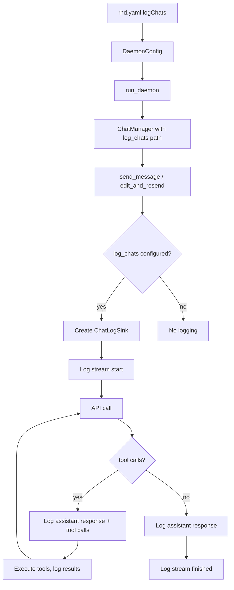

# Chat Logging Plan

## Goal

Add `logChats` option to `rhd.yaml` enabling `rhd daemon` to write detailed chat interaction logs for debugging incorrect AI chat behavior. Logs should show everything sent to and received from the AI, with clear stream lifecycle markers.

## Log Directory Structure

```
<logChats>/<sanitized-chat-title>-<YYYY-MM-DD-HH-MM-SS>/log.txt
```

Collision handling: append `-2`, `-3`, etc. (same as scenario logs).

## Log Format

```
===== Chat "<title>" (id=<id>): stream started =====
model: <model>
available tools: <tool1>, <tool2>, ...

----- messages sent to API -----
[system] <content>
[user] <content>
[assistant] <content>
[assistant + tool_calls] <content>
  tool_call: <name>(<arguments>) id=<id>
[tool <tool_call_id>] <content>

===== Assistant response =====
----- reasoning -----
<reasoning/thinking content>

----- message -----
<assistant message content>

finish_reason: <stop|tool_calls|...>
tokens: prompt=X, completion=Y, total=Z

===== Tool call: <tool_name> (id=<call_id>) =====
<arguments JSON>

===== Tool result: <tool_name> (id=<call_id>) =====
<result content>

===== Stream finished =====
finish_reason: <reason>
total duration: <Xms>

===== Stream error =====
error: <error message>
```

### Key design decisions

1. **Log full API request** — the entire messages array sent to the API, not just the new user message. This is critical for debugging context window issues.
2. **Log accumulated content, not individual chunks** — streaming chunks are noisy; the final accumulated reasoning + message is what matters for debugging.
3. **Clear stream lifecycle markers** — `stream started` and `stream finished`/`stream error` so endless loader issues are immediately visible.
4. **Tool calls logged inline** — both request (arguments) and response (result) with tool name and call ID for correlation.
5. **Tool list without descriptions** — just names, as requested.

## Implementation Steps

### 1. Add `logChats` to config

**File**: [`packages/rhd_app/src/config.rs`](packages/rhd_app/src/config.rs)

- Add `log_chats: Option<PathBuf>` field to `DaemonConfig` (serde: `logChats`, camelCase)
- Default: `None`
- Add to `Default` impl

### 2. Create `ChatLogSink` in `rhd_chat`

**New file**: `packages/rhd_chat/src/chat_log.rs`

Struct similar to `LogSink`:
```rust
pub struct ChatLogSink {
    file: Option<BufWriter<File>>,
    line_count: u64,
}
```

Methods:
- `new(file: Option<File>) -> Self`
- `log_stream_start(chat_id, title, model, tools, messages)` — writes header + messages sent
- `log_assistant_response(reasoning, content, finish_reason, usage)` — writes response block
- `log_tool_call(name, call_id, arguments)` — writes tool call request
- `log_tool_result(name, call_id, result)` — writes tool call response
- `log_stream_finished(finish_reason, duration_ms)` — writes completion marker
- `log_stream_error(error)` — writes error marker

Helper functions:
- `create_chat_log_dir(logs_root, chat_title) -> io::Result<PathBuf>` — creates timestamped dir
- `open_chat_log_file(dir) -> io::Result<File>` — creates `log.txt`

### 3. Wire `log_chats` through `ChatManager`

**File**: [`packages/rhd_chat/src/manager.rs`](packages/rhd_chat/src/manager.rs)

- Add `log_chats: Option<PathBuf>` field to `ChatManager`
- Update `ChatManager::new()` to accept it
- Pass to `stream::send_message` and `stream::edit_and_resend`

### 4. Integrate logging in `stream.rs`

**File**: [`packages/rhd_chat/src/stream.rs`](packages/rhd_chat/src/stream.rs)

In `send_message` (no tools path):
- Create `ChatLogSink` at stream start (if `log_chats` configured)
- Log stream start with model, tools (empty), messages
- After stream completes, log assistant response (accumulated content + reasoning)
- Log stream finished or stream error

In `send_message_with_tools`:
- Same as above, but with tools list
- Tool loop logging delegated to `tools.rs`

In `edit_and_resend`:
- Same pattern as `send_message`

### 5. Integrate logging in `tools.rs`

**File**: [`packages/rhd_chat/src/tools.rs`](packages/rhd_chat/src/tools.rs)

In `tool_loop`:
- Accept `&mut ChatLogSink` parameter
- Before API call: log messages sent to API (via `log_stream_start` or a dedicated method for subsequent iterations)
- After API response with tool calls: log assistant response, then for each tool call log tool_call + tool_result
- On loop exit: log stream finished/error

### 6. Update daemon wiring

**File**: [`packages/rhd_app/src/daemon.rs`](packages/rhd_app/src/daemon.rs)

- Pass `config.log_chats` to `ChatManager::new()`
- Update `run_daemon` signature to accept `log_chats`

**File**: [`packages/rhd_app/src/main.rs`](packages/rhd_app/src/main.rs)

- Pass `log_chats` from config to `run_daemon`

### 7. Update `rhd_chat/src/lib.rs`

- Add `pub mod chat_log;`
- Re-export `ChatLogSink` if needed

### 8. Update memory docs

- Update [`memory/configuration.md`](memory/configuration.md) with `logChats` field
- Update [`memory/chat.md`](memory/chat.md) with logging behavior

## Mermaid: Data Flow



## Files Changed Summary

| File | Change |
|------|--------|
| `packages/rhd_app/src/config.rs` | Add `log_chats` field |
| `packages/rhd_chat/src/chat_log.rs` | **New** — `ChatLogSink` + helpers |
| `packages/rhd_chat/src/lib.rs` | Add `chat_log` module |
| `packages/rhd_chat/src/manager.rs` | Add `log_chats` field, pass through |
| `packages/rhd_chat/src/stream.rs` | Create and use `ChatLogSink` |
| `packages/rhd_chat/src/tools.rs` | Accept and use `ChatLogSink` in tool loop |
| `packages/rhd_app/src/daemon.rs` | Pass `log_chats` to `ChatManager` |
| `packages/rhd_app/src/main.rs` | Pass `log_chats` from config |
| `memory/configuration.md` | Document `logChats` |
| `memory/chat.md` | Document chat logging |
