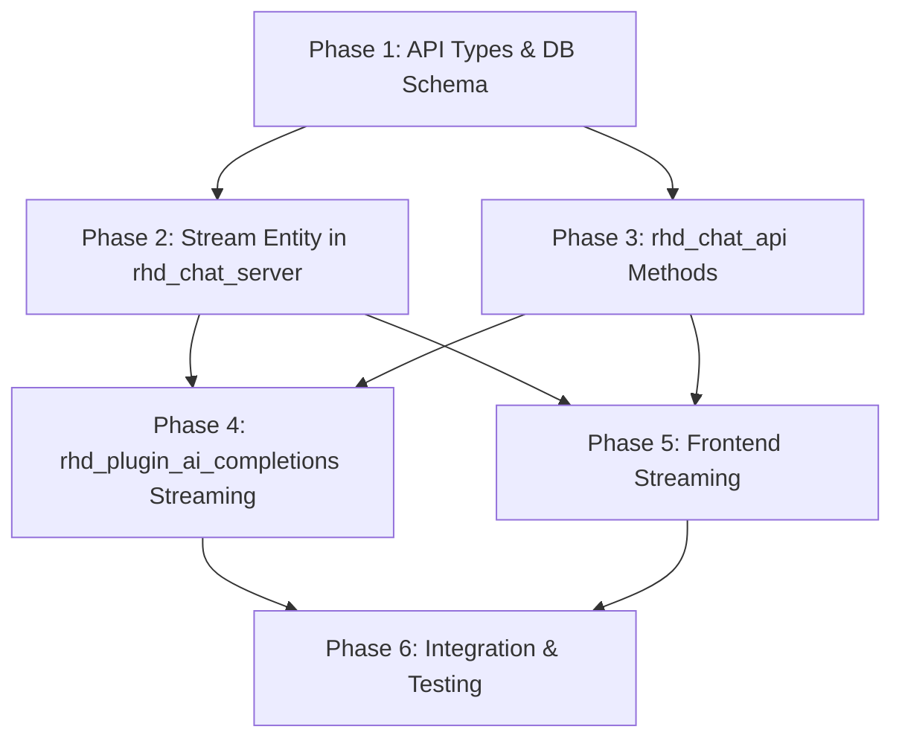

# Chat Streaming Support — Grand Plan

## Overview

Add server-side streaming infrastructure to the chat system so that `rhd_plugin_ai_completions` can stream AI responses token-by-token through the chat server, with the frontend reactively rendering the streamed content.

### Current State

- `rhd_plugin_ai_completions` currently makes non-streaming AI requests (`stream: false`) and adds the complete response as a single message via `add_message`.
- The chat server has no concept of "streams" — messages are atomic.
- The frontend already has streaming UI (animated dots, chunk-by-chunk rendering) but it is driven by the old direct WebSocket streaming from the server, not by a plugin-driven stream entity.

### Target State

- `rhd_plugin_ai_completions` creates a message with `is_streaming: true, is_finished: false` before starting the AI request.
- The plugin pushes reasoning content and content tokens to a server-side stream entity as they arrive from the AI provider.
- The frontend detects messages with `is_streaming: true`, subscribes to the corresponding stream, and reactively renders the content.
- When streaming finishes, the plugin calls a finish method that updates the message with `is_finished: true, is_streaming: false` and sets the final reasoning content, content, and tools.

---

## Dependency Graph

Phases 1, 2, and 3 can be partially parallelized (2 and 3 both depend on 1 but are independent of each other). Phase 4 and 5 depend on all prior phases. Phase 6 is the final integration.

---

## Phase 1: API Types & Database Schema

**Goal**: Define the new message flags and stream-related types in `rhd_chat_api`, and add the necessary database columns.

### Files to Modify

| File | Why |
|------|-----|
| [`packages/rhd_chat_api/src/common.rs`](packages/rhd_chat_api/src/common.rs) | Add `is_finished: bool` and `is_streaming: bool` fields to `Message` struct |
| [`packages/rhd_chat_api/src/methods/mod.rs`](packages/rhd_chat_api/src/methods/mod.rs) | Register new stream method modules |
| [`packages/rhd_chat_api/src/events/mod.rs`](packages/rhd_chat_api/src/events/mod.rs) | Register new stream event modules |
| [`packages/rhd_db/src/chat_db/schema.rs`](packages/rhd_db/src/chat_db/schema.rs) | Add `is_finished` and `is_streaming` columns to `messages` table via migration |
| [`packages/rhd_db/src/chat_db/messages.rs`](packages/rhd_db/src/chat_db/messages.rs) | Update `add_message` and `update_message` to handle new fields |
| [`packages/rhd_db/src/chat_db/mod.rs`](packages/rhd_db/src/chat_db/mod.rs) | Update public API for message operations with new fields |

### Key Decisions

- `is_finished` defaults to `true` and `is_streaming` defaults to `false` for backward compatibility — existing messages created via `add_message` without streaming are considered complete.
- The `Message` struct gains two new fields: `is_finished: bool` (default `true`) and `is_streaming: bool` (default `false`).
- Database migration adds columns with defaults matching the backward-compatible behavior.

### Dependencies

- None — this is the foundation phase.

---

## Phase 2: Stream Entity in rhd_chat_server

**Goal**: Implement the in-memory `streams` entity in `rhd_chat_server` that holds active stream state, supports push/subscribe/finish operations.

### Files to Modify/Create

| File | Why |
|------|-----|
| [`packages/rhd_chat_server/src/streams.rs`](packages/rhd_chat_server/src/streams.rs) | **New file** — Stream manager with push, subscribe+get, finish operations |
| [`packages/rhd_chat_server/src/lib.rs`](packages/rhd_chat_server/src/lib.rs) | Register the streams module |
| [`packages/rhd_chat_server/src/server.rs`](packages/rhd_chat_server/src/server.rs) | Initialize stream manager and pass to connection handlers |
| [`packages/rhd_chat_server/src/connection.rs`](packages/rhd_chat_server/src/connection.rs) | Pass stream manager to request handlers |
| [`packages/rhd_chat_server/src/handlers/mod.rs`](packages/rhd_chat_server/src/handlers/mod.rs) | Register stream handler module |
| [`packages/rhd_chat_server/src/handlers/stream.rs`](packages/rhd_chat_server/src/handlers/stream.rs) | **New file** — Handlers for stream_push, stream_subscribe, stream_finish |

### Stream Manager Design

The `StreamManager` holds a `HashMap<i64, StreamState>` where the key is the chat ID (streams have the same IDs as chats).

`StreamState` contains:
- `reasoning_content: String` — accumulated reasoning/thinking content
- `content: String` — accumulated main content
- `tool_calls: Vec<ToolCall>` — accumulated tool calls from streaming
- `subscribers: Vec<mpsc::UnboundedSender<StreamChunk>>` — active subscribers
- `is_finished: bool` — whether the stream has completed

Methods:
- **`push(chat_id, reasoning_delta, content_delta, tool_calls_delta)`** — Appends deltas to the stream state and notifies all subscribers. Tool call deltas are accumulated and remembered.
- **`subscribe_and_get(chat_id) -> (StreamSnapshot, Receiver<StreamChunk>)`** — Returns the current accumulated content as a snapshot AND a receiver for future chunks in a single atomic operation. This prevents race conditions where content arrives between get and subscribe.
- **`finish(chat_id) -> StreamSnapshot`** — Marks the stream as finished, returns the final snapshot, and clears all subscribers (drops senders). After finish, the stream entry can be cleaned up.

`StreamChunk` enum:
- `ReasoningDelta(String)` — new reasoning content
- `ContentDelta(String)` — new main content
- `ToolCallDelta(ToolCallDelta)` — tool call progress
- `Finished` — stream completed

### Key Decisions

- Streams are keyed by chat ID (1:1 relationship — only one active stream per chat).
- `subscribe_and_get` is atomic to prevent missing content that arrives between fetching current state and subscribing to updates.
- When `finish` is called, all subscriber channels are dropped, which signals to the frontend that the stream is done.
- Tool call streaming is consumed incrementally and accumulated in the stream state. The final tool calls are returned when the stream finishes, to be applied to the message update.

### Dependencies

- Phase 1 (needs the updated Message types and DB schema).

---

## Phase 3: rhd_chat_api Stream Methods & Events

**Goal**: Define the WebSocket protocol methods and events for stream operations.

### Files to Create

| File | Why |
|------|-----|
| [`packages/rhd_chat_api/src/methods/stream_push.rs`](packages/rhd_chat_api/src/methods/stream_push.rs) | `StreamPushParams` and `StreamPushResult` |
| [`packages/rhd_chat_api/src/methods/stream_subscribe.rs`](packages/rhd_chat_api/src/methods/stream_subscribe.rs) | `StreamSubscribeParams` and `StreamSubscribeResult` |
| [`packages/rhd_chat_api/src/methods/stream_finish.rs`](packages/rhd_chat_api/src/methods/stream_finish.rs) | `StreamFinishParams` and `StreamFinishResult` |
| [`packages/rhd_chat_api/src/events/stream_chunk.rs`](packages/rhd_chat_api/src/events/stream_chunk.rs) | `StreamChunkData` event — pushed to subscribers when new content arrives |
| [`packages/rhd_chat_api/src/events/stream_finished.rs`](packages/rhd_chat_api/src/events/stream_finished.rs) | `StreamFinishedData` event — pushed when stream completes |

### Method Definitions

**`streamPush`** (called by plugin):
- Params: `chat_id: i64`, `reasoning_content: Option<String>`, `content: Option<String>`, `tool_calls: Option<Vec<ToolCallDelta>>`
- Result: `{ success: bool }`
- Pushes deltas to the stream. Server broadcasts `streamChunk` event to all subscribers.

**`streamSubscribe`** (called by frontend):
- Params: `chat_id: i64`
- Result: `{ reasoningContent: String, content: String, toolCalls: Vec<ToolCall>, isFinished: bool }`
- Atomically returns current state AND subscribes the caller to future `streamChunk` events.

**`streamFinish`** (called by plugin):
- Params: `chat_id: i64`, `reasoning_content: Option<String>`, `content: Option<String>`, `tool_calls: Option<Vec<ToolCall>>`
- Result: `{ success: bool }`
- Finalizes the stream. Server broadcasts `streamFinished` event and clears subscribers.

### Event Definitions

**`streamChunk`**: `{ chatId: i64, reasoningContent?: String, content?: String, toolCalls?: Vec<ToolCallDelta> }`

**`streamFinished`**: `{ chatId: i64 }`

### Key Decisions

- Stream methods are separate from message methods — they operate on the in-memory stream entity, not on persisted messages.
- The plugin uses `streamPush` during streaming and `streamFinish` at the end.
- The frontend uses `streamSubscribe` when it detects a message with `is_streaming: true`.
- `streamFinish` params allow the plugin to set final values that may differ from accumulated deltas (e.g., the AI provider may return final tool calls that differ from streaming deltas).

### Dependencies

- Phase 1 (needs the updated Message types).
- Independent of Phase 2 (can be developed in parallel), but both must be complete before Phase 4.

---

## Phase 4: rhd_plugin_ai_completions Streaming Integration

**Goal**: Update the AI completions plugin to use streaming AI requests and the new stream API.

### Files to Modify

| File | Why |
|------|-----|
| [`plugins/rhd_plugin_ai_completions/src/ai_request.rs`](plugins/rhd_plugin_ai_completions/src/ai_request.rs) | Rewrite to use streaming: create message, push to stream, finish stream |
| [`plugins/rhd_plugin_ai_completions/src/plugin.rs`](plugins/rhd_plugin_ai_completions/src/plugin.rs) | No major changes — the trigger detection and main loop remain the same |

### Flow Changes in `handle_ai_request`

1. **Before AI request**: Call `add_message` with `is_streaming: true, is_finished: false`, empty content.
2. **Start AI request**: Set `stream: true` in the `ChatCompletionRequest`.
3. **During streaming**: For each chunk from the AI provider:
   - Extract reasoning content delta and content delta.
   - Extract tool call deltas if present.
   - Call `streamPush` with the deltas.
4. **On stream completion**: Call `streamFinish` with final reasoning content, content, and tool calls.
5. **Update message**: Call `update_message` with `is_streaming: false, is_finished: true`, final reasoning content, content, and tool calls.
6. **On error**: Call `streamFinish` (to clean up), then update message with error content and `is_finished: true, is_streaming: false`.

### Key Decisions

- The plugin creates the message BEFORE starting the AI request so the frontend can immediately show a streaming indicator.
- Tool calls from streaming are accumulated and passed to `streamFinish` and then to `update_message`.
- Error handling ensures the stream is always finished (even on error) to prevent the frontend from waiting indefinitely.

### Dependencies

- Phase 2 (stream manager in server).
- Phase 3 (stream API methods).

---

## Phase 5: Frontend Streaming Subscription & Rendering

**Goal**: Update the frontend to detect streaming messages, subscribe to streams, and reactively render content.

### Files to Modify

| File | Why |
|------|-----|
| [`frontend/src/lib/api/schemas.ts`](frontend/src/lib/api/schemas.ts) | Add `isFinished` and `isStreaming` to `MessageSchema` |
| [`frontend/src/lib/api/client.ts`](frontend/src/lib/api/client.ts) | Add `streamSubscribe` method and stream event handling |
| [`frontend/src/lib/components/ChatView.svelte`](frontend/src/lib/components/ChatView.svelte) | Detect streaming messages, subscribe to streams, manage stream state |
| [`frontend/src/lib/components/Message.svelte`](frontend/src/lib/components/Message.svelte) | Render streaming content reactively |

### Frontend Flow

1. When a message appears in the chat with `is_streaming: true`, the frontend calls `streamSubscribe` for that chat.
2. The subscribe response provides the current accumulated content, which is rendered immediately.
3. The frontend listens for `streamChunk` events and appends deltas to the displayed content.
4. When `streamFinished` event arrives (or the stream subscription channel closes), the frontend marks the message as no longer streaming.
5. The final message update (via `messageUpdated` event) provides the definitive content.

### Key Decisions

- The frontend subscribes to streams on-demand when it encounters a streaming message, not proactively for all chats.
- Stream content is accumulated locally in the frontend and merged with the final message update.
- The existing streaming UI (animated dots, auto-scroll) is reused for the new stream-based approach.

### Dependencies

- Phase 2 (stream manager must exist in server).
- Phase 3 (stream API methods must be defined).

---

## Phase 6: Integration Testing & Documentation

**Goal**: Verify end-to-end streaming works correctly and update documentation.

### Files to Modify/Create

| File | Why |
|------|-----|
| [`plugins/rhd_plugin_ai_completions/tests/integration_test.rs`](plugins/rhd_plugin_ai_completions/tests/integration_test.rs) | Add streaming integration tests |
| [`packages/rhd_chat_server/tests/websocket_tests.rs`](packages/rhd_chat_server/tests/websocket_tests.rs) | Add stream method tests |
| [`memory/features/chat.md`](memory/features/chat.md) | Update chat feature documentation with streaming details |
| [`memory/protocols.md`](memory/protocols.md) | Document new stream methods and events |

### Test Scenarios

1. Plugin starts streaming → message created with `is_streaming: true`.
2. Frontend subscribes to stream → receives current content + future chunks.
3. Stream push → subscribers receive chunks.
4. Stream finish → subscribers notified, message updated with final content.
5. Error during streaming → stream finished, message updated with error.
6. Multiple subscribers → all receive chunks.
7. Subscribe after some chunks already pushed → subscriber gets current state + future chunks.

### Dependencies

- Phase 4 (plugin streaming).
- Phase 5 (frontend streaming).

---

## Success Criteria

The grand plan is complete when:

1. ✅ Messages have `is_finished` and `is_streaming` flags in the API and database.
2. ✅ `rhd_chat_server` has a `StreamManager` with push, subscribe+get, and finish operations.
3. ✅ `rhd_chat_api` defines `streamPush`, `streamSubscribe`, and `streamFinish` methods and corresponding events.
4. ✅ `rhd_plugin_ai_completions` uses streaming AI requests and the stream API to stream responses.
5. ✅ Frontend detects streaming messages, subscribes to streams, and reactively renders content.
6. ✅ Integration tests verify end-to-end streaming flow.
7. ✅ Documentation is updated to reflect the new streaming architecture.
