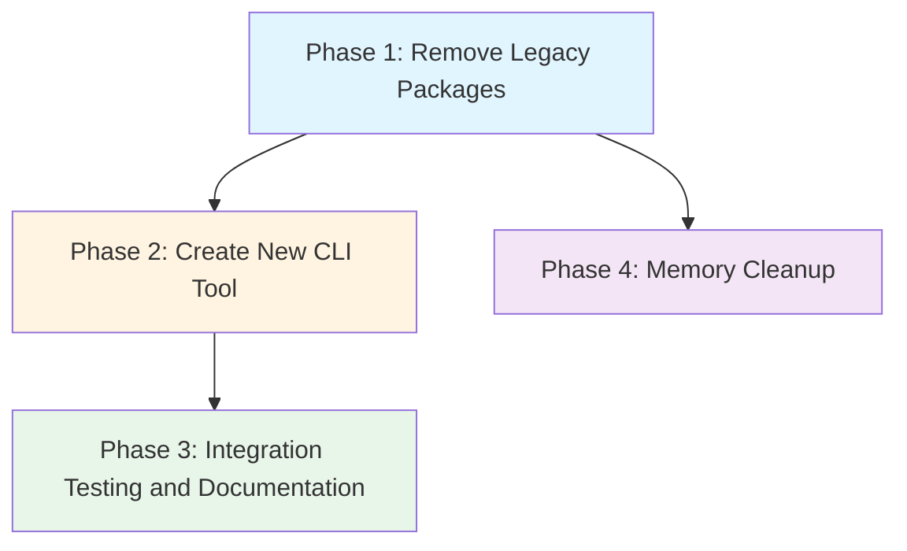

# CLI Restructure Grand Plan

## Overview

This plan outlines the restructuring of the RHD project to remove legacy packages and create a new CLI tool for interacting with `rhd_chat_server`. The goal is to simplify the codebase and provide a command-line interface for manual testing and operations.

## Current State Analysis

### Packages to Remove
Based on dependency analysis, the following packages will be removed:

1. **`rhd_app`** - Old daemon/client binary (legacy implementation)
2. **`rhd_fsm`** - Finite state machine framework (only used by `rhd_chat`)
3. **`rhd_test`** - E2E test runner (depends on `rhd_app`)
4. **`rhd_chat`** - Chat manager and tool loop (depends on `rhd_fsm`, only used by `rhd_app`)
5. **`rhd_ai`** - Old OpenAI-compatible AI client (superseded by `rhd_ai_client`)
6. **`rhd_api`** - Old shared types (not needed anymore)

### Dependency Chain
```
rhd_test → rhd_app → rhd_chat → rhd_fsm
                    → rhd_api (removed)
                    → rhd_ai (removed)
                    → rhd_db (kept)
                    → rhd_mcp_client (kept)
                    → rhd_util (kept)
```

### Packages to Keep
- `rhd_util` - Shared utilities
- `rhd_ai_client` - AI client wrapper (replaces `rhd_ai`)
- `rhd_mock_ai_provider` - Mock AI provider for testing
- `rhd_mcp_client` - MCP protocol client
- `rhd_db` - SQLite database layer
- `rhd_chat_api` - API types for chat WebSocket protocol
- `rhd_chat_server` - WebSocket server for chat storage
- `rhd_chat_client` - Chat client library
- `rhd_plugin_ai_completions` - First plugin implementation

## Phase 1: Remove Legacy Packages

### Goal
Remove all legacy packages that are no longer needed in the new architecture.

### Files to Modify
1. **`Cargo.toml`** (workspace root)
   - Remove `packages/rhd_app` from workspace members
   - Remove `packages/rhd_fsm` from workspace members
   - Remove `packages/rhd_test` from workspace members
   - Remove `packages/rhd_chat` from workspace members
   - Remove `packages/rhd_ai` from workspace members
   - Remove `packages/rhd_api` from workspace members

2. **Delete directories**
   - `packages/rhd_app/` - entire directory
   - `packages/rhd_fsm/` - entire directory
   - `packages/rhd_test/` - entire directory
   - `packages/rhd_chat/` - entire directory
   - `packages/rhd_ai/` - entire directory
   - `packages/rhd_api/` - entire directory

### Key Decisions
- **Remove `rhd_ai`**: This package is superseded by `rhd_ai_client` and is only used by the legacy packages being removed.
- **Remove `rhd_api`**: This package contains legacy types that are no longer needed. All packages that used it are being removed.
- **Remove `rhd_chat`**: This package depends on `rhd_fsm` and is only used by `rhd_app`. Since both are being removed, `rhd_chat` must also be removed.

### Dependencies
- None (this is the first phase)

### Success Criteria
- Workspace compiles successfully after removal
- No references to removed packages in remaining code
- `cargo check` passes without errors

## Phase 2: Create New CLI Tool

### Goal
Create a new `rhd_app` package as a CLI utility for interacting with `rhd_chat_server`.

### Architecture
The new CLI will use `rhd_chat_client` to communicate with `rhd_chat_server` via WebSocket protocol. It will provide commands for:
- Listing chats
- Viewing chat messages (last message by default, all messages with flag)
- Viewing queued messages (always all)
- Creating chats
- Listing plugins
- Removing plugins
- Adding queued messages

### Files to Create/Modify
1. **`packages/rhd_app/Cargo.toml`** (new)
   - Dependencies: `clap`, `tokio`, `rhd_chat_client`, `rhd_chat_api`, `serde`, `serde_json`, `chrono`
   - Binary target: `rhd` (or `rhd-cli`)

2. **`packages/rhd_app/src/main.rs`** (new)
   - Entry point with clap argument parsing
   - Async runtime initialization
   - Command dispatch

3. **`packages/rhd_app/src/cli.rs`** (new)
   - Clap command definitions
   - Subcommands: `chats`, `messages`, `queue`, `create-chat`, `plugins`, `remove-plugin`, `add-queue`

4. **`packages/rhd_app/src/commands/`** (new directory)
   - `mod.rs` - Command module exports
   - `chats.rs` - List chats command
   - `messages.rs` - View chat messages command
   - `queue.rs` - View queued messages command
   - `create_chat.rs` - Create chat command
   - `plugins.rs` - List plugins command
   - `remove_plugin.rs` - Remove plugin command
   - `add_queue.rs` - Add queued message command

5. **`Cargo.toml`** (workspace root)
   - Add `packages/rhd_app` back to workspace members

### Key Decisions
- **Use `rhd_chat_client`**: The CLI will use the existing chat client library to communicate with the server, ensuring consistency with the WebSocket protocol.
- **Simple command structure**: Each command maps to a specific operation on the chat server. No complex workflows or interactive mode in this phase.
- **JSON output**: Commands will output results in JSON format for easy parsing and scripting.

### Command Specifications

#### `rhd chats list`
- Lists all chats
- Output: JSON array of chat objects (id, title, created_at)

#### `rhd messages <chat_id> [--all]`
- Shows messages for a chat
- Default: only last message
- `--all` flag: show all messages
- Output: JSON array of message objects

#### `rhd queue <chat_id>`
- Shows all queued messages for a chat
- Output: JSON array of queued message objects

#### `rhd create-chat <title>`
- Creates a new chat with the given title
- Output: JSON object with created chat (id, title, created_at)

#### `rhd plugins list`
- Lists all available plugins
- Output: JSON array of plugin objects

#### `rhd plugins remove <plugin_id>`
- Removes a plugin by ID
- Output: Success/failure message

#### `rhd queue add <chat_id> <content>`
- Adds a message to the chat's queue
- Output: Success message with queued message ID

### Dependencies
- Phase 1 must be complete (legacy packages removed)

### Success Criteria
- CLI compiles successfully
- All commands are implemented and functional
- CLI can connect to `rhd_chat_server` and execute operations
- Manual testing workflow is possible: create chat → queue message → verify plugin processing → check assistant message

## Phase 3: Integration Testing and Documentation

### Goal
Verify the CLI works correctly with `rhd_chat_server` and `rhd_plugin_ai_completions`, and document the usage.

### Files to Create/Modify
1. **`README.md`** (update)
   - Add section on CLI usage
   - Document each command with examples
   - Include workflow example for testing plugin

2. **`memory/features/cli.md`** (new)
   - Product-view documentation of CLI feature
   - Command reference
   - Example workflows

### Key Decisions
- **Manual testing workflow**: Document the complete workflow for testing `rhd_plugin_ai_completions`:
  1. Start `rhd_chat_server`
  2. Use CLI to create a chat
  3. Use CLI to queue a message
  4. Verify plugin processes the message
  5. Use CLI to check if assistant message was added

### Dependencies
- Phase 2 must be complete (CLI implemented)

### Success Criteria
- CLI is fully documented
- Manual testing workflow is verified and documented
- User can successfully test plugin functionality using CLI

## Phase 4: Memory Cleanup

### Goal
Clean up memory files to remove references to old packages and update documentation to reflect the new architecture.

### Files to Modify
1. **`memory/MEMORY.md`** (update)
   - Remove references to `rhd_app`, `rhd_fsm`, `rhd_test`, `rhd_chat`, `rhd_ai`, `rhd_api`
   - Update package list to reflect current state
   - Update file structure diagram

2. **`memory/architecture.md`** (update)
   - Remove references to removed packages
   - Update architecture diagrams

3. **`memory/file-structure.md`** (update)
   - Remove references to removed package directories
   - Update file structure documentation

4. **`memory/features/*.md`** (update as needed)
   - Remove references to removed packages
   - Update feature documentation to reflect new architecture

### Key Decisions
- **Comprehensive cleanup**: All memory files that reference removed packages will be updated
- **Focus on accuracy**: Ensure documentation reflects the current state of the project
- **Preserve relevant information**: Keep information about remaining packages and their relationships

### Dependencies
- Phase 1 must be complete (legacy packages removed)
- Can run in parallel with Phase 2 and Phase 3

### Success Criteria
- All memory files are updated to reflect the new architecture
- No references to removed packages in memory files
- Documentation is accurate and up-to-date

## Dependency Graph



## Execution Order

1. **Phase 1** (Sequential) - Remove legacy packages
   - Remove workspace members from `Cargo.toml`
   - Delete package directories
   - Verify compilation

2. **Phase 2** (Sequential, after Phase 1) - Create new CLI
   - Create new `rhd_app` package structure
   - Implement CLI commands
   - Test connectivity with `rhd_chat_server`

3. **Phase 3** (Sequential, after Phase 2) - Documentation
   - Update README with CLI usage
   - Create feature documentation
   - Verify manual testing workflow

4. **Phase 4** (Parallel with Phase 2/3, after Phase 1) - Memory Cleanup
   - Update memory files to remove references to old packages
   - Update architecture documentation
   - Ensure all memory files reflect current state

## Success Criteria (Overall)

1. **Legacy packages removed**: `rhd_app`, `rhd_fsm`, `rhd_test`, `rhd_chat`, `rhd_ai`, `rhd_api` are completely removed from the workspace
2. **New CLI functional**: `rhd_app` provides all required commands for chat and plugin management
3. **Manual testing possible**: User can create chats, queue messages, and verify plugin processing using the CLI
4. **Documentation complete**: CLI usage is documented in README and memory files
5. **Memory cleaned up**: All memory files are updated to reflect the new architecture
6. **No regressions**: Existing functionality in `rhd_chat_server`, `rhd_chat_client`, and `rhd_plugin_ai_completions` remains intact

## Notes

- **No code cleanup in other packages**: As per user request, unused code in remaining packages will not be cleaned up in this phase. This will be addressed later.
- **CLI simplicity**: The CLI is designed for manual testing and operations, not for production use. It provides direct access to chat server functionality without complex workflows.
- **Memory cleanup**: Phase 4 focuses on updating memory files to reflect the new architecture. This ensures documentation stays accurate as the project evolves.
