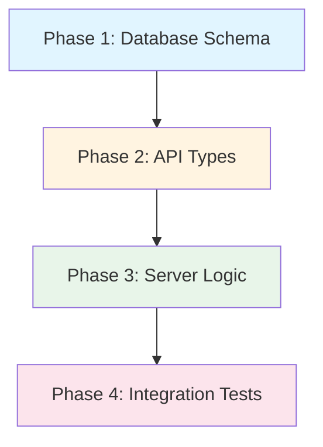

# Custom Event Rejection and Context Fields - Grand Plan

## Overview

This grand plan implements two enhancements to the custom event system:
1. **Rejection capability**: Allow plugins to reject custom events while other plugins can still acknowledge them normally
2. **Context fields**: Add optional `chat_id`, `message_id`, and `tool_call_id` fields to custom events for better traceability

## Phase Dependency Graph

**Execution Order**: Sequential (each phase depends on the previous)

---

## Phase 1: Database Schema Changes

### Goal
Extend the database schema to support storing the new context fields (`chat_id`, `message_id`, `tool_call_id`) for custom events. This is the foundational layer that enables all subsequent functionality.

### Files to Modify

| File | Purpose |
|------|---------|
| `packages/rhd_db/src/chat_db/schema.rs` | Add three nullable TEXT columns to the `custom_events` table: `chat_id`, `message_id`, `tool_call_id` |
| `packages/rhd_db/src/chat_db/custom_events.rs` | Update `create_custom_event()` to accept and store the new fields; update `get_custom_event()` to retrieve them; update `get_pending_events_for_plugin()` to include them in results |
| `packages/rhd_db/src/chat_db/mod.rs` | Update the `ChatDb` trait method signatures to include the new optional parameters |
| `packages/rhd_db/src/chat_db/tests/tags_plugins_events_tests.rs` | Add tests verifying the new columns are stored and retrieved correctly |

### Key Decisions

- **Nullable columns**: All three fields are optional, so they must be nullable in the schema
- **No foreign key constraints**: The fields are informational only; we don't validate that the referenced chat/message/tool_call exists
- **Additive migration**: The schema change adds columns without modifying existing ones, ensuring backward compatibility

### Dependencies
- **None** - This is the foundational phase

### Success Criteria
- Database schema includes three new nullable columns in `custom_events` table
- `create_custom_event()` accepts and stores the new fields
- `get_custom_event()` retrieves the new fields
- Existing tests continue to pass
- New tests verify storage and retrieval of the new fields

---

## Phase 2: API Types Enhancement

### Goal
Update all API type definitions to include the new context fields and rejection flag. This phase defines the contract between clients and the server.

### Files to Modify

| File | Purpose |
|------|---------|
| `packages/rhd_chat_api/src/methods/send_custom_event.rs` | Add optional `chat_id`, `message_id`, `tool_call_id` fields to `SendCustomEventParams` |
| `packages/rhd_chat_api/src/events/custom_event.rs` | Add optional `chat_id`, `message_id`, `tool_call_id` fields to `CustomEventData` |
| `packages/rhd_chat_api/src/methods/ack_custom_event.rs` | Add optional `is_rejected: Option<bool>` field to `AckCustomEventParams` |
| `packages/rhd_chat_api/src/events/custom_event_acknowledged.rs` | Add `is_rejected: bool` field to `CustomEventAcknowledgedData` |
| `packages/rhd_chat_api/src/common.rs` | Add optional `chat_id`, `message_id`, `tool_call_id` fields to `PendingEvent` |

### Key Decisions

- **Optional fields with skip_serializing_if**: All new fields use `#[serde(skip_serializing_if = "Option::is_none")]` to maintain backward compatibility
- **Boolean for rejection**: `is_rejected` is a boolean (not an enum or string) for simplicity
- **Default behavior**: When `is_rejected` is not provided, it defaults to `false` (acceptance)
- **Consistent naming**: Field names match across all structures (`chat_id`, `message_id`, `tool_call_id`, `is_rejected`)

### Dependencies
- **Phase 1** - Database must support the new fields before API types can reference them

### Success Criteria
- All API types compile with new fields
- Serialization/deserialization tests pass for all modified types
- Optional fields are correctly omitted from JSON when `None`
- `is_rejected` defaults to `false` when not provided
- Existing API contracts remain unchanged (backward compatible)

---

## Phase 3: Server Logic Implementation

### Goal
Update the server-side logic to handle the new fields throughout the custom event lifecycle: creation, broadcasting, acknowledgment, and recovery.

### Files to Modify

| File | Purpose |
|------|---------|
| `packages/rhd_chat_server/src/custom_events.rs` | Update `create_custom_event()` to accept and pass context fields; update `ack_custom_event()` to handle the `is_rejected` flag and include it in the acknowledgment event; update `get_pending_events()` to include context fields |
| `packages/rhd_chat_server/src/handlers/plugin.rs` | Update `send_custom_event()` handler to extract context fields from params and pass them to `create_custom_event()`; update `ack_custom_event()` handler to extract `is_rejected` and pass it to the acknowledgment logic |

### Key Decisions

- **Pass-through logic**: The server doesn't validate or transform the context fields; it simply stores and forwards them
- **Rejection doesn't block**: When a plugin rejects an event, the server still processes the acknowledgment and broadcasts it; other plugins can still acknowledge normally
- **Single acknowledgment per plugin**: Existing logic prevents duplicate acknowledgments; this remains unchanged
- **Recovery includes context**: `get_pending_events()` returns all fields so plugins can reconstruct the full event context after reconnection

### Dependencies
- **Phase 1** - Database layer must support the new fields
- **Phase 2** - API types must be defined before server can use them

### Success Criteria
- `sendCustomEvent` accepts and stores context fields
- `customEvent` broadcast includes context fields
- `ackCustomEvent` accepts `is_rejected` parameter
- `customEventAcknowledged` includes `is_rejected` field
- `getPendingAcks` returns events with all context fields
- Existing functionality remains unchanged (backward compatible)

---

## Phase 4: Integration Tests

### Goal
Create comprehensive integration tests that verify the complete flow of both features: rejection and context fields.

### Files to Modify

| File | Purpose |
|------|---------|
| `packages/rhd_chat_server/tests/websocket_tests.rs` | Add test for rejection flow: Plugin A sends event, Plugin B rejects, Plugin C acknowledges, Plugin A receives both with correct `is_rejected` values |
| `packages/rhd_chat_server/tests/websocket_tests.rs` | Add test for context fields: send event with `chat_id`, `message_id`, `tool_call_id`, verify they appear in broadcast and recovery |
| `packages/rhd_chat_server/tests/websocket_tests.rs` | Add test for combined scenario: event with context fields AND rejection |
| `packages/rhd_db/src/chat_db/tests/tags_plugins_events_tests.rs` | Add database-level tests for context field storage and retrieval |

### Key Decisions

- **Test isolation**: Each test creates its own plugins and events to avoid interference
- **Recovery testing**: Tests verify that `getPendingAcks` returns all fields after simulating a disconnection scenario
- **Multiple acknowledgments**: Tests verify that rejection by one plugin doesn't prevent others from acknowledging

### Dependencies
- **Phase 3** - Server logic must be complete before integration tests can run

### Success Criteria
- All new tests pass
- Rejection flow works end-to-end
- Context fields are preserved through the entire lifecycle
- Recovery via `getPendingAcks` includes all fields
- Existing tests continue to pass (no regressions)

---

## Cross-Phase Considerations

### Backward Compatibility
- All new fields are optional
- Existing clients that don't send the new fields continue to work
- Existing clients that don't handle the new fields in responses continue to work (fields are additive)

### Error Handling
- Invalid field values (e.g., non-existent `chat_id`) are not validated at the server level
- Missing optional fields default to `None`/`false`
- Database errors during storage are propagated as server errors

### Performance Impact
- Minimal: three additional nullable columns in the database
- No additional queries or joins required
- Broadcasting logic unchanged (same number of messages)

### Security Considerations
- No new attack vectors introduced
- Plugins can only acknowledge events they receive (existing authorization)
- Context fields are informational only; no privilege escalation possible

---

## Overall Success Criteria

The grand plan is complete when:

1. ✅ Plugins can send custom events with optional `chat_id`, `message_id`, and `tool_call_id` context fields
2. ✅ Context fields are broadcast to all subscribers via `customEvent`
3. ✅ Context fields are stored in the database and recovered via `getPendingAcks`
4. ✅ Plugins can acknowledge custom events with an optional `is_rejected` flag
5. ✅ Rejection by one plugin does not prevent other plugins from acknowledging the same event
6. ✅ The event initiator receives `customEventAcknowledged` events with the correct `is_rejected` value for each acknowledging plugin
7. ✅ All existing functionality remains unchanged (backward compatible)
8. ✅ All tests pass (unit tests, integration tests, database tests)
9. ✅ No breaking changes to the API contract

---

## Implementation Notes

- **Phase splitting**: This grand plan can be split into detailed phase-specific plans using the `plan-split` skill
- **Parallelization**: Phases are sequential; no parallel execution is possible due to dependencies
- **Testing strategy**: Each phase includes tests appropriate to its scope; Phase 4 adds comprehensive integration tests
- **Documentation**: Update `memory/features/plugins.md` after implementation to document the new capabilities
