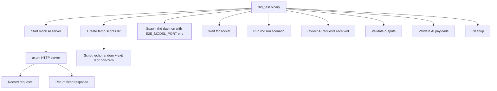

# E2E Test Crate Plan

## Goal

Rust crate `rhd_test` that:
- Starts mock OpenAI-compatible HTTP server
- Runs `rhd daemon` + `rhd run <scenario>`
- Validates AI request payloads (placeholders resolved correctly)
- Validates `rhd run` output
- Uses temporary scripts for `runCommand` actions (random output, 50% exit 0 / 50% non-zero)

## Architecture



## Crate Structure

```
packages/rhd_test/
├── Cargo.toml
└── src/
    └── main.rs
```

## Dependencies

- `tokio` (async runtime, already in workspace)
- `axum` (mock HTTP server)
- `serde`, `serde_json` (parse AI requests)
- `tempfile` (temp dirs for scripts)
- `rand` (random exit codes)

Decision: spawn `rhd` binary via `std::process::Command` (matches bash script approach, avoids linking issues).

## Environment Variable Substitution in Model YAML

**New feature**: Support `$ENV_VAR` syntax in model config values.

Example `test_e2e/models/test_model.yaml`:
```yaml
baseUrl: "http://localhost:$E2E_MODEL_PORT/v1"
apiKey: "test-key"
model: "test-model"
```

**Implementation**:
- Modify `rhd_ai::config::load_models()` to substitute `$VAR_NAME` patterns with env var values
- Use regex or simple string replacement
- If env var not set, keep original string (or error — decide during impl)
- Apply substitution to all string fields after YAML parse

**Files to modify**:
- `packages/rhd_ai/src/config.rs` — add `substitute_env_vars()` function
- `packages/rhd_ai/Cargo.toml` — add `regex` dependency (optional, can use manual parsing)

## Test Scenario Design

**Static scenario** at `test_e2e/scenarios/rhd_test/scenario.yaml`:

```yaml
name: rhd_test
actions:
  - type: runCommand
    name: cmd1
    cmd: $E2E_SCRIPTS_DIR/random_cmd.sh
  - type: aiChat
    name: ai1
    model: test_model
    systemPrompt: "You received: %cmd1.stdout%"
    message: "Exit code was %cmd1.exitCode%, success=%cmd1.success%"
  - type: output
    name: out1
    output: "AI said: %ai1.message%"
```

**Note**: Scenario YAML also uses `$E2E_SCRIPTS_DIR` for script path. Need env var substitution in scenario loader too, OR generate scenario at runtime. User requested static YAMLs, so implement env var substitution in scenario loader as well.

**Alternative**: Keep scenario static but use absolute path to script in temp dir. Since temp dir path unknown at YAML write time, must use env var substitution.

**Model config** at `test_e2e/models/test_model.yaml`:
```yaml
baseUrl: "http://localhost:$E2E_MODEL_PORT/v1"
apiKey: "test-key"
model: "test-model"
```

## Mock Server Behavior

- Listen on `127.0.0.1:0` (random port)
- Endpoint: `POST /v1/chat/completions`
- Record all requests (model, messages array with system/user content)
- Return fixed response: `{"choices":[{"message":{"role":"assistant","content":"mock response"}}]}`
- Expose recorded requests via internal channel for validation

## Temp Scripts

Create executable script in temp dir:

```bash
#!/bin/sh
OUTPUT=$(head -c 8 /dev/urandom | base64 | head -c 8)
echo "$OUTPUT"
if [ $((RANDOM % 2)) -eq 0 ]; then
  exit 0
else
  exit $((RANDOM % 5 + 1))
fi
```

Store in `tempdir/random_cmd.sh`, `chmod +x`, set `E2E_SCRIPTS_DIR` env var to tempdir path.

## Validation Logic

After `rhd run` completes:

1. **Exit code**: expect 0 (scenario success)
2. **Output contains**: "AI said: mock response"
3. **AI request validation**:
   - Exactly 1 request received
   - `model` field matches config
   - `messages[0].role == "system"`, content contains resolved stdout from cmd1
   - `messages[1].role == "user"`, content contains resolved exitCode + success
   - No unresolved placeholders (no `%...%` patterns in content)

## Implementation Steps

1. **Add env var substitution to rhd_ai**:
   - Modify `packages/rhd_ai/src/config.rs`
   - Add `substitute_env_vars(input: &str) -> String` function
   - Apply to all string fields after YAML deserialize
   - Add `regex` dependency to `packages/rhd_ai/Cargo.toml`

2. **Add env var substitution to scenario loader**:
   - Modify `packages/rhd_app/src/scenario/loader.rs`
   - Apply same `substitute_env_vars()` to scenario YAML fields
   - Can reuse function from rhd_ai or duplicate (prefer move to rhd_util)

3. **Move env var substitution to rhd_util** (optional, for sharing):
   - Add `substitute_env_vars()` to `packages/rhd_util/src/lib.rs`
   - Use in both rhd_ai and rhd_app

4. **Create rhd_test crate**:
   - `packages/rhd_test/Cargo.toml`
   - `packages/rhd_test/src/main.rs`

5. **Add rhd_test to workspace**:
   - Modify root `Cargo.toml`

6. **Implement rhd_test main.rs**:
   - Start mock axum server, get port
   - Create temp dir, write `random_cmd.sh`, chmod +x
   - Set env vars: `E2E_MODEL_PORT`, `E2E_SCRIPTS_DIR`
   - Spawn `rhd daemon --models-dir test_e2e/models --scenarios-dir test_e2e/scenarios`
   - Wait for `rhd.sock`
   - Spawn `rhd run rhd_test`, capture stdout
   - Collect AI requests from mock server
   - Run assertions
   - Print results, exit 0 or 1
   - Cleanup (daemon kill, temp dir drop)

7. **Create test scenario**:
   - `test_e2e/scenarios/rhd_test/scenario.yaml`

8. **Update model config**:
   - Modify `test_e2e/models/test_model.yaml` to use `$E2E_MODEL_PORT`

9. **Test locally**:
   - `cargo build`
   - `cargo run -p rhd_test`

10. **Update AI.md**:
    - Add `rhd_test` to workspace structure
    - Document env var substitution feature
    - Document mock server approach
    - Note e2e tests run via `cargo run -p rhd_test`

## Files to Create/Modify

**Create:**
- `packages/rhd_test/Cargo.toml`
- `packages/rhd_test/src/main.rs`
- `test_e2e/scenarios/rhd_test/scenario.yaml`

**Modify:**
- `Cargo.toml` (add `rhd_test` to workspace members)
- `packages/rhd_ai/Cargo.toml` (add `regex` if used)
- `packages/rhd_ai/src/config.rs` (add env var substitution)
- `packages/rhd_app/src/scenario/loader.rs` (add env var substitution)
- `packages/rhd_util/src/lib.rs` (add shared `substitute_env_vars()`)
- `packages/rhd_util/Cargo.toml` (add `regex` if used)
- `test_e2e/models/test_model.yaml` (use `$E2E_MODEL_PORT`)
- `AI.md` (document new features)

## Design Decisions

**Static YAMLs with env vars** (user requirement):
- Model YAML: `baseUrl: "http://localhost:$E2E_MODEL_PORT/v1"`
- Scenario YAML: `cmd: $E2E_SCRIPTS_DIR/random_cmd.sh`
- Env vars substituted at load time

**Env var substitution scope**:
- Apply to all string fields in model config
- Apply to all string fields in scenario (command, args, prompts, output templates)
- Use simple `$VAR_NAME` syntax (no braces, no defaults)
- If var not set, keep original string (allows optional substitution)

**Mock server port**:
- Use `127.0.0.1:0` for random port
- Retrieve actual port via `server.local_addr()`
- Pass to daemon via `E2E_MODEL_PORT` env var

**Script path**:
- Create temp dir, write script, chmod +x
- Pass temp dir path via `E2E_SCRIPTS_DIR` env var
- Scenario references `$E2E_SCRIPTS_DIR/random_cmd.sh`

## Risks

1. **Port conflicts**: Use `127.0.0.1:0` + retrieve actual port
2. **Socket timing**: Poll with timeout (already in bash script)
3. **Script permissions**: Must `chmod +x` temp scripts
4. **Daemon cleanup**: Ensure kill on test exit (use `Drop` or signal handler)
5. **Env var substitution conflicts**: If YAML contains literal `$` followed by valid var name chars, will be substituted. Acceptable for test use case.

## Success Criteria

- `cargo run -p rhd_test` exits 0
- Mock server receives exactly 1 AI request
- Request contains no unresolved placeholders
- `rhd run` output contains expected string
- Test passes consistently (handle 50% exit code randomness by not asserting on cmd1.exitCode value, only that it's resolved)
