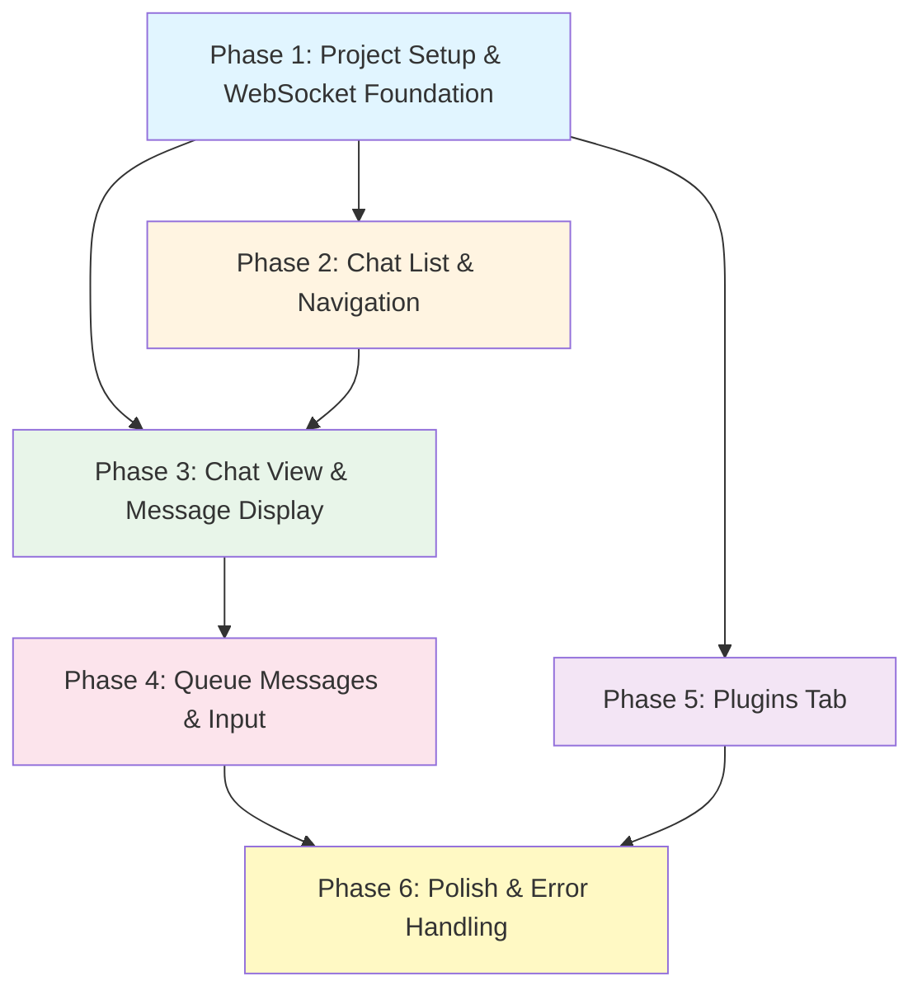

# RHD Chat Server Frontend - Grand Implementation Plan

## Overview

This grand plan outlines the implementation of a Svelte-based frontend for the RHD chat server. The frontend provides a reactive chat interface with real-time messaging, queue management, and plugin monitoring via WebSocket communication.

The implementation is divided into 6 sequential phases, where each phase builds upon the previous ones and can be implemented independently. Each phase is self-contained with clear goals, file lists, architectural decisions, and dependencies.

**Type Safety**: The frontend uses Zod library to define and validate all data types received from WebSocket messages. This ensures type safety and makes it easy to detect mismatches between frontend and backend data structures.

## Phase Dependency Graph



**Execution Order:**
- Phase 1 must complete first (foundation)
- Phases 2, 3, and 5 can be implemented in parallel after Phase 1
- Phase 4 depends on Phase 3 (needs message display infrastructure)
- Phase 6 depends on all previous phases (polish and integration)

---

## Phase 1: Project Setup & WebSocket Foundation

### Goal
Establish the Svelte project structure, configure build tools, and implement the WebSocket connection layer with reactive state management. This phase creates the foundation that all other phases build upon.

### Files to Create

| File | Purpose |
|------|---------|
| `frontend/package.json` | Define project dependencies (Svelte, Vite, marked, zod) and scripts |
| `frontend/vite.config.js` | Configure Vite build tool with Svelte plugin |
| `frontend/svelte.config.js` | Configure Svelte compiler options |
| `frontend/index.html` | Entry HTML file that loads the Svelte app |
| `frontend/src/main.js` | Application entry point, initializes the app |
| `frontend/src/App.svelte` | Root component with basic structure |
| `frontend/src/global.css` | Global CSS variables for colors, sizes, and base styles |
| `frontend/src/lib/api/websocket.js` | WebSocket connection management with event handling |
| `frontend/src/lib/api/schemas.js` | Zod schemas for all WebSocket message types and data structures |
| `frontend/src/lib/stores/connection.js` | Svelte store for connection status (connected/disconnected/error) |

### Key Architectural Decisions

1. **Build Tool**: Use Vite for fast development and optimized builds
2. **Type Safety with Zod**: Use Zod library to define and validate all WebSocket message types:
   - All data structures (Chat, Message, PluginSummary) defined as Zod schemas
   - WebSocket messages validated against schemas before processing
   - Type mismatches caught at runtime with clear error messages
   - TypeScript types inferred from Zod schemas for compile-time safety
3. **WebSocket Management**: Centralized WebSocket client in `websocket.js` that handles:
   - Connection lifecycle (connect, disconnect, reconnect)
   - Request/response correlation via UUID tracking
   - Event subscription and dispatch
   - Automatic JSON serialization/deserialization
   - Message validation using Zod schemas
4. **State Management**: Use Svelte stores for reactive state:
   - `connection` store tracks WebSocket connection status
   - Stores are observable and trigger UI updates automatically
5. **CSS Architecture**: Global CSS variables in `global.css` for consistent theming:
   - Color palette (primary, secondary, background, text, error, success)
   - Spacing scale (xs, sm, md, lg, xl)
   - Border radius, font sizes, shadows
6. **Error Handling Strategy**: WebSocket errors update the connection store, which UI components observe to show appropriate error messages. Zod validation errors logged with details about type mismatches.

### Dependencies
- **None** - This is the foundation phase
- All subsequent phases depend on this phase

### Success Criteria
- Svelte app builds and runs without errors
- WebSocket connects to `ws://localhost:8080` successfully
- Connection status is tracked and accessible via store
- Global CSS variables are defined and applied
- Basic app structure renders with tabs placeholder
- Zod schemas defined for all core data types (Chat, Message, PluginSummary)
- WebSocket messages validated against Zod schemas

---

## Phase 2: Chat List & Navigation

### Goal
Implement the chat list sidebar with real-time updates, chat creation, deletion, and tab navigation. This phase provides the primary navigation interface for the application.

### Files to Create/Modify

| File | Purpose |
|------|---------|
| `frontend/src/lib/stores/chats.js` | **Create**: Svelte store for chat list with reactive updates |
| `frontend/src/lib/api/chatApi.js` | **Create**: API methods for chat operations (list, create, delete) |
| `frontend/src/lib/components/TabView.svelte` | **Create**: Tab navigation component (Chats/Plugins) |
| `frontend/src/lib/components/ChatList.svelte` | **Create**: Chat list sidebar with create/delete buttons |
| `frontend/src/lib/components/ConfirmModal.svelte` | **Create**: Reusable confirmation modal component |
| `frontend/src/lib/styles/common.css` | **Create**: Common CSS module for reusable styles (buttons, lists, modals) |
| `frontend/src/App.svelte` | **Modify**: Integrate TabView and ChatList components |

### Key Architectural Decisions

1. **Chat List Store**: 
   - Maintains array of chats sorted by `updatedAt` DESC
   - Subscribes to `chatCreated`, `chatUpdated`, `chatDeleted` events
   - Automatically updates when events arrive via WebSocket
   - Provides methods: `loadChats()`, `createChat()`, `deleteAllChats()`

2. **API Layer**:
   - `chatApi.js` wraps WebSocket requests with Promise-based API
   - Each method generates UUID, sends request, waits for correlated response
   - Methods: `subscribeChatsList()`, `listChats()`, `createChat(title)`, `deleteChat(chatId)`

3. **Chat Title Generation**:
   - Auto-generate title using current date/time in format: `YYYY-MM-DD HH:mm`
   - Use JavaScript `Date` object with manual formatting (no external library)

4. **Confirmation Modal**:
   - Reusable component with customizable title, message, and buttons
   - Renders as overlay with backdrop
   - Closes on outside click or Escape key
   - Returns Promise that resolves to boolean (confirmed/cancelled)

5. **Tab Navigation**:
   - Simple tab component with two tabs: "Chats" and "Plugins"
   - Active tab state managed locally
   - Tab content rendered conditionally based on active tab

6. **CSS Modules**:
   - `common.css` contains reusable styles for buttons, lists, modals
   - Imported as CSS module for scoped class names
   - Common styles: `.btn`, `.btn-primary`, `.btn-danger`, `.list`, `.modal-overlay`

### Dependencies
- **Requires**: Phase 1 (WebSocket foundation, connection store)
- **Blocks**: Phase 3 (chat view needs chat list to select from)

### Success Criteria
- Chat list displays all chats from server
- New chats appear in list immediately after creation
- Chat titles auto-generated with correct format
- Delete all chats shows confirmation modal
- Confirmation modal closes on outside click/Escape
- Tab navigation switches between Chats and Plugins tabs
- Chat list updates in real-time when chats are created/deleted by another client

---

## Phase 3: Chat View & Message Display

### Goal
Implement the chat view that displays messages for a selected chat, with Markdown rendering, reasoning content collapse/expand, and auto-scrolling behavior. This phase provides the core chat interaction interface.

### Files to Create/Modify

| File | Purpose |
|------|---------|
| `frontend/src/lib/stores/chat.js` | **Create**: Svelte store for current chat (messages, metadata) |
| `frontend/src/lib/components/ChatView.svelte` | **Create**: Main chat view with message list |
| `frontend/src/lib/components/Message.svelte` | **Create**: Individual message display component |
| `frontend/src/App.svelte` | **Modify**: Integrate ChatView, show when chat is selected |

### Key Architectural Decisions

1. **Current Chat Store**:
   - Tracks selected chat ID and its messages
   - Subscribes to `messageAdded`, `messageUpdated`, `messageDeleted` events for selected chat
   - Provides methods: `selectChat(chatId)`, `loadChat(chatId)`, `clearChat()`
   - Automatically subscribes/unsubscribes to chat events when selection changes

2. **Message Rendering**:
   - Use `marked` library for Markdown to HTML conversion
   - Toggle button in top-right corner switches between Markdown and plain text
   - Toggle state stored per-message component (local state)
   - Sanitize HTML output to prevent XSS (use DOMPurify or marked's built-in sanitizer)

3. **Reasoning Content Display**:
   - Collapsed by default with max-height container (~3 lines)
   - Container uses `overflow: hidden` to hide excess content
   - Content scrolled to bottom within container to show last 3 lines
   - Expand/collapse button toggles max-height constraint
   - When expanded: remove max-height, show full content
   - Smooth transition animation for expand/collapse

4. **Auto-Scrolling**:
   - Track scroll position relative to bottom (threshold: 30px)
   - Auto-scroll to bottom only if user is already at bottom
   - New messages trigger scroll check
   - If user scrolled up: do not auto-scroll, preserve position
   - Optional: show "scroll to bottom" button when not at bottom (future enhancement)

5. **Message Component Structure**:
   - Header: role badge, timestamp, tags
   - Body: content (Markdown or plain text based on toggle)
   - Reasoning section (if present): collapsible with expand/collapse button
   - Toggle button: top-right corner for Markdown/plain text switch

6. **Tag Display**:
   - Tags rendered as small badges/pills
   - Positioned near message header
   - Styled with background color and rounded corners

### Dependencies
- **Requires**: Phase 1 (WebSocket), Phase 2 (chat list for selection)
- **Blocks**: Phase 4 (needs message display for queue messages)

### Success Criteria
- Selecting a chat loads and displays its messages
- Messages render with Markdown formatting by default
- Toggle button switches between Markdown and plain text
- Reasoning content shows last 3 lines when collapsed
- Expand/collapse button works smoothly
- Auto-scroll works only when user is at bottom
- Messages update in real-time when added/updated/deleted
- Tags display correctly on messages
- Chat view clears when chat is deselected

---

## Phase 4: Queue Messages & Input

### Goal
Implement the message input component and queue message handling. This phase enables users to send messages to the chat, which are added to the queue and displayed with distinct styling.

### Files to Create/Modify

| File | Purpose |
|------|---------|
| `frontend/src/lib/components/MessageInput.svelte` | **Create**: Multi-line textarea with send button |
| `frontend/src/lib/api/chatApi.js` | **Modify**: Add `addQueueMessage()` method |
| `frontend/src/lib/stores/chat.js` | **Modify**: Handle queue message events, merge queue with regular messages |
| `frontend/src/lib/components/ChatView.svelte` | **Modify**: Integrate MessageInput, display queue messages with distinct styling |
| `frontend/src/lib/components/Message.svelte` | **Modify**: Add support for queue message styling (opacity) |

### Key Architectural Decisions

1. **Message Input Component**:
   - Multi-line textarea with auto-resize (grows with content)
   - Enter key sends message (adds to queue)
   - Shift+Enter adds new line
   - Send button next to textarea
   - Input clears after sending
   - Disabled when no chat is selected or WebSocket is disconnected

2. **Queue Message Flow**:
   - User types message and presses Enter or clicks Send
   - Frontend calls `addQueueMessage(chatId, role="user", content)`
   - Server adds message to queue and emits `queueMessageAdded` event
   - Store receives event, adds queue message to display list
   - Queue messages displayed at end of message list with opacity 0.8
   - When plugin processes queue message, it becomes regular message via `messageAdded` event
   - Store removes queue message and adds regular message

3. **Queue Message Storage**:
   - Chat store maintains two arrays: `messages` and `queueMessages`
   - Combined display list: `[...messages, ...queueMessages]`
   - Queue messages have same structure as regular messages
   - Queue messages identified by source (queue vs regular) for styling

4. **Queue Message Styling**:
   - Queue messages rendered with `opacity: 0.8` to distinguish from regular messages
   - Same Message component used, with `isQueue` prop for styling variation
   - Visual distinction helps users understand message state (pending vs processed)

5. **Input Validation**:
   - Empty messages cannot be sent (disable send button)
   - Whitespace-only messages trimmed before sending
   - Error shown inline if send fails (e.g., WebSocket disconnected)

### Dependencies
- **Requires**: Phase 3 (message display infrastructure)
- **Blocks**: Phase 6 (needs queue handling for polish)

### Success Criteria
- Message input accepts multi-line text with auto-resize
- Enter sends message, Shift+Enter adds new line
- Sent messages appear in queue with opacity 0.8
- Queue messages update in real-time
- When queue message is processed, it becomes regular message
- Input clears after sending
- Send button disabled when input is empty or WebSocket disconnected
- Error shown inline if message send fails

---

## Phase 5: Plugins Tab

### Goal
Implement the Plugins tab that displays a list of registered plugins with their active/inactive status. This phase provides visibility into the plugin ecosystem.

### Files to Create/Modify

| File | Purpose |
|------|---------|
| `frontend/src/lib/stores/plugins.js` | **Create**: Svelte store for plugin list with reactive updates |
| `frontend/src/lib/api/chatApi.js` | **Modify**: Add `getPlugins()`, `subscribePluginsList()` methods |
| `frontend/src/lib/components/PluginList.svelte` | **Create**: Plugin list display component |
| `frontend/src/App.svelte` | **Modify**: Integrate PluginList in Plugins tab |

### Key Architectural Decisions

1. **Plugins Store**:
   - Maintains array of plugins with `pluginId` and `isActive` status
   - Subscribes to `pluginRegistered`, `pluginUpdated`, `pluginRemoved` events
   - Provides methods: `loadPlugins()`, `subscribeToPlugins()`
   - Automatically updates when plugin events arrive

2. **Plugin List Display**:
   - Simple list layout with plugin ID and status indicator
   - Status indicator: green dot for active, gray dot for inactive
   - List sorted alphabetically by plugin ID
   - Empty state: "No plugins registered" message

3. **Plugin Summary Structure**:
   - `pluginId`: string identifier
   - `isActive`: boolean indicating WebSocket connection status
   - Displayed as: `{pluginId} - {status}`

4. **Real-Time Updates**:
   - Plugin list updates automatically when plugins register/remove/update
   - No manual refresh needed
   - Status changes reflected immediately

### Dependencies
- **Requires**: Phase 1 (WebSocket foundation)
- **Blocks**: Phase 6 (needs plugin list for polish)

### Success Criteria
- Plugins tab displays list of all registered plugins
- Each plugin shows ID and active/inactive status
- Status indicator uses visual cue (green/gray dot)
- Plugin list updates in real-time when plugins register/remove
- Empty state shown when no plugins registered
- Plugins tab accessible via tab navigation

---

## Phase 6: Polish & Error Handling

### Goal
Add connection status UI, comprehensive error handling, and styling refinements. This phase polishes the application for production use and ensures robust error handling throughout.

### Files to Create/Modify

| File | Purpose |
|------|---------|
| `frontend/src/lib/components/ConnectionStatus.svelte` | **Create**: Connection status indicator with reconnect button |
| `frontend/src/lib/api/websocket.js` | **Modify**: Improve error handling, add reconnect logic |
| `frontend/src/lib/stores/connection.js` | **Modify**: Add error message tracking |
| `frontend/src/App.svelte` | **Modify**: Integrate ConnectionStatus component |
| `frontend/src/lib/components/ChatList.svelte` | **Modify**: Add error handling for chat operations |
| `frontend/src/lib/components/ChatView.svelte` | **Modify**: Add error handling for message operations |
| `frontend/src/lib/components/MessageInput.svelte` | **Modify**: Add error handling for send failures |
| `frontend/src/global.css` | **Modify**: Add error state styles, refine spacing and colors |

### Key Architectural Decisions

1. **Connection Status UI**:
   - Fixed position indicator at top of page
   - Shows connection state: "Connected" (green), "Disconnected" (red), "Connecting" (yellow)
   - When disconnected: show error message and "Reconnect" button
   - Reconnect button manually triggers WebSocket reconnection
   - Indicator dismissible or auto-hides when connected

2. **Error Handling Strategy**:
   - Inline errors near relevant component (not toast notifications)
   - Error messages stored in component local state or store
   - Errors are dismissible (close button or auto-dismiss after timeout)
   - Error types:
     - Connection errors: shown in ConnectionStatus component
     - Chat operation errors: shown in ChatList component
     - Message operation errors: shown in MessageInput component
     - API errors: shown near component that triggered error

3. **WebSocket Reconnection**:
   - Manual reconnect only (no automatic reconnection)
   - Reconnect button calls `websocket.connect()`
   - Connection state updates reactively
   - After reconnect: re-subscribe to all necessary events

4. **Error Message Display**:
   - Error component with red background, error icon, message, and close button
   - Positioned near the component that triggered the error
   - Errors clear when:
     - User clicks close button
     - Operation succeeds (auto-clear)
     - Component unmounts

5. **Styling Refinements**:
   - Consistent spacing using CSS variables
   - Hover states for interactive elements
   - Focus states for accessibility
   - Responsive design for mobile devices
   - Dark/light theme support (future enhancement, use CSS variables)

6. **Loading States**:
   - Show loading indicators during async operations
   - Chat list: loading spinner while fetching chats
   - Chat view: loading spinner while fetching messages
   - Buttons: disabled state with loading indicator during operation

### Dependencies
- **Requires**: All previous phases (1-5)
- **Blocks**: None (final phase)

### Success Criteria
- Connection status indicator shows current state
- Reconnect button works when disconnected
- Error messages appear inline near relevant components
- Errors are dismissible
- Loading states shown during async operations
- UI is responsive on mobile devices
- All operations have proper error handling
- Styling is consistent and polished
- Application handles edge cases gracefully (network errors, empty states, etc.)

---

## Overall Success Criteria

The grand plan is complete when:

1. **Functional Completeness**:
   - All 6 phases implemented and integrated
   - Chats tab: create, list, delete chats; view messages; send messages via queue
   - Plugins tab: list plugins with status
   - Real-time updates work for all operations
   - Markdown rendering with toggle works
   - Reasoning content collapse/expand works
   - Queue messages display with distinct styling

2. **Technical Quality**:
   - No console errors or warnings
   - WebSocket connection handles errors gracefully
   - All stores update reactively
   - Components are reusable and well-structured
   - CSS is organized (global variables, common module, scoped styles)

3. **User Experience**:
   - UI is responsive and smooth
   - Error messages are clear and helpful
   - Loading states provide feedback
   - Auto-scroll respects user's scroll position
   - Confirmation modal prevents accidental deletions

4. **Code Quality**:
   - Code is well-commented
   - Components have clear responsibilities
   - Stores encapsulate state logic
   - API layer abstracts WebSocket complexity
   - CSS is maintainable and consistent

5. **Testing**:
   - Manual testing passes all scenarios
   - Application works with real chat server
   - Edge cases handled (empty states, errors, disconnections)

---

## Implementation Notes

### WebSocket Protocol Reference

The frontend must implement the following message types:

**Request Format**:
```json
{
  "type": "request",
  "id": "uuid-string",
  "method": "methodName",
  "params": { ... }
}
```

**Response Format**:
```json
{
  "type": "response",
  "id": "uuid-string",
  "success": true,
  "data": { ... }
}
```

**Event Format**:
```json
{
  "type": "event",
  "event": "eventName",
  "data": { ... }
}
```

### Key Methods to Implement

- `subscribeChatsList()` - Subscribe to chat list events
- `listChats()` - Get all chats
- `createChat(title)` - Create new chat
- `deleteChat(chatId)` - Delete a chat
- `subscribeChat(chatId)` - Subscribe to chat events
- `getChat(chatId)` - Get chat with messages
- `addQueueMessage(chatId, role, content)` - Add message to queue
- `subscribePluginsList()` - Subscribe to plugin events
- `getPlugins()` - Get all plugins

### Key Events to Handle

- `chatCreated`, `chatUpdated`, `chatDeleted` - Chat list changes
- `messageAdded`, `messageUpdated`, `messageDeleted` - Message changes
- `queueMessageAdded`, `queueMessageUpdated`, `queueMessageDeleted` - Queue changes
- `pluginRegistered`, `pluginUpdated`, `pluginRemoved` - Plugin changes

### Data Structures (Zod Schemas)

All data structures are defined as Zod schemas in `frontend/src/lib/api/schemas.js`. TypeScript types are inferred from these schemas.

**Chat Schema**:
```javascript
import { z } from 'zod';

export const ChatSchema = z.object({
  id: z.number(),
  title: z.string(),
  createdAt: z.string(), // ISO 8601 date string
  updatedAt: z.string(), // ISO 8601 date string
  tags: z.array(z.string()),
  version: z.number()
});

export const Chat = /** @type {z.infer<typeof ChatSchema>} */ ({});
```

**Message Schema**:
```javascript
export const MessageSchema = z.object({
  id: z.number(),
  chatId: z.number(),
  role: z.string(),
  content: z.string(),
  createdAt: z.string(), // ISO 8601 date string
  reasoningContent: z.string().optional(),
  tags: z.array(z.string())
});

export const Message = /** @type {z.infer<typeof MessageSchema>} */ ({});
```

**PluginSummary Schema**:
```javascript
export const PluginSummarySchema = z.object({
  pluginId: z.string(),
  isActive: z.boolean()
});

export const PluginSummary = /** @type {z.infer<typeof PluginSummarySchema>} */ ({});
```

**WebSocket Message Schemas**:
```javascript
// Request (client → server)
export const RequestSchema = z.object({
  type: z.literal('request'),
  id: z.string(),
  method: z.string(),
  params: z.any()
});

// Response (server → client)
export const ResponseSchema = z.object({
  type: z.literal('response'),
  id: z.string(),
  success: z.boolean(),
  data: z.any()
});

// Event (server → client)
export const EventSchema = z.object({
  type: z.literal('event'),
  event: z.string(),
  data: z.any()
});
```

**Usage Example**:
```javascript
import { ChatSchema, MessageSchema } from './schemas.js';

// Validate incoming WebSocket message
function handleChatData(rawData) {
  try {
    const chat = ChatSchema.parse(rawData);
    // chat is now typed and validated
    return chat;
  } catch (error) {
    console.error('Chat data validation failed:', error);
    throw new Error('Invalid chat data received from server');
  }
}
```

---

## Next Steps

After reviewing this grand plan, the next step is to split it into detailed phase-specific implementation plans using the `plan-split` skill. Each phase plan will contain:
- Detailed file-by-file implementation guidance
- Code structure and component APIs
- Testing scenarios
- Acceptance criteria

The implementer can then execute each phase plan sequentially, with each phase building upon the previous ones.
