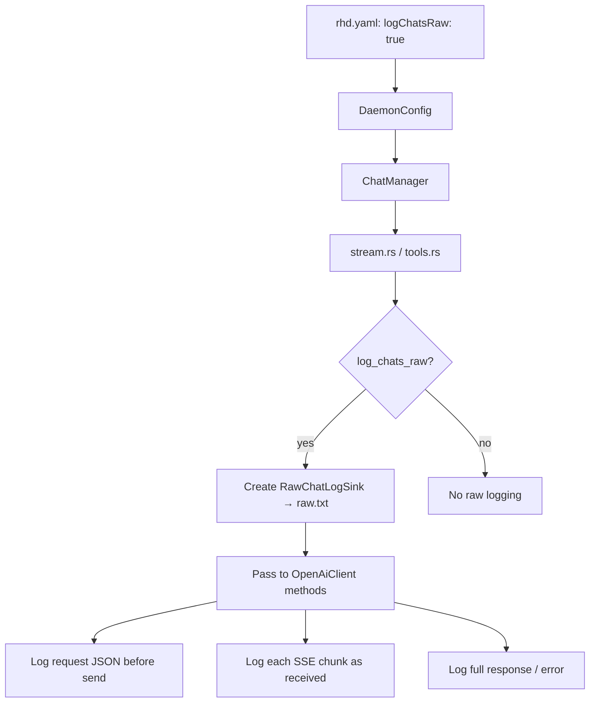

# Plan: `logChatsRaw` — Raw AI Chat Logging

## Goal

Add `logChatsRaw: bool` (default `false`) to `rhd.yaml`. When enabled, write `raw.txt` alongside each chat's `log.txt` containing:
- Full request JSON sent to AI API
- All raw SSE streaming chunks (so user can see which chunks contain reasoning vs content)
- Full non-streaming response JSON
- Detailed error information (status codes, response bodies)

## Architecture



## Files to Modify

### 1. `packages/rhd_app/src/config.rs`
- Add `log_chats_raw: bool` field to `DaemonConfig` (default `false`)
- Serde: `#[serde(default)]` with camelCase → `logChatsRaw`

### 2. `packages/rhd_chat/src/manager.rs`
- Add `log_chats_raw: bool` field to `ChatManager`
- Update `new()` signature to accept it
- Add `log_chats_raw()` accessor

### 3. `packages/rhd_chat/src/chat_log.rs`
- Add `RawChatLogSink` struct (similar to `ChatLogSink`, writes to `raw.txt`)
- Methods:
  - `log_request(model, messages_json, tools_json)` — full request body
  - `log_stream_chunk(index, raw_json)` — each SSE data line
  - `log_response(raw_json)` — full non-streaming response
  - `log_error(status, body)` — error details
- Add `open_raw_log_file(dir)` → creates `raw.txt` in chat log dir

### 4. `packages/rhd_ai/src/client.rs`
- Define `RawLogger` trait:
  ```rust
  pub trait RawLogger: Send {
      fn log_request(&mut self, request_json: &str);
      fn log_stream_chunk(&mut self, index: usize, chunk_json: &str);
      fn log_response(&mut self, response_json: &str);
      fn log_error(&mut self, status: Option<u16>, body: &str);
  }
  ```
- Add optional `raw_log: Option<&mut dyn RawLogger>` parameter to:
  - `chat_with_tools()` — log request JSON before send, log response JSON after receive, log error on failure
  - `chat_stream_cancellable()` — log request JSON, log each SSE `data:` line as it arrives, log error on failure
  - `chat_stream()` — same treatment (used by scenario AI chat)

### 5. `packages/rhd_chat/src/stream.rs`
- When `manager.log_chats_raw()` is true AND `log_chats` dir exists:
  - Create `RawChatLogSink` alongside `ChatLogSink`
  - Pass it to `client.chat_stream_cancellable()` as `raw_log`
- On error path: also log detailed error to raw.txt

### 6. `packages/rhd_chat/src/tools.rs`
- `tool_loop()` receives optional `RawChatLogSink`
- Pass to `client.chat_with_tools()` each iteration
- Log each request/response cycle in the tool loop

### 7. `packages/rhd_app/src/daemon.rs`
- Read `config.log_chats_raw` and pass to `ChatManager::new()`

### 8. `packages/rhd_app/src/scenario/ai_chat.rs`
- If scenario AI chat uses streaming, wire raw logger there too (check if needed)

## Raw Log Format (`raw.txt`)

```
===== REQUEST (iteration 1) =====
POST /chat/completions
model: gpt-4
{full JSON request body}

===== STREAM CHUNK 0 =====
{raw SSE data JSON}

===== STREAM CHUNK 1 =====
{"choices":[{"delta":{"reasoning_content":"Let me think..."}}]}

===== STREAM CHUNK 2 =====
{"choices":[{"delta":{"content":"Here is..."}}]}

===== STREAM DONE =====

----- OR for non-streaming -----
===== RESPONSE =====
{full JSON response body}

----- OR on error -----
===== ERROR =====
status: 429
{error response body}
```

## Key Design Decisions

1. **Trait in `rhd_ai`**: `RawLogger` trait defined in `rhd_ai::client` so the AI client crate stays decoupled from filesystem. `rhd_chat` implements it.

2. **Streaming chunks logged individually**: Each SSE `data:` line logged as it arrives with index, so user can see exactly which chunks contain `reasoning_content` vs `content`.

3. **Requires `logChats`**: `logChatsRaw` only works when `logChats` is also specified. The `raw.txt` file is written to the same chat log directory as `log.txt`. If `logChats` is null, raw logging is silently disabled regardless of `logChatsRaw` setting.

4. **Error logging always detailed**: When raw logging enabled, errors include full HTTP status + response body.
