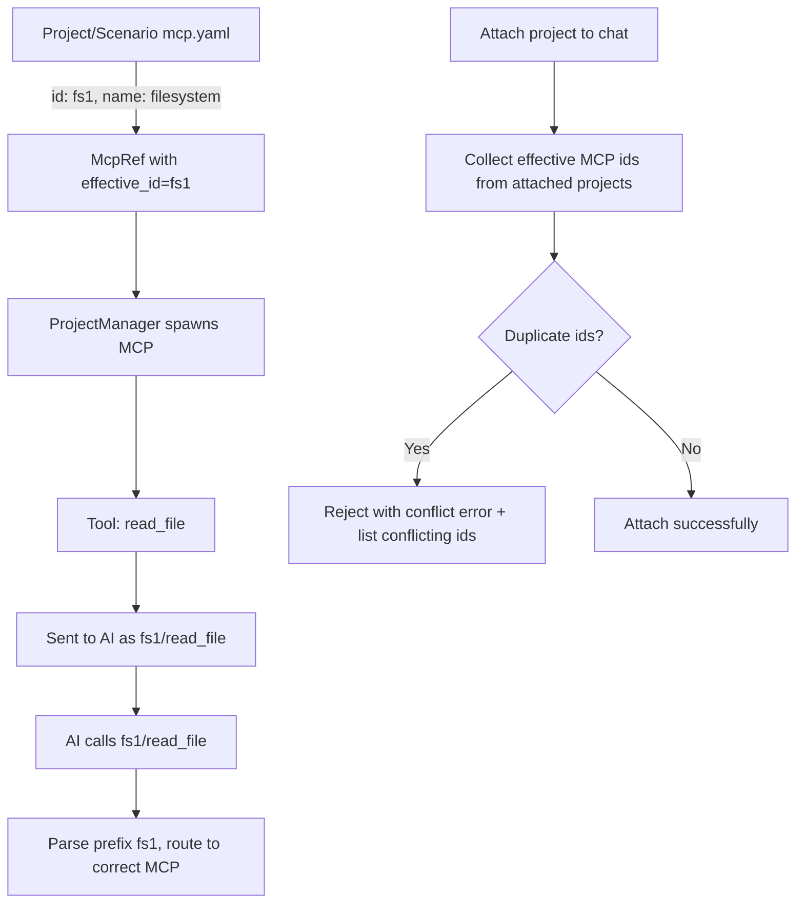

# MCP ID Namespacing Plan

## Goal
Add `id` field to MCP configs in both projects and scenarios. Tool names sent to AI always use `{id}/{tool_name}` format (mandatory prefixing for MCP tools). If `id` not set, defaults to `name`. Internal/built-in tools (e.g. `rhd_set_flag`) are NOT prefixed. Validate no duplicate MCP IDs when attaching projects to chats. Rename `mcpName` → `mcpId` in frontend/API.

## Current State
- Two separate `McpRef` structs:
  - [`rhd_api::project::McpRef`](packages/rhd_api/src/project.rs:17) — projects
  - [`rhd_app::scenario::McpRef`](packages/rhd_app/src/scenario/mod.rs:67) — scenarios
- Both have `name`, `args`, `env` — no `id`
- Tool names sent to AI as-is (no namespace prefix)
- Tool routing: iterate all MCP clients, first `has_tool()` match wins
- Frontend uses `mcpName` in [`ToolCallSchema`](frontend/src/lib/types/index.ts:53) and [`McpStatusSchema`](frontend/src/lib/types/index.ts:79)
- ProjectManager keys MCPs by `project_name:mcp_name`

## Changes

### 1. Add `id` field to project `McpRef` — [`packages/rhd_api/src/project.rs:17`](packages/rhd_api/src/project.rs:17)
```rust
pub struct McpRef {
    pub name: String,
    pub id: Option<String>,  // NEW
    pub args: Option<Vec<String>>,
    pub env: Option<HashMap<String, String>>,
}

impl McpRef {
    pub fn effective_id(&self) -> &str {
        self.id.as_deref().unwrap_or(&self.name)
    }
}
```

### 2. Add `id` field to scenario `McpRef` — [`packages/rhd_app/src/scenario/mod.rs:67`](packages/rhd_app/src/scenario/mod.rs:67)
```rust
pub struct McpRef {
    pub name: String,
    pub id: Option<String>,  // NEW
    pub args: Option<Vec<String>>,
    pub env: Option<HashMap<String, String>>,
}

impl McpRef {
    pub fn effective_id(&self) -> &str {
        self.id.as_deref().unwrap_or(&self.name)
    }
}
```

### 3. Update `project_loader.rs` — [`packages/rhd_app/src/project_loader.rs`](packages/rhd_app/src/project_loader.rs)
- `id` field auto-parsed via serde (optional)
- Add validation: within single project, no duplicate effective MCP ids
- Update tests

### 4. Update scenario loader validation — [`packages/rhd_app/src/scenario/loader.rs`](packages/rhd_app/src/scenario/loader.rs)
- Add validation: within single `aiChat` step's `mcp` list, no duplicate effective ids

### 5. Update `ProjectManager` — [`packages/rhd_app/src/project_manager.rs`](packages/rhd_app/src/project_manager.rs)
- Change status key from `project_name:mcp_name` → `project_name:mcp_id` (using `effective_id()`)
- `get_mcp_status()` returns `(mcp_id, status)` pairs
- `get_mcp_clients()` returns `(mcp_id, client)` pairs
- `spawn_project_mcp()` uses `mcp_ref.effective_id()` for key

### 6. Tool namespacing in chat — [`packages/rhd_app/src/chat.rs`](packages/rhd_app/src/chat.rs)
In `collect_tools_from_projects()`:
- Prefix ALL MCP tool names: `format!("{}/{}", mcp_id, tool.name)`
- Store `(project_name, mcp_id, client)` in mcp_clients

In `find_mcp_for_tool()` and `execute_tool_call()`:
- Parse prefix from tool_call.name (split on first `/`)
- Match by mcp_id directly instead of iterating all clients with `has_tool()`

### 7. Tool namespacing in scenarios — [`packages/rhd_app/src/scenario/ai_chat.rs`](packages/rhd_app/src/scenario/ai_chat.rs)
- Prefix MCP tool names with effective_id: `format!("{}/{}", mcp_ref.effective_id(), tool.name)`
- Built-in tools (`rhd_set_flag`) keep original name — NOT prefixed
- Strip prefix when routing tool calls back to MCP servers
- Route by mcp_id match instead of iterating with `has_tool()`

### 8. Project attachment validation — [`packages/rhd_app/src/chat.rs:894`](packages/rhd_app/src/chat.rs:894)
In `attach_project()`:
- Collect all effective MCP ids from already-attached projects
- Collect all effective MCP ids from project being attached
- If intersection non-empty → return error with conflicting ids
- New error variant: `ChatError::McpIdConflict { conflicting_ids: Vec<String> }`
- On conflict: do NOT attach, return error (frontend shows toast)

### 9. API types rename — [`packages/rhd_api/src/lib.rs`](packages/rhd_api/src/lib.rs)
- `ProjectMcpStatusChangedEvent.mcp_name` → `mcp_id`
- `ToolCallStartedEvent.mcp_name` → `mcp_id`

### 10. WebSocket serialization — [`packages/rhd_app/src/ws.rs`](packages/rhd_app/src/ws.rs)
- Update `ChatEvent::ToolCallStarted` field: `mcp_name` → `mcp_id`
- Update JSON key: `"mcpName"` → `"mcpId"`
- Update `McpStatus` serialization: `"mcpName"` → `"mcpId"`

### 11. Frontend types — [`frontend/src/lib/types/index.ts`](frontend/src/lib/types/index.ts)
- `ToolCallSchema.mcpName` → `mcpId`
- `McpStatusSchema.mcpName` → `mcpId`

### 12. Frontend components
- [`ToolCallMessage.svelte`](frontend/src/components/ToolCallMessage.svelte:56): `toolCall.mcpName` → `toolCall.mcpId`
- [`McpStatusDrawer.svelte`](frontend/src/components/McpStatusDrawer.svelte): update field references
- [`chatStores.ts`](frontend/src/lib/chatStores.ts): update event handling
- [`chatWs.ts`](frontend/src/lib/chatWs.ts): update event parsing

### 13. Update memory docs
- [`memory/features/mcp-tools.md`](memory/features/mcp-tools.md): document id field and mandatory namespacing
- [`memory/features/configuration.md`](memory/features/configuration.md): document project mcp id

## Backward Compatibility
- `id` field optional in YAML — defaults to `name` if not specified
- Existing configs without `id` continue to work (id = name)
- Prefixing mandatory for MCP tools: even without explicit `id`, tools become `name/tool_name`
- Built-in/internal tools (`rhd_set_flag`) NOT prefixed

## Mermaid Diagram


