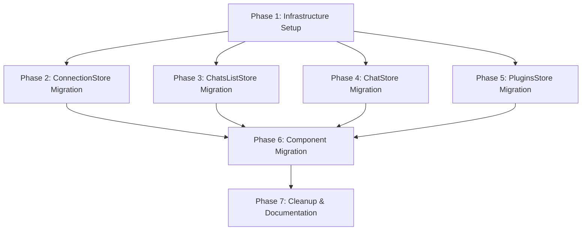

# MobX Migration Grand Plan

## Overview

Migrate the frontend state management from Svelte stores to MobX, establishing a clear separation between business logic (in MobX stores) and UI state (in Svelte's reactivity). This will make the codebase more testable and maintainable.

## Current State

The frontend currently uses Svelte stores (`writable`, `derived`) for state management:
- [`chat.ts`](frontend/src/lib/stores/chat.ts) - Current chat state (messages, queue, loading, error)
- [`chats.ts`](frontend/src/lib/stores/chats.ts) - Chat list state
- [`plugins.ts`](frontend/src/lib/stores/plugins.ts) - Plugins list state
- [`connection.ts`](frontend/src/lib/stores/connection.ts) - WebSocket connection state

Components use `$storeName` syntax to subscribe to stores and call exported functions for mutations.

## Target Architecture

```
frontend/src/
├── stores/
│   ├── AppStore.ts          # Root store with lazy substore access
│   ├── ChatsListStore.ts    # Chat list management
│   ├── ChatStore.ts         # Current chat state
│   ├── PluginsStore.ts      # Plugins management
│   └── ConnectionStore.ts   # WebSocket connection state
├── util/
│   ├── async.ts             # yieldPromise utility
│   └── mobxObservable.ts    # MobX-to-Svelte bridge helper
└── context.ts               # Svelte context for AppStore
```

## Key Architectural Decisions

1. **Root AppStore Pattern**: Single `AppStore` instance accessible via Svelte context, with lazy-loaded substores via getters that cache instances in private fields.

2. **MobX-to-Svelte Bridge**: `mobxObservable()` helper creates a Svelte `$state` that stays in sync with MobX observables via `autorun`.

3. **Async Operations**: Use `mobx.flow` with `yieldPromise` utility for typed async generators.

4. **UI State Separation**: Component-local UI state (modals, menus, form inputs) remains in Svelte's `$state`.

5. **Testing Strategy**: Stores contain all business logic and can be tested independently. Components become "dumb" renderers that can be tested with mocked stores.

## Phase Dependency Graph



## Phases

### Phase 1: Infrastructure Setup

**Goal**: Install MobX, create utility functions, and establish the AppStore pattern.

**Files to Create**:
- `frontend/src/util/async.ts` - `yieldPromise` utility for typed async generators
- `frontend/src/util/mobxObservable.ts` - Bridge helper connecting MobX to Svelte's `$state`
- `frontend/src/stores/AppStore.ts` - Root store with lazy substore getters
- `frontend/src/context.ts` - Svelte context key and helpers for AppStore

**Files to Modify**:
- `frontend/package.json` - Add `mobx` dependency

**Dependencies**: None (starting point)

---

### Phase 2: ConnectionStore Migration

**Goal**: Migrate WebSocket connection state to MobX store.

**Files to Create**:
- `frontend/src/stores/ConnectionStore.ts` - MobX store for connection state

**Files to Modify**:
- `frontend/src/lib/api/websocket.ts` - Update to use ConnectionStore instead of internal Svelte store
- `frontend/src/lib/stores/connection.ts` - Re-export from new ConnectionStore or deprecate

**Dependencies**: Phase 1

---

### Phase 3: ChatsListStore Migration

**Goal**: Migrate chat list management to MobX store with flow-based async operations.

**Files to Create**:
- `frontend/src/stores/ChatsListStore.ts` - MobX store for chat list (init, load, create, delete)

**Files to Modify**:
- `frontend/src/stores/AppStore.ts` - Add `chatsList` lazy getter

**Dependencies**: Phase 1

---

### Phase 4: ChatStore Migration

**Goal**: Migrate current chat state and message handling to MobX store.

**Files to Create**:
- `frontend/src/stores/ChatStore.ts` - MobX store for current chat (messages, queue, selection)

**Files to Modify**:
- `frontend/src/stores/AppStore.ts` - Add `chat` lazy getter

**Dependencies**: Phase 1

---

### Phase 5: PluginsStore Migration

**Goal**: Migrate plugins list management to MobX store.

**Files to Create**:
- `frontend/src/stores/PluginsStore.ts` - MobX store for plugins (init, load, event handling)

**Files to Modify**:
- `frontend/src/stores/AppStore.ts` - Add `plugins` lazy getter

**Dependencies**: Phase 1

---

### Phase 6: Component Migration

**Goal**: Update all components to use MobX stores via `mobxObservable` helper.

**Files to Modify**:
- `frontend/src/App.svelte` - Initialize AppStore, provide via context, update store usage
- `frontend/src/lib/components/ChatList.svelte` - Use `mobxObservable` for chats list state
- `frontend/src/lib/components/ChatView.svelte` - Use `mobxObservable` for current chat state
- `frontend/src/lib/components/Message.svelte` - Update to receive data from parent
- `frontend/src/lib/components/MessageInput.svelte` - Use `mobxObservable` for chat state
- `frontend/src/lib/components/PluginList.svelte` - Use `mobxObservable` for plugins state
- `frontend/src/lib/components/ConnectionStatus.svelte` - Use `mobxObservable` for connection state
- `frontend/src/lib/components/ConfirmModal.svelte` - Keep UI state in Svelte, no changes needed
- `frontend/src/lib/components/TabView.svelte` - Keep UI state in Svelte, no changes needed

**Dependencies**: Phases 2, 3, 4, 5

---

### Phase 7: Cleanup & Documentation

**Goal**: Remove old Svelte stores, update documentation, verify tests.

**Files to Delete**:
- `frontend/src/lib/stores/chat.ts`
- `frontend/src/lib/stores/chats.ts`
- `frontend/src/lib/stores/plugins.ts`
- `frontend/src/lib/stores/connection.ts`

**Files to Create**:
- `memory/frontend/MEMORY.md` - New frontend-specific knowledge base index

**Files to Move**:
- `memory/features/chat.md` → `memory/frontend/features/chat.md`
- `memory/features/cli.md` → `memory/frontend/features/cli.md`
- `memory/features/configuration.md` → `memory/frontend/features/configuration.md`
- `memory/features/logging-monitoring.md` → `memory/frontend/features/logging-monitoring.md`
- `memory/features/mcp-tools.md` → `memory/frontend/features/mcp-tools.md`
- `memory/features/plugins.md` → `memory/frontend/features/plugins.md`
- `memory/features/projects.md` → `memory/frontend/features/projects.md`
- `memory/features/roles.md` → `memory/frontend/features/roles.md`
- `memory/features/scenario-execution.md` → `memory/frontend/features/scenario-execution.md`
- `memory/features/templates.md` → `memory/frontend/features/templates.md`
- `memory/features/testing.md` → `memory/frontend/features/testing.md`

**Files to Modify**:
- `memory/frontend/MEMORY.md` - Update to reflect new MobX store architecture
- `memory/architecture.md` - Document MobX integration pattern

**Dependencies**: Phase 6

## Success Criteria

1. All business logic moved to MobX stores
2. Components use `mobxObservable` for store data
3. UI-only state remains in Svelte's `$state`
4. All existing functionality preserved
5. Stores can be tested independently with mocked API
6. Components can be tested with mocked stores
7. TypeScript types properly inferred throughout
8. No memory leaks from autorun subscriptions

## Testing Strategy

### Store Testing
- Test stores in isolation with mocked API functions
- Verify state transitions and async flows
- Test event handling and data updates

### Component Testing
- Mock AppStore and substores
- Verify components render correct state
- Verify components call correct store methods on user actions

## Migration Pattern Example

**Before (Svelte Store)**:
```typescript
// store.ts
export const items: Writable<Item[]> = writable([]);
export async function loadItems() { ... }

// Component.svelte
import { items, loadItems } from './store.js';
$items // access
loadItems() // mutate
```

**After (MobX)**:
```typescript
// ItemsStore.ts
import { makeAutoObservable } from 'mobx';
import { yieldPromise } from '../util/async.js';
import type { Api } from '../api/Api.js';

class ItemsStore {
  items: Item[] = [];
  #api: Api;

  constructor(options: { api: Api }) {
    this.#api = options.api;
    makeAutoObservable(this);
  }
  
  *loadItems() {
    const result = yield* yieldPromise(this.#api.getItems());
    this.items = result;
  }
}

// Component.svelte
import { mobxObservable } from './util/mobxObservable.js';
import { getAppStore } from './context.js';

const store = getAppStore().items;
let items = mobxObservable(() => store.items);

// In template: $items
// To call: store.loadItems()
```
