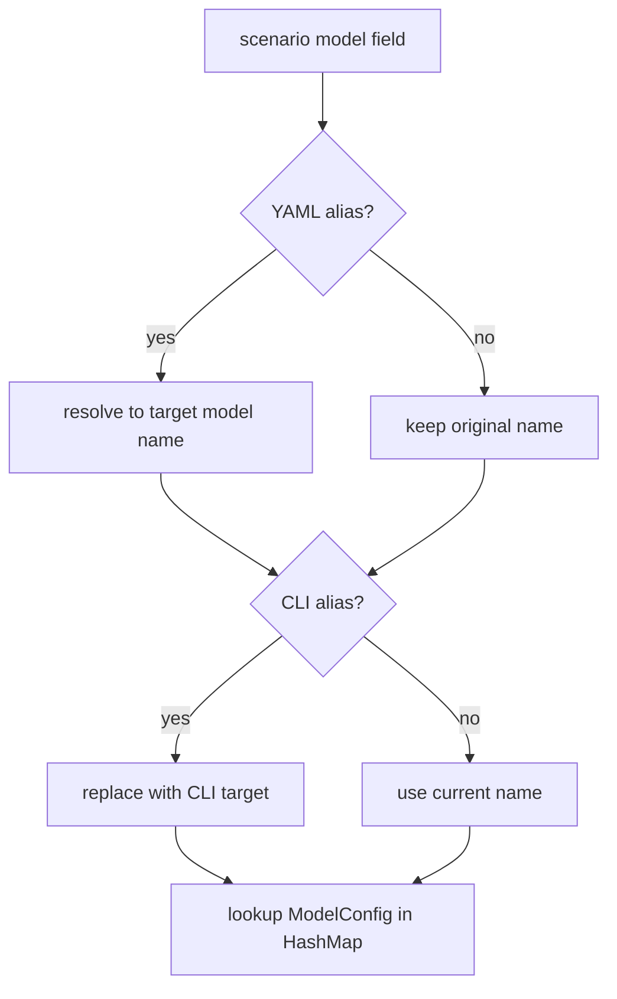

# Model Alias Feature Plan

## Goal

Support model aliases in `models/*.yaml` files and CLI `--modelAlias` option for `rhd run`, allowing model name substitution at execution time.

## Requirements

1. **YAML alias files**: `models/medium.yaml` with `alias: gpt4` resolves to `gpt4` model config
2. **CLI override**: `rhd run example --modelAlias medium=gpt4 --modelAlias small=qwen3` replaces model names in all `aiChat` steps
3. **CLI applies to any model**: `--modelAlias qwen3=gpt5` replaces `qwen3` with `gpt5` even if `qwen3` was itself resolved from a YAML alias
4. **Two-stage resolution**: First YAML aliases resolve, then CLI aliases override
5. **Logging**: Logs show final resolved (actual) model name
6. **Meta/cost**: `meta.json` and cost calculations use final resolved model config

## Resolution Flow



Example:
- `models/medium.yaml` has `alias: qwen3`
- Scenario uses `model: medium`
- CLI: `--modelAlias qwen3=gpt5`
- Resolution: `medium` → `qwen3` (YAML) → `gpt5` (CLI) → lookup `gpt5` in models

## Implementation Steps

### 1. rhd_ai: Model loading with YAML aliases

**File**: `packages/rhd_ai/src/config.rs`

- Add `RawAliasConfig` struct with single `alias: String` field
- Create `RawModelEntry` enum: `Full(RawModelConfig)` or `Alias(RawAliasConfig)` using `#[serde(untagged)]`
- Change `load_models()` to return `HashMap<String, ModelConfig>` where aliases are resolved:
  - First pass: load all entries into `HashMap<String, RawModelEntry>`
  - Second pass: for each alias, resolve to target's `ModelConfig` and insert with alias name
  - Validate: alias target must exist, no circular aliases
- Add new error variants: `AliasTargetNotFound { alias, target }`, `CircularAlias { alias }`

### 2. CLI: Add `--modelAlias` option

**File**: `packages/rhd_app/src/cli.rs`

- Add to `RunArgs`:
  ```rust
  #[arg(long = "modelAlias", value_name = "ALIAS=TARGET")]
  pub model_aliases: Vec<String>,
  ```
- Add validation: each entry must contain `=` and have non-empty alias/target

### 3. IPC protocol: Pass aliases to daemon

**File**: `packages/rhd_app/src/ipc/protocol.rs`

- Extend `IpcRequest::RunScenario`:
  ```rust
  RunScenario { 
      name: String, 
      cwd: String,
      model_aliases: Vec<(String, String)>,
  }
  ```

### 4. Client: Send aliases

**File**: `packages/rhd_app/src/client.rs`

- Update `run_scenario()` signature to accept `model_aliases: Vec<(String, String)>`
- Include in `IpcRequest::RunScenario`

**File**: `packages/rhd_app/src/main.rs`

- Parse `--modelAlias` args into `Vec<(String, String)>`
- Pass to `client::run_scenario()`

### 5. Daemon: Apply CLI aliases during execution

**File**: `packages/rhd_app/src/daemon.rs`

- Update `handle_request()` to extract `model_aliases` from request
- Pass to `execute_scenario()`

**File**: `packages/rhd_app/src/scenario/executor.rs`

- Add `model_aliases: &[(String, String)]` parameter to `execute_scenario()`
- Pass to `execute_ai_chat()`

**File**: `packages/rhd_app/src/scenario/ai_chat.rs`

- Add `model_aliases: &[(String, String)]` parameter to `execute_ai_chat()`
- After determining `model_name` (which may already be YAML-alias-resolved), check if it's in `model_aliases` and replace with target
- The final name is used for all subsequent operations (lookup, logging, meta)

### 6. WebSocket: Support aliases

**File**: `packages/rhd_api/src/lib.rs`

- Add `model_aliases: Vec<(String, String)>` to `WsRequest::RunScenario`

**File**: `packages/rhd_app/src/ws.rs`

- Extract `model_aliases` from request and pass to `execute_scenario()`

## File Changes Summary

| File | Change |
|------|--------|
| `packages/rhd_ai/src/config.rs` | Add YAML alias support to model loading |
| `packages/rhd_app/src/cli.rs` | Add `--modelAlias` option |
| `packages/rhd_app/src/ipc/protocol.rs` | Add `model_aliases` to `RunScenario` |
| `packages/rhd_app/src/client.rs` | Pass aliases to daemon |
| `packages/rhd_app/src/main.rs` | Parse CLI aliases |
| `packages/rhd_app/src/daemon.rs` | Extract and pass aliases |
| `packages/rhd_app/src/scenario/executor.rs` | Accept and pass aliases |
| `packages/rhd_app/src/scenario/ai_chat.rs` | Apply CLI alias after YAML resolution |
| `packages/rhd_api/src/lib.rs` | Add aliases to `WsRequest::RunScenario` |
| `packages/rhd_app/src/ws.rs` | Pass aliases to executor |

## Validation

- YAML alias target must reference existing model name
- CLI alias format must be `alias=target`
- No circular YAML aliases allowed
- Unknown model after full resolution produces clear error

## Testing

- E2E test: create `models/alias.yaml` with `alias: test_model`, verify scenario using `model: alias` works
- E2E test: verify `--modelAlias` overrides model in aiChat step (both direct and YAML-alias-resolved models)
- Verify logs show final resolved model name
- Verify meta.json contains final resolved model name and correct cost
