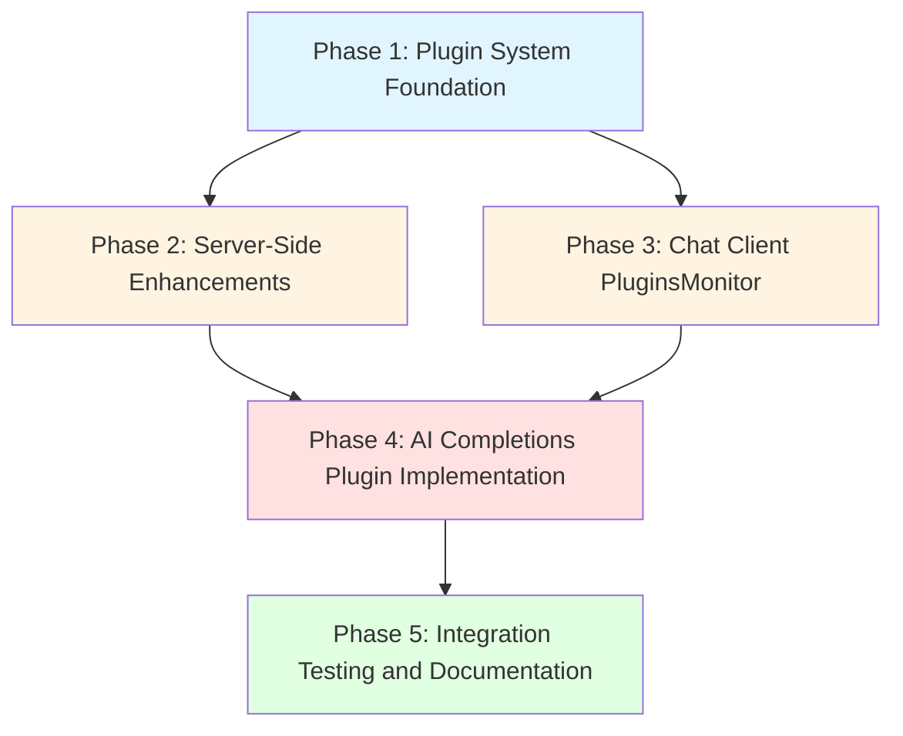

# Plugin System and AI Completions Plugin - Grand Plan

## Overview

This plan establishes a plugin architecture for the RHD chat system and implements the first plugin: `rhd_plugin_ai_completions`. The plugin system allows external binary applications to connect to the chat server, register themselves, subscribe to events, and interact with the chat system through a well-defined API.

## Phase 1: Plugin System Foundation

### Goal
Establish the plugin infrastructure, documentation, and base structure for plugin implementations.

### Files to Create/Modify

#### 1. `plugins/README.md` (CREATE)
**Purpose**: Comprehensive documentation of the plugin system architecture, lifecycle, and conventions.

**Content**:
- Plugin lifecycle: connect → register → getPendingAcks → subscribe → react
- Event model: custom events, acknowledgments, pending acks
- Plugin responsibilities: what events to listen for, what tags to add, what events to emit
- Configuration conventions
- README template for individual plugins

#### 2. `plugins/rhd_plugin_ai_completions/README.md` (CREATE)
**Purpose**: Document this specific plugin's behavior, triggers, events, and tags.

**Content**:
- Trigger conditions (queued messages, tool call resolution)
- Events emitted (`ai_completions:preRequest`)
- Tags added to messages/chat (`ai_completions:error` on errors)
- Configuration format
- Dependencies on other plugins or system events

#### 3. `plugins/rhd_plugin_ai_completions/Cargo.toml` (CREATE)
**Purpose**: Package manifest for the AI completions plugin.

**Dependencies**:
- `rhd_chat_client` - For connecting to chat server
- `rhd_ai_client` - For making AI completion requests
- `tokio` - Async runtime
- `serde`, `serde_yaml` - Configuration parsing
- `tracing` - Logging

#### 4. `plugins/rhd_plugin_ai_completions/src/main.rs` (CREATE)
**Purpose**: Entry point for the plugin binary.

**Responsibilities**:
- Parse command-line arguments (server URL, config file path)
- Load configuration
- Initialize logging
- Run the plugin main loop

#### 5. `plugins/rhd_plugin_ai_completions/src/config.rs` (CREATE)
**Purpose**: Configuration structure and loading logic.

**Structure**:
```rust
struct PluginConfig {
    credentials_config: String,
    ai_completions: AiCompletionsConfig,
}

struct AiCompletionsConfig {
    models: HashMap<String, ModelConfig>,
}

struct ModelConfig {
    alias: Option<String>,
    base_url: Option<String>,
    api_key: ApiKeyConfig,
    model: String,
}

struct ApiKeyConfig {
    cred: String,
}

struct CredentialsConfig {
    // Map of credential name to value
    credentials: HashMap<String, String>,
}
```

#### 6. `plugins/rhd_plugin_ai_completions/src/plugin.rs` (CREATE)
**Purpose**: Core plugin logic and event handling.

**Responsibilities**:
- Connect to chat server
- Register as plugin
- Fetch and process pending acks
- Subscribe to chat list and individual chats
- Monitor for trigger conditions
- Execute AI completions when triggered

### Key Architectural Decisions

1. **Plugin as Binary**: Each plugin is a standalone binary application, not a library. This allows independent deployment and scaling.

2. **Event-Driven Architecture**: Plugins react to events rather than polling. The subscription system ensures real-time responsiveness.

3. **Pending Acks Recovery**: On startup, plugins must call `getPendingAcks` to handle events they may have missed while disconnected.

4. **Custom Event Coordination**: The `ai_completions:preRequest` event allows other plugins to modify state before AI requests are made.

### Dependencies
- None (foundational phase)

---

## Phase 2: Server-Side Enhancements

### Goal
Extend the chat server API to support plugin requirements, specifically returning queued messages count in `getChat` and supporting random port binding.

### Files to Modify

#### 1. `packages/rhd_chat_api/src/methods/get_chat.rs` (MODIFY)
**Purpose**: Add `queued_messages_count` field to `GetChatResult`.

**Changes**:
```rust
pub struct GetChatResult {
    pub chat: Chat,
    pub messages: Vec<Message>,
    pub queued_messages_count: i64,  // NEW FIELD
}
```

**Rationale**: The AI completions plugin needs to know if there are queued messages without making a separate API call. This enables efficient trigger condition checking.

#### 2. `packages/rhd_chat_server/src/handlers/chat.rs` (MODIFY)
**Purpose**: Update `get_chat` handler to include queued messages count.

**Changes**:
- Query database for queued messages count
- Include count in response

#### 3. `packages/rhd_chat_server/src/server.rs` (MODIFY)
**Purpose**: Support binding to random port (port 0).

**Changes**:
- When port is 0, let the OS assign a random available port
- Return the actual bound port so tests can use it
- Update server startup logic to handle this

#### 4. `packages/rhd_chat_server/src/handlers/chat.rs` tests (MODIFY)
**Purpose**: Update tests to verify queued messages count is returned correctly.

### Key Architectural Decisions

1. **Count vs Full Messages**: Return only the count, not the full queued messages. This reduces payload size and the plugin can fetch full messages if needed via `getQueueMessages`.

2. **Backward Compatibility**: The new field is additive and doesn't break existing clients.

3. **Random Port Support**: Essential for integration testing to avoid port conflicts.

### Dependencies
- Phase 1 (plugin system foundation must exist to validate the API changes)

---

## Phase 3: Chat Client PluginsMonitor and ChatMonitor Features

### Goal
Add `PluginsMonitor` and `ChatMonitor` features to `rhd_chat_client` that can be reused by any plugin.

### Files to Modify

#### 1. `packages/rhd_chat_client/src/client.rs` (MODIFY)
**Purpose**: Add `PluginsMonitor` and `ChatMonitor` creation methods.

**New API**:
```rust
impl ChatClient {
    /// Create a plugins monitor that tracks all registered plugins (active and inactive).
    /// Subscribes to plugins list and maintains current set of plugin IDs.
    pub async fn create_plugins_monitor(&self) -> Result<PluginsMonitor, ClientError>;
    
    /// Create a chat monitor that tracks chats and their state.
    /// Subscribes to chat list and individual chats.
    pub async fn create_chat_monitor(&self) -> Result<ChatMonitor, ClientError>;
}
```

#### 2. `packages/rhd_chat_client/src/plugins_monitor.rs` (CREATE)
**Purpose**: Implementation of the PluginsMonitor logic.

**Responsibilities**:
- Subscribe to plugins list events
- Maintain set of ALL registered plugins (active and inactive)
- Track plugin active/inactive status
- Track custom event acknowledgments
- Provide wait logic for acknowledgment coordination

**Key Change**: The monitor tracks ALL plugins, not just active ones. This ensures that even if a plugin hasn't started yet, we still wait for it to acknowledge events.

#### 3. `packages/rhd_chat_client/src/chat_monitor.rs` (CREATE)
**Purpose**: Generic chat monitoring logic that can be used by any plugin.

**Responsibilities**:
- Subscribe to chat list events
- Subscribe to individual chat events
- Track chat state (messages, queue count, tags)
- Provide methods to query chat state
- Detect trigger conditions (configurable by plugin)

**API**:
```rust
pub struct ChatMonitor {
    // Internal state
}

impl ChatMonitor {
    /// Get all chat IDs being monitored.
    pub fn get_chat_ids(&self) -> Vec<i64>;
    
    /// Get chat state for a specific chat.
    pub async fn get_chat_state(&self, chat_id: i64) -> Option<ChatState>;
    
    /// Refresh chat state from server.
    pub async fn refresh_chat(&self, chat_id: i64) -> Result<(), ClientError>;
}

pub struct ChatState {
    pub chat_id: i64,
    pub messages: Vec<Message>,
    pub queued_messages_count: i64,
    pub tags: Vec<String>,
}
```

#### 4. `packages/rhd_chat_client/src/lib.rs` (MODIFY)
**Purpose**: Export the new `PluginsMonitor` and `ChatMonitor` types.

### Key Architectural Decisions

1. **Separate Monitor Objects**: Monitors are separate objects from the client, allowing multiple monitors if needed and clear separation of concerns.

2. **Automatic Subscription**: Monitors automatically subscribe to relevant events when created.

3. **Track All Plugins**: The PluginsMonitor tracks ALL registered plugins, not just active ones. This ensures proper coordination even when plugins start at different times.

4. **Reusable ChatMonitor**: The ChatMonitor is generic and can be used by any plugin that needs to monitor chats. Plugins can add their own trigger detection logic on top of the base monitoring.

5. **Wait Logic**: The `wait_for_acks_except` method waits for ALL plugins (except excluded ones), including inactive ones that haven't started yet.

### Dependencies
- Phase 1 (plugin system foundation)

---

## Phase 4: AI Completions Plugin Implementation

### Goal
Implement the core logic of the `rhd_plugin_ai_completions` plugin.

### Files to Create

#### 1. `plugins/rhd_plugin_ai_completions/src/trigger_detection.rs` (CREATE)
**Purpose**: Detect trigger conditions for AI completions.

**Responsibilities**:
- Analyze chat state to determine if AI completion should be triggered
- Check for queued messages and tool call resolution
- Filter out chats with error tags

**Data Structures**:
```rust
enum TriggerReason {
    /// Queued messages present, no unresolved tool calls
    QueuedMessages,
    /// Tool loop continuation: last assistant has tool calls, all resolved
    ToolLoopContinuation,
    /// No trigger needed
    None,
}

/// Check if chat should trigger AI completion.
pub fn should_trigger(chat_state: &ChatState) -> TriggerReason;

/// Check if chat has error tag.
pub fn has_error_tag(chat_state: &ChatState) -> bool;
```

**Note**: This module uses the `ChatMonitor` and `ChatState` from `rhd_chat_client` (Phase 3).

#### 2. `plugins/rhd_plugin_ai_completions/src/ai_request.rs` (CREATE)
**Purpose**: Handle AI completion requests.

**Responsibilities**:
- Build AI request from chat messages (filtering out error messages)
- Send `ai_completions:preRequest` event
- Wait for acknowledgments from other plugins
- Process queued messages (remove from queue, add to messages)
- Make AI completion request via `rhd_ai_client` (non-streaming)
- Handle response (success or error)
- Add assistant message to chat on success
- Add error message and tag on failure

**Flow**:
1. Check if chat already has `ai_completions:error` tag - if yes, skip
2. Send `ai_completions:preRequest` custom event with chat ID
3. Use `PluginsMonitor.wait_for_acks_except` to wait for all other plugins
4. If trigger reason is `QueuedMessages`:
   - Fetch queued messages
   - Delete each queued message
   - Add each as regular message
5. Acknowledge own event
6. Build AI request from messages (filter out `ai_completions:error` role messages)
7. Make non-streaming completion request
8. On success:
   - Add assistant message to chat
   - If response contains tool calls, other plugins will handle them
9. On error:
   - Add `ai_completions:error` tag to chat
   - Add message with role `ai_completions:error` containing error details

**Message Filtering Logic**:
```rust
fn filter_messages_for_ai(messages: &[Message]) -> Vec<Message> {
    messages.iter()
        .filter(|m| matches!(m.role.as_str(), "user" | "assistant" | "system" | "tool"))
        .cloned()
        .collect()
}
```

#### 3. `plugins/rhd_plugin_ai_completions/src/tool_resolution.rs` (CREATE)
**Purpose**: Detect when tool calls are resolved.

**Responsibilities**:
- Analyze message history to find unresolved tool calls
- Check if all tool calls have corresponding tool result messages
- Determine if tool loop should continue

**Logic**:
```rust
fn has_unresolved_tool_calls(messages: &[Message]) -> bool {
    // Find last assistant message with tool_calls
    // Check if there are tool result messages for all of them
    // Return true if any tool call lacks a result
}

fn all_tool_calls_resolved(messages: &[Message]) -> bool {
    // Find last assistant message with tool_calls
    // Count tool calls
    // Count tool result messages after it
    // Return true if counts match
}
```

### Key Architectural Decisions

1. **Two Trigger Modes**: The plugin operates in two distinct modes:
   - **Queued Messages Mode**: User has queued new messages, plugin processes them
   - **Tool Loop Mode**: AI made tool calls, all resolved, continue the loop

2. **Pre-Request Event**: The `ai_completions:preRequest` event allows other plugins to:
   - Add their own messages to the queue
   - Modify existing queued messages
   - Perform cleanup or logging
   - Block the request if needed (by not acknowledging)

3. **Queued Message Processing**: When processing queued messages:
   - Remove from queue (via `deleteQueueMessage`)
   - Add as regular messages (via `addMessage`)
   - This ensures proper message ordering and history

4. **Non-Streaming Only**: Initial implementation uses non-streaming requests. Streaming will be added later.

5. **Error Handling**:
   - On AI request failure, add `ai_completions:error` tag to chat
   - Add error message with role `ai_completions:error`
   - Skip chats with error tag (no further processing)
   - Filter out error messages when building AI requests

6. **Tool Call Handling**: If AI response contains tool calls:
   - Add assistant message with tool calls to chat
   - Other plugins will execute the tools
   - Results will be added as tool messages
   - Plugin will detect resolution and continue the loop

### Dependencies
- Phase 1 (plugin foundation)
- Phase 2 (getChat with queued count)
- Phase 3 (PluginsMonitor)

---

## Phase 5: Integration Testing and Documentation

### Goal
Create integration tests using mock servers and finalize documentation.

### Files to Create/Modify

#### 1. `plugins/rhd_plugin_ai_completions/tests/integration_test.rs` (CREATE)
**Purpose**: End-to-end tests for the plugin using mock servers.

**Test Infrastructure**:
```rust
// Helper to start test environment
async fn start_test_env() -> TestEnv {
    // Start rhd_chat_server on random port
    let chat_server = start_chat_server_random_port().await;
    
    // Start rhd_mock_ai_provider on random port
    let mock_ai = start_mock_ai_random_port().await;
    
    // Create config without file (in-memory)
    let config = create_test_config(
        chat_server.url(),
        mock_ai.url(),
    );
    
    TestEnv {
        chat_server,
        mock_ai,
        config,
    }
}
```

**Test Scenarios**:
- Plugin connects and registers successfully
- Plugin processes pending acks on startup
- Plugin triggers on queued messages
- Plugin triggers on tool loop continuation
- Plugin sends preRequest event and waits for acks
- Plugin handles configuration loading
- Plugin handles AI request errors (adds error tag and message)
- Plugin skips chats with error tag
- Plugin filters out error messages when building AI requests
- Plugin handles tool calls in AI response (other plugins execute them)
- Plugin continues tool loop when all tool calls resolved

#### 2. `packages/rhd_mock_ai_provider/src/server.rs` (MODIFY)
**Purpose**: Support random port binding for testing.

**Changes**:
- Add function to start server on random port
- Return actual bound port

#### 3. `plugins/rhd_plugin_ai_completions/README.md` (UPDATE)
**Purpose**: Add usage examples and troubleshooting.

**Content**:
- How to run the plugin
- Configuration examples
- Common issues and solutions
- Integration with other plugins

#### 4. `memory/features/plugins.md` (CREATE)
**Purpose**: Product-view documentation of the plugin system.

**Content**:
- What plugins are and how they work
- User workflows for deploying plugins
- Configuration options
- Error handling from user perspective

### Key Architectural Decisions

1. **Test Coverage**: Integration tests verify the full plugin lifecycle, not just individual components.

2. **Mock Server Usage**: Use `rhd_mock_ai_provider` for AI responses, allowing controlled testing of success and error scenarios.

3. **Random Ports**: Both chat server and mock AI server support random port binding to avoid conflicts in CI/CD.

4. **In-Memory Config**: Tests can create configuration without writing files, simplifying test setup.

5. **Error Scenario Testing**: Explicitly test error handling:
   - AI request failures
   - Error tag addition
   - Error message creation
   - Skipping chats with errors

### Dependencies
- Phase 4 (plugin implementation)

---

## Dependency Graph



**Parallelization Opportunities**:
- Phase 2 and Phase 3 can be implemented in parallel after Phase 1 is complete
- Phase 4 requires both Phase 2 and Phase 3 to be complete

---

## Success Criteria

The grand plan is complete when:

1. ✅ `plugins/README.md` exists and documents the plugin system architecture
2. ✅ `plugins/rhd_plugin_ai_completions/` package exists with proper structure
3. ✅ Plugin binary can connect to chat server and register itself
4. ✅ Plugin processes pending acks on startup
5. ✅ Plugin subscribes to chat list and individual chats
6. ✅ Plugin triggers AI completions when:
   - Queued messages present and no unresolved tool calls and no error tag
   - Tool loop continuation needed (all tool calls resolved) and no error tag
7. ✅ Plugin sends `ai_completions:preRequest` event before AI calls
8. ✅ Plugin waits for other plugins to acknowledge the event
9. ✅ Plugin processes queued messages (removes from queue, adds to messages)
10. ✅ Plugin makes non-streaming AI completion requests via `rhd_ai_client`
11. ✅ Plugin handles successful responses (adds assistant message to chat)
12. ✅ Plugin handles tool calls in responses (other plugins execute them)
13. ✅ Plugin handles errors (adds error tag and error message)
14. ✅ Plugin skips chats with error tag
15. ✅ Plugin filters out error messages when building AI requests
16. ✅ Plugin configuration file is properly parsed
17. ✅ `getChat` API returns queued messages count
18. ✅ `PluginsMonitor` feature exists in `rhd_chat_client`
19. ✅ `rhd_chat_server` supports random port binding
20. ✅ `rhd_mock_ai_provider` supports random port binding
21. ✅ Integration tests pass using mock servers
22. ✅ All README files are complete and accurate

---

## Risk Mitigation

1. **Event Ordering**: The preRequest event mechanism ensures proper coordination between plugins. If a plugin fails to acknowledge, the request will timeout.

2. **Message Ordering**: Queued messages are processed in order and added as regular messages to maintain chat history integrity.

3. **Tool Call Resolution**: The tool resolution logic carefully tracks tool calls and their results to avoid premature or delayed triggering.

4. **Configuration Validation**: The plugin validates configuration on startup and provides clear error messages for missing or invalid values.

5. **Error Handling**: Clear error handling with tags and messages ensures visibility into failures and prevents infinite retry loops.

6. **Test Isolation**: Random port binding and in-memory configuration ensure tests don't interfere with each other or with production systems.

---

## Future Enhancements (Out of Scope)

1. **Streaming AI Responses**: Initial implementation uses non-streaming requests. Streaming can be added later.

2. **Plugin-to-Plugin Communication**: Beyond the preRequest event, plugins may need more sophisticated communication mechanisms.

3. **Plugin Health Monitoring**: Track plugin health and automatically restart failed plugins.

4. **Dynamic Plugin Loading**: Allow plugins to be loaded/unloaded without restarting the chat server.

5. **Plugin Sandboxing**: Isolate plugins for security and stability.

6. **Plugin Marketplace**: Central repository for sharing and discovering plugins.

7. **Error Recovery**: Allow chats to recover from error state after manual intervention.
