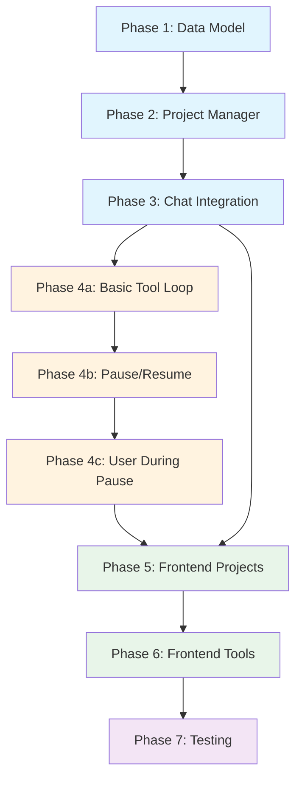

# Projects Feature - Implementation Index

## Overview

Add "projects" feature to RHD, allowing users to attach project contexts to chats. Each project provides MCP servers and system prompts that enhance AI conversations with tool capabilities.

## Architecture

```
┌─────────────────────────────────────────────────────────────┐
│                        Frontend                              │
│  ┌──────────────┐  ┌──────────────┐  ┌──────────────────┐  │
│  │  Projects    │  │  Chat View   │  │  MCP Status      │  │
│  │  Panel       │  │  + Tools     │  │  Drawer          │  │
│  └──────────────┘  └──────────────┘  └──────────────────┘  │
└─────────────────────────────────────────────────────────────┘
                               │ WebSocket
                               ▼
┌─────────────────────────────────────────────────────────────┐
│                         Daemon                               │
│  ┌──────────────┐  ┌──────────────┐  ┌──────────────────┐  │
│  │  Project     │  │  Chat        │  │  MCP Server      │  │
│  │  Manager     │  │  Manager     │  │  Cache           │  │
│  └──────────────┘  └──────────────┘  └──────────────────┘  │
│  ┌──────────────┐  ┌──────────────┐                         │
│  │  Project     │  │  Chat DB     │                         │
│  │  Loader      │  │  (extended)  │                         │
│  └──────────────┘  └──────────────┘                         │
└─────────────────────────────────────────────────────────────┘
                               │
                               ▼
┌─────────────────────────────────────────────────────────────┐
│                      File System                             │
│  projects/                                                   │
│  ├── project-a/                                              │
│  │   ├── mcp.yaml         # MCP server configs              │
│  │   └── systemPrompt.md  # System prompt                   │
│  └── project-b/                                              │
│      ├── mcp.yaml                                            │
│      └── systemPrompt.md                                     │
└─────────────────────────────────────────────────────────────┘
```

## Implementation Plans

| Phase | Plan | Description | Dependencies | Risk |
|-------|------|-------------|--------------|------|
| 1 | [01-project-data-model.md](01-project-data-model.md) | Project structure, config, loader | None | Low |
| 2 | [02-project-manager.md](02-project-manager.md) | ProjectManager, MCP lifecycle, WS API | Phase 1 | Medium |
| 3 | [03-chat-project-integration.md](03-chat-project-integration.md) | Attach projects to chats, system prompts | Phase 1, 2 | Medium |
| 4a | [04a-basic-tool-loop.md](04a-basic-tool-loop.md) | Tool execution loop (reuses scenario pattern) | Phase 1, 2, 3 | Low |
| 4b | [04b-pause-resume.md](04b-pause-resume.md) | Pause/resume state machine | Phase 4a | Medium |
| 4c | [04c-user-during-pause.md](04c-user-during-pause.md) | User message during pause | Phase 4b | Medium |
| 5 | [05-frontend-project-ui.md](05-frontend-project-ui.md) | Project UI, MCP status display | Phase 1-3 | Low |
| 6 | [06-frontend-tool-ui.md](06-frontend-tool-ui.md) | Tool call display, control buttons | Phase 4a, 5 | Medium |
| 7 | [07-testing.md](07-testing.md) | Unit tests, E2E tests | All phases | Medium |

## Implementation Order



**Legend**:
- Blue: Backend core
- Orange: Backend advanced
- Green: Frontend
- Purple: Testing

## Key Design Decisions

1. **MCP Server Lifecycle**: Servers spawned when project attached to chat, killed only on daemon shutdown (not on detach). Avoids restart overhead.

2. **System Prompt Injection**: Added as system messages on first send after attachment. Tracked per-project per-chat in `chat_projects` table to avoid duplicates.

3. **Tool Execution State**: Separate from streaming state. Allows pause/resume without losing tool context. Pause happens between tool calls, not mid-execution.

4. **DB Schema**: Separate `chat_projects` table for chat-project relationships. Tracks system prompt injection state.

5. **Frontend State**: Project stores separate from chat stores. MCP status tracked globally, filtered by chat context.

6. **Tool Call Storage**: Stored as JSON in message content field (no schema change). Simple approach, may need optimization for large results.

## Risk Mitigation

| Risk | Mitigation |
|------|------------|
| MCP server crashes | Track status, show error in UI, allow retry |
| Tool execution hangs | Cancel button always available |
| System prompt duplicates | Track injection state in DB |
| Large tool results | Truncate in UI, full content in DB |
| Multiple projects same tool | First match wins, log warning |
| Pause/resume complexity | Only pause between tool calls, not mid-execution |

## File Structure

```
projects/
├── project-name/
│   ├── mcp.yaml         # MCP server references
│   └── systemPrompt.md  # Optional system prompt
```

### mcp.yaml format
```yaml
- name: fs                    # Reference to mcp/fs/mcp.yaml
  env:
    AVAILABLE_ROOT: /path
  args: ["--extra-arg"]       # Optional override
- name: flags                 # Built-in tools
```

## Future Enhancements (Out of Scope)

- Project templates
- Project sharing/export
- MCP server auto-restart
- Tool result streaming
- Project-level model overrides
