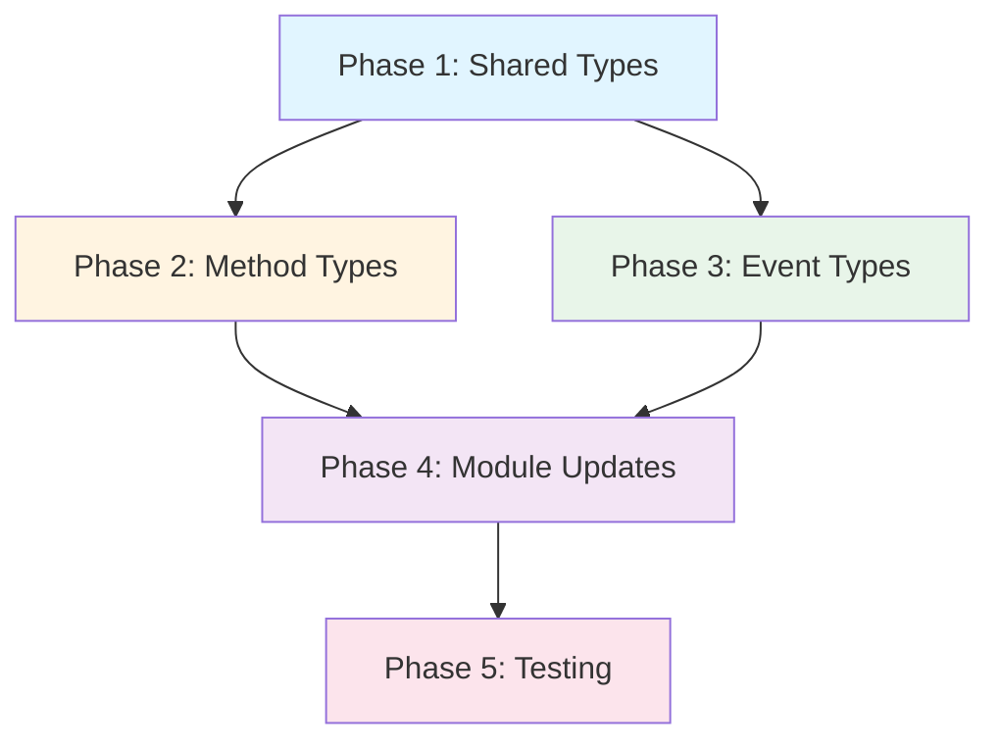

# RHD Chat API Plugin Methods Implementation Plan

## Overview

Add plugin management and custom event methods to the existing `rhd_chat_api` package. This plan focuses solely on adding the API types (request/response structs and event data structs) for the new plugin-related functionality.

## Goals

- Add 8 new method types to `rhd_chat_api`
- Add 5 new event types to `rhd_chat_api`
- Add shared types for Plugin and CustomEvent to `common.rs`
- Follow existing patterns and conventions in the codebase
- All types must serialize/deserialize correctly with camelCase field names

## New Methods to Add

### 1. `registerPlugin`
Register current WebSocket connection as a plugin with the specified ID.

**Files to create:**
- `packages/rhd_chat_api/src/methods/register_plugin.rs`

**Types:**
- `RegisterPluginParams { plugin_id: String }`
- `RegisterPluginResult {}`

### 2. `getPlugins`
List all registered plugins with their active status.

**Files to create:**
- `packages/rhd_chat_api/src/methods/get_plugins.rs`

**Types:**
- `GetPluginsParams {}`
- `GetPluginsResult { plugins: Vec<PluginSummary> }`

### 3. `subscribePluginsList`
Subscribe to changes in the plugins list.

**Files to create:**
- `packages/rhd_chat_api/src/methods/subscribe_plugins_list.rs`

**Types:**
- `SubscribePluginsListParams {}`
- `SubscribePluginsListResult {}`

### 4. `unsubscribePluginsList`
Unsubscribe from plugins list changes.

**Files to create:**
- `packages/rhd_chat_api/src/methods/unsubscribe_plugins_list.rs`

**Types:**
- `UnsubscribePluginsListParams {}`
- `UnsubscribePluginsListResult {}`

### 5. `removePlugin`
Remove a plugin from the list of plugins.

**Files to create:**
- `packages/rhd_chat_api/src/methods/remove_plugin.rs`

**Types:**
- `RemovePluginParams { plugin_id: String }`
- `RemovePluginResult {}`

### 6. `sendCustomEvent`
Send a custom event that broadcasts to all connected WebSockets.

**Files to create:**
- `packages/rhd_chat_api/src/methods/send_custom_event.rs`

**Types:**
- `SendCustomEventParams { event_name: String, additional: Option<String> }`
- `SendCustomEventResult { event_id: String }`

### 7. `ackCustomEvent`
Acknowledge receiving a custom event by the current plugin.

**Files to create:**
- `packages/rhd_chat_api/src/methods/ack_custom_event.rs`

**Types:**
- `AckCustomEventParams { event_id: String }`
- `AckCustomEventResult {}`

### 8. `getPendingAcks`
Get list of events that have not been acknowledged by the current plugin.

**Files to create:**
- `packages/rhd_chat_api/src/methods/get_pending_acks.rs`

**Types:**
- `GetPendingAcksParams {}`
- `GetPendingAcksResult { pending_events: Vec<PendingEvent> }`

## New Event Types to Add

### 1. `pluginRegistered`
Emitted when a new plugin is registered or an existing plugin becomes active.

**Files to create:**
- `packages/rhd_chat_api/src/events/plugin_registered.rs`

**Types:**
- `PluginRegisteredData { plugin_id: String, is_active: bool }`

### 2. `pluginRemoved`
Emitted when a plugin is removed from the list.

**Files to create:**
- `packages/rhd_chat_api/src/events/plugin_removed.rs`

**Types:**
- `PluginRemovedData { plugin_id: String }`

### 3. `pluginUpdated`
Emitted when a plugin's active status changes.

**Files to create:**
- `packages/rhd_chat_api/src/events/plugin_updated.rs`

**Types:**
- `PluginUpdatedData { plugin_id: String, is_active: bool }`

### 4. `customEvent`
Broadcast to all connected WebSocket clients when a custom event is sent.

**Files to create:**
- `packages/rhd_chat_api/src/events/custom_event.rs`

**Types:**
- `CustomEventData { event_id: String, event_name: String, sender_plugin_id: Option<String>, additional: Option<String>, created_at: DateTime<Utc> }`

### 5. `customEventAcknowledged`
Sent to the plugin that originally sent the custom event when another plugin acknowledges it.

**Files to create:**
- `packages/rhd_chat_api/src/events/custom_event_acknowledged.rs`

**Types:**
- `CustomEventAcknowledgedData { event_id: String, acknowledging_plugin_id: String }`

## Shared Types to Add

### In `common.rs`

Add the following types:

```rust
/// A plugin with its active status.
#[derive(Debug, Clone, Serialize, Deserialize, PartialEq, Eq)]
#[serde(rename_all = "camelCase")]
pub struct PluginSummary {
    /// Unique identifier for the plugin.
    pub plugin_id: String,
    /// Whether the plugin's WebSocket connection is active.
    pub is_active: bool,
}

/// A pending custom event that has not been acknowledged.
#[derive(Debug, Clone, Serialize, Deserialize, PartialEq, Eq)]
#[serde(rename_all = "camelCase")]
pub struct PendingEvent {
    /// Unique identifier for the event.
    pub event_id: String,
    /// Name of the event.
    pub event_name: String,
    /// ID of the plugin that sent the event.
    pub sender_plugin_id: Option<String>,
    /// Additional JSON data.
    pub additional: Option<String>,
    /// Timestamp when the event was created.
    pub created_at: DateTime<Utc>,
}
```

## Files to Modify

### 1. `packages/rhd_chat_api/src/methods/mod.rs`
Add module declarations and re-exports for all 8 new method files.

### 2. `packages/rhd_chat_api/src/events/mod.rs`
Add module declarations and re-exports for all 5 new event files.

### 3. `packages/rhd_chat_api/src/lib.rs`
Add re-exports for all new types at the crate root.

### 4. `packages/rhd_chat_api/src/common.rs`
Add `PluginSummary` and `PendingEvent` types.

## Implementation Phases

### Phase 1: Shared Types
**Goal**: Add shared types to `common.rs`.

**Files to modify:**
- `packages/rhd_chat_api/src/common.rs` — Add `PluginSummary` and `PendingEvent`

**Key decisions:**
- Follow existing patterns for struct definitions
- Use `#[serde(rename_all = "camelCase")]` for JSON field names
- Use `DateTime<Utc>` for timestamps

### Phase 2: Method Types
**Goal**: Implement request/response types for all 8 new methods.

**Files to create:**
- `packages/rhd_chat_api/src/methods/register_plugin.rs`
- `packages/rhd_chat_api/src/methods/get_plugins.rs`
- `packages/rhd_chat_api/src/methods/subscribe_plugins_list.rs`
- `packages/rhd_chat_api/src/methods/unsubscribe_plugins_list.rs`
- `packages/rhd_chat_api/src/methods/remove_plugin.rs`
- `packages/rhd_chat_api/src/methods/send_custom_event.rs`
- `packages/rhd_chat_api/src/methods/ack_custom_event.rs`
- `packages/rhd_chat_api/src/methods/get_pending_acks.rs`

**Key decisions:**
- Each method has its own file for easy discovery
- Doc comments include example JSON for each type
- Optional fields use `Option<T>`
- Follow existing patterns from other method files

### Phase 3: Event Types
**Goal**: Implement event data types for all 5 new event types.

**Files to create:**
- `packages/rhd_chat_api/src/events/plugin_registered.rs`
- `packages/rhd_chat_api/src/events/plugin_removed.rs`
- `packages/rhd_chat_api/src/events/plugin_updated.rs`
- `packages/rhd_chat_api/src/events/custom_event.rs`
- `packages/rhd_chat_api/src/events/custom_event_acknowledged.rs`

**Key decisions:**
- Each event type has its own file
- Doc comments include example JSON for each type
- Events reference shared types from `common.rs`

### Phase 4: Module Updates
**Goal**: Update module files to export all new types.

**Files to modify:**
- `packages/rhd_chat_api/src/methods/mod.rs` — Add module declarations and re-exports
- `packages/rhd_chat_api/src/events/mod.rs` — Add module declarations and re-exports
- `packages/rhd_chat_api/src/lib.rs` — Add re-exports at crate root

### Phase 5: Testing
**Goal**: Add unit tests for all new types.

**Tests to add:**
- Unit tests for all new type serialization/deserialization
- Verify JSON field names use camelCase
- Verify optional fields are handled correctly

## Success Criteria

1. All 8 new method types are implemented with request/response structs
2. All 5 new event types are implemented
3. Shared types (`PluginSummary`, `PendingEvent`) are defined in `common.rs`
4. All types serialize/deserialize correctly with camelCase field names
5. Each method has its own file for easy discovery
6. Each event has its own file for easy discovery
7. All new types are properly exported from their respective modules
8. All new types are re-exported at the crate root for convenience
9. All tests pass

## Dependency Graph



## Notes

- This plan assumes the existing `rhd_chat_api` package structure is already in place
- The server implementation logic is covered in `plans/rhd-chat-server-implementation.md`
- The API specification is documented in `plans/rhd-chat-api-implementation.md`
