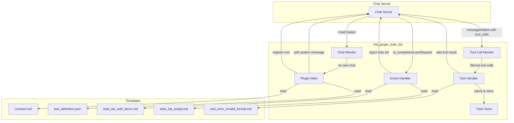
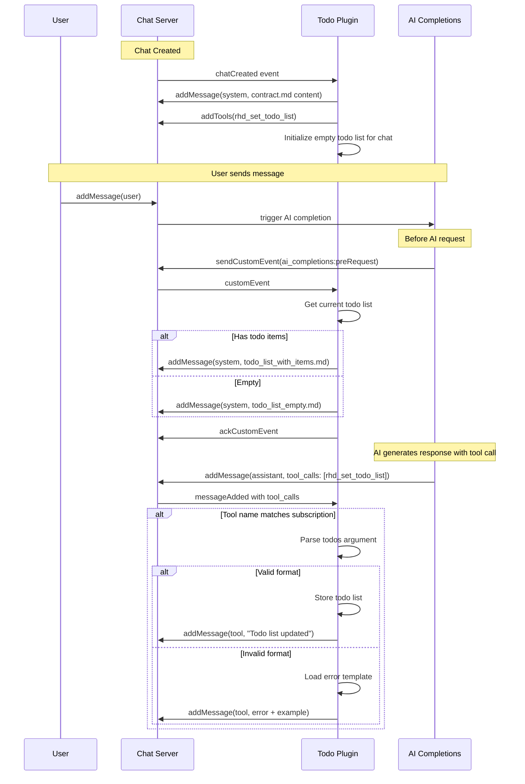

# RHD Plugin Todo List Implementation Plan

## Overview

Implement a new plugin `rhd_plugin_todo_list` that manages a task tracking list for multi-step operations. The plugin:
1. Triggers on newly created chats to inject system message and register the `rhd_set_todo_list` tool
2. Subscribes to tool calls for `rhd_set_todo_list` and updates the todo list
3. Injects current todo list state before AI requests via `ai_completions:preRequest` event

## Architecture

### Component Diagram



### Data Flow



## Implementation Tasks

### Phase 1: Core Event Infrastructure

#### 1.1 Add new event type for assistant messages with tool calls

**File**: `packages/rhd_chat_api/src/events/assistant_message_with_tool_calls.rs`

Create a new event data structure that is emitted when an assistant message with tool calls is added:

```rust
pub struct AssistantMessageWithToolCallsData {
    pub chat_id: i64,
    pub message: Message,
    pub chat_version: i64,
    pub tool_names: Vec<String>,  // Extracted tool names for filtering
}
```

**File**: `packages/rhd_chat_api/src/events/mod.rs`

Add the new event module and re-export.

**File**: `packages/rhd_chat_server/src/handlers/message.rs`

Emit the new event when `addMessage` is called with role="assistant" and non-empty tool_calls.

#### 1.2 Add tool call subscription mechanism to chat client

**File**: `packages/rhd_chat_client/src/event_stream.rs`

Add new subscription type for tool calls with filtering:

```rust
pub struct ToolCallSubscription {
    pub chat_id: i64,
    pub tool_names: Vec<String>,  // Empty means all tools
    pub callback: ToolCallCallback,
    pub cancel_rx: CancellationToken,
}

pub type ToolCallCallback = Arc<dyn Fn(AssistantMessageWithToolCallsData) -> Pin<Box<dyn Future<Output = ()> + Send>> + Send + Sync>;
```

**File**: `packages/rhd_chat_client/src/client.rs`

Add method to subscribe to tool calls:

```rust
pub fn on_tool_call<F, Fut>(&self, chat_id: i64, tool_names: Vec<String>, callback: F) -> CancellationToken
where
    F: Fn(AssistantMessageWithToolCallsData) -> Fut + Send + Sync + 'static,
    Fut: Future<Output = ()> + Send + 'static,
```

Update `dispatch_event` to handle the new event type and route to tool call subscribers.

### Phase 2: Plugin Structure

#### 2.1 Create plugin crate structure

**Directory**: `plugins/rhd_plugin_todo_list/`

```
plugins/rhd_plugin_todo_list/
├── Cargo.toml
├── README.md
├── src/
│   ├── main.rs           # Entry point
│   ├── lib.rs            # Library root
│   ├── plugin.rs         # Main plugin logic
│   ├── config.rs         # Configuration
│   ├── todo_store.rs     # Per-chat todo list storage
│   ├── tool_handler.rs   # Handle rhd_set_todo_list tool calls
│   ├── parser.rs         # Parse markdown checklist format
│   └── templates.rs      # Template loading
└── tests/
    └── integration_test.rs
```

**File**: `plugins/rhd_plugin_todo_list/Cargo.toml`

```toml
[package]
name = "rhd_plugin_todo_list"
version.workspace = true
edition.workspace = true

[dependencies]
rhd_chat_api = { path = "../../packages/rhd_chat_api" }
rhd_chat_client = { path = "../../packages/rhd_chat_client" }
tokio = { workspace = true }
tracing = { workspace = true }
serde = { workspace = true }
serde_json = { workspace = true }
thiserror = { workspace = true }
chrono = { workspace = true }
regex = "1"
include_dir = "0.7"
```

#### 2.2 Create error template for invalid format

**File**: `templates/mcp_internal/rhd_set_todo_list/tool_error_invalid_format.md`

```markdown
Error: Invalid todo list format.

The `todos` parameter must be a markdown checklist with one item per line.

Valid checkbox states:
- `[ ]` - Pending
- `[-]` - In Progress  
- `[x]` - Completed
- `[!]` - Discarded

Example of correct format:
```
[x] Analyze requirements
[-] Design solution
[ ] Implement changes
[ ] Test implementation
```

Please fix the format and try again.
```

### Phase 3: Plugin Implementation

#### 3.1 Implement todo list parser

**File**: `plugins/rhd_plugin_todo_list/src/parser.rs`

Parse markdown checklist format:

```rust
pub struct TodoItem {
    pub content: String,
    pub status: TodoStatus,
}

pub enum TodoStatus {
    Pending,      // [ ]
    InProgress,   // [-]
    Completed,    // [x]
    Discarded,    // [!]
}

pub fn parse_todo_list(input: &str) -> Result<Vec<TodoItem>, ParseError>
pub fn format_todo_for_display(items: &[TodoItem]) -> String
```

#### 3.2 Implement todo store

**File**: `plugins/rhd_plugin_todo_list/src/todo_store.rs`

Per-chat todo list storage:

```rust
pub struct TodoStore {
    chats: RwLock<HashMap<i64, Vec<TodoItem>>>,
}

impl TodoStore {
    pub fn get(&self, chat_id: i64) -> Option<Vec<TodoItem>>
    pub fn set(&self, chat_id: i64, items: Vec<TodoItem>)
    pub fn clear(&self, chat_id: i64)
}
```

#### 3.3 Implement tool handler

**File**: `plugins/rhd_plugin_todo_list/src/tool_handler.rs`

Handle `rhd_set_todo_list` tool calls:

```rust
pub async fn handle_tool_call(
    client: &ChatClient,
    todo_store: &TodoStore,
    chat_id: i64,
    tool_call_id: &str,
    arguments: &str,
    templates: &Templates,
) -> Result<(), HandlerError>
```

Logic:
1. Parse arguments JSON to extract `todos` string
2. Parse markdown checklist
3. If valid: store and return success message
4. If invalid: return error message with example

#### 3.4 Implement main plugin logic

**File**: `plugins/rhd_plugin_todo_list/src/plugin.rs`

Main plugin lifecycle:

```rust
pub async fn run_plugin(
    server_url: &str,
    plugin_id: &str,
) -> Result<(), PluginError>
```

Steps:
1. Connect to chat server
2. Register as plugin
3. Create chat monitor
4. Subscribe to all chats
5. Register callback for chat state changes (detect new chats)
6. Subscribe to tool calls for `rhd_set_todo_list`
7. Subscribe to `ai_completions:preRequest` custom events
8. Main loop (keep alive)

**On new chat**:
1. Check if system message with tag `todo_list:contract` already exists; if so, skip
2. Add system message with contract.md content and tag `todo_list:contract`
3. Register `rhd_set_todo_list` tool
4. Initialize empty todo list in store

**On tool call**:
1. Check if tool call result message already exists for this tool_call_id; if so, skip
2. Parse arguments
3. Validate format
4. Store or return error

**On preRequest event**:
1. Get current todo list for chat
2. If has items: inject todo_list_with_items.md as system message
3. If empty: inject todo_list_empty.md as system message
4. Acknowledge event

### Phase 4: Integration

#### 4.1 Update workspace Cargo.toml

Add new plugin to workspace members.

#### 4.2 Update CLI to support new plugin

**File**: `packages/rhd_app/src/commands/plugins.rs`

Add plugin ID constant and configuration handling.

#### 4.3 Write integration tests

**File**: `plugins/rhd_plugin_todo_list/tests/integration_test.rs`

Test scenarios:
1. New chat triggers system message and tool registration
2. Valid tool call updates todo list
3. Invalid tool call returns error with example
4. preRequest event injects correct template based on todo state

### Phase 5: Documentation

#### 5.1 Update memory documentation

**File**: `memory/features/plugins.md`

Add section about todo list plugin.

**File**: `memory/features/mcp-tools.md`

Add `rhd_set_todo_list` to built-in tools list.

## Key Files to Modify

| File | Change |
|------|--------|
| `packages/rhd_chat_api/src/events/mod.rs` | Add new event module |
| `packages/rhd_chat_api/src/events/assistant_message_with_tool_calls.rs` | New event type |
| `packages/rhd_chat_server/src/handlers/message.rs` | Emit new event |
| `packages/rhd_chat_client/src/event_stream.rs` | Add tool call subscription |
| `packages/rhd_chat_client/src/client.rs` | Add `on_tool_call` method |
| `Cargo.toml` | Add plugin to workspace |
| `templates/mcp_internal/rhd_set_todo_list/tool_error_invalid_format.md` | New error template |

## New Files to Create

| File | Purpose |
|------|---------|
| `plugins/rhd_plugin_todo_list/Cargo.toml` | Plugin manifest |
| `plugins/rhd_plugin_todo_list/src/main.rs` | Entry point |
| `plugins/rhd_plugin_todo_list/src/lib.rs` | Library root |
| `plugins/rhd_plugin_todo_list/src/plugin.rs` | Main plugin logic |
| `plugins/rhd_plugin_todo_list/src/config.rs` | Configuration |
| `plugins/rhd_plugin_todo_list/src/todo_store.rs` | Todo storage |
| `plugins/rhd_plugin_todo_list/src/tool_handler.rs` | Tool call handler |
| `plugins/rhd_plugin_todo_list/src/parser.rs` | Markdown parser |
| `plugins/rhd_plugin_todo_list/src/templates.rs` | Template loading |
| `plugins/rhd_plugin_todo_list/tests/integration_test.rs` | Tests |
| `plugins/rhd_plugin_todo_list/README.md` | Documentation |
| `templates/mcp_internal/rhd_set_todo_list/tool_error_invalid_format.md` | Error template |

## Testing Strategy

1. **Unit Tests**: Parser, todo store, template rendering
2. **Integration Tests**: Full plugin lifecycle with mock chat server
3. **E2E Tests**: Verify todo list appears in environment details

## Risks and Mitigations

| Risk | Mitigation |
|------|------------|
| Race condition between chat creation and tool registration | Use chat version checking |
| Todo list lost on plugin restart | Consider persistence in future iteration |
| Invalid tool call arguments | Robust parsing with clear error messages |
| Multiple tool calls in same message | Process each tool call independently |
