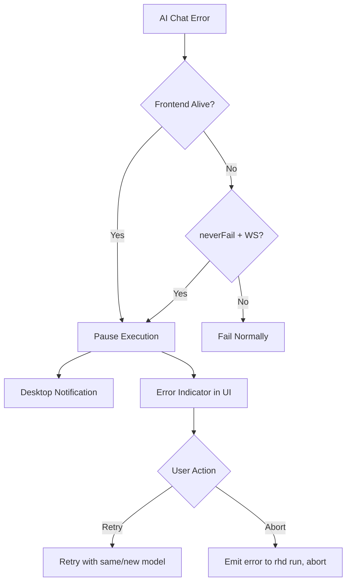

# Scenario Run Control Plan

## Status

**Last Updated**: 2026-07-03

### Completed (Steps 1-12)

- ✅ **Step 1**: Added `neverFail` config option to `DaemonConfig`
- ✅ **Step 2**: Implemented WebSocket ping/pong for frontend liveness tracking (2s ping interval, 5s timeout)
- ✅ **Step 3**: Added pause/resume mechanism to execution tracker with `PausedState`, `ResumeAction`, and `pause_and_wait()` method
- ✅ **Step 4**: Added WebSocket protocol types for pause/resume (`RetryScenario`, `AbortScenarioWithError`, `DevNotification` requests; `scenarioPaused`, `scenarioResumed`, `devNotification` events)
- ✅ **Step 5**: Created desktop notification support module (`notifications.rs`) with `terminal-notifier` and `osascript` fallback
- ✅ **Step 6**: Integrated notifications into pause flow - added `DevNotification` variant to `ChatEvent`, implemented handlers in `ws.rs`
- ✅ **Step 7**: Added frontend paused scenario types (`PausedScenario`), stores (`pausedScenarios`), and WebSocket event handling
- ✅ **Step 8**: Created `PausedScenario.svelte` component with model selector, retry, and abort buttons; integrated into `ScenariosTab.svelte`
- ✅ **Step 9**: Added browser notification support (`notifications.ts`) with permission request on app load and notification display on pause
- ✅ **Step 10**: Added `rhd dev` CLI command with `daemon-notification` and `frontend-notification` subcommands
- ✅ **Step 11**: Modified `rhd run` client to handle paused state
  - Added `IpcResponse::Paused { error, step }` variant to IPC protocol
  - Updated client to loop and wait for final response when paused
- ✅ **Step 12**: Updated daemon IPC handler to send `Paused` response and wait for resume/abort
  - Added `PauseNotification` broadcast channel to `ExecutionTracker`
  - Made `McpServerCache` cloneable (wrapped internal `Mutex` in `Arc`)
  - Restructured `handle_run_scenario` to spawn execution as async task
  - Used `tokio::select!` to detect pause notification before execution completes
  - Changed `handle_request` to return `Vec<IpcResponse>` for multi-response support
  - On pause: sends `IpcResponse::Paused`, then waits for execution to complete after resume/abort
  - Sends final response (Success/Error/Aborted) after execution completes

### Integration Testing Needed

- Test full pause/resume flow with frontend
- Test `neverFail` mode without frontend
- Test `rhd dev` notification commands
- Test model switching on retry
- Test abort flow

## Goal

Add scenario execution control: track frontend presence, pause on AI errors instead of failing, emit desktop notifications, provide retry/abort UI, and add debug notification commands.

## Architecture Overview

## Key Design Decisions

1. **Frontend tracking via ping/pong**: Daemon sends WebSocket ping every N seconds. Frontend must respond with pong within 5 seconds. If no pong received, frontend considered "not alive". This is more reliable than just tracking connection count.
2. **Pause mechanism**: On AI error, execution enters "paused" state instead of returning error. A new `PauseHandle` allows waiting for user action (retry/abort).
3. **Desktop notifications**: Use macOS `osascript -e 'display notification ...'` for daemon notifications. For "click to open browser", use `terminal-notifier` if available, otherwise show generic notification.
4. **neverFail config**: New `neverFail: true` in `rhd.yaml`. Only activates when WebSocket server is enabled (wsPort is set).
5. **Retry with model change**: Frontend sends `retryScenario` WebSocket request with optional `model` override.

## Implementation Steps

### 1. Add `neverFail` config option

**Files**: `packages/rhd_app/src/config.rs`

- Add `never_fail: bool` field to `DaemonConfig` (default: false)
- Pass to `DaemonState`

### 2. Add WebSocket ping/pong for frontend liveness

**Files**: `packages/rhd_app/src/ws.rs`, `packages/rhd_app/src/daemon.rs`

- Add `frontend_alive: Arc<AtomicBool>` to `DaemonState` (tracks if any frontend is alive)
- In WebSocket handler: send ping every 2 seconds
- Track last pong time; if no pong within 5 seconds, mark frontend as not alive
- On pong received: mark frontend as alive
- Expose `is_frontend_alive()` method in `DaemonState`
- On WebSocket disconnect: mark frontend as not alive (if no other connections)

### 3. Add pause/resume mechanism to execution

**Files**: `packages/rhd_app/src/execution.rs`, `packages/rhd_app/src/scenario/executor.rs`, `packages/rhd_app/src/scenario/ai_chat.rs`

- Add `PausedExecution` state to `ActiveExecution` with error info and resume channel
- Add `ExecutionHandle::pause(error)` method that stores error and waits for resume signal
- Add `ExecutionTracker::resume(id, model_override)` and `ExecutionTracker::abort_with_error(id)`
- Modify `execute_ai_chat` to call `handle.pause()` on error instead of returning `Err` when frontend is alive or neverFail is active
- Add new `ExecuteError::Paused` variant (or handle pause inside ai_chat before returning error)

### 4. Add WebSocket protocol for pause/resume

**Files**: `packages/rhd_api/src/lib.rs`, `packages/rhd_app/src/ws.rs`

- New `WsRequest` variants:
  - `RetryScenario { id, execution_id, model: Option<String> }` - retry paused scenario
  - `AbortScenarioWithError { id, execution_id }` - abort and emit error to client
- New `WsEvent`:
  - `scenarioPaused { executionId, error, stepName, availableModels }` - emitted when scenario pauses
  - `scenarioResumed { executionId }` - emitted when retry starts
- Modify `scenarioFinished` to include error info when applicable

### 5. Add desktop notification support

**Files**: New `packages/rhd_app/src/notifications.rs`

- `send_notification(title, message, open_url: Option<String>)` function
- Use `osascript` for macOS notifications
- Try `terminal-notifier` first (supports click actions), fall back to `osascript`
- `show_daemon_notification()` and `show_frontend_notification()` for debug

### 6. Integrate notifications into pause flow

**Files**: `packages/rhd_app/src/ws.rs`, `packages/rhd_app/src/execution.rs`

- When scenario pauses:
  - If frontend alive: emit `scenarioPaused` event (frontend shows browser notification)
  - If neverFail + no frontend alive: emit desktop notification from daemon
  - Notification text: "Scenario '{name}' paused at step '{step}': {error}"
  - If wsPort configured, notification can include URL to open frontend

### 7. Frontend: Handle paused scenarios

**Files**: `frontend/src/lib/types/index.ts`, `frontend/src/lib/types/ws.ts`, `frontend/src/lib/stores.ts`, `frontend/src/lib/ws.ts`

- Add `PausedScenario` type with error, stepName, availableModels
- Add `pausedScenarios` store
- Handle `scenarioPaused` event: add to paused store
- Handle `scenarioResumed` event: remove from paused store

### 8. Frontend: Paused scenario UI

**Files**: `frontend/src/components/PausedScenario.svelte` (new), `frontend/src/components/ScenariosTab.svelte`

- New `PausedScenario` component showing:
  - Scenario name + "paused" badge (yellow/orange)
  - Error message
  - Current step name
  - Model selector dropdown (fetch available models)
  - "Retry" button (sends `retryScenario` with selected model)
  - "Abort" button (sends `abortScenarioWithError`)
- Show in `ScenariosTab` between active and finished sections

### 9. Frontend: Browser notifications

**Files**: `frontend/src/lib/notifications.ts` (new), `frontend/src/lib/ws.ts`

- Request notification permission on load
- On `scenarioPaused` event: show browser notification
- Click notification: focus browser tab

### 10. Add `rhd dev` CLI command

**Files**: `packages/rhd_app/src/cli.rs`, `packages/rhd_app/src/main.rs`

- New `Command::Dev(DevArgs)` with subcommand: `daemon-notification` or `frontend-notification`
- `rhd dev daemon-notification`: calls `send_notification("RHD Daemon", "Test notification from daemon", None)`
- `rhd dev frontend-notification`: sends `devNotification` WebSocket request to daemon, which broadcasts a test notification event to all connected frontends

### 11. Add `devNotification` WebSocket request

**Files**: `packages/rhd_api/src/lib.rs`, `packages/rhd_app/src/ws.rs`

- New `WsRequest::DevNotification { id }` variant
- Handler emits a new `WsEvent::devNotification { title, message }` to all connected clients
- Frontend handles this event by showing a browser notification with the given title/message

### 12. Modify `rhd run` client behavior

**Files**: `packages/rhd_app/src/client.rs`, `packages/rhd_app/src/daemon.rs` (IPC handler)

- When scenario is paused (neverFail mode), `rhd run` client should NOT receive error immediately
- Instead, client waits (long-poll or the connection stays open)
- On retry: scenario continues, client still waits
- On abort: client receives the error that caused the pause

### 13. Update IPC protocol for pause awareness

**Files**: `packages/rhd_app/src/ipc/protocol.rs`

- Add `IpcResponse::Paused { error, step }` variant
- Client handles paused state: prints "Scenario paused, waiting..." and waits
- On resume: continues waiting
- On abort: receives error

## File Changes Summary

| File | Change |
|------|--------|
| `packages/rhd_app/src/config.rs` | Add `never_fail` field |
| `packages/rhd_app/src/daemon.rs` | Add `frontend_alive`, pass `never_fail` to state |
| `packages/rhd_app/src/ws.rs` | Add ping/pong, track frontend liveness, handle retry/abort/devNotification, emit pause events |
| `packages/rhd_app/src/execution.rs` | Add pause state, resume/abort methods |
| `packages/rhd_app/src/scenario/executor.rs` | Pass frontend/neverFail context |
| `packages/rhd_app/src/scenario/ai_chat.rs` | Pause on error instead of fail |
| `packages/rhd_app/src/scenario/error.rs` | Add `Paused` variant or error context |
| `packages/rhd_app/src/notifications.rs` | **New** - desktop notification helpers |
| `packages/rhd_app/src/cli.rs` | Add `Dev` command |
| `packages/rhd_app/src/main.rs` | Handle `Dev` command |
| `packages/rhd_app/src/client.rs` | Handle paused response |
| `packages/rhd_app/src/ipc/protocol.rs` | Add `Paused` response |
| `packages/rhd_api/src/lib.rs` | Add new WS request/event types (RetryScenario, AbortScenarioWithError, DevNotification, scenarioPaused, scenarioResumed, devNotification) |
| `frontend/src/lib/types/index.ts` | Add `PausedScenario` type |
| `frontend/src/lib/types/ws.ts` | Add pause/resume/devNotification WS types |
| `frontend/src/lib/stores.ts` | Add `pausedScenarios` store |
| `frontend/src/lib/ws.ts` | Handle pause events, add retry/abort/devNotification functions |
| `frontend/src/lib/notifications.ts` | **New** - browser notification helpers |
| `frontend/src/components/PausedScenario.svelte` | **New** - paused scenario UI |
| `frontend/src/components/ScenariosTab.svelte` | Show paused scenarios section |

## Risks

1. **Blocking IPC connection**: `rhd run` holds IPC connection while paused. Need to ensure daemon doesn't block other operations.
2. **Notification permissions**: Browser notifications require user permission. Daemon notifications need `osascript` or `terminal-notifier`.
3. **Race conditions**: Pause/resume must be thread-safe. Multiple retries should be handled.
4. **Model override on retry**: Need to propagate model override through the execution pipeline.
5. **Ping/pong timing**: 5 second timeout must be tuned to avoid false negatives on slow networks.

## Success Criteria

- `rhd run` does not fail on AI errors when frontend is alive or neverFail is active
- Frontend liveness tracked via WebSocket ping/pong (5 second timeout)
- Paused scenarios show error indicator in UI with retry/abort buttons
- Desktop notifications emitted on pause
- `rhd dev daemon-notification` shows desktop notification
- `rhd dev frontend-notification` sends `devNotification` WS request, frontend shows browser notification
- Retry allows changing model before retrying
- Abort emits the original error to `rhd run` client
