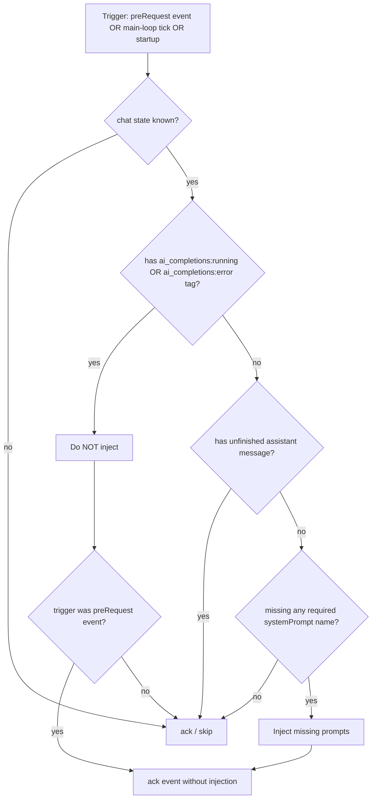

# System Prompt Injection Gated by AI Completions Tags

## Goal

In the `rhd_plugin_system_prompt` plugin, never inject new system prompt messages into a chat while that chat carries either the `ai_completions:running` or the `ai_completions:error` tag. Injection must happen only when the chat **awaits a next queued user message** or **is a new chat** — i.e., when the chat is idle and not parked in an error state.

## Background

### What came before

The plan [`plans/ai-completions-running-tag-plan.md`](plans/ai-completions-running-tag-plan.md) is **already implemented**. The `rhd_plugin_ai_completions` plugin now maintains two chat-level tags:

| Tag | Meaning | Lifecycle |
|-----|---------|-----------|
| `ai_completions:running` | An AI request is actively in progress (including between tool-loop iterations) | Added in `ai_request.rs` right before the plugin acknowledges its own `preRequest` event; removed on success-without-tool-calls, on transition to `error`, and at startup reconciliation |
| `ai_completions:error` | The chat is parked after a failure | Added on request/conversion/streaming failure; removed manually by an operator |

### Current system prompt plugin behavior

`rhd_plugin_system_prompt` injects system prompts from **three** call sites, all funneling into `system_prompt::process_chat()`:

1. **Startup reconciliation** — `plugin.rs:261` (`startup_reconciliation`)
2. **Main loop** — `plugin.rs:223` (every 1 s, for every monitored chat)
3. **`ai_completions:preRequest` event handler** — `plugin.rs:91` (`on_custom_event` callback)

The only guard today is `has_unfinished_assistant_message()` (`system_prompt.rs:26`). This is insufficient:

- **Mid-request gaps**: between tool-loop iterations all messages are finished, yet the chat is actively owned by the AI completions plugin (`running` tag present). The 1 s main loop would inject a system prompt into the middle of an active conversation.
- **Parked error chats**: a chat with `ai_completions:error` may have all messages finished. The main loop would inject prompts into a broken chat that nobody asked to resume.

### Discovered prerequisite bug (must fix first)

`extract_chat_id_from_event()` in [`plugins/rhd_plugin_system_prompt/src/plugin.rs:291`](plugins/rhd_plugin_system_prompt/src/plugin.rs:291) parses `chatId` out of the event's `additional` JSON. But per [`plans/ai-request-chatid-field-move.md`](plans/ai-request-chatid-field-move.md), the AI completions plugin now sends the chat id in the **top-level** `chat_id` field of `CustomEventData` (see [`ai_request.rs:61`](plugins/rhd_plugin_ai_completions/src/ai_request.rs:61)); `additional` only contains `triggerReason`. As a result the event handler currently always logs `"event missing chatId"` and acknowledges without ever injecting — the preRequest coordination path is dead. Gating this path on tags is meaningless until the extraction is fixed, so the fix is included as Step 1.

## Semantics

### The gate

A chat is **locked** (injection forbidden) iff its tags contain `ai_completions:running` **or** `ai_completions:error`.

The gate is applied at **all three** call sites:

- Inside `process_chat()` → covers the main loop and startup reconciliation, and also the event handler's actual injection call.
- Explicitly in the `preRequest` event handler → so the handler logs the skip reason and acknowledges immediately without doing redundant needs-injection work.

### Why this satisfies "only when chat awaits next queued message or is new"

```
preRequest (QueuedMessages, first request)
  → running tag NOT yet added (added after all other plugins ack)
  → gate passes → injection happens before AI request  ✔ (chat awaited a queued message)

New chat (no messages, no ai_completions tags)
  → gate passes → main loop / startup reconciliation injects  ✔

Tool-loop continuation preRequest
  → running tag IS present (kept across iterations)
  → gate blocks → ack without injection (deferred)  ✔ (chat is actively running)

Chat parked with error
  → error tag present
  → gate blocks at all call sites until operator removes tag  ✔

Chat finishes request (running tag removed), no tool calls
  → chat now idle, awaiting next queued user message
  → next main-loop tick (≤1 s) injects any prompts required by chat tags  ✔
```

Deferring injection until the running tag is removed is intentional: a prompt added to a chat's tag set mid-request gets picked up as soon as the chat returns to idle.

### Decision flow



## Implementation Steps

### Step 1: Fix chat-id extraction from `preRequest` events

**File:** `plugins/rhd_plugin_system_prompt/src/plugin.rs`

**Location:** `extract_chat_id_from_event()` (line 288–296)

**Change:** read the top-level `event.chat_id` first; keep the legacy `additional.chatId` parse as a fallback.

```rust
/// Extract chat ID from a custom event.
///
/// The AI completions plugin sends the chat id in the top-level `chat_id`
/// field of the event. The legacy `additional.chatId` JSON path is kept as
/// a fallback for events produced by older senders.
fn extract_chat_id_from_event(event: &rhd_chat_api::CustomEventData) -> Option<i64> {
    // Preferred: dedicated top-level chat_id field
    if let Some(id) = event
        .chat_id
        .as_deref()
        .and_then(|s| s.parse::<i64>().ok())
    {
        return Some(id);
    }

    // Legacy fallback: chatId inside additional JSON
    let additional = event.additional.as_ref()?;
    let json: serde_json::Value = serde_json::from_str(additional).ok()?;
    let chat_id = json.get("chatId")?.as_str()?;
    chat_id.parse::<i64>().ok()
}
```

### Step 2: Add the lock predicate to `system_prompt.rs`

**File:** `plugins/rhd_plugin_system_prompt/src/system_prompt.rs`

**Location:** after the tag-prefix constant (line 9) — new constants + predicate function.

```rust
/// Chat tag set by the AI completions plugin while a request is in flight
/// (including tool-loop iterations). While present, system prompt injection
/// must not touch the chat.
pub const AI_COMPLETIONS_RUNNING_TAG: &str = "ai_completions:running";

/// Chat tag set by the AI completions plugin when the chat is parked after a
/// failure. While present, system prompt injection must not touch the chat.
pub const AI_COMPLETIONS_ERROR_TAG: &str = "ai_completions:error";

/// Check whether a chat is locked by the AI completions plugin.
///
/// A chat is locked while it carries `ai_completions:running` (request
/// actively in progress) or `ai_completions:error` (chat parked after a
/// failure). No system prompts may be injected until the tag is removed.
pub fn has_blocking_tag(chat_state: &ChatState) -> bool {
    chat_state.tags.iter().any(|tag| {
        tag == AI_COMPLETIONS_RUNNING_TAG || tag == AI_COMPLETIONS_ERROR_TAG
    })
}
```

### Step 3: Gate `process_chat()` on the lock predicate

**File:** `plugins/rhd_plugin_system_prompt/src/system_prompt.rs`

**Location:** `process_chat()` (line 99), before the existing unfinished-message check.

```rust
pub async fn process_chat(
    client: &ChatClient,
    chat_state: &ChatState,
    cached_prompts: &[CachedPrompt],
) -> Result<usize, InjectError> {
    // Skip while the chat is locked by the AI completions plugin
    // (request in flight, or chat parked with error).
    if has_blocking_tag(chat_state) {
        tracing::debug!(
            chat_id = chat_state.chat_id,
            "skipping chat with ai_completions running/error tag"
        );
        return Ok(0);
    }

    // Skip if chat has unfinished assistant message
    if has_unfinished_assistant_message(chat_state) {
        ...
    }
    ...
}
```

Also update the doc comment above `process_chat()` to list the new step 0: "Checks if the chat is locked by the AI completions plugin (running/error tag) — if so, skip."

This single change covers the **main loop** and **startup reconciliation** call sites in `plugin.rs`.

### Step 4: Gate the `preRequest` event handler

**File:** `plugins/rhd_plugin_system_prompt/src/plugin.rs`

**Location:** inside `on_custom_event`, after obtaining `chat_state` (line 141) and **before** the existing `has_unfinished_assistant_message` check (line 143).

```rust
// Do not inject while the chat is locked by the AI completions plugin.
// The event must still be acknowledged so the request is not blocked —
// the AI completions plugin's own trigger logic already skips error
// chats, and a running-tag hit here means a tool-loop continuation.
if system_prompt::has_blocking_tag(&chat_state) {
    tracing::debug!(
        chat_id = chat_id,
        "chat has ai_completions running/error tag, acknowledging without injection"
    );
    let _ = client.ack_custom_event(rhd_chat_api::AckCustomEventParams {
        event_id: event_id.clone(),
        is_rejected: None,
    }).await;
    return;
}
```

**Important invariant:** the handler must *always* acknowledge, even when skipping injection — never reject or silently drop `preRequest`, otherwise the AI completions plugin times out waiting for acks.

### Step 5: Unit tests

**File:** `plugins/rhd_plugin_system_prompt/src/system_prompt.rs` (tests module)

Add, reusing the existing `create_chat_state` helper:

1. `test_has_blocking_tag_running` — tags `["ai_completions:running"]` → `true`
2. `test_has_blocking_tag_error` — tags `["ai_completions:error"]` → `true`
3. `test_has_blocking_tag_both` — both tags → `true`
4. `test_has_blocking_tag_none` — tags `["systemPrompt:warhammer", "other"]` → `false`
5. `test_has_blocking_tag_empty` — no tags → `false`

### Step 6: Integration tests

**File:** `plugins/rhd_plugin_system_prompt/tests/integration_test.rs`

Following the existing test-server pattern (`start_test_server`, `connect_client`, `create_test_config`), add tests that drive `rhd_plugin_system_prompt::system_prompt::process_chat` directly against a real chat:

1. **`test_process_chat_skips_running_tag`**
   - Create chat with tags `["systemPrompt:warhammer", "ai_completions:running"]`
   - Build `ChatState` from `get_chat`, call `process_chat` → assert `Ok(0)`
   - `get_chat` again → assert no message carries the `systemPrompt:warhammer` tag

2. **`test_process_chat_skips_error_tag`**
   - Same, with `ai_completions:error` instead of `running`

3. **`test_process_chat_injects_after_tag_removed`**
   - Chat with `["systemPrompt:warhammer", "ai_completions:running"]` → `process_chat` → 0
   - `update_chat` removing the `running` tag → re-fetch state → `process_chat` → 1
   - Assert the system message with tag `systemPrompt:warhammer` now exists

4. **`test_extract_chat_id_from_top_level_field`** (if `extract_chat_id_from_event` is made `pub(crate)`/testable; otherwise verify via a small unit test in `plugin.rs` tests module constructing a `CustomEventData` with only the top-level `chat_id` set, and one with only the legacy `additional` payload).

### Step 7: Update README

**File:** `plugins/rhd_plugin_system_prompt/README.md`

Add a section after "How It Works":

```markdown
## Interaction with AI Completions Tags

The plugin never injects system prompts into a chat while the chat is locked
by the AI completions plugin, i.e. while its tags contain either:

- `ai_completions:running` — an AI request is actively in progress
  (including between tool-loop iterations)
- `ai_completions:error` — the chat is parked after a failure

**Effect:** injection happens only when the chat awaits its next queued user
message, or when the chat is new. If a `systemPrompt:<name>` tag is added to a
locked chat, the prompt is injected as soon as the lock tag is removed:

- after `running` is removed (request finished) — within one main-loop tick
- after `error` is removed by an operator — on the next main-loop tick

The `ai_completions:preRequest` event is always acknowledged, even when
injection is skipped, so the AI completions plugin is never blocked.
```

Also extend the "System prompts not being injected" troubleshooting checklist with: "Check that the chat does not have an `ai_completions:running` or `ai_completions:error` tag."

## File Changes Summary

| File | Changes |
|------|---------|
| `plugins/rhd_plugin_system_prompt/src/plugin.rs` | Fix `extract_chat_id_from_event` to read top-level `chat_id`; add lock gate in `preRequest` handler |
| `plugins/rhd_plugin_system_prompt/src/system_prompt.rs` | Add tag constants + `has_blocking_tag()`; gate `process_chat()`; unit tests |
| `plugins/rhd_plugin_system_prompt/tests/integration_test.rs` | Integration tests for gated/ungated `process_chat` |
| `plugins/rhd_plugin_system_prompt/README.md` | Document tag-based gating |

No changes to `rhd_plugin_ai_completions` — the tag lifecycle is already implemented there.

## Risks and Mitigations

| Risk | Mitigation |
|------|------------|
| Stale `running` tag after an AI-plugin crash defers injection | Existing startup reconciliation in `ai_completions` clears/parks stale `running` tags; system prompt plugin then injects on the next tick |
| Chat parked with `error` never receives prompts | Intentional: operator removes `error` tag to recover; injection resumes automatically |
| Prompt required mid-tool-loop never reaches the *current* request | Intentional per requirement: injection deferred to idle state; next request after the loop includes it |
| Event handler gate blocks legitimate first-request injection | First `preRequest` fires before `running` is added (tag added only after all other plugins ack), so the gate passes |
| Breaking the ack invariant causes AI request timeouts | Gate path always acks (Step 4); covered by integration test flow |

## Success Criteria

1. **Functional**
   - [ ] `process_chat` returns `Ok(0)` without touching the chat when `ai_completions:running` is present
   - [ ] Same when `ai_completions:error` is present
   - [ ] `preRequest` handler acks without injection when either tag is present
   - [ ] `preRequest` handler injects missing prompts (then acks) when neither tag is present
   - [ ] Main loop injects within ~1 s after the `running` tag is removed
   - [ ] `extract_chat_id_from_event` resolves the chat id from the top-level event field
2. **Testing**
   - [ ] Unit tests for `has_blocking_tag` (5 cases)
   - [ ] Integration tests for gated and ungated `process_chat`
   - [ ] `cargo test -p rhd_plugin_system_prompt` passes
3. **Documentation**
   - [ ] README documents the tag-based gating and deferral behavior

## Rollout Plan

1. Step 1 — chat-id extraction fix (`plugin.rs`)
2. Steps 2–3 — predicate + `process_chat` gate (`system_prompt.rs`)
3. Step 4 — event handler gate (`plugin.rs`)
4. Steps 5–6 — unit + integration tests
5. Step 7 — README
6. Run `cargo test -p rhd_plugin_system_prompt`, then manual end-to-end check with both plugins running
