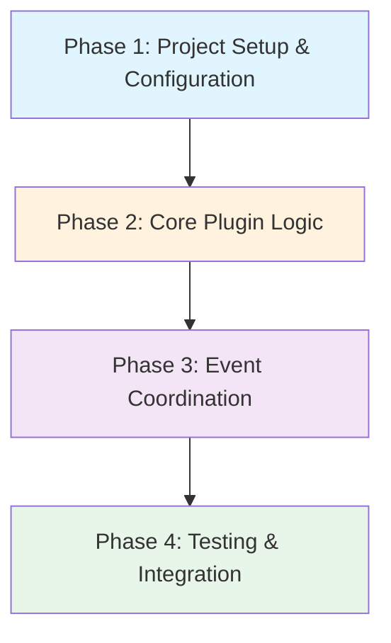

# Grand Plan: rhd_plugin_system_prompt Implementation

## Overview
This grand plan outlines the implementation of a new plugin `rhd_plugin_system_prompt` that automatically injects system prompts into chats based on chat tags. The plugin coordinates with the AI completions plugin to ensure system prompts are in place before AI requests proceed.

## Phase Dependency Graph

**Execution Order**: Sequential (each phase depends on the previous)

---

## Phase 1: Project Setup & Configuration

### Goal
Establish the plugin project structure and implement configuration loading with path resolution and validation. This phase creates the foundation for all subsequent work.

### Files to Create/Modify

| File | Action | Purpose |
|------|--------|---------|
| `plugins/rhd_plugin_system_prompt/Cargo.toml` | Create | Package manifest with dependencies on `rhd_chat_client`, `rhd_chat_api`, `tokio`, `serde`, `serde_yaml`, `tracing`, `clap`, `thiserror` |
| `plugins/rhd_plugin_system_prompt/src/lib.rs` | Create | Module exports for `config`, `plugin`, `system_prompt` |
| `plugins/rhd_plugin_system_prompt/src/config.rs` | Create | Configuration loading, path resolution, prompt file caching, and validation |
| `Cargo.toml` (workspace root) | Modify | Add `plugins/rhd_plugin_system_prompt` to workspace members |

### Key Architectural Decisions

1. **Configuration Structure**: Use a simple `HashMap<String, String>` for `systemPrompts` mapping prompt names to file paths. This allows arbitrary prompt names without schema changes.

2. **Path Resolution**: Resolve relative paths against the config file's directory (consistent with `credentialsConfig` in `rhd_plugin_ai_completions`). Absolute paths are used as-is.

3. **Startup Validation**: Fail fast if any configured prompt file is missing or unreadable. This prevents runtime errors and makes configuration issues immediately visible.

4. **Content Caching**: Read all prompt files once at startup and cache contents in memory. This avoids repeated I/O during the main loop and ensures consistent prompt content.

### Dependencies
- **None** - This is the foundation phase

### Success Criteria
- Plugin compiles successfully
- Config loading works with relative and absolute paths
- Missing prompt files cause startup failure with clear error message
- Prompt contents are cached and accessible

---

## Phase 2: Core Plugin Logic

### Goal
Implement the main plugin lifecycle (connect, register, monitor setup) and the system prompt detection/injection logic. This phase establishes the plugin's ability to monitor chats and inject system prompts.

### Files to Create/Modify

| File | Action | Purpose |
|------|--------|---------|
| `plugins/rhd_plugin_system_prompt/src/main.rs` | Create | Entry point with CLI argument parsing (`--server-url`, `--config`, `--plugin-id`) |
| `plugins/rhd_plugin_system_prompt/src/plugin.rs` | Create | Core plugin lifecycle: connect, register, create monitors, main loop |
| `plugins/rhd_plugin_system_prompt/src/system_prompt.rs` | Create | Helper methods for tag parsing, system prompt detection, and injection |

### Key Architectural Decisions

1. **Plugin ID**: Default to `"system_prompt"` (configurable via `--plugin-id` argument).

2. **Tag Format**: Use `systemPrompt:<name>` format where `<name>` matches the config key. This allows multiple system prompts per chat.

3. **Message Tagging**: System prompt messages receive the same tag as the chat (`systemPrompt:<name>`). This enables easy detection of existing prompts.

4. **Helper Methods**:
   - `has_system_prompt_message(chat_state, prompt_name) -> bool`: Checks if a message with the given tag exists
   - `has_unfinished_assistant_message(chat_state) -> bool`: Checks for streaming or unfinished assistant messages
   - `parse_system_prompt_tag(tag) -> Option<&str>`: Extracts prompt name from tag

5. **Startup Reconciliation**: After subscribing to all chats, iterate through monitored chats and inject missing system prompts. This handles chats that existed before the plugin started.

6. **Main Loop**: Periodically check all monitored chats for missing system prompts. This handles tags added after the plugin started.

### Dependencies
- **Phase 1** - Requires configuration loading and prompt caching

### Success Criteria
- Plugin connects to chat server and registers successfully
- Plugin subscribes to all chats
- System prompts are injected for chats with matching tags
- Duplicate system prompts are prevented
- Unfinished assistant messages block system prompt injection

---

## Phase 3: Event Coordination

### Goal
Implement the `ai_completions:preRequest` event handling with proper acknowledgment timing. This phase ensures the plugin coordinates correctly with the AI completions plugin.

### Files to Create/Modify

| File | Action | Purpose |
|------|--------|---------|
| `plugins/rhd_plugin_system_prompt/src/plugin.rs` | Modify | Add custom event subscription and handling logic |

### Key Architectural Decisions

1. **Event Subscription**: Use `client.on_custom_event()` to subscribe to all custom events, then filter for `ai_completions:preRequest` events.

2. **Acknowledgment Logic**:
   - **Always acknowledge** the event (never reject or timeout)
   - **If chat has unfinished assistant message**: Ack immediately, don't add system prompt (conditions not met)
   - **If chat needs system prompt and not yet added**: Add system prompt FIRST, then ack
   - **If system prompt already exists OR not needed**: Ack immediately

3. **Chat ID Extraction**: Extract `chatId` from the event's `additional` JSON field (the AI completions plugin includes this).

4. **Synchronous Injection**: When system prompt needs to be added, wait for the `add_message` call to complete before acknowledging. This ensures the system prompt is in place before the AI request proceeds.

5. **Error Handling**: If system prompt injection fails, log the error but still acknowledge the event. This prevents blocking the AI request indefinitely.

### Dependencies
- **Phase 2** - Requires core plugin logic and system prompt injection methods

### Success Criteria
- Plugin receives `ai_completions:preRequest` events
- System prompts are injected before acknowledgment when needed
- Events are acknowledged in all cases (no timeouts)
- Unfinished messages are handled correctly (ack without injection)

---

## Phase 4: Testing & Integration

### Goal
Write comprehensive tests and ensure the plugin integrates correctly with the workspace. This phase validates the implementation and prevents regressions.

### Files to Create/Modify

| File | Action | Purpose |
|------|--------|---------|
| `plugins/rhd_plugin_system_prompt/src/config.rs` | Modify | Add unit tests for config loading, path resolution, validation |
| `plugins/rhd_plugin_system_prompt/src/system_prompt.rs` | Modify | Add unit tests for tag parsing, detection methods |
| `plugins/rhd_plugin_system_prompt/tests/integration_test.rs` | Create | Integration tests for plugin lifecycle, system prompt injection, event handling |
| `plugins/rhd_plugin_system_prompt/README.md` | Create | Documentation with usage examples and configuration format |

### Key Architectural Decisions

1. **Unit Tests**: Test individual functions in isolation (config loading, tag parsing, detection methods).

2. **Integration Tests**: Use the existing test infrastructure (`rhd_chat_server`, `rhd_mock_ai_provider`) to test the full plugin lifecycle.

3. **Test Scenarios**:
   - Plugin startup with valid config
   - Plugin startup with missing prompt file (should fail)
   - System prompt injection on chat with tag
   - Duplicate prevention (don't add twice)
   - Event acknowledgment flow (ack after adding prompt)
   - Race condition handling (unfinished message → ack without adding)
   - Multiple system prompts in same chat

4. **README Documentation**: Include configuration format, usage examples, and troubleshooting tips.

### Dependencies
- **Phase 3** - Requires complete plugin implementation

### Success Criteria
- All unit tests pass
- Integration tests cover all major scenarios
- README provides clear usage instructions
- Plugin builds and runs successfully in the workspace

---

## Overall Success Criteria

The grand plan is complete when:

1. **Plugin Functionality**:
   - Plugin loads configuration and validates prompt files at startup
   - Plugin injects system prompts into chats with matching tags
   - Plugin prevents duplicate system prompts
   - Plugin handles unfinished assistant messages correctly
   - Plugin coordinates with AI completions via event acknowledgment

2. **Code Quality**:
   - All tests pass (unit and integration)
   - Code follows project conventions (structured logging, error handling)
   - README provides clear documentation

3. **Integration**:
   - Plugin is part of the workspace
   - Plugin builds successfully with `cargo build`
   - Plugin can be run alongside `rhd_plugin_ai_completions`

---

## Risk Mitigation

| Risk | Mitigation |
|------|------------|
| Race condition: AI request starts before system prompt is added | Synchronous injection before acknowledgment |
| Missing prompt files cause runtime errors | Fail fast at startup with clear error |
| Duplicate system prompts | Check for existing message with same tag before adding |
| Plugin blocks AI request indefinitely | Always acknowledge, even on injection failure |
| Unfinished messages cause issues | Check for unfinished messages before injection |

---

## Future Enhancements (Out of Scope)

- Hot-reloading prompt files when they change
- Removing system prompts when tags are removed
- Supporting non-markdown file formats
- System prompt versioning/updates
- Per-chat system prompt overrides
