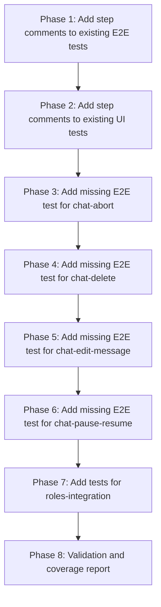

# Grand Plan: Enforce Step Comments in Test Code

## Goal
Inject step-by-step comments into test code that correspond to test case steps, making it easy to trace which test code covers which test case step. Tests can cover ranges of steps (e.g., mock state up to step 6, test steps 6-9), but the sum of ranges must cover all steps.

## Current State

### Test Cases (in `tests/cases/`)
| File | Steps | Status |
|------|-------|--------|
| [chat-create.md](tests/cases/chat-create.md) | 10 | Covered |
| [chat-send-message.md](tests/cases/chat-send-message.md) | 14 | Covered |
| [chat-streaming.md](tests/cases/chat-streaming.md) | 9 | Covered |
| [chat-select-model.md](tests/cases/chat-select-model.md) | 8 | Covered |
| [chat-mcp-tools.md](tests/cases/chat-mcp-tools.md) | 19 | Covered |
| [chat-abort.md](tests/cases/chat-abort.md) | 7 | **Missing E2E** |
| [chat-delete.md](tests/cases/chat-delete.md) | 8 | **Missing E2E** |
| [chat-edit-message.md](tests/cases/chat-edit-message.md) | 11 | **Missing E2E** |
| [chat-pause-resume.md](tests/cases/chat-pause-resume.md) | 14 | **Missing E2E** |
| [roles-integration.md](tests/cases/roles-integration.md) | 8 scenarios | **Missing all tests** |

### Test Files
| File | Covers |
|------|--------|
| [chat-state.test.ts](frontend/src/tests/e2e/chat-state.test.ts) | chat-create, chat-send-message, chat-streaming, chat-select-model |
| [chat-mcp-tools.test.ts](frontend/src/tests/e2e/chat-mcp-tools.test.ts) | chat-mcp-tools |
| [MessageInput.test.ts](frontend/src/tests/ui/MessageInput.test.ts) | chat-send-message (UI), chat-abort (UI), chat-pause-resume (UI) |
| [ChatList.test.ts](frontend/src/tests/ui/ChatList.test.ts) | chat-create (UI), chat-delete (UI) |
| [Message.test.ts](frontend/src/tests/ui/Message.test.ts) | chat-edit-message (UI), chat-streaming (UI) |

---

## Phase 1: Add Step Comments to Existing E2E Tests

### Objective
Add step comments to existing E2E tests that already cover test cases. This establishes the pattern and ensures existing tests are properly documented.

### Files to Edit
| File | Why |
|------|-----|
| [chat-state.test.ts](frontend/src/tests/e2e/chat-state.test.ts) | Add step comments for chat-create (steps 1-10), chat-send-message (steps 1-14), chat-streaming (steps 1-9), chat-select-model (steps 1-8) |
| [chat-mcp-tools.test.ts](frontend/src/tests/e2e/chat-mcp-tools.test.ts) | Add step comments for chat-mcp-tools (steps 1-19) |

### Test Cases Referenced
- [chat-create.md](tests/cases/chat-create.md)
- [chat-send-message.md](tests/cases/chat-send-message.md)
- [chat-streaming.md](tests/cases/chat-streaming.md)
- [chat-select-model.md](tests/cases/chat-select-model.md)
- [chat-mcp-tools.md](tests/cases/chat-mcp-tools.md)

### Example Comment Format
```typescript
// Step 1. User clicks "+ New Chat" button
// Step 2. Dialog opens with title input field
// ...
await dispatch({ type: 'createChat', payload: { title: 'Test Chat' } });
// Step 5. System dispatches `createChat` action with title
// Step 6. System sends request to daemon
// Step 7. Daemon creates chat and returns chatId
// Step 8. System updates chats store with new chat
const allChats = get(chats);
expect(allChats.length).toBe(1);
// Step 9. System sets currentChatId to new chat
expect(get(currentChatId)).toBeDefined();
// Step 10. Dialog closes (UI test covers this)
```

---

## Phase 2: Add Step Comments to Existing UI Tests

### Objective
Add step comments to existing UI tests. UI tests typically cover specific steps (e.g., rendering at a certain state), so comments should indicate which steps they cover.

### Files to Edit
| File | Why |
|------|-----|
| [MessageInput.test.ts](frontend/src/tests/ui/MessageInput.test.ts) | Add step comments for chat-send-message (UI steps), chat-abort (UI steps), chat-pause-resume (UI steps) |
| [ChatList.test.ts](frontend/src/tests/ui/ChatList.test.ts) | Add step comments for chat-create (UI steps), chat-delete (UI steps) |
| [Message.test.ts](frontend/src/tests/ui/Message.test.ts) | Add step comments for chat-edit-message (UI steps), chat-streaming (UI steps) |

### Test Cases Referenced
- [chat-send-message.md](tests/cases/chat-send-message.md)
- [chat-abort.md](tests/cases/chat-abort.md)
- [chat-pause-resume.md](tests/cases/chat-pause-resume.md)
- [chat-create.md](tests/cases/chat-create.md)
- [chat-delete.md](tests/cases/chat-delete.md)
- [chat-edit-message.md](tests/cases/chat-edit-message.md)
- [chat-streaming.md](tests/cases/chat-streaming.md)

### Example Comment Format
```typescript
// Covers chat-abort.md steps 1, 5-7 (UI rendering)
// Step 1. User clicks Abort button (renders Abort button)
it('renders abort button when streaming', () => {
  isStreaming.set(true);
  render(MessageInput);
  // Step 5-7. System sets isStreaming to false, clears streamingMessageId (UI reflects streaming state)
  expect(screen.getByText('Abort')).toBeTruthy();
});
```

---

## Phase 3: Add Missing E2E Test for chat-abort

### Objective
Create E2E test for chat-abort state logic. Currently only UI test exists.

### Files to Edit
| File | Why |
|------|-----|
| [chat-state.test.ts](frontend/src/tests/e2e/chat-state.test.ts) | Add new test case for abort flow with step comments |

### Test Case Referenced
- [chat-abort.md](tests/cases/chat-abort.md)

### Steps to Cover
1. User clicks Abort button
2. System dispatches `abortChat` action
3. System sends abort request to daemon
4. Daemon stops processing
5. System receives `chatStreamError` or `chatStreamFinished` action
6. System sets isStreaming to false
7. System clears streamingMessageId

### Test Strategy
- Mock state up to step 3 (streaming in progress)
- Test steps 3-7 (abort flow)

---

## Phase 4: Add Missing E2E Test for chat-delete

### Objective
Create E2E test for chat-delete state logic. Currently only UI test exists.

### Files to Edit
| File | Why |
|------|-----|
| [chat-state.test.ts](frontend/src/tests/e2e/chat-state.test.ts) | Add new test case for delete flow with step comments |

### Test Case Referenced
- [chat-delete.md](tests/cases/chat-delete.md)

### Steps to Cover
1. User clicks delete button (×) on chat item
2. System shows confirmation dialog
3. User confirms deletion
4. System dispatches `deleteChat` action with chatId
5. System sends request to daemon
6. Daemon deletes chat
7. System removes chat from chats store
8. If deleted chat was current: System sets currentChatId to null, clears messages store

### Test Strategy
- Create chat first (steps 1-3 setup)
- Test steps 4-8 (delete flow)

---

## Phase 5: Add Missing E2E Test for chat-edit-message

### Objective
Create E2E test for chat-edit-message state logic. Currently only UI test exists.

### Files to Edit
| File | Why |
|------|-----|
| [chat-state.test.ts](frontend/src/tests/e2e/chat-state.test.ts) | Add new test case for edit message flow with step comments |

### Test Case Referenced
- [chat-edit-message.md](tests/cases/chat-edit-message.md)

### Steps to Cover
1. User clicks edit button on user message
2. System enters edit mode for that message
3. User modifies message content
4. User clicks Save (or presses Enter)
5. System dispatches `editMessage` action with messageId, new content, model
6. System updates message content in messages store
7. System truncates all messages after edited message
8. System sets isStreaming to true
9. System sends request to daemon
10. Daemon re-processes from edited message
11. System receives streaming response

### Test Strategy
- Create chat and send message (setup steps 1-4)
- Test steps 5-11 (edit and re-stream flow)

---

## Phase 6: Add Missing E2E Test for chat-pause-resume

### Objective
Create E2E test for chat-pause-resume state logic. Currently only UI test exists.

### Files to Edit
| File | Why |
|------|-----|
| [chat-state.test.ts](frontend/src/tests/e2e/chat-state.test.ts) | Add new test case for pause/resume flow with step comments |

### Test Case Referenced
- [chat-pause-resume.md](tests/cases/chat-pause-resume.md)

### Steps to Cover
**Pause Steps (1-7):**
1. User clicks Pause button
2. System dispatches `pauseChat` action
3. System sends pause request to daemon
4. Daemon pauses execution
5. System receives `chatPaused` action
6. System sets isPaused to true
7. System sets isStreaming to false

**Resume Steps (1-7):**
1. User clicks Resume button
2. System dispatches `resumeChat` action
3. System sends resume request to daemon
4. Daemon resumes execution
5. System receives `chatResumed` action
6. System sets isPaused to false
7. System sets isStreaming to true

### Test Strategy
- Mock state with streaming in progress (setup)
- Test pause steps 1-7
- Test resume steps 1-7

---

## Phase 7: Add Tests for roles-integration

### Objective
Create tests for roles-integration scenarios. Currently no tests exist.

### Files to Create/Edit
| File | Why |
|------|-----|
| [roles-integration.test.ts](frontend/src/tests/e2e/roles-integration.test.ts) | New file for roles integration E2E tests |

### Test Case Referenced
- [roles-integration.md](tests/cases/roles-integration.md)

### Scenarios to Cover
1. **Scenario 1: Basic Role Selection** - Create chat, attach project, select role, send message, verify role prompt injected
2. **Scenario 2: Role Switching via Tool** - AI calls `rhd_set_role` tool, verify role changes
3. **Scenario 3: Project Detachment with Active Role** - Detach project, verify role cleared
4. **Scenario 4: Role Name Conflict** - Attach two projects with overlapping role names, verify rejection
5. **Scenario 5: Project Attached After Chat Started** - Send message, then attach project, verify roles available
6. **Scenario 6: No Roles Available** - Attach project without roles, verify no role UI
7. **Scenario 7: Multiple Projects with Roles** - Attach multiple projects, verify all roles available
8. **Scenario 8: State Export/Import with Roles** - Export/import state, verify roles preserved

### Test Strategy
- Each scenario as a separate test case
- Use step comments for each scenario's steps

---

## Phase 8: Validation and Coverage Report

### Objective
Verify all test cases are fully covered with step comments. Generate coverage report.

### Activities
1. Review all test files for step comments
2. Verify sum of step ranges covers all test case steps
3. Update test case files to reference new tests
4. Generate coverage matrix

### Files to Update
| File | Why |
|------|-----|
| [chat-abort.md](tests/cases/chat-abort.md) | Update "Covered By" section |
| [chat-delete.md](tests/cases/chat-delete.md) | Update "Covered By" section |
| [chat-edit-message.md](tests/cases/chat-edit-message.md) | Update "Covered By" section |
| [chat-pause-resume.md](tests/cases/chat-pause-resume.md) | Update "Covered By" section |
| [roles-integration.md](tests/cases/roles-integration.md) | Update "Covered By" section |

---

## Execution Order



---

## Success Criteria

1. All test code has step comments matching test case steps
2. Sum of step ranges in tests covers all test case steps
3. Missing E2E tests added for: chat-abort, chat-delete, chat-edit-message, chat-pause-resume
4. Roles-integration tests added for all 8 scenarios
5. Test case files updated with correct "Covered By" references
6. Coverage matrix shows 100% step coverage
