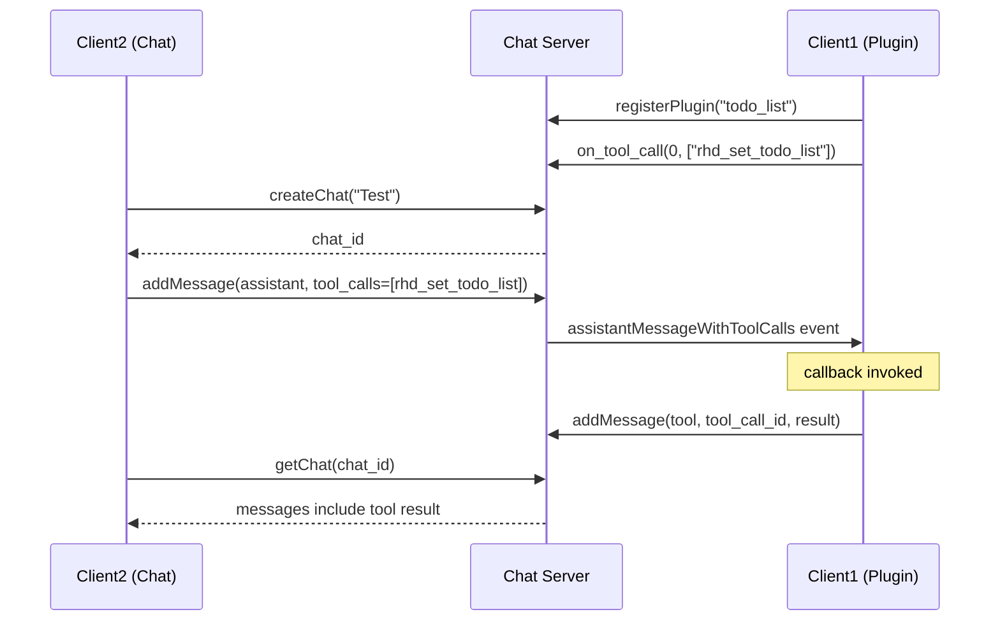

# Todo List Plugin Tool Call E2E Test Plan

## Problem Statement

The todo list plugin is not triggering on tool calls. When an assistant message with tool calls is added to the chat, the plugin's `on_tool_call` handler is not being invoked, so no tool result message is added.

## Root Cause

In [`plugin.rs:196`](plugins/rhd_plugin_todo_list/src/plugin.rs:196), the plugin calls:
```rust
client.on_tool_call(
    0, // chat_id 0 means all chats (we'll filter in the handler)
    vec!["rhd_set_todo_list".to_string()],
    ...
)
```

The comment says "chat_id 0 means all chats", but the dispatch logic in [`client.rs:524-525`](packages/rhd_chat_client/src/client.rs:524) does an exact match:
```rust
if sub.chat_id == chat_id {
```

This means a subscription with `chat_id: 0` will only match events with `chat_id: 0`, not actual chat IDs like `1`, `2`, etc.

## Fix

Update the dispatch logic in `client.rs` to treat `chat_id: 0` as a wildcard meaning "all chats":

```rust
// In dispatch_event for "assistantMessageWithToolCalls"
for sub in &subs.tool_call_subscriptions {
    if sub.chat_id == 0 || sub.chat_id == chat_id {  // <-- Add wildcard check
        // ... rest of the logic
    }
}
```

## E2E Test Plan

Write an e2e test in `packages/rhd_chat_server/tests/websocket_tests.rs` that:

1. **Setup**: Start test server, connect two clients
2. **Register plugin**: Client1 registers as "todo_list" plugin
3. **Subscribe to tool calls**: Client1 calls `on_tool_call(0, ["rhd_set_todo_list"], callback)` to subscribe to all chats
4. **Create chat**: Client2 creates a chat
5. **Add assistant message with tool call**: Client2 adds an assistant message with a `rhd_set_todo_list` tool call
6. **Verify callback invoked**: Client1's callback should be invoked with the tool call event
7. **Add tool result**: Client1 adds a tool result message
8. **Verify tool result in chat**: Client2 fetches the chat and verifies the tool result message exists

### Test Flow Diagram



## Implementation Steps

1. **Write the e2e test** in `packages/rhd_chat_server/tests/websocket_tests.rs`:
   - Test name: `test_todo_list_plugin_tool_call_flow`
   - Follow the pattern from existing tests like `test_subscription_chat_events`

2. **Fix the bug** in `packages/rhd_chat_client/src/client.rs`:
   - Update line 525 to add wildcard check: `if sub.chat_id == 0 || sub.chat_id == chat_id`

3. **Run tests** to verify:
   - `mise run test-cargo` should pass
   - The new test should fail before the fix and pass after

## Files to Modify

1. `packages/rhd_chat_server/tests/websocket_tests.rs` - Add e2e test
2. `packages/rhd_chat_client/src/client.rs` - Fix dispatch logic (line 525)

## Success Criteria

- E2E test fails before the fix (demonstrates the bug)
- E2E test passes after the fix
- All existing tests continue to pass
