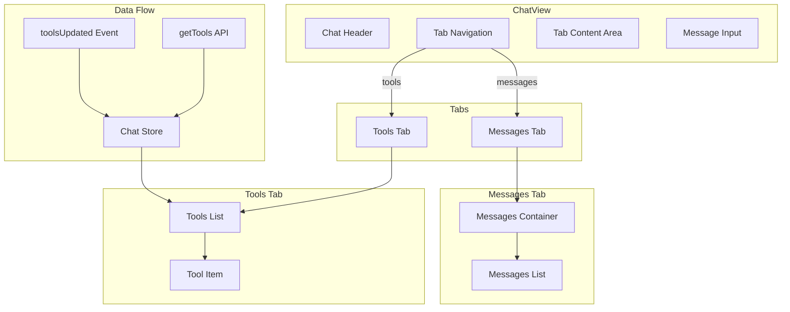
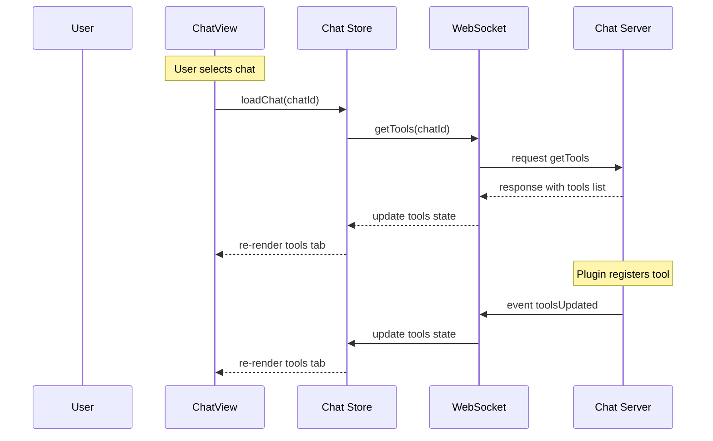

# Todo List Tool Definition Fix & Chat Tabs Implementation Plan

## Overview

Two issues to address:
1. **Bug fix**: The `rhd_set_todo_list` tool definition JSON has an incorrect structure, causing a parse error: `missing field 'type' at line 14 column 1`
2. **Feature**: Add tabs inside the chat view — one tab for messages, another for the list of registered tools for that chat

## Part 1: Tool Definition Fix

### Root Cause

The [`ToolDefinition`](packages/rhd_chat_api/src/tools.rs:30) struct expects a nested OpenAI-style format:

```json
{
  "type": "function",
  "function": {
    "name": "rhd_set_todo_list",
    "description": "...",
    "parameters": { ... }
  }
}
```

But [`templates/mcp_internal/rhd_set_todo_list/tool_definition.json`](templates/mcp_internal/rhd_set_todo_list/tool_definition.json) currently has a flat structure:

```json
{
  "name": "rhd_set_todo_list",
  "description": "...",
  "parameters": { ... }
}
```

### Fix

Rewrite `tool_definition.json` to wrap the content in the expected `type`/`function` structure:

```json
{
  "type": "function",
  "function": {
    "name": "rhd_set_todo_list",
    "description": "Replace the entire TODO list with an updated checklist reflecting the current state. Always provide the full list; the system will overwrite the previous one. This tool is designed for step-by-step task tracking, allowing you to confirm completion of each step before updating, update multiple statuses at once (e.g., mark one as completed and start the next), and dynamically add new todos as they're discovered.",
    "parameters": {
      "type": "object",
      "properties": {
        "todos": {
          "type": "string",
          "description": "Full markdown checklist in execution order, using [ ] for pending, [x] for completed, [-] for in progress, and [!] for discarded"
        }
      },
      "required": ["todos"]
    }
  }
}
```

### Files to modify

| File | Change |
|------|--------|
| `templates/mcp_internal/rhd_set_todo_list/tool_definition.json` | Wrap in `type`/`function` structure |

## Part 2: Chat Tabs (Messages + Tools)

### Architecture



### Data Flow



### Implementation Tasks

#### Phase 1: Frontend API Layer

##### 1.1 Add ToolInfo schema and getTools API

**File**: `frontend/src/lib/api/schemas.ts`

Add schemas for tool definitions:

```typescript
export const FunctionDefinitionSchema = z.object({
  name: z.string(),
  description: z.string(),
  parameters: z.any()
});

export const ToolDefinitionSchema = z.object({
  type: z.string(),
  function: FunctionDefinitionSchema
});

export const ToolInfoSchema = z.object({
  pluginId: z.string(),
  tool: ToolDefinitionSchema
});

export const GetToolsResultSchema = z.object({
  tools: z.array(ToolInfoSchema)
});

export type ToolInfo = z.infer<typeof ToolInfoSchema>;
export type ToolDefinition = z.infer<typeof ToolDefinitionSchema>;
export type GetToolsResult = z.infer<typeof GetToolsResultSchema>;
```

**File**: `frontend/src/lib/api/chatApiImpl.ts`

Add `getTools` function:

```typescript
export async function getTools(chatId: number): Promise<GetToolsResult> {
  const data = await websocket.request('getTools', { chatId });
  return GetToolsResultSchema.parse(data);
}
```

Add `toolsUpdated` event handler support:

```typescript
export const ToolsUpdatedDataSchema = z.object({
  chatId: z.number(),
  tools: z.array(ToolInfoSchema)
});

export type ToolsUpdatedData = z.infer<typeof ToolsUpdatedDataSchema>;
```

**File**: `frontend/src/lib/api/ChatApi.ts`

Add `getTools` to the interface and default implementation.

#### Phase 2: Chat Store Integration

##### 2.1 Add tools state to chat store

**File**: `frontend/src/lib/stores/ChatStore.ts` (or equivalent)

Add:
- `tools: Map<number, ToolInfo[]>` — per-chat tools cache
- `loadTools(chatId: number)` — fetch tools via API
- Handle `toolsUpdated` event to update cache

#### Phase 3: UI Components

##### 3.1 Create ChatTabNav component

**File**: `frontend/src/lib/components/ChatTabNav.svelte`

A simple tab navigation component for switching between "Messages" and "Tools" tabs within the chat view. Uses the same styling pattern as the existing `TabView.svelte`.

```svelte
<script lang="ts">
  import { createEventDispatcher } from 'svelte';

  type ChatTab = 'messages' | 'tools';

  interface Props {
    activeTab?: ChatTab;
    toolsCount?: number;
  }

  let { activeTab = 'messages', toolsCount = 0 }: Props = $props();

  const dispatch = createEventDispatcher<{
    tabChange: { tab: ChatTab };
  }>();

  function selectTab(tab: ChatTab) {
    activeTab = tab;
    dispatch('tabChange', { tab });
  }
</script>
```

##### 3.2 Create ToolsList component

**File**: `frontend/src/lib/components/ToolsList.svelte`

Displays the list of registered tools for the current chat:

```svelte
<script lang="ts">
  import type { ToolInfo } from '../api/schemas.js';

  interface Props {
    tools: ToolInfo[];
  }

  let { tools }: Props = $props();
</script>
```

Each tool item shows:
- Tool name (from `tool.function.name`)
- Description (from `tool.function.description`)
- Plugin ID that registered it (from `pluginId`)

##### 3.3 Update ChatView to include tabs

**File**: `frontend/src/lib/components/ChatView.svelte`

Restructure the chat view to include tab navigation between the header and content area:

1. Add `ChatTabNav` component after the chat header
2. Wrap existing messages container in a conditional block for the "messages" tab
3. Add `ToolsList` component for the "tools" tab
4. Load tools when chat is selected
5. Subscribe to `toolsUpdated` events

#### Phase 4: Event Handling

##### 4.1 Add toolsUpdated event support

**File**: `frontend/src/lib/api/chatApiImpl.ts`

Add event listener for `toolsUpdated` in `onChatEvents`:

```typescript
export interface ChatEventHandlers {
  // ... existing handlers
  onToolsUpdated?: (data: ToolsUpdatedData) => void;
}
```

### Files to Create

| File | Purpose |
|------|---------|
| `frontend/src/lib/components/ChatTabNav.svelte` | Tab navigation for messages/tools |
| `frontend/src/lib/components/ToolsList.svelte` | Display registered tools list |

### Files to Modify

| File | Change |
|------|--------|
| `templates/mcp_internal/rhd_set_todo_list/tool_definition.json` | Fix JSON structure |
| `frontend/src/lib/api/schemas.ts` | Add ToolInfo, ToolDefinition, GetToolsResult, ToolsUpdatedData schemas |
| `frontend/src/lib/api/chatApiImpl.ts` | Add getTools function, toolsUpdated event support |
| `frontend/src/lib/api/ChatApi.ts` | Add getTools to interface |
| `frontend/src/lib/stores/ChatStore.ts` | Add tools state and loadTools method |
| `frontend/src/lib/components/ChatView.svelte` | Add tab navigation and tools tab content |

## Testing Strategy

1. **Tool definition fix**: Verify plugin starts without parse error, tool appears in `getTools` response
2. **Chat tabs**:
   - Messages tab shows existing messages (no regression)
   - Tools tab shows registered tools with name, description, plugin ID
   - Tools tab updates in real-time when plugins register/remove tools
   - Tab state persists when switching between chats

## Risks and Mitigations

| Risk | Mitigation |
|------|------------|
| Large number of tools could slow rendering | Virtualize list if needed (unlikely for typical use) |
| Tab state lost on page refresh | Acceptable for v1; can persist in localStorage later |

## Confirmed Backend Support

- ✅ `toolsUpdated` event exists in [`packages/rhd_chat_api/src/events/tools_updated.rs`](packages/rhd_chat_api/src/events/tools_updated.rs:31)
- ✅ `getTools` method exists in [`packages/rhd_chat_api/src/methods/get_tools.rs`](packages/rhd_chat_api/src/methods/get_tools.rs:46)
- ✅ `ToolInfo` and `ToolDefinition` types are defined in [`packages/rhd_chat_api/src/tools.rs`](packages/rhd_chat_api/src/tools.rs:30)
