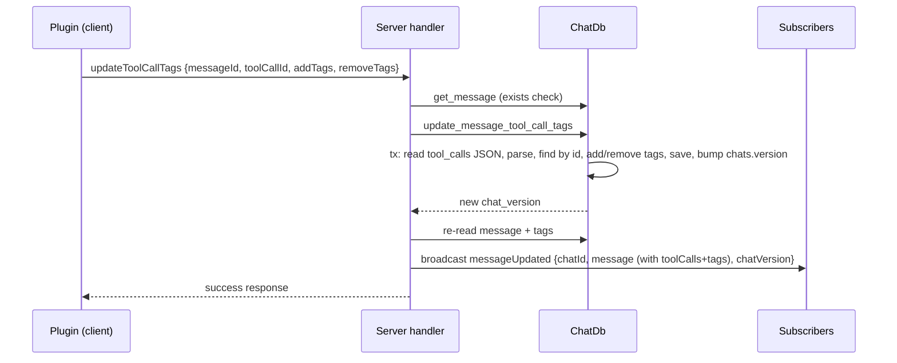

# Tool Call Tags — Implementation Plan

## Goal

Give plugins the ability to add/remove tags on individual tool calls stored in assistant messages. The operation must: read the message's tool calls, parse them, mutate tags, save, bump the chat version, and broadcast a `messageUpdated` event so any plugin watching chat changes can sync its state.

Additionally: ensure `messageUpdated` carries the chat version so plugins can validate they hold the latest message state.

## Who Stores Tool Calls Today?

**The ai_completions plugin already stores tool calls** — this plan does not introduce a new storage path:

- **Writer**: `rhd_plugin_ai_completions` ([`ai_request.rs`](../plugins/rhd_plugin_ai_completions/src/ai_request.rs)) — after streaming finishes it converts accumulated `StreamToolCallDelta`s into `rhd_chat_api::ToolCall` values, serializes them to a JSON string, and sends it via `updateMessage { toolCalls: "<json>" }`. The server writes that string into the `messages.tool_calls` column.
- **Reader**: `rhd_db::get_message` parses the column into `Vec<rhd_db::ToolCall>` ([`messages.rs`](../packages/rhd_db/src/chat_db/messages.rs)). Note the two `ToolCall` shapes differ slightly (API has `type: "function"`, DB doesn't) — serde ignores unknown fields, so both parse the same stored JSON fine.
- **Gap**: `convert_message_to_api` drops tool calls on the way out, so subscribers (plugins, frontend) never see them in `messageUpdated`/`getChat`. The plugin's `tool_resolution.rs` has an explicit TODO about this.

So this feature = add `tags` to the existing blob + a focused mutation method + expose tool calls on the API `Message`.

## Current State (verified)

- Tool calls are persisted as a JSON array in the `messages.tool_calls` column (`packages/rhd_db/src/chat_db/mod.rs:50`).
- The API `Message` struct (`packages/rhd_chat_api/src/common.rs:60`) has **no** `tool_calls` field (`packages/rhd_chat_server/src/handlers/message.rs:19`).
- **`chat_version` is already present** in `MessageUpdatedData` (`packages/rhd_chat_api/src/events/message_updated.rs:33`) and the sole emit site already passes the post-update version. Only verification is needed.
- Message-level tags already follow an additive pattern: `updateMessage` takes `addTags`/`removeTags`; the DB bumps `chats.version` inside a transaction (`packages/rhd_db/src/chat_db/tags.rs`).

## Design Decisions

1. **Tags live inside the tool-call JSON blob.** Add `tags: Vec<String>` with `#[serde(default)]` to `ToolCall` in both `rhd_db` and `rhd_chat_api`. No DB migration; existing rows (written by the plugin without tags) deserialize with empty tags. Matches the requested flow (read → parse → mutate → save) and keeps tags atomic with the tool call.
2. **Expose tool calls on the API `Message`.** Add `tool_calls: Vec<ToolCall>` with `#[serde(default, skip_serializing_if = "Vec::is_empty")]`. Without this, the `messageUpdated` event cannot carry tag changes to plugins. Additive and backward-compatible on the wire.
3. **One method, `updateToolCallTags`,** with `addTags`/`removeTags` arrays — mirrors `updateMessage`'s race-avoiding pattern rather than two separate methods.
4. **Version bump inside the DB transaction**, returning the new version (same pattern as `tags.rs`), so the event always carries a version that includes this change.

## Flow

## Implementation Steps

### 1. rhd_db — data model + mutation function

- `packages/rhd_db/src/chat_db/mod.rs`: add `tags: Vec<String>` (`#[serde(default)]`) to `ToolCall`.
- `packages/rhd_db/src/chat_db/messages.rs`: add `update_message_tool_call_tags(conn, message_id, tool_call_id, add_tags, remove_tags) -> DbResult<i64>`:
  - transaction: `SELECT chat_id, tool_calls` for the message; parse `Vec<ToolCall>`; locate tool call by `id` (error if message/tool call not found — add a `DbError` variant if none fits);
  - append `add_tags` (skip duplicates), remove `remove_tags`;
  - `UPDATE messages SET tool_calls = <serialized>`;
  - `UPDATE chats SET updated_at, version = version + 1`; return new version.
- `ChatDb` impl method in `mod.rs` delegating to it.
- Unit tests in `packages/rhd_db/src/chat_db/tests/message_tests.rs`: add/remove, dedup, unknown tool-call id error, version increments, backward compat with tag-less stored JSON (as currently written by the ai_completions plugin).

### 2. rhd_chat_api — protocol types

- `packages/rhd_chat_api/src/tools.rs`: add `tags: Vec<String>` (`#[serde(default)]`) to `ToolCall`.
- `packages/rhd_chat_api/src/common.rs`: add `tool_calls: Vec<ToolCall>` (`#[serde(default, skip_serializing_if = "Vec::is_empty")]`) to `Message`; update serialization tests.
- New `packages/rhd_chat_api/src/methods/update_tool_call_tags.rs`: `UpdateToolCallTagsParams { message_id, tool_call_id, add_tags (default), remove_tags (default) }`, `UpdateToolCallTagsResult {}`; camelCase; doc example JSON; serialization tests. Register + re-export in `methods/mod.rs` and `lib.rs`.

### 3. rhd_chat_server — handler + event broadcast

- `packages/rhd_chat_server/src/handlers/message.rs`:
  - extend `convert_message_to_api` to map DB `ToolCall` → API `ToolCall` (`call_type = "function"`, carry `tags`);
  - add `update_tool_call_tags(...)` handler: parse params, message-not-found error path, call DB fn, map unknown tool-call id to `ErrorResponse::invalid_request`, re-read message + tags, broadcast `message_updated_event(chat_id, api_message, new_version)`.
- `packages/rhd_chat_server/src/handlers/mod.rs`: route `"updateToolCallTags"`.

### 4. rhd_chat_client — typed wrapper

- `packages/rhd_chat_client/src/client.rs`: `pub async fn update_tool_call_tags(&self, params) -> Result<UpdateToolCallTagsResult, ClientError>` via `send_request("updateToolCallTags", params)`; import the new types.

### 5. Verify chat_version on messageUpdated

- Confirm the single emit site (`message.rs:150`) and any future ones pass the post-change version; assert `chatVersion` in the integration test payload. (Already implemented — verification only.)

### 6. Integration tests

- `packages/rhd_chat_server/tests/websocket_tests.rs`: add message with tool calls via `updateMessage` (JSON string, same shape the ai_completions plugin writes), subscribe to chat, call `updateToolCallTags`, assert success response, assert received `messageUpdated` event contains updated `message.toolCalls[].tags` and an incremented `chatVersion`; error case for unknown tool call id.

### 7. Docs

- Update `plugins/README.md` with the new `updateToolCallTags` method and a note that `messageUpdated` now carries `message.toolCalls` with per-call `tags` and `chatVersion` for state validation.

## Validation

- `mise run check-cargo`
- `mise run test-cargo`

## Risks / Notes

- **Full-blob overwrite hazard**: the plugin's existing flow sets `tool_calls` via `updateMessage`, which replaces the whole JSON blob — any tags added via `updateToolCallTags` on that message would be wiped if the plugin later rewrites `tool_calls`. Mitigation: document in `plugins/README.md` that tag changes must go through `updateToolCallTags` and that `updateMessage.toolCalls` should only be written once at stream finish (which is the current behavior).
- Wire compatibility: all new fields are `#[serde(default)]`/skipped when empty — old clients and existing stored JSON keep working.
- `getChat`/`messageAdded`/`messageUpdated` payloads now include `toolCalls` when present (intentional; enables plugin sync). Frontend `ChatStore` tolerates extra fields; no frontend change in scope.
- Concurrent tag updates on the same message: last-writer-wins on the blob inside each transaction; version bump stays monotonic. Acceptable for v1.
- Follow-up (out of scope): ai_completions can now implement real tool-call-id resolution (its TODO) using `Message.tool_calls`.

## Success Criteria

- A plugin can call `updateToolCallTags` and see tags reflected in the persisted message and in `messageUpdated` events received by subscribers.
- `messageUpdated` always carries the chat version covering the change.
- All cargo checks and tests pass; existing behavior unchanged for clients that ignore the new fields.
