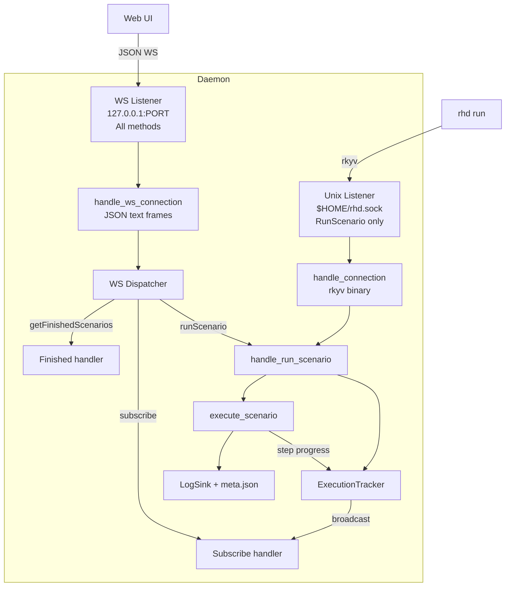

# WebSocket Transport & Execution Tracking Plan

## Goal

Add WebSocket transport inside the rhd daemon for Web UI integration, with real-time execution tracking and historical scenario metadata.

## Architecture Overview



## Key Decisions

1. **WebSocket inside daemon** — not a separate bridge. Daemon already async (tokio), `DaemonState` already `Arc`-shared.

2. **JSON over WebSocket** — web-friendly, no rkyv dependency in browser. Unix socket keeps rkyv for CLI.

3. **`tokio-tungstenite`** for WS — lightweight, native tokio integration.

4. **New `rhd_api` crate** — all IPC types, protocol definitions, and data structures live here. Both daemon and future clients use it.

5. **Unix socket unchanged** — only supports `RunScenario`. New methods (subscribe, getFinished, etc.) are WS-only.

6. **`tokio::sync::broadcast`** for event pub/sub — typically 1 subscriber, but supports 2-3+ without issues. Slow subscribers dropped if they can't keep up.

7. **meta.json** — structured JSON for forward compatibility. Written at scenario completion.

8. **UTC ISO timestamps everywhere** — no timezone offsets. All times stored and transmitted as UTC ISO 8601 (`2026-06-26T15:00:00Z`).

9. **Token pricing** — optional `inputTokenPrice` / `outputTokenPrice` in model YAML. Supports tiered pricing via `priceTiers` array (e.g., different price after 250k tokens). Cost calculated and stored in meta.json.

10. **Log section line numbers** — each step in meta.json stores line ranges for all its sections (main section + subsections delimited by `-----`). Enables future "get me this step's system prompt" API.

---

## Part 1: `rhd_api` Crate

### New crate: `packages/rhd_api/`

```
packages/rhd_api/
├── Cargo.toml
└── src/
    └── lib.rs          # All shared types
```

**Contents:**

```rust
// Execution tracking types
pub struct ExecutionEvent { ... }
pub struct StepTiming { ... }
pub struct LogSection { ... }
pub struct TokenUsage { ... }
pub struct ScenarioMeta { ... }

// WebSocket protocol types
pub enum WsRequest { ... }
pub enum WsResponse { ... }
pub enum WsEvent { ... }
pub enum ErrorCode { ... }

// Token pricing types
pub struct TokenPriceTier { ... }
```

All types derive `Serialize` + `Deserialize` (serde JSON).

---

## Part 2: Token Pricing

### Changes to `rhd_ai/src/config.rs`

Add optional pricing fields to `ModelConfig`:

```rust
pub struct ModelConfig {
    pub base_url: String,
    pub api_key: String,
    pub model: String,
    #[serde(default)]
    pub input_token_price: Option<f64>,      // price per 1M tokens
    #[serde(default)]
    pub output_token_price: Option<f64>,     // price per 1M tokens
    #[serde(default)]
    pub price_tiers: Option<Vec<PriceTier>>, // tiered pricing
}

pub struct PriceTier {
    pub after_tokens: u64,        // e.g., 250000
    pub input_token_price: f64,   // price per 1M tokens after this threshold
    pub output_token_price: f64,
}
```

**Example model YAML:**
```yaml
baseUrl: "https://api.openai.com/v1"
apiKey: "sk-..."
model: "gpt-4"
inputTokenPrice: 5.0
outputTokenPrice: 15.0
priceTiers:
  - afterTokens: 250000
    inputTokenPrice: 10.0
    outputTokenPrice: 30.0
```

**Cost calculation** (in `rhd_api`):
```rust
pub fn calculate_cost(usage: &TokenUsage, config: &ModelConfig) -> Option<f64>
```
- If no pricing configured → `None`
- If `price_tiers` present → find applicable tier based on cumulative token count, calculate cost
- If only flat prices → simple `tokens * price / 1_000_000`

---

## Part 3: Execution Tracking

### New module: `packages/rhd_app/src/execution.rs`

```rust
pub struct ExecutionTracker {
    next_id: AtomicU64,
    active: Mutex<HashMap<u64, ActiveExecution>>,
    events_tx: broadcast::Sender<ExecutionEvent>,
}

pub struct ActiveExecution {
    pub id: u64,
    pub scenario_name: String,
    pub started_at: DateTime<Utc>,
    pub current_step: Option<StepProgress>,
}

pub struct StepProgress {
    pub name: String,
    pub started_at: DateTime<Utc>,
}

pub struct ExecutionHandle {
    id: u64,
    tracker: Arc<ExecutionTracker>,
    step_timings: Vec<StepTiming>,
    token_usage: TokenUsage,
    scenario_name: String,
    started_at: DateTime<Utc>,
}

// ExecutionHandle methods:
// - step_started(name) — records previous step end, updates active, broadcasts event
// - finished() — removes from active, broadcasts finish event, returns collected data
// - add_token_usage(usage) — accumulates tokens from AI calls

pub struct StepTiming {
    pub name: String,
    pub started_at: DateTime<Utc>,
    pub finished_at: DateTime<Utc>,
    pub duration_ms: u64,
    pub tokens: Option<TokenUsage>,
    pub sections: Vec<LogSection>,
}

pub struct LogSection {
    pub kind: LogSectionKind,
    pub start_line: u64,  // 1-based
    pub end_line: u64,    // 1-based, inclusive
}

pub enum LogSectionKind {
    // runCommand sections
    RunningCommand,
    ExitCode,
    CommandOutput,
    // aiChat sections
    AiRequest,
    SystemPrompt,
    Message,
    AiResponse,
    ToolCall,
    ToolResult,
    // common
    Skipped,
    OutputStep,
}

pub struct TokenUsage {
    pub prompt_tokens: u64,
    pub completion_tokens: u64,
    pub total_tokens: u64,
}
```

**Broadcast design:**
- `ExecutionTracker` holds `broadcast::Sender<ExecutionEvent>` with capacity ~64
- WS subscribe handler creates `broadcast::Receiver`, forwards events as WS text frames
- Multiple subscribers supported (2-3+ typical)
- Slow receivers that lag behind are dropped by broadcast (acceptable for real-time monitoring)

**Flow:**
1. `handle_request(RunScenario)` calls `tracker.start(scenario_name)` → returns `ExecutionHandle`
2. `execute_scenario()` receives `Option<&ExecutionHandle>` (always `Some` from daemon)
3. Before each action: `handle.step_started(step_name)` — also captures current log line number
4. During execution: `LogSink` reports section boundaries to `ExecutionHandle` (via callback or shared state)
5. After AI calls: `handle.add_token_usage(usage)` (from `ChatResult`)
6. After scenario completes: `handle.finished()` — drops handle, broadcasts finish event, returns collected timings

### Changes to `executor.rs`

- `execute_scenario()` gains parameter: `handle: Option<&ExecutionHandle>`
- Before each action in the loop, call `handle.step_started(step_name)`
- Pass handle down to `execute_ai_chat()` and `execute_run_command()` for section tracking

### Changes to `rhd_ai/client.rs`

- Add `usage` field to `ChatResponse`:
  ```rust
  #[derive(Deserialize)]
  struct Usage {
      prompt_tokens: u64,
      completion_tokens: u64,
      total_tokens: u64,
  }
  ```
- Add `usage: Option<TokenUsage>` to `ChatResult`
- Parse `usage` from response JSON (optional — some APIs may not provide it)

### Changes to `ai_chat.rs`

- `execute_ai_chat()` gains parameter: `handle: Option<&ExecutionHandle>`
- After each `client.chat()` / `client.chat_with_tools()` call, extract usage from `ChatResult` and call `handle.add_token_usage(usage)`

---

## Part 4: meta.json

### Changes to `log.rs`

New function:
```rust
pub fn write_meta_json(dir: &Path, meta: &ScenarioMeta) -> io::Result<()>
```

**meta.json format:**
```json
{
  "scenario": "my_scenario",
  "started": "2026-06-26T15:00:00Z",
  "finished": "2026-06-26T15:01:30Z",
  "durationMs": 90000,
  "tokens": {
    "prompt": 1500,
    "completion": 800,
    "total": 2300
  },
  "cost": 0.0235,
  "steps": [
    {
      "name": "build",
      "started": "2026-06-26T15:00:00Z",
      "finished": "2026-06-26T15:00:10Z",
      "durationMs": 10000,
      "sections": [
        { "kind": "runningCommand", "startLine": 5, "endLine": 6 },
        { "kind": "exitCode", "startLine": 8, "endLine": 9 },
        { "kind": "commandOutput", "startLine": 11, "endLine": 15 }
      ]
    },
    {
      "name": "ai_review",
      "started": "2026-06-26T15:00:10Z",
      "finished": "2026-06-26T15:01:25Z",
      "durationMs": 75000,
      "tokens": {
        "prompt": 1500,
        "completion": 800,
        "total": 2300
      },
      "cost": 0.0235,
      "sections": [
        { "kind": "aiRequest", "startLine": 17, "endLine": 25 },
        { "kind": "systemPrompt", "startLine": 20, "endLine": 21 },
        { "kind": "message", "startLine": 22, "endLine": 24 },
        { "kind": "aiResponse", "startLine": 27, "endLine": 35 },
        { "kind": "toolCall", "startLine": 37, "endLine": 38 },
        { "kind": "toolResult", "startLine": 40, "endLine": 44 },
        { "kind": "toolCall", "startLine": 46, "endLine": 47 },
        { "kind": "toolResult", "startLine": 49, "endLine": 52 }
      ]
    }
  ]
}
```

- `tokens` and `cost` fields omitted at scenario level if no AI steps
- Per-step `tokens` and `cost` omitted for non-AI steps
- `sections` array contains all `=====` and `-----` delimited blocks within the step
- Multiple `toolCall` / `toolResult` sections possible per step (tool loop)
- Written by `daemon.rs` after `execute_scenario()` returns (both success and error paths)
- `ScenarioMeta` struct built from `ExecutionHandle` data + cost calculation from model config

### Log section tracking in `LogSink`

- `LogSink` gains a `line_count: u64` field (tracks total lines written)
- Each `log()` / `log_step()` / etc. increments counter by number of `\n` in output
- New method: `current_line() -> u64` — returns next line number (1-based)
- New method: `start_section(kind: LogSectionKind) -> u64` — records `current_line()` as section start, returns it
- New method: `end_section(kind: LogSectionKind) -> LogSection` — records `current_line() - 1` as section end, returns `LogSection`
- Executor / step functions call `start_section` / `end_section` around each logical block
- Sections collected into `StepTiming.sections` via `ExecutionHandle`

### New function in `log.rs`:
```rust
pub fn read_finished_scenarios(logs_dir: &Path) -> io::Result<Vec<ScenarioMeta>>
```
- Scans `logs_dir` for subdirectories
- Parses `meta.json` from each
- Returns sorted by start time (newest first)
- Skips dirs with missing/invalid meta.json

---

## Part 5: WebSocket Transport

### New module: `packages/rhd_app/src/ws.rs`

**WebSocket JSON protocol:**

Client → Server requests:
```json
{ "type": "runScenario", "id": "req-1", "name": "my_scenario", "cwd": "/path" }
{ "type": "subscribe", "id": "req-2" }
{ "type": "getFinishedScenarios", "id": "req-3" }
```

Server → Client responses (to specific request):
```json
{ "type": "response", "id": "req-1", "success": true, "data": { "output": "..." } }
{ "type": "response", "id": "req-1", "success": false, "errorCode": "UNKNOWN_SCENARIO", "error": "unknown scenario: foo" }
```

**Error codes enum:**
```rust
pub enum ErrorCode {
    UnknownScenario,
    ScenarioExecutionFailed,
    InvalidRequest,
    InternalError,
}
```

Server → Client events (subscription push):
```json
{ "type": "event", "event": "scenarioStarted", "data": { "id": 1, "name": "my_scenario", "daemonTime": "2026-06-26T15:00:00Z", "startedAt": "2026-06-26T15:00:00Z" } }
{ "type": "event", "event": "stepStarted", "data": { "executionId": 1, "stepName": "build", "startedAt": "2026-06-26T15:00:00Z" } }
{ "type": "event", "event": "scenarioFinished", "data": { "id": 1, "name": "my_scenario", "daemonTime": "2026-06-26T15:01:30Z", "startedAt": "2026-06-26T15:00:00Z", "finishedAt": "2026-06-26T15:01:30Z", "durationMs": 90000, "steps": [...], "tokens": {...}, "cost": 0.0235 } }
```

**Subscribe behavior:**
1. Client sends `{ "type": "subscribe", "id": "req-2" }`
2. Server responds with `{ "type": "response", "id": "req-2", "success": true, "data": { "activeExecutions": [...] } }` — snapshot of current active executions
3. Server then pushes `event` messages as they happen via broadcast channel
4. Multiple subscribers supported — each gets its own `broadcast::Receiver`

**WS server setup:**
- `tokio-tungstenite` accepts TCP connections on `127.0.0.1:{ws_port}`
- Each connection spawns a task that reads JSON frames, dispatches to handlers
- Subscription: task creates `broadcast::Receiver`, forwards events as WS text frames
- Connection cleanup on disconnect (receiver dropped automatically)

### Changes to `daemon.rs`

- `DaemonState` gains `execution_tracker: Arc<ExecutionTracker>`
- `run_daemon()` gains `ws_port: Option<u16>` parameter
- When `ws_port` is `Some`, bind TCP listener on `127.0.0.1:{ws_port}`
- Add WS listener to `tokio::select!` loop alongside Unix listener and signal handlers
- `handle_request()` creates `ExecutionHandle` before executing scenario, writes meta.json after

### Changes to `config.rs`

- Add `ws_port: Option<u16>` field to `DaemonConfig` (default: `None`)

### Changes to `cli.rs`

- Add `--ws-port` flag to `DaemonArgs`

### Changes to `main.rs`

- Pass `ws_port` through config merge to `run_daemon()`

---

## Part 6: Dependencies

### Workspace `Cargo.toml`

Add:
```toml
tokio-tungstenite = "0.24"
futures-util = "0.3"
```

### `packages/rhd_app/Cargo.toml`

Add:
```toml
tokio-tungstenite = { workspace = true }
futures-util = { workspace = true }
rhd_api = { path = "../rhd_api" }
```

### New `packages/rhd_api/Cargo.toml`

```toml
[package]
name = "rhd_api"
version = "0.1.0"
edition = "2021"

[dependencies]
serde = { workspace = true }
serde_json = { workspace = true }
chrono = { workspace = true }
```

---

## Implementation Order

1. **`rhd_api` crate** — create crate, define all shared types (events, protocol, meta, error codes, pricing, log sections)
2. **Token usage parsing** — `rhd_ai/client.rs`: add `Usage` to `ChatResponse`, `TokenUsage` to `ChatResult`
3. **Token pricing** — `rhd_ai/config.rs`: add pricing fields to `ModelConfig`, cost calculation in `rhd_api`
4. **Execution tracking** — `execution.rs`: `ExecutionTracker`, `ExecutionHandle`, broadcast channel
5. **Executor integration** — `executor.rs` + `ai_chat.rs` + `run_command.rs`: accept `ExecutionHandle`, report steps, accumulate tokens
6. **Log section tracking** — `log.rs`: `LogSink` line counter, `start_section()` / `end_section()` methods
7. **meta.json** — `log.rs`: `write_meta_json()`, `read_finished_scenarios()`, `ScenarioMeta` struct
8. **Daemon wiring** — `daemon.rs`: create tracker in `DaemonState`, create handle in `handle_request()`, write meta.json after execution
9. **WebSocket protocol types** — `ws.rs`: JSON request/response/event types (from `rhd_api`), error codes
10. **WebSocket server** — `ws.rs`: TCP listener, WS upgrade, connection handler, subscription via broadcast
11. **Daemon WS integration** — `daemon.rs`: add WS listener to select loop
12. **Config + CLI** — `config.rs`, `cli.rs`, `main.rs`: `ws_port` field and flag
13. **E2E test: meta.json validation** — verify meta.json written correctly after scenario execution (timing, sections, tokens)

---

## File Changes Summary

| File | Change |
|------|--------|
| `packages/rhd_api/` | **NEW CRATE** — all shared IPC types, protocol, meta, pricing, log sections |
| `packages/rhd_ai/src/client.rs` | Parse `usage` from API response, add to `ChatResult` |
| `packages/rhd_ai/src/config.rs` | Add optional token pricing fields to `ModelConfig` |
| `packages/rhd_app/src/execution.rs` | **NEW** — `ExecutionTracker`, `ExecutionHandle`, events |
| `packages/rhd_app/src/scenario/executor.rs` | Accept `ExecutionHandle`, report step progress |
| `packages/rhd_app/src/scenario/ai_chat.rs` | Accept `ExecutionHandle`, accumulate token usage, report sections |
| `packages/rhd_app/src/scenario/run_command.rs` | Accept `ExecutionHandle`, report sections |
| `packages/rhd_app/src/log.rs` | Line counter, section tracking, `write_meta_json()`, `read_finished_scenarios()` |
| `packages/rhd_app/src/ws.rs` | **NEW** — WebSocket server, JSON protocol, handlers |
| `packages/rhd_app/src/daemon.rs` | `ExecutionTracker` in state, WS listener in select loop, meta.json writing |
| `packages/rhd_app/src/config.rs` | Add `ws_port: Option<u16>` |
| `packages/rhd_app/src/cli.rs` | Add `--ws-port` flag |
| `packages/rhd_app/src/main.rs` | Wire `ws_port` through, add `rhd_api` dep |
| `Cargo.toml` | Add `rhd_api` to workspace, add `tokio-tungstenite`, `futures-util` |
| `packages/rhd_app/Cargo.toml` | Add `rhd_api`, `tokio-tungstenite`, `futures-util` deps |

---

## Risks & Mitigations

| Risk | Mitigation |
|------|------------|
| `block_on(execute_scenario)` inside `spawn_blocking` + broadcast send | `ExecutionHandle` methods are sync (just lock + send), safe from blocking context |
| WS bind failure (port in use) | Daemon fails fast with clear error message at startup |
| meta.json parse errors (corrupt/old format) | `read_finished_scenarios` skips dirs with missing/invalid meta.json |
| Token usage not available from some APIs | `usage` is `Option<TokenUsage>`, omitted from meta.json when absent |
| Cost calculation with tiered pricing | Unit tests for `calculate_cost()` with various tier configurations |
| Broadcast channel lag | Capacity 64, slow receivers dropped (acceptable for real-time monitoring) |
| Section line tracking adds complexity to LogSink | Sections tracked via explicit `start_section`/`end_section` calls, minimal intrusion |

---

## Success Criteria

- [ ] `rhd_api` crate created with all shared types
- [ ] Daemon starts with optional `--ws-port` / `wsPort` config
- [ ] WS clients can run scenarios via JSON protocol
- [ ] WS clients can subscribe and receive real-time execution events (start, step, finish)
- [ ] WS clients can request finished scenarios list (parsed from meta.json)
- [ ] meta.json written in log dirs with timing, optional token data, optional cost, log section line numbers
- [ ] Token usage captured from OpenAI-compatible API responses
- [ ] Token pricing configurable in model YAML with tiered pricing support
- [ ] Error responses include `errorCode` enum field
- [ ] All timestamps UTC ISO 8601
- [ ] Existing CLI Unix socket transport unchanged (RunScenario only)
- [ ] E2E test validates meta.json written correctly after scenario execution
- [ ] `cargo build` succeeds, `cargo test` passes
