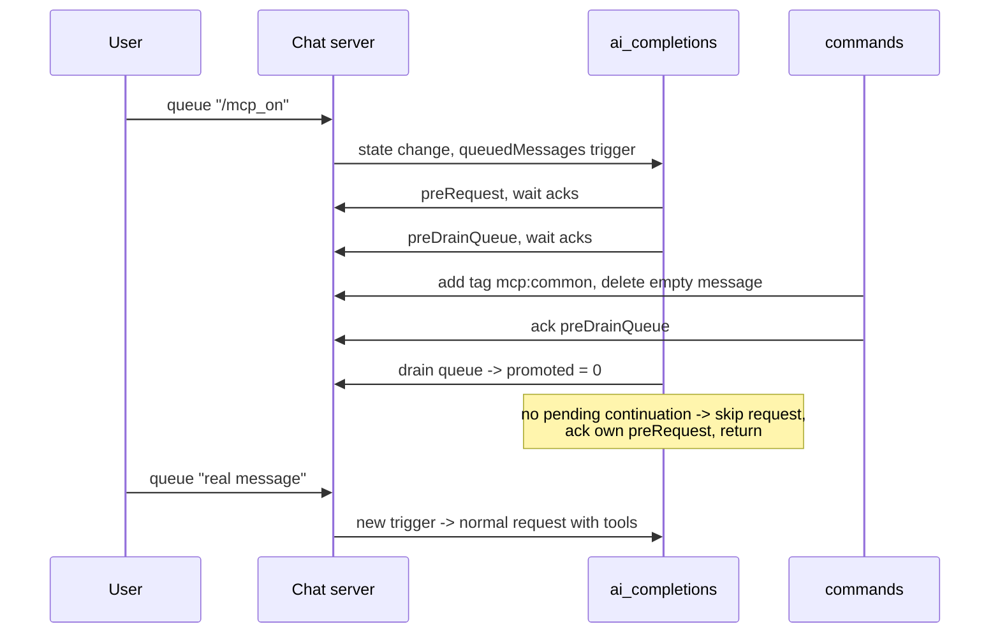

# Skip AI request when the queue empties during preDrainQueue

## Problem

A queued slash-command that only mutates queue/chat state (e.g. `/mcp_on` in
`~/projects/aitools/rhd/rhd.yaml` — a pure `chat_tags` command) must apply its
steps and then leave the chat waiting for a real user message. Today the model
is woken up instead.

Verified by an e2e reproduction (temporary test, reverted) driving the real
server + commands plugin + ai_completions plugin against the mock provider:

1. **Removal already works** — after `/tags_example` (tag-only) drains, the
   queue is empty and no residue appears in history. `executor::finalize_plan`
   already returns `FinalizeAction::Delete` for an empty remainder (commit
   `c387f73`). No commands-plugin code change is needed — only regression
   coverage (the existing e2e scenario 2 uses a command that leaves a prompt
   message in the queue, so the "queue ends up fully empty" case is untested).
   *If an empty message was seen lingering in a live instance, the running
   binary predates `c387f73`; rebuild.*
2. **The real bug** — ai_completions sends the AI request anyway: the
   reproduction recorded **2 provider requests**, the second carrying only the
   stale history, producing an unwanted assistant reply. With `/mcp_on` this is
   worse than noise: the tag change registers MCP tools in that same request
   (`get_tools` runs after the drain), so the model tends to start calling them
   — the spurious tool loop the user observed.

## Agreed decisions

- **Fix #1**: verify + regression test only; no executor change.
- **Abort rule (fix #2)**: skip the request when the drain promoted **zero**
  messages **and** no tool-loop continuation is pending (`all_tool_calls_resolved`
  on the refetched history). The guard preserves the real continuation owed when
  a tool result and a queue-emptying command coalesce into one QueuedMessages
  trigger.
- **Literal rule for prompt commands**: `/warhammer` alone inserts a system
  prompt → queue non-empty → still triggers. Out of scope by design.

## Changes

### 1. `plugins/rhd_plugin_ai_completions/src/queued_messages.rs`

- `process_queued_messages` returns `Result<usize, AiRequestError>` — the
  number of messages promoted (currently `Result<(), _>`). Doc comment updated
  accordingly.

### 2. `plugins/rhd_plugin_ai_completions/src/ai_request.rs`

In `handle_ai_request`, inside the `TriggerReason::QueuedMessages` branch,
**after** `process_queued_messages` + the existing `get_chat` refetch (the
branch's tail that yields `current_messages`), insert the skip guard:

```rust
if promoted == 0 && !tool_resolution::all_tool_calls_resolved(&current_messages) {
    tracing::info!(
        chat_id = chat_id,
        "queue emptied during preDrainQueue; waiting for a real message"
    );
    // Ack own preRequest so the event store stays clean (no self-replay via
    // getPendingAcks after restart), then return before the running tag.
    client
        .ack_custom_event(AckCustomEventParams { event_id, is_rejected: None })
        .await
        .map_err(|e| AiRequestError::EventAck(e.to_string()))?;
    return Ok(());
}
```

- Placement is deliberately **before** the `ai_completions:running` tag and the
  streaming `add_message`, so the abort leaves zero residue: no running tag, no
  parked chat, no streaming assistant message. The next queued message bumps
  the chat state and re-triggers the whole flow normally.
- Add `use crate::tool_resolution;` to the module.
- Update the module-level flow doc comment (steps list at the top of the file
  and `handle_ai_request`'s doc).

Resulting flow for `/mcp_on`:



### 3. Regression tests

**`plugins/rhd_plugin_commands/tests/commands_e2e_test.rs`** — new scenario 9
`test_tag_only_command_stays_silent_until_real_message` (shape proven in the
reproduction):

- Seed history with one real exchange; assert exactly 1 mock request.
- Queue `/tags_example` (tag-only). Wait until the chat tag is applied and the
  queue is empty (this also pins fix #1: the emptied message is removed).
- Settle; assert mock request count is still 1, no new assistant message, chat
  carries neither `ai_completions:running` nor `ai_completions:error`.
- Queue a real message; assert request #2 fires and the assistant replies —
  proving the plugin "waits for actual new messages".

**`plugins/rhd_plugin_ai_completions/tests/pre_drain_queue_test.rs`** — two new
scenarios using the existing observer-plugin machinery (no commands plugin
needed; the observer deletes the queued message upon `preDrainQueue`):

- `test_empty_queue_after_pre_drain_skips_request` — queue one message,
  observer deletes it during preDrainQueue; assert no provider request, chat
  not parked/tagged, and a subsequently queued normal message triggers the
  request as usual.
- `test_tool_loop_continuation_survives_empty_drain` — primer request returns a
  tool call (loop parked, unresolved); queue a message; observer deletes it on
  preDrainQueue; post the tool result → QueuedMessages trigger wins the race;
  drain promotes 0 but a continuation is pending → the second provider request
  **must** still go out with the tool history.

### 4. Docs & memory

- `plugins/rhd_plugin_ai_completions/README.md` — `ai_completions:preDrainQueue`
  section + request-flow list: document the empty-drain skip with the
  continuation guard.
- `plugins/rhd_plugin_commands/README.md` — user-visible guarantee: a
  commands-only message is removed after its steps run and never produces a
  model reply on its own.
- `memory/features/plugins.md` — AI Completions section ("Pre-Request
  Coordination" / "Queued Message Processing" bullets) and Commands Plugin
  section ("Coordination & safety"): add the skip rule.

### 5. Known side effects (accepted)

- `preRequest` already fired before the abort, so pre-request injections still
  happen on a skipped cycle: `system_prompt` is tag-idempotent; `todo_list`
  appends its snapshot system message (minor, self-limiting history noise;
  the alternative — reordering `preDrainQueue` before `preRequest` — breaks the
  Phase-2 ordering contract and is rejected).
- Prompt-type commands alone (`/warhammer` with no text) still wake the model
  (literal "empty queue" rule, confirmed).

## Verification

1. `cargo test -p rhd_plugin_ai_completions` and `cargo test -p rhd_plugin_commands`
   (new scenarios green, existing ones untouched — in particular
   `test_no_commands_plugin_no_behavior_change` and the ack-ordering suites).
2. `mise run test-cargo` full workspace suite; `mise run check-cargo` clean.
3. Optional live check in `~/projects/aitools/rhd`: rebuild binaries, `rhd
   start`, send `/mcp_on` in a fresh + established chat → tag applied, silence;
   next message → normal answer.

## Commit

Single commit per project convention (lowercase, concise), e.g.:
`skip ai request when queue empties during preDrainQueue`
