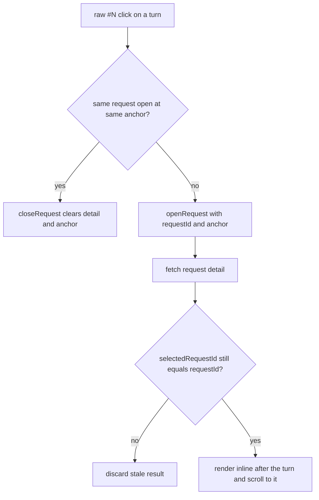

# frontend-proxy: Inline Request Drill-Down

## Goal

Replace the bottom-only request drill-down placement for **turn buttons** with an **inline**
placement: clicking `raw #N` on a message renders the raw exchange directly **after that
message** in the conversation and scrolls it into view. A second click on the same button
(or the drill-down's own × Close) closes it. Timeline rows keep the bottom placement — the
user is already at the bottom when clicking them.

This supersedes the drill-down placement part of
[frontend-proxy-conversation-ux.md](frontend-proxy-conversation-ux.md) (implemented; the rest
of that plan — index panel, collapsed timeline, per-turn buttons — stays as built).

## Design

### Anchor model

Exactly **one** drill-down exists at a time; its location is the *anchor*:

| Anchor value              | Meaning                                            | Opened by        |
|---------------------------|----------------------------------------------------|------------------|
| `seq` of a message turn   | inline right after that turn                       | turn `raw #N`    |
| `'tail'`                  | inline after the pending/error tail turn           | tail `raw #N`    |
| `null`                    | bottom section (below the timeline, as today)      | timeline row     |

Toggle semantics: clicking `raw #N` when that same request is already open **at that same
anchor** closes it; any other click opens (and moves) the drill-down. Anchor identity is the
turn (`seq` / `'tail'`), not the requestId — several turns can share one requestId (all
first-seen in the same request's history), and clicking a sibling turn should re-anchor, not
close.

Fallback: if the anchored turn no longer exists after a refresh (e.g. the tail completed and
became a response row), the drill-down renders at the bottom instead of vanishing.

### Stale-apply guard

`openRequest` currently assigns `requestDetail` whenever its fetch resolves. With toggling,
the user can close (or re-target) the drill-down while a fetch is in flight — the late result
would resurrect a zombie detail. Fix in the flow: apply the fetched detail only if
`selectedRequestId === requestId` still holds after the await. (This also fixes a pre-existing
double-click race where an older fetch could land after a newer one.)



## Implementation Steps

### 1. `ProxyLogsStore.ts` — anchor state + stale-apply guard

- New public observable: `openRequestAnchor: number | 'tail' | null = null`.
- `*openRequest(requestId: number, anchor: number | 'tail' | null = null)`:
  sets `openRequestAnchor = anchor` alongside `selectedRequestId`; after the fetch, assign
  `requestDetail` only when `selectedRequestId === requestId` (stale-apply guard).
- `closeRequest()`: also resets `openRequestAnchor = null` (so `openChat`/`clearSelection`
  reset it for free via their existing `closeRequest` calls).
- `refresh()` keeps working unchanged: it re-fetches the selected request; the anchor survives
  and placement fallback is a view concern.

### 2. `ConversationView.svelte` — inline rendering + anchored dispatch

- New props: `requestDetail: RequestDetail | null` (default `null`),
  `openAnchor: number | 'tail' | null` (default `null`), `onCloseRequest: () => void`
  (callback prop, mirroring `RequestDetailView`'s `onClose` style).
- Turn buttons dispatch `requestSelect` with `{ requestId, anchor }` — `anchor` is
  `turn.seq` for message turns and `'tail'` for the pending/error tails.
- Render `<RequestDetailView {requestDetail} onClose={onCloseRequest} />` immediately after
  the turn matching `openAnchor` (message turn with `seq === openAnchor`, or the tail when
  `openAnchor === 'tail'`), only when `requestDetail !== null` and `openAnchor !== null`.
  As a direct child of the `.conversation` flex column it inherits the existing gap spacing.

### 3. `ChatDetailView.svelte` — toggle handling + placement split

- New mobx bridge + `$derived` for `store.openRequestAnchor`.
- `$derived anchoredInConversation`: the anchor matches a message turn's `seq` in
  `detail.conversation`, or `anchor === 'tail'` and the last turn is pending/error. This is
  the refresh-fallback switch.
- `handleTurnRequestSelect(event: { requestId, anchor })`: if
  `requestDetail?.summary.id === requestId && openRequestAnchor === anchor` →
  `store.closeRequest()`; else open + scroll (shared helper).
- Timeline handler: same open helper with anchor `null` (always two-arg call for uniform
  assertions).
- Shared `openAndScroll(requestId, anchor)`: `await flowResult(store.openRequest(...))`
  (swallow — store surfaces errors), `await tick()`, then scroll
  `[data-testid="request-detail"]` into view via the existing `scrollIntoViewSafe` — the
  selector matches wherever the drill-down rendered (inline or bottom), so no new scroll code.
- Template: `ConversationView` receives
  `requestDetail={anchoredInConversation ? requestDetail : null}`, `openAnchor`, and
  `onCloseRequest`; the bottom `RequestDetailView` section renders only when
  `requestDetail && !anchoredInConversation`.

### 4. Unchanged

`RequestDetailView.svelte` (close button already exists), `RequestTimeline.svelte`,
`ConversationIndex.svelte`, all server/API/schema code.

### 5. Tests

- **`ProxyLogsStore.test.ts`**:
  - `openRequest` sets/clears `openRequestAnchor` (default `null`, explicit anchor, cleared by
    `closeRequest`).
  - stale-apply guard: resolve the (deferred) api promise only after `closeRequest()` →
    `requestDetail` and `selectedRequestId` stay `null`.
- **`ConversationView.test.ts`**:
  - inline drill-down renders after the anchored message turn; not rendered for mismatched or
    `null` anchor; `'tail'` anchor renders after the pending/error tail.
  - turn buttons dispatch `requestSelect` with `{ requestId, anchor }` (seq / `'tail'`).
  - the inline drill-down's close button invokes `onCloseRequest`.
- **`ChatDetailView.test.ts`** (mock store gains `openRequestAnchor`):
  - turn button click → `openRequest(requestId, seq)`; second click while that request is
    open at that anchor → `closeRequest` (and no `openRequest`); different turn → new anchor.
  - timeline row click → `openRequest(id, null)`.
  - placement: anchored detail renders between the anchored turn and the following turns (not
    in the bottom section); un-anchored detail renders at the bottom.

### 6. Validation

```sh
mise run check-frontend-proxy
mise run test-frontend-proxy
```

### 7. Docs

- `frontend-proxy/README.md` — "Using": turn `raw #N` opens the drill-down inline after the
  message (click again or × Close to dismiss, auto-scrolled); timeline rows keep the bottom
  placement.
- `memory/frontend/proxy-logs-viewer.md` — "What it does" + "Key decisions": anchor model
  (`seq` / `'tail'` / `null`), single drill-down with toggle, refresh fallback to bottom,
  stale-apply guard.

## Risks / Notes

- The stale-apply guard slightly changes `openRequest` semantics (late results for a
  superseded selection are dropped); existing store tests must keep passing — the guard is
  transparent unless the selection changed mid-flight.
- Toggle during an in-flight open (detail not yet rendered) is treated as a re-open, not a
  close — nothing visible exists to close yet.
- `RequestDetailView` rendered inside the conversation column inherits its width; no layout
  work expected beyond the existing gap spacing.
- All files stay under the 500-line limit (ConversationView ~+45 lines).
