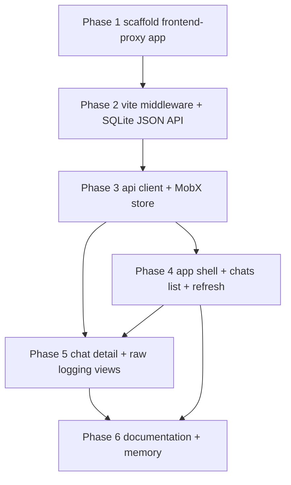

# Grand Plan: `frontend-proxy` — Proxy Chat Logs Viewer

## Summary

Build `frontend-proxy`, a second web frontend (sibling of `frontend/`) that visualizes the chat
logging database produced by `rhd_ai_proxy`'s `proxy.logging` feature. The viewer provides:

1. A **chats list** (title, model, timestamps) mirroring the `chats` table.
2. A **chat content view** — the reconstructed conversation of a chat.
3. **Raw logging views** — per-request raw request/response bodies and assembled assistant
   messages, straight from the `requests`/`raw` tables.
4. A **refresh button** that re-fetches all data to pick up new proxy activity.

The SQLite database is accessed through a **custom Vite dev-server middleware**: the `frontend-proxy`
dev server reads `VITE_PROXY_LOGS_PATH` (the directory containing `chats.sqlite3`, same semantics as
`proxy.logging.path` in the proxy YAML), opens the database, and serves a small JSON API that the
frontend consumes. **No changes to `rhd_ai_proxy` code are required** — the existing schema
(`chats`, `prefix_hashes`, `requests`, `raw`) already contains everything the viewer needs; the
proxy only gets a README pointer to the new tool.

**Scope decisions confirmed with the user:**

- Dev server on port **5174**, `strictPort: true`.
- **Fail fast** at dev-server startup when `VITE_PROXY_LOGS_PATH` is unset (clear error naming the
  variable).
- Viewer is **strictly read-only** — only `SELECT`s, no delete/purge endpoints.
- **Dev-only tool** — the API exists only under `vite dev`; no production build story.

## Reused Building Blocks (verified in codebase)

- `rhd_ai_proxy` logging schema (`packages/rhd_ai_proxy/src/logging/db.rs`) — `chats`, `requests`,
  `raw` tables; WAL journal mode with busy timeout means a second reader process (the dev server)
  can read safely while the proxy writes.
- `frontend/` project template — package.json dependency set (Svelte 5 + runes, MobX, Zod, Vite,
  Vitest, svelte-check), `svelte.config.ts` (`runes: true`), `tsconfig.json`, `vitest.config.ts`,
  `.nvmrc`, `.gitignore`.
- `frontend/src/util/mobxObservable.svelte.ts` and `frontend/src/util/async.ts` — the MobX↔Svelte
  bridge and typed-flow helper, copied into the new app.
- Frontend store conventions (`memory/frontend/MEMORY.md`) — `makeAutoObservable` classes, public
  observable fields, generator-method flows, DI of the API layer, component tests via mocked store
  in Svelte context.

## Architectural Decisions

- **AD-1. Separate sibling application.** `frontend-proxy/` is a standalone app at the repo root,
  not a route inside `frontend/`. Rationale: it is a local debug tool with a different lifecycle
  (dev-only), different data source (SQLite instead of the chat WebSocket), and a different port;
  keeping it separate avoids polluting the product frontend. No shared npm package is extracted —
  small helpers (`mobxObservable`, `yieldPromise`) are duplicated; extraction can happen later if a
  third consumer appears.
- **AD-2. Vite dev-server middleware as the data layer.** A Vite plugin's `configureServer` hook
  installs a connect middleware that serves a JSON API under `/api/*`. Rationale: SQLite access
  requires Node (native `better-sqlite3`), the browser cannot reach the file; the middleware keeps
  the client browser-pure. This matches the approach the user requested.
- **AD-3. `VITE_PROXY_LOGS_PATH` semantics.** The variable points at the **directory** that holds
  `chats.sqlite3` (identical semantics to `proxy.logging.path`). It is read from `process.env` in
  `vite.config.ts` at dev-server startup; when unset, config resolution throws with a message that
  names the variable and its expected content, so the server never starts half-configured.
- **AD-4. SQLite access strategy.** Single `better-sqlite3` connection opened once at server start.
  Synchronous queries are fine inside connect middleware (no async bridging needed). The connection
  is opened in normal mode — **not** `readonly: true` — because SQLite cannot open a WAL database
  read-only when no writer is attached (`-shm` recovery requires write access); read-only behavior
  is instead enforced by the query layer containing only `SELECT` statements (AD-9). A busy timeout
  keeps concurrent proxy writes from failing viewer reads.
- **AD-5. API contract — three read endpoints, Zod as single source of truth.**
  - `GET /api/chats` → list of chat summaries (id, title, model, createdAt, updatedAt,
    requestCount), ordered by `updated_at DESC`.
  - `GET /api/chats/:id` → chat summary plus its request summaries (id, ts, model, stream, status,
    durationMs, error), ordered oldest-first.
  - `GET /api/requests/:id` → full request detail: metadata + raw `requestBody` + raw
    `responseBody` + `responseAssembled`.
  Zod schemas (and the TS types inferred from them) live in one module imported by **both** the
  server middleware and the browser client, so the contract cannot drift. Unknown chat/request ids
  produce `404`; database errors produce `500` with a JSON error body. No pagination — this is a
  debug tool and chat counts are small; note that raw bodies can be large (O(N²) storage per chat
  by proxy design) and the UI must render them without choking (plain preformatted text, no
  syntax-highlight pass over megabytes).
- **AD-6. Chat content reconstruction rule.** Each logged `request_body` carries the harness's full
  message history at that point. The conversation view of a chat therefore renders: the **latest**
  request's `messages` array (system/user/tool turns) as the conversation spine, with each
  request's `responseAssembled` shown as the assistant turn that followed it (keyed by request id,
  in order). In-flight (`status IS NULL`) and errored requests are visible in the request timeline
  with their state; the conversation spine simply lacks an assistant turn for them. This avoids
  re-implementing the proxy's prefix-chain matching on the client.
- **AD-7. State management mirrors `frontend/` conventions.** One MobX root store
  (`ProxyLogsStore`) with `makeAutoObservable`, generator-method flows, public observable state
  fields, and plain-function API injected via constructor (testable with mocks). The Svelte side
  uses the `mobxObservable` bridge and `$derived`. No `ConnectionStore`/WebSocket layer — data is
  pulled over plain `fetch` on demand; the refresh button is the only re-sync mechanism (explicit
  user requirement; no live updates/SSE).
- **AD-8. Raw bodies cross the API as UTF-8 text.** `request_body` is JSON and `response_body` is
  either JSON or concatenated SSE text — both textual. The API returns them as strings (lossy on
  invalid UTF-8, acceptable for a debug viewer). The UI pretty-prints JSON bodies and shows SSE
  bodies verbatim.
- **AD-9. Read-only guarantee.** The middleware defines no write routes; the query module exposes
  only `SELECT` statements. This is the enforcement point for the "strictly read-only" decision —
  reviewable at a glance.
- **AD-10. Port 5174, `strictPort: true`.** Fails loudly if taken, consistent with `frontend/`'s
  strictPort usage; no silent port-hopping.

## Phases

### Phase 1 — Scaffold `frontend-proxy` application

**Goal:** A runnable, testable, empty Svelte application at `frontend-proxy/` using the same
technology stack and conventions as `frontend/` (Svelte 5 runes, TypeScript strict, Vite, Vitest,
svelte-check), serving on port 5174 with `strictPort`, plus mise tasks so later phases (and the
plan-split implementers) have standard commands.

**Files:**
- `frontend-proxy/package.json` — same dependency set as `frontend/package.json` (svelte, mobx,
  zod, marked, vite, vitest, svelte-check, testing-library, jsdom, @types/node) minus anything
  websocket-specific (none — deps are generic); scripts `dev`/`build`/`preview`/`check`/`test`.
- `frontend-proxy/vite.config.ts` — svelte plugin, `server.port: 5174`, `strictPort: true`,
  CSS modules convention copied from `frontend/`. Middleware plugin wiring is added in Phase 2.
- `frontend-proxy/svelte.config.ts` — copy of `frontend/`'s (vitePreprocess, `runes: true`).
- `frontend-proxy/tsconfig.json` — copy of `frontend/`'s strict config.
- `frontend-proxy/vitest.config.ts` — jsdom environment like `frontend/`, with per-file Node
  environment support for server-side tests added in Phase 2 (`@vitest-environment node` docblock
  or environmentMatchGlobs).
- `frontend-proxy/index.html` — app mount point.
- `frontend-proxy/src/main.ts`, `frontend-proxy/src/App.svelte` — minimal placeholder shell
  (title/header only; real layout lands in Phase 4).
- `frontend-proxy/src/global.css` — base styles copied/adapted from `frontend/`.
- `frontend-proxy/src/vite-env.d.ts` — Svelte/TS ambient declarations.
- `frontend-proxy/.nvmrc`, `frontend-proxy/.gitignore` — copies from `frontend/`.
- `mise.toml` — add `dev-frontend-proxy` (npm --prefix frontend-proxy run dev), and
  `check-frontend-proxy` / `test-frontend-proxy` tasks; fold into existing `check` / test task
  groups where consistent.

**Key decisions:** duplicate-don't-share per AD-1; strict port per AD-10; mise tasks added now so
every subsequent phase has a uniform verification command.

**Dependencies:** none — first phase.

### Phase 2 — Vite middleware: env handling + SQLite JSON API

**Goal:** The dev server validates `VITE_PROXY_LOGS_PATH` at startup (fail fast per AD-3), opens
the logging database, and serves the three read endpoints from AD-5, returning real data from
`chats`/`requests`/`raw`. After this phase the API is exercisable with `curl` — no UI yet.

**Files:**
- `frontend-proxy/src/server/plugin.ts` — Vite plugin factory: reads and validates the env var in
  `config`/`configureServer` (throws descriptive error when unset — AD-3), opens the DB, and
  registers the connect middleware on the dev server. Lives outside `vite.config.ts` so it is
  unit-testable.
- `frontend-proxy/src/server/db.ts` — connection management: resolve
  `<VITE_PROXY_LOGS_PATH>/chats.sqlite3` (reusing the proxy's `DB_FILE_NAME` convention), open with
  busy timeout (AD-4), friendly error when the file does not exist (proxy never ran with logging
  enabled), share one handle for the server's lifetime.
- `frontend-proxy/src/server/queries.ts` — all SQL, SELECT-only (AD-9): chat summaries with request
  counts, request summaries per chat, request detail with raw bodies. Returns plain objects typed
  by the shared contract.
- `frontend-proxy/src/server/routes.ts` — connect middleware: URL routing for the three endpoints,
  404 for unknown ids, 500 JSON error wrapping for database failures (AD-5).
- `frontend-proxy/src/lib/api/schemas.ts` — Zod schemas + inferred types for ChatSummary,
  ChatDetail, RequestSummary, RequestDetail, error envelope — the shared contract (AD-5), consumed
  by both this phase (server) and Phase 3 (client).
- `frontend-proxy/vite.config.ts` — register the plugin (fails fast on missing env).
- `frontend-proxy/package.json` — add `better-sqlite3` + `@types/better-sqlite3`.
- `frontend-proxy/src/server/fixture.ts` — test fixture builder: creates a temporary logging
  database with the proxy's schema DDL and seeded chats/requests/raw rows (schema duplicated here
  on purpose — the viewer must not depend on the Rust crate; noted in-file).
- `frontend-proxy/src/server/queries.test.ts` — Node-environment Vitest tests against the fixture:
  chats ordering, request summaries, request detail including streaming (SSE) and failed
  (`status NULL`/`error`) rows, missing-file error, empty database.

**Key decisions:** fail-fast env validation (AD-3); normal-mode open with SELECT-only queries
(AD-4); contract module created here because the middleware is the source of truth for shapes
(AD-5); SSE responses surface as verbatim text (AD-8).

**Dependencies:** Phase 1 (scaffold, vitest config, mise tasks).

### Phase 3 — API client + MobX store layer

**Goal:** Browser-side data layer: a typed `fetch` client for the three endpoints, and a MobX
`ProxyLogsStore` holding chats list, selected chat (with request summaries), selected request
detail, plus loading/error state and `refresh()` flows. Fully unit-tested against a mocked API —
no UI yet.

**Files:**
- `frontend-proxy/src/lib/api/proxyLogsApi.ts` — plain async functions for the three endpoints;
  response parsing/validation via the shared Zod schemas; thrown errors carry HTTP status and
  message. Injected into the store as an interface for testability (frontend DI pattern).
- `frontend-proxy/src/stores/ProxyLogsStore.ts` — root store: public observable fields (chats,
  selected chat detail, selected request detail, loading/error flags per area), computed getters
  (e.g. sorted chats, hasSelection), generator-method flows: `loadChats`, `openChat`,
  `openRequest`, `refresh` (re-fetches chats and, if a selection is active, its detail — preserving
  selection across refreshes), error state handling per AD-7.
- `frontend-proxy/src/context.ts` — `PROXY_LOGS_STORE_KEY` symbol + `set`/`get` helpers (frontend
  context pattern) for component DI and test injection.
- `frontend-proxy/src/util/mobxObservable.svelte.ts` — copied from `frontend/` (AD-1/AD-7).
- `frontend-proxy/src/util/async.ts` — `yieldPromise` helper copied from `frontend/`.
- `frontend-proxy/src/stores/ProxyLogsStore.test.ts` — mocked-API tests: initial state, load
  success/failure, selection flows, refresh preserving selection, loading transitions, error
  clearing (follows the store-testing rules in `memory/frontend/MEMORY.md`).

**Key decisions:** refresh = explicit re-fetch of everything visible, preserving selection
(AD-7); contract types come from Phase 2's schema module — no drift possible.

**Dependencies:** Phase 2 (schema contract and live endpoints to develop against). The store's
mock-based tests technically only need the contract, so this phase can start as soon as Phase 2's
`schemas.ts` review is done, but completes after Phase 2.

### Phase 4 — App shell, chats list, refresh button

**Goal:** The visible application frame: a two-pane layout (chat list sidebar + main content
placeholder), a header refresh button that triggers `store.refresh()`, and loading / error / empty
states. After this phase the tool is usable for monitoring which chats passed through the proxy.

**Files:**
- `frontend-proxy/src/App.svelte` — creates `ProxyLogsStore`, sets context, initial `loadChats` on
  mount, two-pane layout shell (sidebar + main), global refresh affordance.
- `frontend-proxy/src/lib/components/ChatsList.svelte` — chat summaries (title, model, updatedAt,
  request count); clicking a chat calls `openChat` (selection highlight); loading and empty states.
- `frontend-proxy/src/lib/components/RefreshButton.svelte` — triggers `refresh`, shows in-progress
  state while flows run (AD-7's only re-sync mechanism).
- `frontend-proxy/src/lib/components/StatusMessage.svelte` — shared loading/error/empty display
  used by list and (in Phase 5) detail panes.
- Component tests + `*Harness.svelte` files following the frontend harness pattern
  (`ChatsList.test.ts`, `ChatsListHarness.svelte`, `RefreshButton.test.ts`): mocked store via
  context, render assertions, store-call verification.

**Key decisions:** layout shell lands here so Phase 5 only fills the main pane; refresh button is
global (header) because it refreshes both list and selection.

**Dependencies:** Phases 1, 3. (Presentational leaf components of Phase 5 have no dependency on
this phase, but the main-pane integration does.)

### Phase 5 — Chat detail: conversation view + request timeline + raw logging

**Goal:** The main pane: reconstructed chat content (AD-6), a chronological request timeline with
status/duration/error, and a per-request drill-down showing assembled assistant message, raw
request body, and raw response body (pretty JSON / verbatim SSE). This completes the "review chats
content, raw logging" requirement.

**Files:**
- `frontend-proxy/src/lib/components/ChatDetailView.svelte` — main pane composition for the
  selected chat: header (title, model, timestamps), conversation view, request timeline; loads via
  `openChat`; renders when no assistant turn exists for failed/in-flight requests.
- `frontend-proxy/src/lib/components/ConversationView.svelte` — conversation spine per AD-6:
  role-labeled message blocks from the latest request's messages, assistant turns from
  `responseAssembled` (markdown-rendered for assistant content via `marked`, matching `frontend/`
  conventions).
- `frontend-proxy/src/lib/components/RequestTimeline.svelte` — one row per request: ts, model,
  stream flag, status (incl. "in flight"/error states), duration; row click → `openRequest`.
- `frontend-proxy/src/lib/components/RequestDetailView.svelte` — request metadata + tabbed body
  views: assembled assistant message, raw request body, raw response body.
- `frontend-proxy/src/lib/components/RawBodyView.svelte` — robust raw display: pretty-printed JSON
  detection, verbatim SSE text, large-body-safe rendering (preformatted text, no expensive
  highlighting — AD-5 note).
- Component tests + harnesses for each (mocked store; verify selection calls, state rendering
  including error/`NULL`-status rows, SSE rendering).

**Key decisions:** conversation reconstruction rule (AD-6) keeps client logic trivial and truthful
to what the harness actually sent; raw views deliberately low-tech for large-body safety.

**Dependencies:** Phases 3, 4 (store selection flows; main-pane shell). Leaf components
(`RawBodyView`, `ConversationView`) can be built in parallel with Phase 4 since they only need
Phase 3's types.

### Phase 6 — Documentation and memory updates

**Goal:** The tool is discoverable and documented: how to run it, what it reads, and the knowledge
base reflects the new component.

**Files:**
- `frontend-proxy/README.md` — purpose (read-only viewer for `rhd_ai_proxy` chat logging),
  prerequisites, `VITE_PROXY_LOGS_PATH` setup with example, run commands (`mise run
  dev-frontend-proxy` or npm), port, fail-fast behavior, endpoint list, testing commands.
- `packages/rhd_ai_proxy/README.md` — extend the "Inspecting" section of the chat-logging docs
  with a pointer to `frontend-proxy` as the GUI alternative to `sqlite3`.
- `memory/frontend/proxy-logs-viewer.md` — new knowledge file: architecture (middleware, env var,
  read-only SQLite access), stack, port, API contract location, conventions shared with
  `frontend/`.
- `memory/MEMORY.md` — index row for the new file (read when working on frontend-proxy or the
  proxy logging viewer); also mention `frontend-proxy/` in the project tree sketch.
- `memory/frontend/MEMORY.md` — related-docs pointer.

**Key decisions:** documented next to both sides (proxy README for discovery from the logging
feature; frontend-proxy README for operation); memory file goes under `frontend/` topic since it
is a frontend application, and stays product/infrastructure-view (no SQL snippets).

**Dependencies:** Phases 2–5 (documents final behavior). Can be drafted in parallel with Phase 5
once the API contract and UI composition are frozen (after Phase 4).

## Dependency Graph

Execution notes:

- The chain P1 → P2 → P3 is strictly sequential (each layer builds on the previous one's output).
- P4 and P5 both depend on P3. P5's integration into the main pane additionally needs P4's shell,
  so the practical order is P4 then P5 — but P5's leaf components (`RawBodyView`,
  `ConversationView`) are pure-presentational and can be built in parallel with P4.
- P6 can be drafted once P4 freezes the UI composition, but must be finalized after P5.

## Success Criteria

1. `mise run check-frontend-proxy` (svelte-check) and `mise run test-frontend-proxy` (vitest) pass;
   `cargo` workspace unaffected (`mise run check-cargo` still clean — no Rust changes).
2. `npm install` in `frontend-proxy/` then `VITE_PROXY_LOGS_PATH=... npm run dev` (or `mise run
   dev-frontend-proxy`) serves the viewer on `http://localhost:5174`.
3. Running `npm run dev` **without** `VITE_PROXY_LOGS_PATH` aborts at startup with an error that
   names the variable and explains what it must point to.
4. With `rhd_ai_proxy` running (logging enabled at the same directory) and any OpenAI-compatible
   client chatting through it, the viewer initially shows the chats; after sending more traffic,
   pressing **Refresh** brings in new chats/requests without losing the current selection.
5. Chat detail shows the reconstructed conversation (latest history + assembled assistant replies,
   markdown-rendered) and the request timeline with correct states — completed, in-flight
   (`status NULL`), and errored rows are visually distinguishable.
6. Request detail shows the raw pre-injection request body (pretty JSON) and raw response body
   (verbatim SSE text for streams), plus the assembled assistant message; unknown ids yield 404s.
7. The viewer never writes to the logging database — the middleware exposes only `GET` routes and
   the query layer contains only `SELECT` statements; the proxy keeps logging correctly while the
   viewer is open (WAL concurrent read/write verified manually or via Phase 2 tests).
8. All new source files stay within the project's file-size limits; store and component tests
   follow the frontend testing conventions (mocked API/store, context injection, harness pattern).
9. `frontend-proxy/README.md`, the `rhd_ai_proxy` README pointer, and the memory files exist and
   accurately describe setup, behavior, and architecture.
