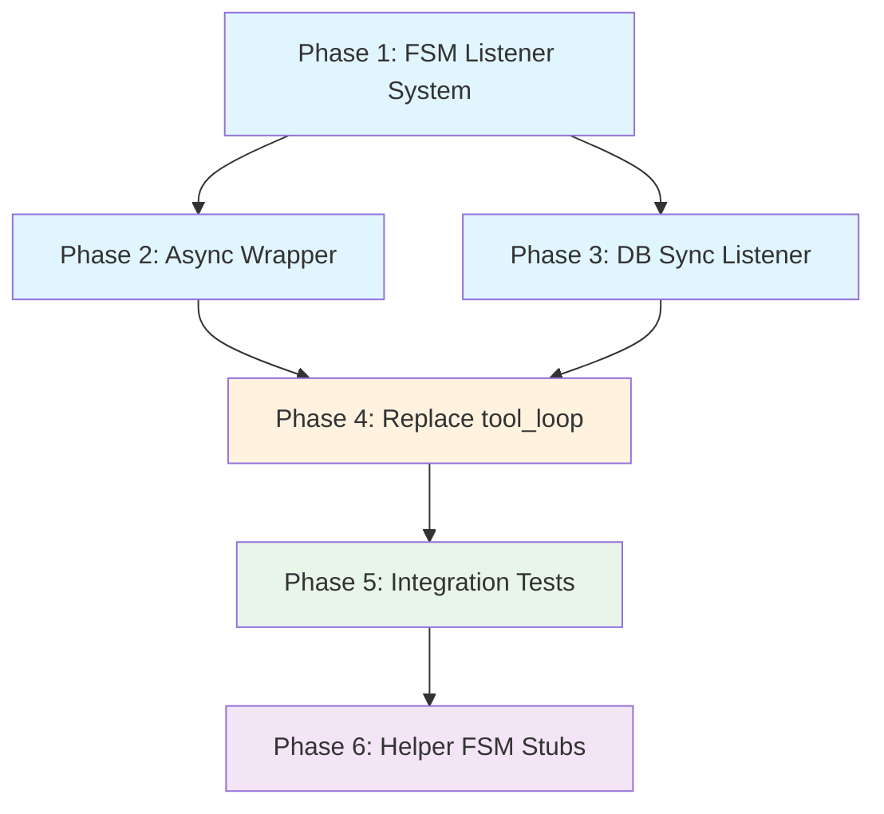

# FSM Tool Loop Integration - Grand Plan

## Overview

Replace the current monolithic async `tool_loop()` function with an FSM-driven architecture. The FSM becomes the source of truth for messages, with a listener system for DB synchronization and extensibility. Helper FSMs (todo_list, roles) will handle built-in tools via event interception.

## Current State

### Existing Implementation
- [`tool_loop()`](packages/rhd_chat/src/tools/tool_loop.rs:72) - 300+ line async function
- Manages messages via DB (`manager.db().get_messages()`, `manager.add_message_and_notify()`)
- Handles pause by checking `manager.get_stream_state()` and exiting loop
- Handles abort via `CancellationToken` checks at multiple points
- Special handling for built-in tools (`rhd_set_todo_list`, `rhd_set_role`)

### Existing FSM
- [`ToolLoopFsm`](packages/rhd_fsm/src/tool_loop_fsm/mod.rs:16) - Pure synchronous state machine
- States: `Idle`, `AwaitingAiResponse`, `AwaitingToolResults`, `Paused`, `Aborted`, `Completed`
- Inputs: `Run`, `ProvideAiResponse`, `ProvideToolResult`, `Pause`, `Resume`, `Abort`, message/tool management
- Actions: `SendToAi`, `ExecuteToolCall`, `Completed`, `Paused`, `Aborted`, `GenerateToolCallId`
- Unit tests exist in [`tests.rs`](packages/rhd_fsm/src/tool_loop_fsm/tests.rs:1)

## Requirements

### Functional Requirements

1. **FSM as Source of Truth**
   - All message mutations go through FSM
   - FSM maintains internal `messages: Vec<ChatMessage>`
   - DB synchronized via listener system

2. **Listener System**
   - Type: `Arc<dyn Fn(ToolLoopFsmEvent) + Send + Sync>`
   - Methods:
     - `add_listener(callback) -> ToolLoopCancelId(usize)`
     - `remove_listener(cancel_id: ToolLoopCancelId)`
   - Multiple listeners supported
   - Listeners called synchronously during FSM state transitions

3. **ToolLoopFsmEvent Enum**
   - `MessageInserted { message: ChatMessage }`
   - `MessageRemoved { message_id: i64 }`
   - `MessageReplaced { message_id: i64, new_message: ChatMessage }`
   - `AllMessagesReplaced { messages: Vec<ChatMessage> }`
   - `ToolCallRequested { tool_call: ToolCall, propagate: Arc<AtomicBool> }`
   - `ToolCallExecuted { tool_call: ToolCall, result: ToolResult }`
   - `AiResponseReceived { content: Option<String>, thinking_content: Option<String>, tool_calls: Vec<ToolCall> }`
   - `ToolCallIdGenerated { tool_call_id: String }`
   - `StateChanged { from: State, to: State }`

4. **Message ID Generation**
   - FSM constructor accepts initial `message_id_counter: i64`
   - `generate_message_id()` increments counter
   - `ToolCallIdGenerated` event emitted with new ID
   - DB listener updates its counter accordingly

5. **FSM Wrapping for Sharing**
   - Create `ToolLoopFsmInner` or similar wrapper
   - Wrap in `Arc<Mutex<ToolLoopFsm>>` or `Arc<RwLock<ToolLoopFsm>>`
   - Allow passing to helper FSMs (todo_list, roles)

6. **Event Interception**
   - `ToolCallRequested` event includes `propagate: Arc<AtomicBool>` (default `true`)
   - Helper FSMs can set `propagate` to `false` to prevent tool call propagation
   - FSM checks `propagate` after emitting event, skips `ExecuteToolCall` action if `false`

7. **Pause/Resume Integration**
   - FSM stays alive when paused
   - FSM emits `Paused` action
   - Async wrapper:
     - Detects `Paused` action
     - Waits on `pause_notify.notified()`
     - On resume, feeds `Resume` input to FSM
   - FSM does NOT track `pause_notify` internally

8. **Abort Integration**
   - Async wrapper monitors `CancellationToken`
   - When cancelled, feeds `Abort` input to FSM
   - FSM transitions to `Aborted` state, emits `Aborted` action
   - Async wrapper aborts current AI call (via cancel token) and tool executions

9. **Async Wrapper**
   - New function/struct that:
     - Creates `ToolLoopFsm` with initial messages from DB
     - Attaches DB sync listener
     - Attaches helper FSM listeners (todo_list, roles)
     - Loops:
       - Feeds inputs to FSM
       - Executes actions (AI calls, tool executions)
       - Monitors cancel token
       - Waits on pause_notify when paused
     - Returns when FSM reaches terminal state

10. **Built-in Tools via Helper FSMs**
    - `TodoListFsm` (future):
      - Listens to `ToolCallRequested` events
      - If tool is `rhd_set_todo_list`, sets `propagate = false`
      - Handles tool execution, emits results back to tool_loop_fsm
    - `RolesFsm` (future):
      - Listens to `ToolCallRequested` events
      - If tool is `rhd_set_role`, sets `propagate = false`
      - Handles role switching, emits system prompt injection events

11. **Logging**
    - Logging done outside FSM
    - Based on FSM events/actions
    - DB sync listener can also handle logging if needed

### Non-Functional Requirements

- **Testability**: FSM can be tested deterministically without async
- **Separation of Concerns**: FSM handles state, async wrapper handles I/O
- **Extensibility**: Listener system allows plugins, helper FSMs
- **Backward Compatibility**: Existing pause/resume/abort behavior preserved

### Out of Scope

- Plugin system implementation
- Changes to DB schema

## Architecture Decisions

| Decision | Choice | Rationale |
|----------|--------|-----------|
| State synchronization | FSM is source of truth | Enables future plugin system, avoids DB re-reads |
| Listener type | `Arc<dyn Fn(ToolLoopFsmEvent)>` | Simpler than trait, supports multiple listeners |
| Message ID generation | FSM generates, notifies via events | FSM is source of truth |
| Pause/resume | FSM stays alive, emits Paused action | Preserves FSM state, simpler than recreation |
| Abort | Async wrapper monitors token, feeds Abort | Keeps FSM synchronous |
| Built-in tools | Helper FSMs via listener system | Separation of concerns, extensible |
| Event interception | `propagate: Arc<AtomicBool>` | Allows listeners to intercept and handle events |
| FSM wrapping | `Arc<Mutex<ToolLoopFsm>>` or similar | Enables sharing with helper FSMs |

## Phase Dependency Graph

**Legend:**
- Blue: Core FSM enhancements
- Orange: Integration work
- Green: Testing
- Purple: Future extensibility

## Phases

### Phase 1: FSM Listener System

**Goal**: Add listener system and event enum to FSM to enable external synchronization and extensibility.

**Files to Modify**:
- `packages/rhd_fsm/src/tool_loop_fsm/mod.rs` - Add listener management methods
- `packages/rhd_fsm/src/tool_loop_fsm/event.rs` - New file: `ToolLoopFsmEvent` enum
- `packages/rhd_fsm/src/tool_loop_fsm/listener.rs` - New file: listener types and management
- `packages/rhd_fsm/src/tool_loop_fsm/state.rs` - Add `message_id_counter` field
- `packages/rhd_fsm/Cargo.toml` - Add `std::sync::atomic` if needed

**Key Changes**:
1. Define `ToolLoopFsmEvent` enum with all event variants
2. Add `listeners: Vec<(usize, Arc<dyn Fn(ToolLoopFsmEvent) + Send + Sync>)>` to FSM
3. Add `next_listener_id: usize` counter
4. Implement `add_listener()` and `remove_listener()` methods
5. Add `emit_event()` helper that calls all listeners
6. Modify state transitions to emit appropriate events
7. Add `message_id_counter: i64` field to FSM, accept in constructor
8. Modify `generate_message_id()` to use and increment counter, emit event

**Dependencies**: None (first phase)

**Success Criteria**:
- FSM can register and unregister listeners
- Listeners receive events for all state transitions and message mutations
- Message ID counter works correctly
- Existing unit tests still pass
- New unit tests for listener system pass

---

### Phase 2: Async Wrapper

**Goal**: Create async wrapper that drives FSM execution, handles AI calls, tool executions, pause/resume, and abort.

**Files to Create**:
- `packages/rhd_chat/src/tools/fsm_wrapper.rs` - New file: async wrapper implementation

**Files to Modify**:
- `packages/rhd_chat/src/tools/mod.rs` - Export new wrapper
- `packages/rhd_chat/Cargo.toml` - Add `rhd_fsm` dependency

**Key Changes**:
1. Create `FsmToolLoop` struct or function
2. Initialize FSM with messages from DB
3. Attach listeners (DB sync, helper FSMs - stubs for now)
4. Main loop:
   - Feed inputs to FSM
   - Process actions:
     - `SendToAi`: Call AI client, feed `ProvideAiResponse` back
     - `ExecuteToolCall`: Execute tool, feed `ProvideToolResult` back
     - `Paused`: Wait on `pause_notify`, feed `Resume` on wake
     - `Completed`/`Aborted`: Exit loop
   - Monitor `CancellationToken`, feed `Abort` when cancelled
5. Handle built-in tools (temporary: in wrapper, later: helper FSMs)
6. Return `ToolLoopResult` (Completed/Paused/Aborted)

**Dependencies**: Phase 1 (needs listener system)

**Success Criteria**:
- Wrapper can execute complete tool loop scenarios
- Pause/resume works correctly
- Abort works correctly
- Wrapper integrates with existing `ChatManager` state management
- Unit tests with mock AI client pass

---

### Phase 3: DB Sync Listener

**Goal**: Implement DB synchronization listener that keeps database in sync with FSM state.

**Files to Create**:
- `packages/rhd_chat/src/tools/db_sync_listener.rs` - New file: DB sync listener implementation

**Files to Modify**:
- `packages/rhd_chat/src/tools/mod.rs` - Export new listener
- `packages/rhd_chat/src/manager.rs` - Add method to get current message ID counter

**Key Changes**:
1. Create `create_db_sync_listener()` function
2. Listener handles:
   - `MessageInserted`: Add message to DB
   - `MessageRemoved`: Remove message from DB
   - `MessageReplaced`: Update message in DB
   - `AllMessagesReplaced`: Truncate and re-add all messages
   - `ToolCallIdGenerated`: Update DB counter (if needed)
3. Handle message ID mapping (FSM IDs vs DB IDs)
4. Ensure atomic updates for consistency

**Dependencies**: Phase 1 (needs listener system)

**Success Criteria**:
- DB stays in sync with FSM state
- Message IDs are correctly mapped
- Concurrent access handled correctly
- Unit tests for DB sync pass

---

### Phase 4: Replace tool_loop

**Goal**: Replace existing `tool_loop()` function with FSM-based implementation.

**Files to Modify**:
- `packages/rhd_chat/src/tools/tool_loop.rs` - Replace implementation
- `packages/rhd_chat/src/stream/send/tools.rs` - Update caller if needed

**Key Changes**:
1. Replace `tool_loop()` body with call to `FsmToolLoop`
2. Ensure all existing behavior preserved:
   - Streaming events
   - Logging
   - Error handling
   - Pause/resume
   - Abort
3. Remove old implementation code
4. Update function signature if needed (keep compatible)

**Dependencies**: Phase 2, Phase 3 (needs wrapper and DB sync)

**Success Criteria**:
- All existing tests pass
- Behavior identical to old implementation
- Code is simpler and more maintainable
- No regressions in pause/resume/abort

---

### Phase 5: Integration Tests

**Goal**: Add comprehensive integration tests for FSM-based tool loop, focusing on deterministic pause/resume/abort testing.

**Files to Create**:
- `packages/rhd_chat/src/tools/tests/fsm_integration_tests.rs` - New file: integration tests

**Files to Modify**:
- `packages/rhd_chat/src/tools/tests/mod.rs` - Include new test module

**Key Changes**:
1. Test complete tool loop scenarios with mock AI and MCP clients
2. Test pause during AI call
3. Test pause during tool execution
4. Test resume from pause
5. Test abort during AI call
6. Test abort during tool execution
7. Test multiple tool calls
8. Test built-in tool handling (when helper FSMs implemented)
9. Test DB synchronization
10. Test event interception

**Dependencies**: Phase 4 (needs replaced implementation)

**Success Criteria**:
- All pause/resume/abort scenarios tested deterministically
- Tests are fast and reliable
- Edge cases covered
- Test coverage > 80% for new code

---

### Phase 6: Helper FSMs Implementation

**Goal**: Implement full `TodoListFsm` and `RolesFsm` to handle built-in tools, moving logic from current implementation into these dedicated FSMs.

**Files to Create**:
- `packages/rhd_fsm/src/todo_list_fsm.rs` - New file: todo list FSM with full state management
- `packages/rhd_fsm/src/roles_fsm.rs` - New file: roles FSM with role switching logic
- `packages/rhd_chat/src/tools/builtin_fsms.rs` - New file: integration of helper FSMs

**Files to Modify**:
- `packages/rhd_fsm/src/lib.rs` - Export new FSMs
- `packages/rhd_chat/src/tools/mod.rs` - Export builtin FSMs
- `packages/rhd_chat/src/tools/builtin.rs` - Refactor to use FSMs instead of direct handlers
- `packages/rhd_chat/src/tools/tool_loop.rs` - Remove built-in tool handling from wrapper

**Key Changes**:
1. Implement `TodoListFsm` with complete state management:
   - Track current todo list state
   - Handle `rhd_set_todo_list` tool calls via event interception
   - Emit events for todo list updates
   - Manage todo list injection into conversation context
2. Implement `RolesFsm` with role switching logic:
   - Track active role state
   - Handle `rhd_set_role` tool calls via event interception
   - Emit events for role changes
   - Manage role system prompt injection
3. Implement listener methods for each FSM
4. Integrate with `FsmToolLoop` via listener system
5. Move built-in tool handling from async wrapper to helper FSMs
6. Use event interception with `propagate` flag to prevent tool call propagation
7. Update existing code to use new FSMs instead of direct handlers

**Dependencies**: Phase 5 (needs integration tests to verify)

**Success Criteria**:
- `TodoListFsm` fully manages todo list state and operations
- `RolesFsm` fully manages role switching and injection
- Built-in tools handled entirely by helper FSMs
- No built-in tool logic remains in async wrapper
- Unit tests for both helper FSMs pass
- Integration tests verify end-to-end functionality

## Success Criteria (Overall)

1. **Functional**:
   - Tool loop works identically to before
   - Pause/resume works correctly
   - Abort works correctly
   - DB stays in sync
   - Built-in tools work

2. **Non-Functional**:
   - Code is more maintainable
   - FSM is testable in isolation
   - Extensibility demonstrated
   - No performance regression

3. **Testing**:
   - All existing tests pass
   - New integration tests cover pause/resume/abort
   - Test coverage > 80% for new code

4. **Documentation**:
   - Architecture documented
   - Listener system documented
   - Helper FSM pattern documented

## Risks and Mitigations

| Risk | Impact | Mitigation |
|------|--------|------------|
| Performance regression from listener overhead | Medium | Profile and optimize listener calls |
| DB sync inconsistencies | High | Add comprehensive tests, use transactions |
| Breaking existing behavior | High | Keep old implementation until new one verified |
| Complexity in async wrapper | Medium | Keep wrapper simple, delegate to FSM |
| Helper FSM coordination issues | Medium | Start with stubs, iterate |

## Open Questions

None. All requirements clarified.

## Future Work

1. Implement full `TodoListFsm` with complete state management
2. Implement full `RolesFsm` with role switching logic
3. Add plugin system using listener pattern
4. Optimize listener performance if needed
5. Add metrics/monitoring for FSM state transitions
