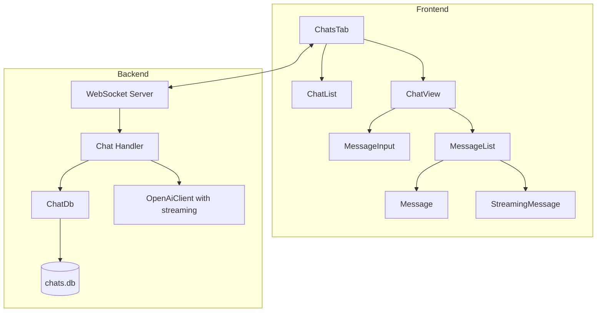
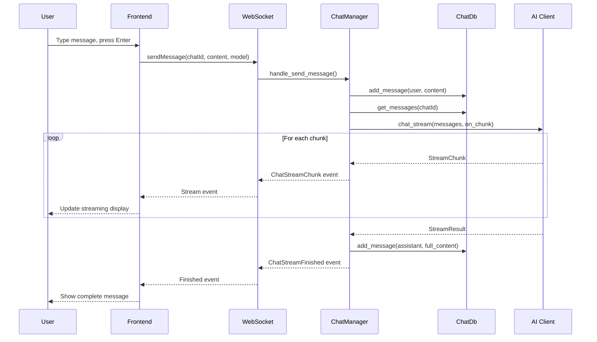
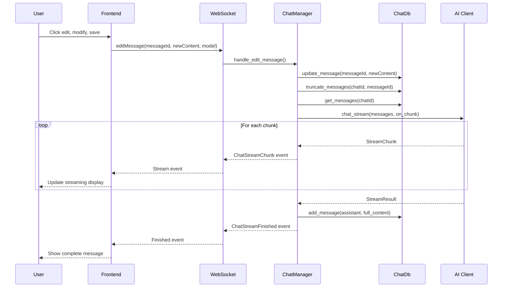

# Chat Feature Implementation Plan (Master)

## Overview

Implement persistent chat functionality where users can create chats, send messages to AI completions, and view streaming responses. All messages are persisted in SQLite database `rhd_db/chats.db`.

## Implementation Plans

This master plan is split into separate implementation plans covering distinct system parts:

1. [x] **[Chat Database Plan](../chat-db-plan.md)** — `ChatDb` in `rhd_db` crate for persistence
2. [ ] **[Chat AI Streaming Plan](../chat-ai-streaming-plan.md)** — Streaming support in `OpenAiClient`
3. [ ] **[Chat API Protocol Plan](../chat-api-protocol-plan.md)** — WebSocket protocol extensions
4. [ ] **[Chat Backend Plan](../chat-backend-plan.md)** — `ChatManager`, daemon integration, WS handlers
5. [ ] **[Chat Frontend Plan](../chat-frontend-plan.md)** — Svelte UI components and stores

## Dependency Graph

```
chat-db-plan ─────────────┐
                          ├─→ chat-backend-plan ─→ chat-frontend-plan
chat-ai-streaming-plan ───┤                              ↑
                          │                              │
chat-api-protocol-plan ───┴──────────────────────────────┘
```

Execute plans in order: DB → AI streaming → API protocol → Backend → Frontend.

## Architecture



## Database Schema (chats.db)

```sql
-- Chats table
CREATE TABLE chats (
    id INTEGER PRIMARY KEY AUTOINCREMENT,
    title TEXT NOT NULL,
    created_at TEXT NOT NULL,
    updated_at TEXT NOT NULL
);

-- Messages table
CREATE TABLE messages (
    id INTEGER PRIMARY KEY AUTOINCREMENT,
    chat_id INTEGER NOT NULL,
    role TEXT NOT NULL, -- 'user' or 'assistant'
    content TEXT NOT NULL,
    created_at TEXT NOT NULL,
    FOREIGN KEY (chat_id) REFERENCES chats(id) ON DELETE CASCADE
);

-- Index for faster message retrieval
CREATE INDEX idx_messages_chat_id ON messages(chat_id);
```

## Backend Implementation

### 1. Chat Database (`packages/rhd_db/src/chat_db.rs`)

New module in `rhd_db` crate:

```rust
pub struct ChatDb {
    conn: Mutex<Connection>,
}

impl ChatDb {
    pub fn new(path: &str) -> DbResult<Self>;
    
    // Chat operations
    pub fn create_chat(&self, title: &str) -> DbResult<i64>;
    pub fn list_chats(&self) -> DbResult<Vec<ChatInfo>>;
    pub fn get_chat(&self, id: i64) -> DbResult<Option<ChatInfo>>;
    pub fn delete_chat(&self, id: i64) -> DbResult<()>;
    pub fn update_chat_title(&self, id: i64, title: &str) -> DbResult<()>;
    
    // Message operations
    pub fn add_message(&self, chat_id: i64, role: &str, content: &str) -> DbResult<i64>;
    pub fn get_messages(&self, chat_id: i64) -> DbResult<Vec<Message>>;
    pub fn truncate_messages(&self, chat_id: i64, after_message_id: i64) -> DbResult<()>;
    pub fn update_message(&self, message_id: i64, content: &str) -> DbResult<()>;
}

pub struct ChatInfo {
    pub id: i64,
    pub title: String,
    pub created_at: String,
    pub updated_at: String,
}

pub struct Message {
    pub id: i64,
    pub chat_id: i64,
    pub role: String,
    pub content: String,
    pub created_at: String,
}
```

### 2. Streaming AI Client (`packages/rhd_ai/src/client.rs`)

Add streaming support to `OpenAiClient`:

```rust
// New method for streaming chat
pub async fn chat_stream<F>(
    &self,
    model: &str,
    messages: &[ChatMessage],
    on_chunk: F,
) -> Result<StreamResult, AiError>
where
    F: FnMut(StreamChunk) -> bool; // return false to abort

pub struct StreamChunk {
    pub content: Option<String>,
    pub finish_reason: Option<String>,
}

pub struct StreamResult {
    pub finish_reason: Option<String>,
    pub usage: Option<rhd_api::TokenUsage>,
}

// ChatMessage needs to be public and cloneable for building message history
pub enum ChatMessage {
    System { content: String },
    User { content: String },
    Assistant { content: Option<String>, tool_calls: Option<Vec<ToolCall>> },
    Tool { tool_call_id: String, content: String },
}
```

### 3. WebSocket Protocol Extensions (`packages/rhd_api/src/lib.rs`)

Add new request types:

```rust
pub enum WsRequest {
    // ... existing variants ...
    
    // Chat operations
    #[serde(rename = "createChat")]
    CreateChat { id: String, title: String },
    
    #[serde(rename = "listChats")]
    ListChats { id: String },
    
    #[serde(rename = "getChat")]
    GetChat { id: String, chat_id: i64 },
    
    #[serde(rename = "deleteChat")]
    DeleteChat { id: String, chat_id: i64 },
    
    #[serde(rename = "sendMessage")]
    SendMessage { 
        id: String, 
        chat_id: i64, 
        content: String,
        model: String,
    },
    
    #[serde(rename = "editMessage")]
    EditMessage { 
        id: String, 
        message_id: i64, 
        content: String,
        model: String,
    },
    
    #[serde(rename = "abortChat")]
    AbortChat { id: String, chat_id: i64 },
}
```

Add new event types for streaming:

```rust
pub enum WsEvent {
    // ... existing variants ...
    
    // Chat streaming events
    ChatStreamChunk {
        chat_id: i64,
        content: String,
    },
    
    ChatStreamFinished {
        chat_id: i64,
        message_id: i64,
        finish_reason: String,
    },
    
    ChatStreamError {
        chat_id: i64,
        error: String,
    },
}
```

### 4. Chat Handler (`packages/rhd_app/src/chat.rs`)

New module for chat operations:

```rust
pub struct ChatManager {
    db: Arc<ChatDb>,
    active_streams: Mutex<HashMap<i64, CancellationToken>>,
}

impl ChatManager {
    pub fn new(db: Arc<ChatDb>) -> Self;
    
    pub async fn send_message(
        &self,
        chat_id: i64,
        content: String,
        model: &str,
        models: &HashMap<String, ModelConfig>,
        event_sender: broadcast::Sender<ExecutionEvent>,
    ) -> Result<(), ChatError>;
    
    pub async fn edit_and_resend(
        &self,
        message_id: i64,
        new_content: String,
        model: &str,
        models: &HashMap<String, ModelConfig>,
        event_sender: broadcast::Sender<ExecutionEvent>,
    ) -> Result<(), ChatError>;
    
    pub fn abort_chat(&self, chat_id: i64);
}
```

### 5. Daemon Integration (`packages/rhd_app/src/daemon.rs`)

- Add `ChatDb` to `DaemonState`
- Initialize chat database at `rhd_db/chats.db`
- Pass `ChatManager` to WebSocket handler

### 6. WebSocket Handler Updates (`packages/rhd_app/src/ws.rs`)

- Add handlers for new chat-related requests
- Stream responses via broadcast channel
- Handle abort requests

## Frontend Implementation

### 1. Chat Stores (`frontend/src/lib/chatStores.js`)

```javascript
// Chat list store
export const chats = writable([]);

// Current chat store
export const currentChat = writable(null);

// Messages for current chat
export const messages = writable([]);

// Streaming state
export const streamingMessage = writable(null);
export const isStreaming = writable(false);
export const streamError = writable(null);
```

### 2. Chat WebSocket Functions (`frontend/src/lib/chatWs.js`)

```javascript
export async function createChat(title);
export async function listChats();
export async function getChat(chatId);
export async function deleteChat(chatId);
export async function sendMessage(chatId, content, model);
export async function editMessage(messageId, content, model);
export async function abortChat(chatId);
```

### 3. ChatsTab Component (`frontend/src/components/ChatsTab.svelte`)

Layout:
- Left sidebar: Chat list with "New Chat" button
- Main area: Chat view (when chat selected)

### 4. ChatList Component (`frontend/src/components/ChatList.svelte`)

- List of chats with title and timestamp
- "New Chat" button at top
- Delete button on each chat (with confirmation)
- Click to select chat

### 5. ChatView Component (`frontend/src/components/ChatView.svelte`)

- Header with chat title
- Message list (scrollable)
- Message input at bottom
- Model selector dropdown

### 6. MessageList Component (`frontend/src/components/MessageList.svelte`)

- Renders list of messages
- Shows streaming message when active
- Auto-scrolls to bottom on new content
- Edit button on user messages

### 7. Message Component (`frontend/src/components/Message.svelte`)

- Different styles for user/assistant messages
- Edit mode for user messages (textarea with save/cancel)
- Copy button for assistant messages
- Timestamp display

### 8. MessageInput Component (`frontend/src/components/MessageInput.svelte`)

- Textarea with auto-resize
- Enter to send, Shift+Enter for newline
- Send button (disabled when empty or streaming)
- Abort button when streaming
- Retry button on error

### 9. StreamingMessage Component (`frontend/src/components/StreamingMessage.svelte`)

- Shows partial content as it streams
- Loading indicator (spinner or dots)
- Error state with retry button
- Abort button

## Event Flow

### Send Message Flow



### Edit Message Flow



## File Changes Summary

### Backend (Rust)

| File | Change |
|------|--------|
| `packages/rhd_db/src/lib.rs` | Add `ChatDb` module export |
| `packages/rhd_db/src/chat_db.rs` | **NEW** - Chat database implementation |
| `packages/rhd_ai/src/client.rs` | Add streaming support, make `ChatMessage` public |
| `packages/rhd_api/src/lib.rs` | Add chat request/event types |
| `packages/rhd_app/src/daemon.rs` | Add `ChatDb` to state, initialize |
| `packages/rhd_app/src/ws.rs` | Add chat request handlers |
| `packages/rhd_app/src/chat.rs` | **NEW** - Chat manager with streaming |
| `packages/rhd_app/src/lib.rs` | Export chat module |

### Frontend (Svelte)

| File | Change |
|------|--------|
| `frontend/src/lib/chatStores.js` | **NEW** - Chat state stores |
| `frontend/src/lib/chatWs.js` | **NEW** - Chat WebSocket functions |
| `frontend/src/components/ChatsTab.svelte` | Replace placeholder with chat UI |
| `frontend/src/components/ChatList.svelte` | **NEW** - Chat list sidebar |
| `frontend/src/components/ChatView.svelte` | **NEW** - Main chat view |
| `frontend/src/components/MessageList.svelte` | **NEW** - Message list with streaming |
| `frontend/src/components/Message.svelte` | **NEW** - Individual message display |
| `frontend/src/components/MessageInput.svelte` | **NEW** - Input with send/abort |
| `frontend/src/components/StreamingMessage.svelte` | **NEW** - Streaming response display |

## Implementation Order

1. **Database Layer**
   - Create `ChatDb` in `rhd_db`
   - Add tests for chat operations

2. **AI Client Streaming**
   - Add streaming support to `OpenAiClient`
   - Make `ChatMessage` public and cloneable

3. **API Types**
   - Add chat request types to `rhd_api`
   - Add chat event types for streaming

4. **Backend Chat Manager**
   - Create `ChatManager` in `rhd_app`
   - Implement send/edit/abort operations
   - Integrate with daemon state

5. **WebSocket Handlers**
   - Add handlers for chat requests
   - Stream events to connected clients

6. **Frontend Stores**
   - Create chat stores
   - Create WebSocket functions

7. **Frontend Components**
   - Build ChatList component
   - Build ChatView with MessageList
   - Build MessageInput with keyboard handling
   - Build streaming display

8. **Integration & Testing**
   - End-to-end testing
   - Error handling verification
   - Abort functionality testing

## Risks & Mitigations

| Risk | Mitigation |
|------|------------|
| Streaming connection drops | Implement reconnection logic, show error state |
| Database corruption | Use WAL mode, proper error handling |
| Memory leak from active streams | Use CancellationToken, cleanup on disconnect |
| Large message history | Implement pagination if needed |
| Concurrent edits | Use database transactions, optimistic locking |

## Success Criteria

- [ ] Can create new chat
- [ ] Can delete chat
- [ ] Can send message and see streaming response
- [ ] Can abort streaming request
- [ ] Can edit message and resend (truncates chat)
- [ ] Can retry failed requests
- [ ] Messages persist across daemon restarts
- [ ] Error states display correctly
- [ ] UI is responsive during streaming

## Future Enhancements (Out of Scope)

- MCP tool support
- Chat export/import
- Search functionality
- Chat sharing
- Multiple model support per chat
- Token usage tracking per chat
