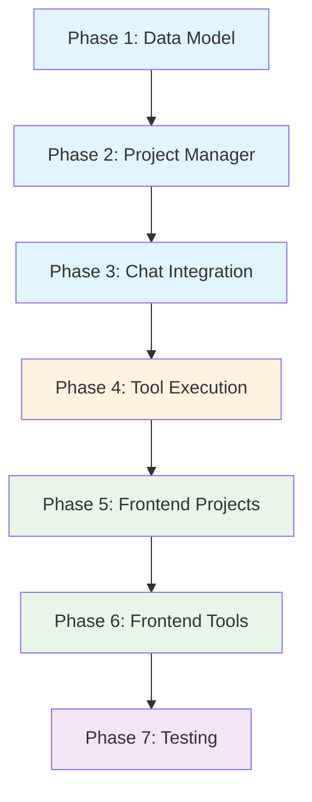

# Projects Feature Implementation Plan

## Overview

Add "projects" feature to RHD, allowing users to attach project contexts to chats. Each project provides MCP servers and system prompts that enhance AI conversations with tool capabilities.

## Architecture Summary

```
┌─────────────────────────────────────────────────────────────┐
│                        Frontend                              │
│  ┌──────────────┐  ┌──────────────┐  ┌──────────────────┐  │
│  │  Projects    │  │  Chat View   │  │  MCP Status      │  │
│  │  Panel       │  │  + Tools     │  │  Drawer          │  │
│  └──────────────┘  └──────────────┘  └──────────────────┘  │
└─────────────────────────────────────────────────────────────┘
                              │ WebSocket
                              ▼
┌─────────────────────────────────────────────────────────────┐
│                         Daemon                               │
│  ┌──────────────┐  ┌──────────────┐  ┌──────────────────┐  │
│  │  Project     │  │  Chat        │  │  MCP Server      │  │
│  │  Manager     │  │  Manager     │  │  Cache           │  │
│  └──────────────┘  └──────────────┘  └──────────────────┘  │
│  ┌──────────────┐  ┌──────────────┐                         │
│  │  Project     │  │  Chat DB     │                         │
│  │  Loader      │  │  (extended)  │                         │
│  └──────────────┘  └──────────────┘                         │
└─────────────────────────────────────────────────────────────┘
                              │
                              ▼
┌─────────────────────────────────────────────────────────────┐
│                      File System                             │
│  projects/                                                   │
│  ├── project-a/                                              │
│  │   ├── mcp.yaml         # MCP server configs              │
│  │   └── systemPrompt.md  # System prompt                   │
│  └── project-b/                                              │
│      ├── mcp.yaml                                            │
│      └── systemPrompt.md                                     │
└─────────────────────────────────────────────────────────────┘
```

---

## Phase 1: Project Data Model & Configuration

**Goal**: Define project structure, add configuration, implement loader.

### Subtasks

1.1. **Add `projectsDir` to DaemonConfig**
   - File: `packages/rhd_app/src/config.rs`
   - Add `projects_dir: PathBuf` field with default `"projects"`
   - Update `Default` impl
   - Test: Config parsing with/without projectsDir

1.2. **Define Project types**
   - File: `packages/rhd_api/src/lib.rs` (or new `packages/rhd_api/src/project.rs`)
   - Types:
     ```rust
     pub struct Project {
         pub name: String,
         pub path: PathBuf,
         pub mcp_configs: Vec<McpRef>,
         pub system_prompt: Option<String>,
     }
     
     pub struct McpRef {
         pub name: String,
         pub args: Option<Vec<String>>,
         pub env: Option<HashMap<String, String>>,
     }
     ```
   - Test: Serialization/deserialization

1.3. **Implement Project loader**
   - File: `packages/rhd_app/src/project_loader.rs` (new)
   - Functions:
     - `load_projects(projects_dir: &Path) -> Result<Vec<Project>>`
     - `load_project(project_dir: &Path) -> Result<Project>`
   - Parse `mcp.yaml` (same format as scenario MCP refs)
   - Read `systemPrompt.md` if exists
   - Test: Load valid project, handle missing files, invalid YAML

1.4. **Add CLI flag for projects directory**
   - File: `packages/rhd_app/src/cli.rs`
   - Add `--projects-dir` flag to daemon command
   - Test: CLI parsing

### Deliverables
- [ ] `projectsDir` config field
- [ ] `Project` struct with MCP configs and system prompt
- [ ] `load_projects()` function
- [ ] Unit tests for loader

---

## Phase 2: Project Manager & MCP Lifecycle

**Goal**: Manage project MCP servers, track status, provide API.

### Subtasks

2.1. **Create ProjectManager**
   - File: `packages/rhd_app/src/project_manager.rs` (new)
   - State:
     ```rust
     pub struct ProjectManager {
         projects: HashMap<String, Project>,
         mcp_clients: HashMap<String, Arc<McpClient>>,  // key: project_name:mcp_name
         mcp_status: HashMap<String, McpStatus>,         // key: project_name:mcp_name
     }
     
     pub enum McpStatus {
         Connecting,
         Connected,
         Failed(String),  // error message
     }
     ```
   - Methods:
     - `new(projects: Vec<Project>) -> Self`
     - `list_projects() -> Vec<ProjectInfo>`
     - `get_project(name: &str) -> Option<&Project>`
     - `get_mcp_status(project_name: &str) -> Vec<(String, McpStatus)>`
     - `spawn_project_mcp(project_name: &str) -> Result<()>`
     - `get_mcp_clients(project_name: &str) -> Vec<Arc<McpClient>>`

2.2. **MCP server spawning**
   - Reuse `McpServerCache` for client caching
   - Spawn servers when project is attached to chat
   - Track connection status (success/failure with error)
   - Handle server crashes (mark as failed)

2.3. **Add WebSocket API for projects**
   - File: `packages/rhd_api/src/lib.rs`
   - New requests:
     ```rust
     ListProjects { id: String }
     GetProjectMcpStatus { id: String, project_name: String }
     ```
   - New events:
     ```rust
     ProjectMcpStatusChanged { project_name: String, mcp_name: String, status: McpStatus }
     ```
   - File: `packages/rhd_app/src/ws.rs`
   - Handle new requests, emit status events

2.4. **Integrate with DaemonState**
   - File: `packages/rhd_app/src/daemon.rs`
   - Add `project_manager: Arc<ProjectManager>` to `DaemonState`
   - Initialize on daemon startup

### Deliverables
- [ ] `ProjectManager` with MCP lifecycle management
- [ ] MCP status tracking (connecting/connected/failed)
- [ ] WebSocket API for project operations
- [ ] Unit tests for ProjectManager

---

## Phase 3: Chat-Project Integration (Backend)

**Goal**: Attach projects to chats, manage system prompts, track state.

### Subtasks

3.1. **Extend Chat DB schema**
   - File: `packages/rhd_db/src/chat_db.rs`
   - New tables:
     ```sql
     CREATE TABLE chat_projects (
         chat_id INTEGER NOT NULL,
         project_name TEXT NOT NULL,
         system_prompt_added BOOLEAN NOT NULL DEFAULT 0,
         PRIMARY KEY (chat_id, project_name),
         FOREIGN KEY (chat_id) REFERENCES chats(id) ON DELETE CASCADE
     );
     ```
   - Methods:
     - `attach_project(chat_id, project_name)`
     - `detach_project(chat_id, project_name)`
     - `get_chat_projects(chat_id) -> Vec<(String, bool)>`  // (name, system_prompt_added)
     - `mark_system_prompt_added(chat_id, project_name)`

3.2. **Extend ChatManager**
   - File: `packages/rhd_app/src/chat.rs`
   - New methods:
     - `attach_project(chat_id, project_name, project_manager) -> Result<()>`
       - Spawn MCP servers if not already running
       - Add to DB
     - `detach_project(chat_id, project_name) -> Result<()>`
       - Remove from DB
       - (MCP servers stay alive until daemon shutdown)
     - `get_chat_projects(chat_id) -> Result<Vec<ProjectInfo>>`
   - Modify `send_message()`:
     - Check all attached projects' MCP servers are connected
     - If not, return error
     - For newly attached projects (system_prompt_added = false):
       - Add system prompt as system message
       - Mark as added
     - Build message history with project system prompts

3.3. **Add WebSocket API for chat-project operations**
   - File: `packages/rhd_api/src/lib.rs`
   - New requests:
     ```rust
     AttachProject { id: String, chat_id: i64, project_name: String }
     DetachProject { id: String, chat_id: i64, project_name: String }
     GetChatProjects { id: String, chat_id: i64 }
     ```
   - File: `packages/rhd_app/src/ws.rs`
   - Handle new requests

3.4. **Add chat events for project changes**
   - File: `packages/rhd_app/src/chat.rs`
   - New events:
     ```rust
     ProjectAttached { chat_id: i64, project_name: String }
     ProjectDetached { chat_id: i64, project_name: String }
     ```
   - Emit when projects attached/detached

### Deliverables
- [ ] DB schema for chat-project relationships
- [ ] `attach_project()` / `detach_project()` methods
- [ ] System prompt injection logic
- [ ] WebSocket API for chat-project operations
- [ ] Unit tests for DB operations
- [ ] Unit tests for ChatManager project methods

---

## Phase 4: Tool Execution in Chat

**Goal**: Enable AI to use tools from attached projects, implement control flow.

### Subtasks

4.1. **Extend ChatMessage for tool calls**
   - File: `packages/rhd_ai/src/client.rs`
   - Already has `Tool` variant and `tool_calls` in `Assistant`
   - Ensure proper serialization for DB storage

4.2. **Extend Chat DB for tool messages**
   - File: `packages/rhd_db/src/chat_db.rs`
   - Messages table already supports any role
   - Store tool calls as JSON in content field
   - Or add new columns: `tool_calls TEXT`, `tool_call_id TEXT`
   - Migration: add columns if not exist

4.3. **Implement tool execution loop in ChatManager**
   - File: `packages/rhd_app/src/chat.rs`
   - New method: `send_message_with_tools()`
   - Logic:
     1. Get attached projects' MCP clients
     2. Collect all tool definitions
     3. Loop:
        - Send request to AI with tools
        - If tool_calls in response:
          - Execute each tool
          - Add tool results to history
          - Continue loop
        - If no tool_calls:
          - Return final response
   - Emit events for tool calls and results

4.4. **Add cancel/pause/resume functionality**
   - File: `packages/rhd_app/src/chat.rs`
   - Extend `active_streams` to track state:
     ```rust
     enum StreamState {
         Running(CancellationToken),
         Paused { cancel_token: CancellationToken, resume_tx: oneshot::Sender<()> },
     }
     ```
   - New methods:
     - `cancel_chat(chat_id)` - abort immediately
     - `pause_chat(chat_id)` - wait for current tool call to complete, then pause
     - `resume_chat(chat_id)` - resume tool loop
   - New WebSocket requests:
     ```rust
     PauseChat { id: String, chat_id: i64 }
     ResumeChat { id: String, chat_id: i64 }
     ```

4.5. **Add chat events for tool execution**
   - File: `packages/rhd_app/src/chat.rs`
   - New events:
     ```rust
     ToolCallStarted { chat_id: i64, tool_call_id: String, tool_name: String, arguments: String }
     ToolCallCompleted { chat_id: i64, tool_call_id: String, result: String }
     ChatPaused { chat_id: i64 }
     ChatResumed { chat_id: i64 }
     ```

4.6. **Handle user message during pause**
   - When paused, user can send message
   - Message appended to history after current tool results
   - Resume tool loop with updated history
   - Modify `send_message()` to handle paused state

### Deliverables
- [ ] Tool execution loop in ChatManager
- [ ] Cancel/pause/resume functionality
- [ ] Tool call events
- [ ] User message during pause handling
- [ ] Unit tests for tool execution
- [ ] Unit tests for pause/resume

---

## Phase 5: Frontend - Project UI

**Goal**: Display projects, allow attachment, show MCP status.

### Subtasks

5.1. **Add project types to frontend**
   - File: `frontend/src/lib/types/index.ts`
   - Types:
     ```typescript
     interface Project {
       name: string;
       hasMcp: boolean;
       hasSystemPrompt: boolean;
     }
     
     interface McpStatus {
       projectName: string;
       mcpName: string;
       status: 'connecting' | 'connected' | 'failed';
       error?: string;
     }
     ```
   - File: `frontend/src/lib/types/ws.ts`
   - Add schemas for project events

5.2. **Add project stores**
   - File: `frontend/src/lib/projectStores.ts` (new)
   - Stores:
     - `projects: writable<Project[]>`
     - `mcpStatuses: writable<McpStatus[]>`
   - Functions:
     - `loadProjects()`
     - `loadMcpStatus(projectName)`
     - `handleMcpStatusEvent(event)`

5.3. **Create ProjectsPanel component**
   - File: `frontend/src/components/ProjectsPanel.svelte` (new)
   - Show list of available projects
   - Each project shows:
     - Name
     - Attach/detach button (context-aware based on current chat)
   - Integrate into ChatsTab sidebar or separate tab

5.4. **Create McpStatusDrawer component**
   - File: `frontend/src/components/McpStatusDrawer.svelte` (new)
   - Right-side drawer (toggleable)
   - Show attached projects list
   - For each project:
     - Project name
     - List of MCP servers with status dots (green/red)
     - Error message if failed
   - Toggle button in header

5.5. **Add project attachment to ChatView**
   - File: `frontend/src/components/ChatView.svelte`
   - Show attached projects in header
   - Button to open project selector
   - Disable send button if any MCP server not connected

5.6. **Add WebSocket handlers for projects**
   - File: `frontend/src/lib/chatWs.ts`
   - Functions:
     - `attachProject(chatId, projectName)`
     - `detachProject(chatId, projectName)`
     - `loadChatProjects(chatId)`
   - Handle project events

### Deliverables
- [ ] Project types and schemas
- [ ] Project stores
- [ ] ProjectsPanel component
- [ ] McpStatusDrawer component
- [ ] Project attachment UI in ChatView
- [ ] WebSocket handlers for projects

---

## Phase 6: Frontend - Chat Tool Execution UI

**Goal**: Display tool calls, implement control buttons.

### Subtasks

6.1. **Extend message types for tool calls**
   - File: `frontend/src/lib/types/index.ts`
   - Extend `ChatMessage`:
     ```typescript
     interface ChatMessage {
       id: number;
       role: 'user' | 'assistant' | 'system' | 'tool';
       content: string;
       toolCalls?: ToolCall[];
       toolCallId?: string;
     }
     
     interface ToolCall {
       id: string;
       name: string;
       arguments: string;
       result?: string;
     }
     ```

6.2. **Create ToolCallMessage component**
   - File: `frontend/src/components/ToolCallMessage.svelte` (new)
   - Display tool call with:
     - Tool name
     - Arguments (collapsible, formatted)
     - Result (collapsible, formatted)
     - Status indicator (running/completed/failed)

6.3. **Update MessageList for tool calls**
   - File: `frontend/src/components/MessageList.svelte`
   - Render tool call messages
   - Show tool calls inline with assistant messages
   - Group tool calls with their results

6.4. **Add control buttons to MessageInput**
   - File: `frontend/src/components/MessageInput.svelte`
   - Buttons:
     - Cancel (visible when streaming/tool loop running)
     - Pause (visible when tool loop running)
     - Resume (visible when paused)
   - Disable send when:
     - Streaming in progress
     - Any MCP server not connected
   - Enable send during pause (to guide AI)

6.5. **Add WebSocket handlers for tool events**
   - File: `frontend/src/lib/chatWs.ts`
   - Handle:
     - `toolCallStarted` - add pending tool call to message
     - `toolCallCompleted` - update tool call with result
     - `chatPaused` - update UI state
     - `chatResumed` - update UI state
   - Functions:
     - `cancelChat()`
     - `pauseChat()`
     - `resumeChat()`

6.6. **Update chat stores for tool execution**
   - File: `frontend/src/lib/chatStores.ts`
   - New stores:
     - `isPaused: writable<boolean>`
     - `pendingToolCalls: writable<ToolCall[]>`
   - Update `isStreaming` to include tool execution state

### Deliverables
- [ ] Extended message types
- [ ] ToolCallMessage component
- [ ] Tool calls in MessageList
- [ ] Control buttons (cancel/pause/resume)
- [ ] WebSocket handlers for tool events
- [ ] Updated chat stores

---

## Phase 7: Testing

**Goal**: Comprehensive test coverage for projects feature.

### Subtasks

7.1. **Unit tests for project loader**
   - File: `packages/rhd_app/src/project_loader.rs`
   - Tests:
     - Load valid project with mcp.yaml and systemPrompt.md
     - Load project with only mcp.yaml
     - Load project with only systemPrompt.md
     - Handle missing project directory
     - Handle invalid YAML
     - Handle empty mcp.yaml

7.2. **Unit tests for ProjectManager**
   - File: `packages/rhd_app/src/project_manager.rs`
   - Tests:
     - List projects
     - Get project by name
     - Spawn MCP servers
     - Track MCP status
     - Handle MCP spawn failure
     - Get MCP clients for project

7.3. **Unit tests for Chat DB extensions**
   - File: `packages/rhd_db/src/chat_db.rs`
   - Tests:
     - Attach/detach project
     - Get chat projects
     - Mark system prompt added
     - Cascade delete on chat delete

7.4. **Unit tests for ChatManager project methods**
   - File: `packages/rhd_app/src/chat.rs`
   - Tests:
     - Attach project spawns MCP
     - Detach project
     - System prompt injection
     - MCP status check before send

7.5. **Unit tests for tool execution**
   - File: `packages/rhd_app/src/chat.rs`
   - Tests:
     - Tool call loop
     - Cancel during tool execution
     - Pause/resume during tool execution
     - User message during pause

7.6. **E2E tests for project attachment**
   - File: `packages/rhd_test/src/project_test.rs` (new)
   - Tests:
     - List projects via WebSocket
     - Attach project to chat
     - Verify MCP servers started
     - Detach project

7.7. **E2E tests for tool execution in chat**
   - File: `packages/rhd_test/src/project_test.rs`
   - Tests:
     - Send message with tools
     - Verify tool calls executed
     - Verify tool results in messages
     - Cancel tool execution
     - Pause/resume tool execution

7.8. **Frontend E2E tests**
   - File: `frontend/src/tests/e2e/projects.test.ts` (new)
   - Tests:
     - Display projects panel
     - Attach/detach project
     - Show MCP status
     - Display tool calls in messages
     - Cancel/pause/resume buttons

### Deliverables
- [ ] Unit tests for project loader
- [ ] Unit tests for ProjectManager
- [ ] Unit tests for Chat DB extensions
- [ ] Unit tests for ChatManager
- [ ] Unit tests for tool execution
- [ ] E2E tests for project attachment
- [ ] E2E tests for tool execution
- [ ] Frontend E2E tests

---

## Implementation Order



**Legend**:
- Blue: Backend core
- Orange: Backend advanced
- Green: Frontend
- Purple: Testing

---

## Key Design Decisions

1. **MCP Server Lifecycle**: Servers spawned when project attached, killed on daemon shutdown (not on detach). This avoids restart overhead.

2. **System Prompt Injection**: Added as system messages on first send after attachment. Tracked per-project per-chat to avoid duplicates.

3. **Tool Execution State**: Separate from streaming state. Allows pause/resume without losing tool context.

4. **DB Schema**: Separate table for chat-project relationships. Allows tracking system prompt injection state.

5. **Frontend State**: Project stores separate from chat stores. MCP status tracked globally, filtered by chat context.

---

## Risk Mitigation

| Risk | Mitigation |
|------|------------|
| MCP server crashes | Track status, show error in UI, allow retry |
| Tool execution hangs | Cancel button always available |
| System prompt duplicates | Track injection state in DB |
| Large tool results | Truncate in UI, full content in DB |
| Multiple projects same tool | First match wins, log warning |

---

## Future Enhancements (Out of Scope)

- Project templates
- Project sharing/export
- MCP server auto-restart
- Tool result streaming
- Project-level model overrides
