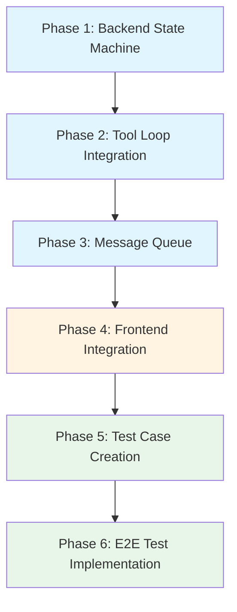

# Grand Plan: Fix Pause, Abort, Resume Functionality

## Overview

This plan addresses the broken pause/abort/resume implementation in the chat system. The current implementation has fundamental issues with state management, cancellation handling, and message queuing. This plan will fix the backend state machine, update the frontend to handle new states, and ensure comprehensive test coverage.

## Test Case Structure

All pause/abort related test cases will be stored in `tests/cases/pause-abort/` folder:

```
tests/cases/pause-abort/
├── pause-during-ai-call.md
├── pause-during-tool-execution.md
├── abort-during-ai-call.md
├── abort-during-tool-execution.md
└── message-queue-during-pause-abort.md
```

## Dependency Graph



**Legend:**
- Blue: Backend implementation (phases 1-3)
- Orange: Frontend integration (phase 4)
- Green: Testing (phases 5-6)

---

## Phase 1: Backend State Machine

### Goal
Redesign the `StreamState` enum to properly distinguish between running, paused, and aborted states, and track execution phase (AI call vs tool execution).

### Files to Modify

| File | Why |
|------|-----|
| [`packages/rhd_chat/src/state.rs`](packages/rhd_chat/src/state.rs) | Add `ExecutionPhase` enum, `Aborted` variant, and fields to track pending tool calls and aborted tool IDs |
| [`packages/rhd_chat/src/manager.rs`](packages/rhd_chat/src/manager.rs) | Update `pause_chat()`, `abort_chat()`, `resume_chat()` to use new state machine |

### Key Architectural Decisions

1. **Three-state model**: `Running`, `Paused`, `Aborted` (not just two)
2. **Execution phase tracking**: Distinguish between AI call phase and tool execution phase
3. **Pending tool calls storage**: When pausing during AI call, store tool calls without executing them
4. **Aborted tool tracking**: When aborting during tool execution, track which tools need error results

### Dependencies
- None (first phase)

### Success Criteria
- [ ] `StreamState` has three variants: `Running`, `Paused`, `Aborted`
- [ ] `ExecutionPhase` enum tracks `AiCall` vs `ToolExecution`
- [ ] `Paused` state can store pending tool calls
- [ ] `Aborted` state tracks which tool calls were interrupted
- [ ] State transitions compile and basic unit tests pass

---

## Phase 2: Tool Loop Integration

### Goal
Update the tool loop to respect pause/abort states at the correct points: after AI call completes, before tool execution, and during tool execution.

### Files to Modify

| File | Why |
|------|-----|
| [`packages/rhd_chat/src/tools/tool_loop.rs`](packages/rhd_chat/src/tools/tool_loop.rs) | Add pause checks after AI call, before tool execution, and during tool execution loop |
| [`packages/rhd_chat/src/manager.rs`](packages/rhd_chat/src/manager.rs) | Add helper methods: `get_stream_state()`, `is_aborted()`, `set_pending_tool_calls()` |
| [`packages/rhd_chat/src/stream.rs`](packages/rhd_chat/src/stream.rs) | Handle abort during streaming: discard partial response, emit event to remove streaming message |

### Key Architectural Decisions

1. **Pause check placement**: 
   - After AI call completes (before tool execution)
   - Before each tool execution
   - NOT at start of iteration (current broken behavior)

2. **Abort during AI call**: 
   - Cancel token immediately
   - Discard partial response
   - Do NOT save assistant message
   - Emit `StreamAborted` event to frontend

3. **Abort during tool execution**:
   - Cancel non-finished tools
   - Non-finished tools return "Aborted" error result
   - Finished tools keep their results
   - Pause tool loop after current batch

4. **Pause during AI call**:
   - Wait for AI to complete naturally
   - Store tool calls in `pending_tool_calls`
   - Do NOT execute tools yet
   - Exit tool loop, wait for resume

5. **Pause during tool execution**:
   - Wait for current tool calls to complete
   - Insert tool results into chat messages
   - THEN pause tool loop (do NOT continue to next iteration)
   - Exit tool loop, wait for resume

### Dependencies
- Phase 1 (state machine must be in place)

### Success Criteria
- [ ] Tool loop checks pause state after AI call
- [ ] Tool loop checks abort state before each tool
- [ ] Pause during AI call stores pending tool calls
- [ ] Abort during AI call discards partial response
- [ ] Abort during tool execution emits "Aborted" error for non-finished tools
- [ ] Pause during tool execution inserts results before pausing
- [ ] Tool loop exits cleanly on pause/abort

---

## Phase 3: Message Queue

### Goal
Implement message queuing for when chat is paused or aborted, allowing users to add messages that will be sent on resume.

### Files to Modify

| File | Why |
|------|-----|
| [`packages/rhd_chat/src/state.rs`](packages/rhd_chat/src/state.rs) | Add `MessageQueue` struct to store queued messages |
| [`packages/rhd_chat/src/manager.rs`](packages/rhd_chat/src/manager.rs) | Add `queue_message()`, `process_queued_messages()` methods |
| [`packages/rhd_api/src/ws.rs`](packages/rhd_api/src/ws.rs) | Add `QueueMessage` WebSocket request type |
| [`packages/rhd_app/src/ws/handlers/chat.rs`](packages/rhd_app/src/ws/handlers/chat.rs) | Add `handle_queue_message()` handler |

### Key Architectural Decisions

1. **Queue storage**: Store messages in `ChatManager` per chat_id
2. **Queue processing**: On resume, append queued messages to chat history, then trigger AI call
3. **Frontend notification**: Emit `MessageQueued` event so frontend can show queued indicator
4. **Queue persistence**: Messages are NOT persisted to DB until resume (in-memory only)

### Dependencies
- Phase 1 (state machine)
- Phase 2 (tool loop must handle pause/abort correctly)

### Success Criteria
- [ ] Messages can be queued when chat is paused/aborted
- [ ] Queued messages are stored in memory
- [ ] On resume, queued messages are appended to chat history
- [ ] AI call is triggered with full context (including queued messages)
- [ ] Frontend receives `MessageQueued` event

---

## Phase 4: Frontend Integration

### Goal
Update frontend to handle new pause/abort states, show appropriate UI, and support message queuing.

### Files to Modify

| File | Why |
|------|-----|
| [`frontend/src/lib/chatStores/index.ts`](frontend/src/lib/chatStores/index.ts) | Add `queuedMessages` store, update `isPaused` logic |
| [`frontend/src/lib/chatWs/operations.ts`](frontend/src/lib/chatWs/operations.ts) | Add `queueMessage()` operation, update `pauseChat()`, `abortChat()`, `resumeChat()` |
| [`frontend/src/lib/chatWs/handlers.ts`](frontend/src/lib/chatWs/handlers.ts) | Add handlers for `StreamAborted`, `MessageQueued` events |
| [`frontend/src/lib/components/MessageInput.svelte`](frontend/src/lib/components/MessageInput.svelte) | Allow input when paused/aborted, show queued indicator |
| [`frontend/src/lib/components/Message.svelte`](frontend/src/lib/components/Message.svelte) | Handle `StreamAborted` event to remove streaming message |

### Key Architectural Decisions

1. **State representation**:
   - `isPaused: boolean` — true when paused OR aborted
   - `isAborted: boolean` — true only when aborted (subset of isPaused)
   - `queuedMessages: Message[]` — messages waiting to be sent

2. **UI behavior**:
   - When paused/aborted: show Resume button, allow message input
   - Queued messages show "Queued" indicator
   - On abort during streaming: remove streaming message from UI

3. **Message flow**:
   - User sends message while paused → `queueMessage()` instead of `sendMessage()`
   - On resume → `processQueuedMessages()` sends all queued messages

### Dependencies
- Phase 3 (message queue must be implemented)

### Success Criteria
- [ ] Frontend shows pause/abort indicator
- [ ] User can input messages when paused/aborted
- [ ] Queued messages show "Queued" indicator
- [ ] On abort during streaming, streaming message is removed
- [ ] On resume, queued messages are sent
- [ ] UI tests pass for pause/abort/resume buttons

---

## Phase 5: Test Case Creation

### Goal
Create test case markdown files for all pause/abort scenarios based on the examples provided.

### Files to Create

| File | Why |
|------|-----|
| [`tests/cases/pause-abort/pause-during-ai-call.md`](tests/cases/pause-abort/pause-during-ai-call.md) | Test case for pausing during active AI chat call |
| [`tests/cases/pause-abort/pause-during-tool-execution.md`](tests/cases/pause-abort/pause-during-tool-execution.md) | Test case for pausing during tool execution |
| [`tests/cases/pause-abort/abort-during-ai-call.md`](tests/cases/pause-abort/abort-during-ai-call.md) | Test case for aborting during active AI chat call |
| [`tests/cases/pause-abort/abort-during-tool-execution.md`](tests/cases/pause-abort/abort-during-tool-execution.md) | Test case for aborting during tool execution |
| [`tests/cases/pause-abort/message-queue-during-pause-abort.md`](tests/cases/pause-abort/message-queue-during-pause-abort.md) | Test case for message queuing during pause/abort |

### Test Case Examples (from user)

#### Example 1: Pause During AI Call

**Scenario:**
1. There is active ai chat call, it still in thinking or in final message streaming state
2. User clicks pause
3. We wait until result from ai will be finished completely. If ai emit tool calls — they should be remembered, but not executed yet.
4. User can add one or multiple messages.
5. User clicks resume
6. If there is pending tool calls — they are executed, results provided to chat. Then added user messages are appended and ai chat request goes with it, continuing tool loop.

**Test Case Structure:**
```markdown
# Test Case: Pause During AI Call

## Description
User pauses chat while AI is in thinking or streaming state.

## Preconditions
- Chat exists and is selected
- AI chat call in progress (isStreaming = true, isPaused = false)
- AI is in thinking or final message streaming state

## Steps

### Pause Phase
1. User clicks Pause button
2. System dispatches `pauseChat` action
3. System sends pause request to daemon
4. Daemon waits for AI call to complete naturally
5. If AI emits tool calls, daemon stores them in pending_tool_calls
6. Daemon transitions to Paused state
7. System receives `chatPaused` action
8. System sets isPaused to true
9. System sets isStreaming to false

### Message Queue Phase
10. User types message in input field
11. User clicks Send button
12. System dispatches `queueMessage` action
13. System sends queue request to daemon
14. Daemon stores message in message queue
15. System receives `messageQueued` action
16. System adds message to queuedMessages store with "Queued" indicator

### Resume Phase
17. User clicks Resume button
18. System dispatches `resumeChat` action
19. System sends resume request to daemon
20. Daemon processes pending tool calls (if any)
21. Daemon executes tools, sends results to AI
22. Daemon processes queued messages
23. Daemon appends queued messages to chat history
24. Daemon sends AI chat request with full context
25. Daemon transitions to Running state
26. System receives `chatResumed` action
27. System sets isPaused to false
28. System sets isStreaming to true
29. System clears queuedMessages store

## Expected Results
- Pause: AI completes naturally, tool calls remembered but not executed
- Message queue: Messages stored with "Queued" indicator
- Resume: Pending tool calls executed, queued messages sent, tool loop continues

## Covered By

### E2E Tests
- [`chat-state.test.ts`](frontend/src/tests/e2e/chat-state.test.ts) - `pauses during AI call and resumes with pending tool calls` (steps 2-29)

### UI Tests
- [`MessageInput.test.ts`](frontend/src/tests/ui/MessageInput.test.ts) - `renders pause button when streaming` (step 1)
- [`MessageInput.test.ts`](frontend/src/tests/ui/MessageInput.test.ts) - `renders resume button when paused` (step 17)
- [`MessageInput.test.ts`](frontend/src/tests/ui/MessageInput.test.ts) - `allows message input when paused` (step 10)
```

#### Example 2: Pause During Tool Execution

**Scenario:**
1. There is finished ai chat call, which emitted tool calls, they are executing.
2. User clicks pause
3. We wait until tool calls results are available, tool loop is not continued
4. User can add one or multiple messages
5. User clicks resume
6. Tool results inserted in chat messages as usual, then user messages are appended and ai chat request goes with it, continuing tool loop

**Test Case Structure:**
```markdown
# Test Case: Pause During Tool Execution

## Description
User pauses chat while tool calls are executing.

## Preconditions
- Chat exists and is selected
- AI chat call completed with tool calls
- Tool calls are executing (isStreaming = true, isPaused = false)

## Steps

### Pause Phase
1. User clicks Pause button
2. System dispatches `pauseChat` action
3. System sends pause request to daemon
4. Daemon waits for current tool calls to complete
5. Daemon inserts tool results into chat messages
6. Daemon does NOT continue to next iteration
7. Daemon transitions to Paused state
8. System receives `chatPaused` action
9. System sets isPaused to true
10. System sets isStreaming to false

### Message Queue Phase
11. User types message in input field
12. User clicks Send button
13. System dispatches `queueMessage` action
14. System sends queue request to daemon
15. Daemon stores message in message queue
16. System receives `messageQueued` action
17. System adds message to queuedMessages store with "Queued" indicator

### Resume Phase
18. User clicks Resume button
19. System dispatches `resumeChat` action
20. System sends resume request to daemon
21. Daemon processes queued messages
22. Daemon appends queued messages to chat history
23. Daemon sends AI chat request with full context
24. Daemon transitions to Running state
25. System receives `chatResumed` action
26. System sets isPaused to false
27. System sets isStreaming to true
28. System clears queuedMessages store

## Expected Results
- Pause: Current tool calls complete, results inserted, tool loop paused
- Message queue: Messages stored with "Queued" indicator
- Resume: Queued messages sent, tool loop continues

## Covered By

### E2E Tests
- [`chat-state.test.ts`](frontend/src/tests/e2e/chat-state.test.ts) - `pauses during tool execution and resumes` (steps 2-28)

### UI Tests
- [`MessageInput.test.ts`](frontend/src/tests/ui/MessageInput.test.ts) - `renders pause button when streaming` (step 1)
- [`MessageInput.test.ts`](frontend/src/tests/ui/MessageInput.test.ts) - `renders resume button when paused` (step 18)
```

#### Example 3: Abort During AI Call

**Scenario:**
1. There is active ai chat call, it still in thinking or in final message streaming state
2. User clicks abort
3. We cancelling current request to ai chat. If it already emitted result with tool calls — they are not called.
3a. User does not see loading/streaming item of last ai call which cancelled
4. User can add one or multiple messages.
5. User clicks resume
6. In the messages there is no message with aborted ai call

**Test Case Structure:**
```markdown
# Test Case: Abort During AI Call

## Description
User aborts chat while AI is in thinking or streaming state.

## Preconditions
- Chat exists and is selected
- AI chat call in progress (isStreaming = true, isPaused = false)
- AI is in thinking or final message streaming state

## Steps

### Abort Phase
1. User clicks Abort button
2. System dispatches `abortChat` action
3. System sends abort request to daemon
4. Daemon cancels current AI request immediately
5. Daemon discards partial response
6. If AI emitted tool calls, daemon does NOT execute them
7. Daemon transitions to Aborted state
8. Daemon emits `streamAborted` event
9. System receives `streamAborted` action
10. System removes streaming message from UI
11. System sets isPaused to true
12. System sets isStreaming to false

### Message Queue Phase
13. User types message in input field
14. User clicks Send button
15. System dispatches `queueMessage` action
16. System sends queue request to daemon
17. Daemon stores message in message queue
18. System receives `messageQueued` action
19. System adds message to queuedMessages store with "Queued" indicator

### Resume Phase
20. User clicks Resume button
21. System dispatches `resumeChat` action
22. System sends resume request to daemon
23. Daemon processes queued messages
24. Daemon appends queued messages to chat history
25. Daemon sends AI chat request with full context
26. Daemon transitions to Running state
27. System receives `chatResumed` action
28. System sets isPaused to false
29. System sets isStreaming to true
30. System clears queuedMessages store

## Expected Results
- Abort: AI request cancelled, partial response discarded, no message saved
- Message queue: Messages stored with "Queued" indicator
- Resume: Queued messages sent, no aborted AI call in message history

## Covered By

### E2E Tests
- [`chat-state.test.ts`](frontend/src/tests/e2e/chat-state.test.ts) - `aborts during AI call and resumes without aborted message` (steps 2-30)

### UI Tests
- [`MessageInput.test.ts`](frontend/src/tests/ui/MessageInput.test.ts) - `renders abort button when streaming` (step 1)
- [`MessageInput.test.ts`](frontend/src/tests/ui/MessageInput.test.ts) - `renders resume button when paused` (step 20)
- [`Message.svelte`](frontend/src/lib/components/Message.svelte) - `removes streaming message on abort` (step 10)
```

#### Example 4: Abort During Tool Execution

**Scenario:**
1. There is finished ai chat call, which emitted tool calls, they are executing.
2. User clicks abort
3. We cancel execution of non-finished ai calls, they should respond with "Aborted" error, tool loop is paused
4. User can add one or multiple messages
5. User clicks resume
6. Result of finished tool calls before abort should have their result, aborted ones should respond with error "Aborted". Then user messages are aborted and tool loop continues

**Test Case Structure:**
```markdown
# Test Case: Abort During Tool Execution

## Description
User aborts chat while tool calls are executing.

## Preconditions
- Chat exists and is selected
- AI chat call completed with tool calls
- Tool calls are executing (isStreaming = true, isPaused = false)

## Steps

### Abort Phase
1. User clicks Abort button
2. System dispatches `abortChat` action
3. System sends abort request to daemon
4. Daemon cancels execution of non-finished tool calls
5. Non-finished tool calls return "Aborted" error result
6. Finished tool calls keep their results
7. Daemon inserts all tool results (finished + aborted) into chat messages
8. Daemon transitions to Aborted state
9. Daemon emits `toolCallAborted` events for non-finished tools
10. System receives `toolCallAborted` actions
11. System updates tool call UI to show "Aborted" error
12. System sets isPaused to true
13. System sets isStreaming to false

### Message Queue Phase
14. User types message in input field
15. User clicks Send button
16. System dispatches `queueMessage` action
17. System sends queue request to daemon
18. Daemon stores message in message queue
19. System receives `messageQueued` action
20. System adds message to queuedMessages store with "Queued" indicator

### Resume Phase
21. User clicks Resume button
22. System dispatches `resumeChat` action
23. System sends resume request to daemon
24. Daemon processes queued messages
25. Daemon appends queued messages to chat history
26. Daemon sends AI chat request with full context
27. Daemon transitions to Running state
28. System receives `chatResumed` action
29. System sets isPaused to false
30. System sets isStreaming to true
31. System clears queuedMessages store

## Expected Results
- Abort: Non-finished tools return "Aborted" error, finished tools keep results, all results inserted
- Message queue: Messages stored with "Queued" indicator
- Resume: Queued messages sent, tool loop continues

## Covered By

### E2E Tests
- [`chat-state.test.ts`](frontend/src/tests/e2e/chat-state.test.ts) - `aborts during tool execution and resumes with error results` (steps 2-31)

### UI Tests
- [`MessageInput.test.ts`](frontend/src/tests/ui/MessageInput.test.ts) - `renders abort button when streaming` (step 1)
- [`MessageInput.test.ts`](frontend/src/tests/ui/MessageInput.test.ts) - `renders resume button when paused` (step 21)
- [`ToolCall.test.ts`](frontend/src/tests/ui/ToolCall.test.ts) - `shows Aborted error for cancelled tool calls` (step 11)
```

#### Example 5: Message Queue During Pause/Abort

**Scenario:**
User can add messages while chat is paused or aborted. These messages should be queued and sent on resume.

**Test Case Structure:**
```markdown
# Test Case: Message Queue During Pause/Abort

## Description
User adds messages while chat is paused or aborted, messages are queued and sent on resume.

## Preconditions
- Chat exists and is selected
- Chat is paused or aborted (isPaused = true)

## Steps

### Queue First Message
1. User types first message in input field
2. User clicks Send button
3. System dispatches `queueMessage` action
4. System sends queue request to daemon
5. Daemon stores message in message queue
6. System receives `messageQueued` action
7. System adds message to queuedMessages store with "Queued" indicator

### Queue Second Message
8. User types second message in input field
9. User clicks Send button
10. System dispatches `queueMessage` action
11. System sends queue request to daemon
12. Daemon stores message in message queue
13. System receives `messageQueued` action
14. System adds message to queuedMessages store with "Queued" indicator

### Resume
15. User clicks Resume button
16. System dispatches `resumeChat` action
17. System sends resume request to daemon
18. Daemon processes queued messages in order
19. Daemon appends first queued message to chat history
20. Daemon appends second queued message to chat history
21. Daemon sends AI chat request with full context
22. Daemon transitions to Running state
23. System receives `chatResumed` action
24. System sets isPaused to false
25. System sets isStreaming to true
26. System clears queuedMessages store

## Expected Results
- Queue: Messages stored in order with "Queued" indicator
- Resume: Queued messages appended in order, AI call triggered with full context

## Covered By

### E2E Tests
- [`chat-state.test.ts`](frontend/src/tests/e2e/chat-state.test.ts) - `queues multiple messages during pause and sends on resume` (steps 3-26)

### UI Tests
- [`MessageInput.test.ts`](frontend/src/tests/ui/MessageInput.test.ts) - `allows message input when paused` (step 1)
- [`Message.test.ts`](frontend/src/tests/ui/Message.test.ts) - `shows Queued indicator for queued messages` (step 7)
```

### Dependencies
- Phase 4 (frontend must be updated to match new behavior)

### Success Criteria
- [ ] All 5 test case files created in `tests/cases/pause-abort/`
- [ ] Each test case has detailed steps matching the examples
- [ ] Each test case has "Covered By" section
- [ ] Step comments match established pattern from tests-grooming skill
- [ ] Old `chat-pause-resume.md` and `chat-abort.md` can be deprecated or updated

---

## Phase 6: E2E Test Implementation

### Goal
Implement comprehensive E2E tests for all pause/abort/resume scenarios, following the tests-grooming skill pattern.

### Files to Modify

| File | Why |
|------|-----|
| [`frontend/src/tests/e2e/chat-state.test.ts`](frontend/src/tests/e2e/chat-state.test.ts) | Add tests for all 4 pause/abort scenarios, message queuing |
| [`frontend/src/tests/ui/MessageInput.test.ts`](frontend/src/tests/ui/MessageInput.test.ts) | Add tests for pause/abort/resume buttons, message input when paused |
| [`frontend/src/tests/ui/Message.test.ts`](frontend/src/tests/ui/Message.test.ts) | Add tests for "Queued" indicator, streaming message removal on abort |
| [`frontend/src/tests/ui/ToolCall.test.ts`](frontend/src/tests/ui/ToolCall.test.ts) | Add tests for "Aborted" error display |
| [`tests/cases/pause-abort/*.md`](tests/cases/pause-abort/) | Update "Covered By" sections with actual test references |

### Key Architectural Decisions

1. **Test structure**: Follow tests-grooming skill pattern:
   - Range comment at start: `// Covers test-case.md steps X-Y`
   - Step comments before each action/assertion: `// Step N. Description`
   - Clear indication of UI vs state logic coverage

2. **Mock server enhancements**: May need to add mock server controls to:
   - Pause AI response mid-stream
   - Pause tool execution mid-call
   - Simulate abort during AI call
   - Simulate abort during tool execution

3. **Test scenarios**:
   - Pause during AI streaming → verify AI completes, tool calls pending
   - Pause during tool execution → verify current tools complete, results inserted, loop paused
   - Abort during AI streaming → verify AI cancelled, no message saved
   - Abort during tool execution → verify finished tools keep results, aborted get error, all results inserted
   - Message queuing during pause → verify messages sent on resume
   - Message queuing during abort → verify messages sent on resume

### Dependencies
- Phase 5 (test cases must be defined)

### Success Criteria
- [ ] All 4 pause/abort scenarios have E2E tests
- [ ] Message queuing has E2E tests
- [ ] All tests have step comments matching test case steps
- [ ] All test cases have updated "Covered By" sections
- [ ] All tests pass: `mise run test-frontend-e2e`
- [ ] Coverage matrix updated

---

## Overall Success Criteria

The entire grand plan is complete when:

1. **Backend**:
   - [ ] State machine correctly tracks Running/Paused/Aborted states
   - [ ] Tool loop respects pause/abort at correct points
   - [ ] Message queue stores and processes queued messages
   - [ ] All backend unit tests pass

2. **Frontend**:
   - [ ] UI shows correct indicators for pause/abort states
   - [ ] User can queue messages during pause/abort
   - [ ] Streaming message removed on abort
   - [ ] All frontend unit tests pass

3. **Testing**:
   - [ ] All 4 pause/abort scenarios have E2E tests
   - [ ] Message queuing has E2E tests
   - [ ] All test cases in `tests/cases/pause-abort/` have "Covered By" sections
   - [ ] All tests pass: `mise run test-frontend-e2e`
   - [ ] Coverage matrix shows 100% coverage for pause/abort/resume

4. **Documentation**:
   - [ ] Test cases reflect new behavior with detailed steps
   - [ ] Step comments match established pattern
   - [ ] No skipped tests (all `it.skip` removed or justified)

---

## Implementation Notes

### Parallelization Opportunities

- Phases 1-3 (backend) can be done sequentially by one developer
- Phase 4 (frontend) can start once Phase 3 is complete
- Phase 5 (test cases) can be done in parallel with Phase 4
- Phase 6 (E2E tests) must wait for Phase 5

### Risk Areas

1. **Race conditions**: Pause/abort during tool execution may have race conditions between tool completion and state change
2. **Message ordering**: Queued messages must be appended in correct order on resume
3. **Frontend state sync**: Frontend must stay in sync with backend state during pause/abort transitions

### Testing Strategy

- Unit tests for state machine transitions (Phase 1)
- Integration tests for tool loop pause/abort (Phase 2)
- Integration tests for message queue (Phase 3)
- UI tests for button rendering (Phase 4)
- E2E tests for full scenarios (Phase 6)
