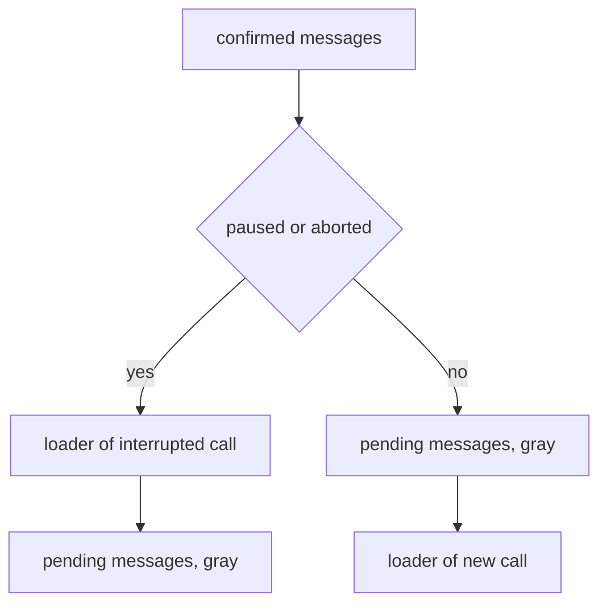

# Pause During AI Call — Pending Message Fix

## Goal

Fix three defects observed while stepping through the `Pause-Abort/PauseDuringAiCall` Storybook story:

1. **Wrong order after "click send (queue)"** — the not-yet-sent message renders *before* the pending AI call loader; it must render *after* the loader.
2. **Duplicated queued message** — the message is added twice: optimistically into `messages` by [`queueMessage()`](frontend/src/lib/chatWs/operations.ts:264) and again into `queuedMessages` by the `messageQueued` event. The "daemon response: messageQueued" step, its implementation and its test assertions must be removed; instead the single optimistic message is styled with a **gray background** to communicate "not yet part of the chat".
3. **Wrong final order after "daemon response: streamFinished"** — required order is:
   1. `Hello, can you help me?` (user)
   2. `AI response after resume` (assistant)
   3. `Please continue later` (pending, gray)
   4. loader of the next AI call

## Investigation Summary

### Current rendering

[`MessageList.svelte`](frontend/src/components/MessageList.svelte:36) renders in this fixed order:

```
$messages  →  StreamingMessage (loader)  →  $queuedMessages
```

### Root cause of defect 1

[`queueMessage()`](frontend/src/lib/chatWs/operations.ts:268) pushes an optimistic **plain user message** into `messages`. Because `messages` is rendered *before* the loader, the message appears above the loader. The `$queuedMessages` block placed after the loader stays empty at that moment, so the "loader before queued message" assertion in [`pause-during-ai-call.spec.ts`](frontend/tests/storybook/pause-during-ai-call.spec.ts:59) only passes later, after the separate `messageQueued` step populates `queuedMessages` — while the duplicate optimistic copy still sits above the loader.

### Root cause of defect 2

Two independent code paths represent the same user intent:

| Path | Store | Trigger |
|------|-------|---------|
| optimistic | `messages` | [`queueMessage()`](frontend/src/lib/chatWs/operations.ts:264) |
| daemon echo | `queuedMessages` | `messageQueued` in [`events.ts`](frontend/src/lib/chatWs/events.ts:345) |

Both are rendered, so the text appears twice.

### Root cause of defect 3

The loader is always rendered *between* `messages` and `queuedMessages`. After resume, the newly appended assistant message lands in `messages` (above the loader) and the pending message stays below the loader, producing `user → assistant → loader → pending` instead of the required `user → assistant → pending → loader`.

The loader has two distinct meanings, which the current markup cannot express:

- **while paused/aborted** — the loader belongs to the *interrupted* call, which the pending message is **not** part of → loader **before** pending.
- **after resume** — the loader belongs to a *new* call whose context **includes** the pending message → loader **after** pending.

This distinction is derivable from existing state: `$isPaused || $isAborted`.

## Design

### Single source of truth for not-yet-sent messages

Keep exactly **one** representation, held in a dedicated store rather than in `messages`, so it can be positioned independently of the loader and styled distinctly.

- Rename/repurpose `queuedMessages` → **`pendingMessages`** (type `QueuedMessage` reused; `status: 'queued'` retained to avoid touching the shared type).
- Populate it **optimistically** inside `queueMessage()`; roll back on request failure.
- Stop pushing the optimistic copy into `messages`.
- Remove the `messageQueued` event handling entirely (see "Scope of messageQueued removal").

### Ordering rule

```
$messages
  →  if (paused || aborted)  loader, then pending
  →  else                    pending, then loader
```



Walking the story with this rule:

| After step | State | Rendered order | Matches requirement |
|-----------|-------|----------------|---------------------|
| click send (queue) | paused | user, loader, **pending** | ✓ req 1 |
| chatResumed | streaming | user, **pending**, loader | ✓ |
| streamFinished | streaming | user, assistant, **pending**, loader | ✓ req 3 |

### Pending message lifetime

The pending message must remain visible (gray) after resume — requirement 3 shows it still present alongside the new loader. It is therefore **not** cleared on `chatResumed`. It is removed when the daemon confirms it, i.e. when `chatMessageAdded` arrives with `role === 'user'` and matching `content`; that real message enters `messages` and the gray copy is dropped. This keeps exactly one visible copy at all times.

### Styling

Replace the current "Queued" badge + `opacity: 0.8` with a gray background:

- Drop `.queued-badge` markup and the `opacity` rule in [`Message.svelte`](frontend/src/components/Message.svelte:176).
- Add a `.pending` background (e.g. `var(--color-bg-secondary, #f5f5f5)`) plus muted text colour, keeping the `user` margin so it still reads as a user message.
- Expose `data-pending="true"` alongside the existing `data-role`/`data-message-content` attributes for test targeting, per [locator guidance](memory/storybook.md:140).

Note: `data-role` for a pending message currently resolves to `"queued"`. Decide one convention and use it consistently in spec and component — recommended: `data-role="user"` + `data-pending="true"`, since it *is* a user message that simply is not committed yet. This is the one behavioural choice worth confirming before implementation.

### Scope of messageQueued removal

`messageQueued` is emitted by the backend ([`events.rs`](packages/rhd_app/src/ws/events.rs:147)) and consumed in several places. Removing only the story step would leave the duplicate bug alive, so the frontend handler is removed too, while the **backend event and its Zod schema are left intact** (removing the schema would make `ws.ts` log validation errors for a still-emitted event; the event simply becomes a no-op on the client).

Removals:
- `messageQueued` case in [`events.ts`](frontend/src/lib/chatWs/events.ts:345)
- `messageQueued` case in [`processors.ts`](frontend/src/lib/actions/processors.ts:96)
- `messageQueued` variant in [`actions/types.ts`](frontend/src/lib/actions/types.ts:28)

Kept: [`MessageQueuedEventSchema`](frontend/src/lib/types/ws.ts:242) and all Rust code.

Consequence: every place that drove state via `dispatch({ type: 'messageQueued' })` must instead rely on `queueMessage`'s optimistic insert. This affects five e2e tests in [`chat-state.test.ts`](frontend/src/tests/e2e/chat-state.test.ts:401) and the four other pause-abort test-case documents.

### Dead code cleanup

- `.queued-indicator` CSS in [`MessageInput.svelte`](frontend/src/components/MessageInput.svelte:266) has no corresponding markup — remove it, along with the now-unused `queuedMessages` import there.
- `QUEUED_INDICATOR` in [`testIds.ts`](frontend/src/stories/testIds.ts:7) is only referenced by a negative assertion — remove the constant and that assertion.
- The spec's `[data-queued-messages-count]` assertion ([line 91](frontend/tests/storybook/pause-during-ai-call.spec.ts:91)) targets an attribute that exists nowhere; it passes vacuously. Replace with a meaningful assertion.
- [`MessageInput.test.ts` "shows queued messages indicator"](frontend/src/tests/ui/MessageInput.test.ts:189) asserts text `2 messages queued` that no longer renders — this test is currently failing or asserting removed UI and must be deleted.
- [`Message.test.ts` "shows Queued indicator"](frontend/src/tests/ui/Message.test.ts:142) asserts the badge being removed — rewrite to assert the gray/pending styling instead.

## Implementation Steps

Test-first, per [the storybook-test skill](.agents/skills/storybook-test/SKILL.md).

### Phase 1 — Spec first

1. In [`pause-during-ai-call.spec.ts`](frontend/tests/storybook/pause-during-ai-call.spec.ts):
   - Delete the "daemon response: messageQueued" step click and its block; renumber subsequent `step-button-N` indices down by one (6→5, 7→6, 8→7, 9→8).
   - After "click send (queue)": assert the pending message is visible, gray, and positioned **below** the loader; assert exactly **one** element carries `data-message-content="Please continue later"`.
   - After `chatResumed`: assert pending still visible and now **above** the loader; drop the vacuous `[data-queued-messages-count]` assertion.
   - After `streamFinished`: assert the four-element order user → assistant → pending → loader via `boundingBox().y`.
   - Remove the `queued-indicator` negative assertion.
2. Run `cd frontend && npm run test-storybook -- --grep "pauses during AI call"` and confirm it fails for the expected reasons.

### Phase 2 — Stores and state

3. Rename `queuedMessages` → `pendingMessages` in [`chatStores.ts`](frontend/src/lib/chatStores.ts:18) and `resetAllStores`.
4. In [`queueMessage()`](frontend/src/lib/chatWs/operations.ts:264): insert into `pendingMessages` (id `pending-<timestamp>`, `status: 'queued'`) instead of `messages`; on failure remove that entry.
5. Remove the `messageQueued` handler, processor case and action variant.
6. In the `chatMessageAdded` handler, drop any `pendingMessages` entry whose `content` matches an incoming `role === 'user'` message.

### Phase 3 — Rendering and styling

7. In [`MessageList.svelte`](frontend/src/components/MessageList.svelte:52), implement the conditional loader/pending ordering rule; keep the loader condition `($isStreaming || $isPaused) && !$streamingMessageId` unchanged.
8. In [`Message.svelte`](frontend/src/components/Message.svelte:93): remove the badge, replace opacity with the gray background, add `data-pending`, and settle the `data-role` convention.
9. Remove `.queued-indicator` CSS and the unused import from `MessageInput.svelte`; remove `QUEUED_INDICATOR` from `testIds.ts`.

### Phase 4 — Story

10. In [`PauseDuringAiCall.stories.ts`](frontend/src/stories/pause-abort/PauseDuringAiCall.stories.ts:170): delete the "daemon response: messageQueued" step and its `queueMessage` mock-handler expectation of a follow-up event; update the `setupDefaultStores` reference to the renamed store; keep step-name/`state.step` numbering coherent after the deletion.

### Phase 5 — Iterate

11. Re-run the grepped storybook test until green, then visually confirm the three reported behaviours.

### Phase 6 — Dependent tests

12. Update the five `chat-state.test.ts` pause-abort tests: drop `dispatch({ type: 'messageQueued' })`, assert `pendingMessages` populated by `queueMessage` instead, and revise the "cleared on resume" expectations to the new lifetime (cleared on `chatMessageAdded` confirmation, not on `chatResumed`).
13. Delete the obsolete `MessageInput.test.ts` queued-indicator test; rewrite the `Message.test.ts` queued test to assert pending styling.

### Phase 7 — Documentation

14. Update the five [`tests/cases/pause-abort/*.md`](tests/cases/pause-abort/pause-during-ai-call.md) documents: remove the `messageQueued` receive step and the "clears queuedMessages store" step, describe the optimistic gray pending message and its confirmation-driven removal, and refresh the "Covered By" line numbers.
15. Add a short note to [`memory/frontend.md`](memory/frontend.md) describing the pending-message store, the ordering rule and the gray styling convention.

### Phase 8 — Validation

16. `cd frontend && npm run test-storybook` (full suite, watch for regressions in [`chatview.spec.ts`](frontend/tests/storybook/chatview.spec.ts)).
17. `mise run test-frontend-unit`, `mise run test-frontend-e2e`, `mise run check-svelte`.

## Files to Modify

| File | Change |
|------|--------|
| [`pause-during-ai-call.spec.ts`](frontend/tests/storybook/pause-during-ai-call.spec.ts) | assertions, step renumbering |
| [`PauseDuringAiCall.stories.ts`](frontend/src/stories/pause-abort/PauseDuringAiCall.stories.ts) | remove messageQueued step |
| [`chatStores.ts`](frontend/src/lib/chatStores.ts) | rename store |
| [`operations.ts`](frontend/src/lib/chatWs/operations.ts) | optimistic pending insert |
| [`events.ts`](frontend/src/lib/chatWs/events.ts) | remove handler, add confirmation cleanup |
| [`processors.ts`](frontend/src/lib/actions/processors.ts), [`actions/types.ts`](frontend/src/lib/actions/types.ts) | remove action |
| [`MessageList.svelte`](frontend/src/components/MessageList.svelte) | conditional ordering |
| [`Message.svelte`](frontend/src/components/Message.svelte) | gray styling, data attrs |
| [`MessageInput.svelte`](frontend/src/components/MessageInput.svelte), [`testIds.ts`](frontend/src/stories/testIds.ts) | dead code |
| [`chat-state.test.ts`](frontend/src/tests/e2e/chat-state.test.ts), [`MessageInput.test.ts`](frontend/src/tests/ui/MessageInput.test.ts), [`Message.test.ts`](frontend/src/tests/ui/Message.test.ts) | test updates |
| [`tests/cases/pause-abort/*.md`](tests/cases/pause-abort/pause-during-ai-call.md) (5 files) | step updates |
| [`memory/frontend.md`](memory/frontend.md) | document convention |

No Rust changes.

## Risks

- **Ripple beyond the story.** Removing `messageQueued` touches five e2e tests and five test-case documents. Confining the change to the story would leave the duplicate visible in the real app, so the wider edit is deliberate.
- **`data-role` convention change.** Switching pending messages from `data-role="queued"` to `data-role="user"` + `data-pending` may affect other selectors; a repo-wide grep for `data-role="queued"` is required before committing.
- **Pending lifetime depends on content matching.** Dropping the pending entry by matching `content` mirrors the existing temp-user-message reconciliation in `chatMessageAdded`, but two identical queued texts would collapse to one removal; acceptable, and matching the first occurrence only keeps it predictable.
- **Ordering rule relies on `isAborted`.** The abort story shares this markup; step 7 of the validation phase should confirm no regression in abort-related stories/tests.

## Success Criteria

- Only one `Please continue later` element exists at any point in the flow, rendered with a gray background.
- After "click send (queue)": order is user → loader → pending.
- After "daemon response: streamFinished": order is user → assistant → pending → loader.
- No "daemon response: messageQueued" step remains in the story, spec, or test-case documents.
- Full storybook suite, frontend unit tests, frontend e2e tests and `check-svelte` all pass.
