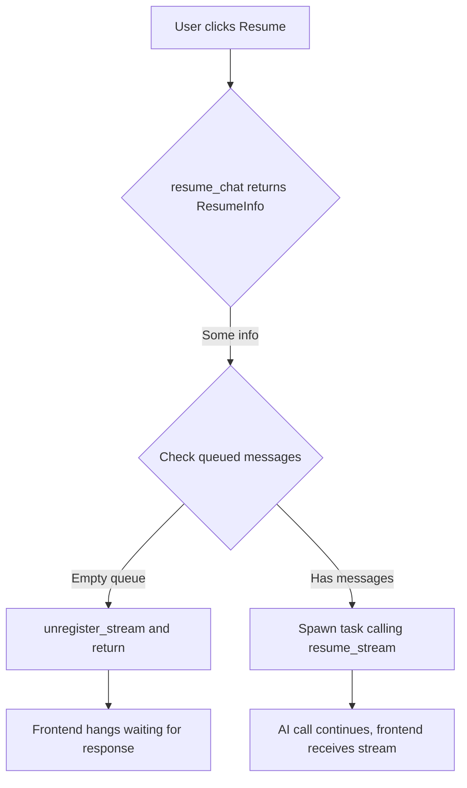

# Pause/Resume Immediate Hang Fix

## Problem Description

When pausing or aborting a chat and then immediately resuming (without queuing any messages), the system hangs. However, if a message is queued before resuming, it works correctly.

## Root Cause Analysis

The issue is in [`handle_resume_chat()`](packages/rhd_app/src/ws/handlers/chat.rs:184) in the WebSocket handler.

### Current Flow (Buggy)



**The Problem:**
- When resuming with an **empty queue**, the code calls `unregister_stream()` and returns immediately
- No AI call is made, no stream is started
- The frontend is left waiting for a response that never comes
- The state transitions to Running but there's no actual work happening

### Working Flow (With Queued Message)

When a message is queued:
1. `queued.is_empty()` is false
2. The code spawns a task that calls `resume_stream()`
3. `resume_stream()` registers a new stream and makes the AI call
4. The frontend receives the streaming response

## Solution

When resuming with an empty queue, we still need to call `resume_stream()` to continue the AI call with the existing message history. The AI should be called to generate a response based on the current conversation state.

### Fix Implementation

Modify [`handle_resume_chat()`](packages/rhd_app/src/ws/handlers/chat.rs:184) to always spawn a task calling `resume_stream()`, regardless of whether the queue is empty.

**Before:**
```rust
if queued.is_empty() {
    state.chat_manager.unregister_stream(chat_id).await;
    return WsResponse::success(id, serde_json::json!({ "resumed": true }));
}
```

**After:**
```rust
// Always spawn resume_stream task, even with empty queue
// The AI will be called with existing message history
```

## Files to Modify

1. [`packages/rhd_app/src/ws/handlers/chat.rs`](packages/rhd_app/src/ws/handlers/chat.rs:184) - Fix `handle_resume_chat()` to always call `resume_stream()`

## Testing

1. Test pause → immediate resume (no queued messages)
2. Test abort → immediate resume (no queued messages)
3. Test pause → queue message → resume (existing working flow)
4. Verify frontend receives proper streaming response in all cases
