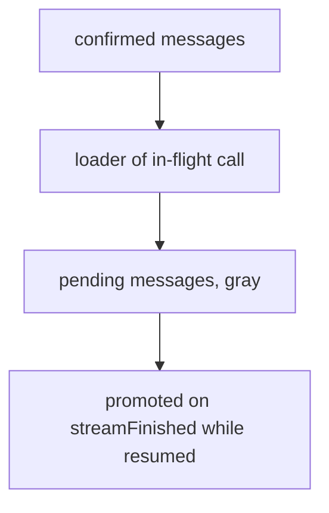

# Pending Message Ordering & Promotion Fix

Follow-up to [`pause-during-ai-call-pending-message-fix.md`](plans/pause-during-ai-call-pending-message-fix.md), which is now implemented. Two defects remain in the `Pause-Abort/PauseDuringAiCall` flow.

## Reported Issues

1. **After "click resume" the pending message jumps above the loader.**
   It must stay *below* the loader, because the interrupted AI call has not produced its result yet.
2. **After "daemon response: streamFinished" the order is right but the message is still gray.**
   At that point the previous AI response has arrived and the chat is resumed, so the queued message has been handed to the AI — it must render as a **regular message**, not a gray pending one.

## Root Cause Analysis

### Issue 1 — the ordering rule keys off the wrong signal

[`MessageList.svelte`](frontend/src/components/MessageList.svelte:55) currently switches order on `loaderBelongsToInterruptedCall = $isPaused || $isAborted`:

```
paused/aborted →  loader, then pending
otherwise      →  pending, then loader
```

`resumeChat()` optimistically sets `isPaused = false` / `isStreaming = true` ([`operations.ts`](frontend/src/lib/chatWs/operations.ts:253)), and `chatResumed` does the same ([`events.ts`](frontend/src/lib/chatWs/events.ts:323)). So the moment resume is clicked the flag flips and the pending message moves **above** the loader — exactly the reported jump.

The premise of the old rule was wrong. Resuming does not mean the visible loader now represents a new call that includes the pending message. The loader still represents the **interrupted** call, which must finish first. Per the test case, the daemon only drains the queue *after* the resumed call completes: <cite>Daemon processes pending tool calls → executes tools, sends results to AI → processes queued messages → appends queued messages to chat history</cite> ([`pause-during-ai-call.md`](tests/cases/pause-abort/pause-during-ai-call.md:36)). Backend `resume_chat` merely hands the preserved `message_queue` back to the resumed stream ([`manager.rs`](packages/rhd_chat/src/manager.rs:167)); the drain happens later in `process_queued_messages`.

**Therefore the ordering is unconditional: a not-yet-sent message always renders after the loader of the in-flight call.** The conditional branch can be deleted entirely, which also removes the `isAborted` coupling flagged as a risk in the previous plan.

### Issue 2 — nothing ever promotes a pending message

A pending entry is removed only when `chatMessageAdded` arrives with a matching `role === 'user'` ([`events.ts`](frontend/src/lib/chatWs/events.ts:89)). In the story no such event is emitted, so the entry stays in `pendingMessages` and keeps its gray `.pending` styling ([`Message.svelte`](frontend/src/components/Message.svelte:174)).

But `chatStreamFinished` is itself the signal that the interrupted call has ended. Once it fires **while the chat is resumed** (not paused/aborted), the daemon proceeds to drain the queue, so from the user's point of view the message is no longer "waiting to be sent" — it has been sent. There is currently no code path expressing that transition, so the message can never lose its gray state until a daemon echo arrives.

Note the story's step 8 is also mislabelled: named `daemon response: streamFinished`, it never dispatches `chatStreamFinished`. It appends the assistant message and re-arms `isStreaming` manually ([`PauseDuringAiCall.stories.ts`](frontend/src/stories/pause-abort/PauseDuringAiCall.stories.ts:204)). The story must dispatch the real action, or the promotion logic is never exercised.

## Design

### Ordering — unconditional

```
$messages  →  loader (if shown)  →  $pendingMessages
```



The loader condition `($isStreaming || $isPaused) && !$streamingMessageId` is unchanged.

### Promotion on `chatStreamFinished`

Extend the `chatStreamFinished` handler: if the chat is **not** paused and **not** aborted, every entry in `pendingMessages` is *promoted* — moved out of `pendingMessages` and appended to `messages` as a normal user message — then `pendingMessages` is cleared.

Promotion, not deletion: the text must stay visible and keep its position after the assistant message. Order within `messages` is append order, so a promoted message lands after the assistant response, satisfying `user → assistant → promoted → loader`.

Guard rationale:
- **paused/aborted** — the call ended without resuming; the message is still genuinely queued → stay gray.
- **resumed** — the daemon is draining the queue → promote.

Promoted messages need an id that will not collide and that the existing `chatMessageAdded` reconciliation can replace. That reconciliation matches a user message with a numeric id `> 1000000000000` and identical content ([`events.ts`](frontend/src/lib/chatWs/events.ts:112)), i.e. a `Date.now()`-style id. Using `Date.now()` (incremented per entry to keep ids unique) makes a later daemon echo overwrite the promoted message in place instead of duplicating it — preserving the "exactly one copy" invariant.

Because promotion already empties `pendingMessages`, the content-matching cleanup added to `chatMessageAdded` becomes a fallback for the paused-forever case. It stays.

### Resulting walkthrough

| After step | State | Rendered order | Pending styling |
|-----------|-------|----------------|-----------------|
| click send (queue) | paused | user, loader, pending | gray |
| click resume | resumed | user, loader, pending | gray (**fixes issue 1**) |
| chatResumed | resumed | user, loader, pending | gray |
| streamFinished | resumed, new stream | user, assistant, message, loader | regular (**fixes issue 2**) |

The required final order from the previous plan still holds; only the styling and the intermediate ordering change.

### Styling

No change to [`Message.svelte`](frontend/src/components/Message.svelte:174). A promoted message is an ordinary `ChatMessage` with `role: 'user'`, so it automatically renders with `.message.user` background (`var(--color-bg-active)`) and no `data-pending` attribute — the assertions can simply check that `data-pending` is absent.

## Implementation Steps

Test-first, per [the storybook-test skill](.agents/skills/storybook-test/SKILL.md).

### Phase 1 — Spec first

1. In [`pause-during-ai-call.spec.ts`](frontend/tests/storybook/pause-during-ai-call.spec.ts):
   - **Step 13 (after "click resume", line 78)** — add assertions that the pending message is still gray, still carries `data-pending="true"`, and its `y` is **greater** than the loader's.
   - **Step 15 (after `chatResumed`, line 87)** — invert the current ordering assertion at [line 103](frontend/tests/storybook/pause-during-ai-call.spec.ts:103): expect `pendingBox.y` **greater** than `loaderBox.y`.
   - **Step 17 (after `streamFinished`, line 109)** — retarget the locator from `[data-pending="true"]` to `[data-role="user"][data-message-content="Please continue later"]`; assert `data-pending` is absent, assert the background is **not** the gray `rgb(245, 245, 245)` (use the regular user background), and keep the four-element order check `user → assistant → message → loader`.
   - Keep every `toHaveCount(1)` invariant.
2. Run `cd frontend && npm run test-storybook -- --grep "pauses during AI call"` and confirm failures match the two reported defects.

### Phase 2 — Story correctness

3. In [`PauseDuringAiCall.stories.ts`](frontend/src/stories/pause-abort/PauseDuringAiCall.stories.ts:204), make step 8 dispatch the event it is named after: append the assistant message, then `dispatch({ type: 'chatStreamFinished' })`, then start the follow-up stream (`isStreaming = true`, `streamingMessageId = null`) to represent the new call for the promoted message. Assert in `waitFor` that `pendingMessages` is empty and `messages` contains the promoted user message.

### Phase 3 — Rendering

4. In [`MessageList.svelte`](frontend/src/components/MessageList.svelte:55), delete the `loaderBelongsToInterruptedCall` branch and render unconditionally: `$messages` → loader → `$pendingMessages`. Drop the now-unused `isAborted` import if nothing else uses it.

### Phase 4 — Promotion logic

5. In the `chatStreamFinished` case of [`events.ts`](frontend/src/lib/chatWs/events.ts:71): after the existing resets, if `!get(isPaused) && !get(isAborted)` and `pendingMessages` is non-empty, append each entry to `messages` as a user `ChatMessage` (unique `Date.now()`-based numeric id, `chatId` from `currentChatId`, `role: 'user'`, `content`, `createdAt` from `queuedAt`, `model` from the entry) and clear `pendingMessages`. Skip when there is no current chat.

### Phase 5 — Iterate

6. Re-run the grepped storybook test until green; confirm both reported behaviours visually.

### Phase 6 — Dependent tests

7. In [`chat-state.test.ts`](frontend/src/tests/e2e/chat-state.test.ts:401), extend the four pause/abort queue tests: after `chatResumed`, assert `pendingMessages` still populated; dispatch `chatStreamFinished` and assert the entry moved into `messages` as a user message with `pendingMessages` empty. For the **abort** tests, assert the opposite — `chatStreamFinished` while `isAborted` leaves the message gray in `pendingMessages`.
8. In the multi-message test ([line 735](frontend/src/tests/e2e/chat-state.test.ts:735)), assert both messages promote in queue order and that a subsequent `chatMessageAdded` echo does not duplicate them.

### Phase 7 — Documentation

9. Update the [`tests/cases/pause-abort/*.md`](tests/cases/pause-abort/pause-during-ai-call.md) documents: correct step 28 of `pause-during-ai-call.md` (pending stays **below** the loader after resume, not above), add the promotion step on stream finish, and refresh "Expected Results" plus "Covered By" line numbers.
10. Update [`memory/frontend.md`](memory/frontend.md) to record the unconditional ordering rule and the promote-on-`chatStreamFinished` lifecycle, superseding the conditional rule from the previous plan.

### Phase 8 — Validation

11. `cd frontend && npm run test-storybook` (full suite; watch the abort stories, which share this markup).
12. `mise run test-frontend-unit`, `mise run test-frontend-e2e`, `mise run check-svelte`.

## Files to Modify

| File | Change |
|------|--------|
| [`pause-during-ai-call.spec.ts`](frontend/tests/storybook/pause-during-ai-call.spec.ts) | ordering + promotion assertions |
| [`PauseDuringAiCall.stories.ts`](frontend/src/stories/pause-abort/PauseDuringAiCall.stories.ts) | dispatch real `chatStreamFinished` |
| [`MessageList.svelte`](frontend/src/components/MessageList.svelte) | unconditional ordering |
| [`events.ts`](frontend/src/lib/chatWs/events.ts) | promote pending on stream finish |
| [`chat-state.test.ts`](frontend/src/tests/e2e/chat-state.test.ts) | promotion / abort-stays-gray coverage |
| [`tests/cases/pause-abort/*.md`](tests/cases/pause-abort/pause-during-ai-call.md) | corrected steps |
| [`memory/frontend.md`](memory/frontend.md) | revised convention |

No changes to `Message.svelte`, stores, action types, or Rust.

## Risks

- **Double-render if the daemon echo arrives after promotion.** Mitigated by giving promoted messages `Date.now()`-style numeric ids so the existing `chatMessageAdded` reconciliation replaces them in place. Worth an explicit test (step 8).
- **`chatStreamFinished` can fire for a call unrelated to the queue.** The `!isPaused && !isAborted` guard means any finished stream while resumed promotes the queue. This matches the daemon's drain-after-resume behaviour, but if a stream finishes while messages were queued and the chat was *never* paused, `queueMessage` would have been rejected by the backend anyway (`message_queue_mut` returns `None` for `Running`), so `pendingMessages` is empty in practice.
- **Abort path shares the markup.** Removing the conditional branch changes abort rendering too; abort stories/tests are covered in Phase 8.
- **Promotion loses the "queued" provenance.** Once promoted, the message is indistinguishable from a normal user message; if provenance is ever needed for debugging, a `data-promoted` attribute could be added later. Not required by the reported issues.

## Success Criteria

- After "click resume" and after `chatResumed`: pending message is gray and renders **below** the loader.
- After `streamFinished`: order is user → assistant → message → loader, and the message renders as a **regular** user message with no `data-pending` attribute.
- Exactly one `Please continue later` element at every point in the flow.
- `chatStreamFinished` while aborted leaves the message gray and queued.
- Full storybook suite, frontend unit tests, frontend e2e tests and `check-svelte` all pass.
