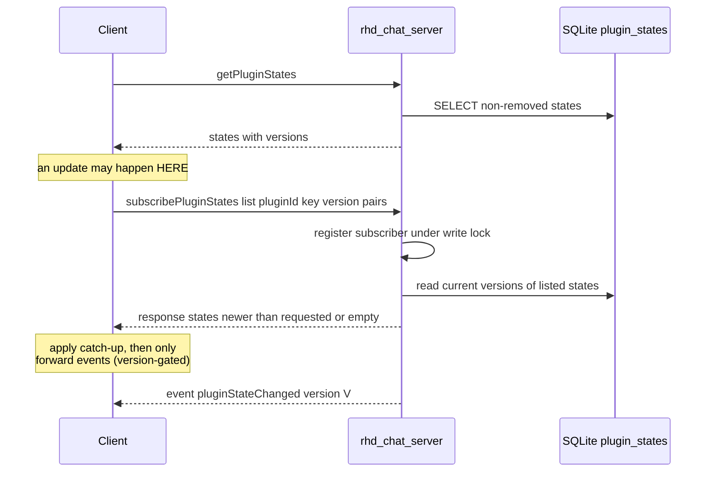

# Plugin State Exposure — Implementation Plan

> **Sub-plans** (split via plan-split, implement in order):
> [`phase-1-chat-api-state-types.md`](plugin-state/phase-1-chat-api-state-types.md) →
> [`phase-2-db-plugin-states.md`](plugin-state/phase-2-db-plugin-states.md) →
> [`phase-3-server-state-handlers.md`](plugin-state/phase-3-server-state-handlers.md) →
> [`phase-4-client-state-api.md`](plugin-state/phase-4-client-state-api.md) →
> [`phase-5-mcp-plugin-status-reporting.md`](plugin-state/phase-5-mcp-plugin-status-reporting.md) →
> [`phase-6-frontend-state-api-layer.md`](plugin-state/phase-6-frontend-state-api-layer.md) →
> [`phase-7-frontend-plugins-store-states.md`](plugin-state/phase-7-frontend-plugins-store-states.md) →
> [`phase-8-frontend-plugins-tab-states-ui.md`](plugin-state/phase-8-frontend-plugins-tab-states-ui.md) →
> [`phase-9-frontend-mcps-tab.md`](plugin-state/phase-9-frontend-mcps-tab.md) →
> [`phase-10-validation.md`](plugin-state/phase-10-validation.md) →
> [`phase-11-memory-docs.md`](plugin-state/phase-11-memory-docs.md)
>
> Where the sub-plans and this document disagree, the sub-plans win (they were
> enriched against the actual code after this plan was written). Notable
> refinement: `PluginState.updatedAt` is an opaque SQLite datetime **string**,
> not `DateTime<Utc>`.

## Goal

Allow plugins to expose structured state to other plugins and the frontend:

- A state is identified by `(pluginId, key)` — keys are namespaced per plugin (plugin A's `status` and plugin B's `status` are separate states).
- A state carries `content` (text), `format` (`markdown` | `json`), `schema` (free-form string identifying a well-known format + version, e.g. `mcpStatus:1`, `errors:1`), and a server-managed monotonic `version`.
- Protocol methods: **update** (upsert), **remove**, **get** (query with optional filters), **subscribe** to state changes (with versioned catch-up), **unsubscribe**.

Consumers:

1. `rhd_plugin_mcp` exposes `key: "status"`, `format: "json"`, `schema: "mcpStatus:1"` with per-MCP-server liveness/errors:
   ```json
   {"mcp":[{"id":"<id>","name":"<name>","status":"ok"|"error","error":"<optional message>"}]}
   ```
2. Frontend **Plugins tab**: each plugin entry shows its states in a collapsed-by-default section, reactive to `pluginStateChanged`/`pluginStateRemoved` events.
3. Frontend **MCPs tab**: appears only when at least one plugin exposes a state with `schema: "mcpStatus:1"`; renders parsed per-server statuses and errors.

## Confirmed Decisions (from user)

1. **Storage**: SQLite `plugin_states` table (persistent; survives server restart; kept when a plugin merely disconnects so the UI can show last-known state; FK `ON DELETE CASCADE` so `removePlugin` wipes states).
2. **MCP plugin startup**: switch from fail-fast to **best-effort** — a server that fails to spawn/initialize is reported as `"error"` in state instead of aborting the plugin.
3. **Subscription fan-out**: `subscribePluginStates` is unfiltered; the server broadcasts all state changes to subscribers; **consumers filter client-side** (by `schema`/`pluginId` in their callbacks).
4. **Versioning (review feedback)**: every state has a server-assigned `version`, starting at `1`, incremented on every update and on remove. `subscribePluginStates` accepts the versions the client already holds and atomically returns any newer state in its response — closing the get→subscribe race. `version: 0` means "I hold nothing; give me the current state at subscription time".

## Architecture

### Versioning model

- `version` is **server-managed** only: `updatePluginState` on a fresh `(pluginId, key)` assigns `1`; every subsequent update or remove increments it. Clients never supply a version when writing.
- **Remove is a tombstone**: the row stays with `is_removed = 1` and an incremented version. This keeps versions strictly monotonic per `(pluginId, key)` across delete/re-create cycles, so a client that applies "only newer versions win" can never wrongly discard a re-created state.
- Every event carries the version; consumers dedupe by ignoring events whose `version` is not greater than what they already hold.

**Race-free get-then-subscribe flow:**



The server registers the subscription **before** reading the catch-up snapshot, so any update that lands in between is either already reflected in the snapshot or will be delivered as an event. Duplicates are possible; version-gated application makes them harmless.

### Protocol (rhd_chat_api)

New shared types (`common.rs`):

```rust
#[serde(rename_all = "lowercase")] pub enum StateFormat { Markdown, Json }

pub struct PluginState {
    pub plugin_id: String,
    pub key: String,
    pub content: String,
    pub format: StateFormat,
    pub schema: String,
    pub version: i64,
    pub updated_at: DateTime<Utc>,
}

/// One entry of `subscribePluginStates` params.
pub struct StateVersionRef { pub plugin_id: String, pub key: String, pub version: i64 }
```

New methods (one file each under `methods/`, mirroring `add_tools.rs`):

| Method | Params | Result | Notes |
|---|---|---|---|
| `updatePluginState` | `{ key, content, format, schema }` | `{ state: PluginState }` (with assigned version) | Upsert `(pluginId, key)`; pluginId resolved from the connection's registry entry (same pattern as `addTools` in `handlers/mod.rs`); error if connection has no registered plugin |
| `removePluginState` | `{ key }` | `{}` | Tombstone + version bump; no-op if state never existed |
| `getPluginStates` | `{ pluginId?, schema? }` | `{ states: [PluginState] }` | Non-removed only; readable by any connection (like `getPlugins`) |
| `subscribePluginStates` | `{ states: [StateVersionRef] }` (empty list = subscribe without catch-up) | `{ states: [PluginState] }` | Registers subscriber, then returns current non-removed state for each ref whose stored `version >` requested (`version: 0` ⇒ always returned if present) |
| `unsubscribePluginStates` | `{}` | `{}` | Removes connection from the subscriber set |

New events (one file each under `events/`, mirroring `plugin_registered.rs`):

- `pluginStateChanged` → `{ state: PluginState }` (includes `version`)
- `pluginStateRemoved` → `{ pluginId, key, version }`

Broadcast to the plugin-states subscriber set only. State changes do **not** bump chat versions (states are global, not chat-scoped).

### Persistence (rhd_db)

New `chat_db/plugin_states.rs` + table in `schema.rs`:

```sql
CREATE TABLE IF NOT EXISTS plugin_states (
    plugin_id  TEXT NOT NULL,
    key        TEXT NOT NULL,
    content    TEXT NOT NULL DEFAULT '',
    format     TEXT NOT NULL DEFAULT 'json' CHECK (format IN ('markdown','json')),
    schema     TEXT NOT NULL DEFAULT '',
    version    INTEGER NOT NULL DEFAULT 1,
    is_removed INTEGER NOT NULL DEFAULT 0,
    updated_at TEXT NOT NULL DEFAULT (datetime('now')),
    PRIMARY KEY (plugin_id, key),
    FOREIGN KEY (plugin_id) REFERENCES plugins(plugin_id) ON DELETE CASCADE
);
CREATE INDEX IF NOT EXISTS idx_plugin_states_schema ON plugin_states(schema);
```

Functions:

- `upsert_plugin_state(...)` — `INSERT ... ON CONFLICT(plugin_id, key) DO UPDATE SET content/excluded, format, schema, version = version + 1, is_removed = 0, updated_at = ...`; returns stored row (new version). Fresh insert ⇒ `version = 1`.
- `remove_plugin_state(plugin_id, key)` — `UPDATE ... SET is_removed = 1, version = version + 1` returning the new version (`None` if no row ⇒ handler skips broadcast).
- `get_plugin_states(plugin_id: Option<&str>, schema: Option<&str>)` — `WHERE is_removed = 0` + filters.
- `get_plugin_state_versions(refs)` (or reuse `get_plugin_states` per ref) — raw rows incl. tombstones for the subscribe catch-up comparison.

`ChatDb` wrapper methods in `chat_db/mod.rs`. `remove_plugin` unchanged (cascade). Deactivation on disconnect intentionally preserves rows.

### Server (rhd_chat_server)

- `subscriptions.rs`: add `plugin_states_subscribers: HashSet<ConnectionId>` + `subscribe_plugin_states` / `unsubscribe_plugin_states` / `broadcast_to_plugin_states`; cleanup in `unregister_connection`.
- New `handlers/plugin_state.rs` (keeps `handlers/plugin.rs` under the 500-line budget) with the 5 handlers:
  - update/remove resolve plugin_id from `plugin_registry` (error `Connection has no registered plugin` otherwise, same as `ackCustomEvent`), write DB, then broadcast.
  - subscribe: take `subscription_manager.write()` and register the connection, release, then read catch-up states from DB and respond. (Register-then-read guarantees no missed updates; see race flow above.)
- `handlers/mod.rs`: route the 5 methods.

### Client (rhd_chat_client)

- `client.rs`: typed `update_plugin_state` / `remove_plugin_state` / `get_plugin_states` / `subscribe_plugin_states` / `unsubscribe_plugin_states` via `send_request`.
- `event_stream.rs`: add `PluginStateEvent` + subscription entry (mirror `CustomEventSubscription`); `dispatch_event` in `client.rs` dispatches `pluginStateChanged`/`pluginStateRemoved` to all state subscribers via `tokio::spawn` (never block the read task — see memory/development.md).
- Convenience `on_plugin_state_events(callback)` returning a `CancellationToken`, matching `on_custom_event`.

### MCP plugin (plugins/rhd_plugin_mcp)

- `McpPool::startup` becomes best-effort: returns `(pool, Vec<ServerStartupReport>)` — per configured server either `ok` (spawned + tools listed) or `error` with message. Routes/chat_tools only for healthy servers. The plugin **never exits** due to a server startup failure; if all servers fail it still runs and reports (config load errors remain fatal — those are not per-server).
- New `status.rs` module: `ServerStatus { id, name, status: ok|error, error: Option<String> }` map in `Arc<Mutex<..>>` + `fn mcp_status_payload_json(...)` producing the `mcpStatus:1` content; keeps `last_pushed` to skip no-op pushes (server still assigns versions; dedup only saves traffic).
- Reporting points (event-driven, no polling):
  1. After startup — initial state push.
  2. On tool-call failure routed to a specific server (`tool_handler` marks that server `error` with the failure message; a later success flips it back to `ok`).
  3. Push via `client.update_plugin_state(key="status", format=Json, schema="mcpStatus:1", content=...)` whenever the map changes.
- `run_plugin`: connect/register **before** pool startup so state can be pushed even if all servers fail; keep fail-fast only for connect/register/config errors.
- Update `plugins/rhd_plugin_mcp/README.md` (startup behavior change + state reporting).

### Frontend

- `schemas.ts`: `PluginStateFormatSchema` (`z.enum(['markdown','json'])`), `PluginStateSchema` (incl. `version`), `GetPluginStatesResultSchema`, `SubscribePluginStatesResultSchema`, `PluginStateChangedDataSchema`, `PluginStateRemovedDataSchema`, plus `McpStatusEntrySchema`/`McpStatusPayloadSchema` for the `mcpStatus:1` content.
- `chatApiImpl.ts`: `subscribePluginStates(refs)`, `getPluginStates()`, `onPluginStateEvents({onPluginStateChanged,onPluginStateRemoved})` (cleanup-function pattern like `onPluginListEvents`).
- `PluginsStore.ts`: public observable `_states: PluginState[]`;
  - `init()` flow: `getPluginStates()` → `subscribePluginStates(refs from snapshot)` → apply catch-up response → register event handlers.
  - Event handlers are **version-gated**: apply `pluginStateChanged` only if `state.version >` held version (or absent); `pluginStateRemoved` only if `version >` held; `pluginRemoved` drops that plugin's states.
  - Getters: `statesFor(pluginId)`, `statesWithSchema(schema)`, `hasMcpStatus` (any state with `schema === 'mcpStatus:1'`).
- `PluginList.svelte`: per plugin, a collapsed-by-default `<details>` "State (n)" section; each state row shows `key`, format + schema badges, `v{version}`, and content rendered with `marked` for `markdown` or pretty-printed `<pre>` for `json` (parse-guarded); states of inactive plugins marked "last known".
- `TabView.svelte`: `TabType` gains `'mcps'`; tab button rendered only when `showMcps` prop is true (from `pluginsStore.hasMcpStatus`).
- New `McpStatusList.svelte`: for every `mcpStatus:1` state (grouped by plugin), parse content and render per-server rows: name, id, ok/error status dot, error message when present; tolerate parse failures with a fallback raw view.
- `App.svelte`: wire `showMcps` + render `McpStatusList` for the new tab.

## Implementation Steps

### Phase 1 — rhd_chat_api: types, methods, events
1. `common.rs`: `StateFormat`, `PluginState` (with `version`), `StateVersionRef` (+ camelCase serialization tests).
2. `methods/`: `update_plugin_state.rs` (result returns stored `state`), `remove_plugin_state.rs`, `get_plugin_states.rs`, `subscribe_plugin_states.rs` (params `states: Vec<StateVersionRef>`, result `states: Vec<PluginState>`), `unsubscribe_plugin_states.rs`; export from `methods/mod.rs` and `lib.rs`.
3. `events/`: `plugin_state_changed.rs`, `plugin_state_removed.rs` (with `version`); export from `events/mod.rs`/`lib.rs`.
4. `mise run check-cargo` + `cargo test -p rhd_chat_api`.

### Phase 2 — rhd_db: persistence
1. `schema.rs`: create `plugin_states` table (version + `is_removed` tombstone) + index.
2. `chat_db/plugin_states.rs`: upsert (version bump, un-tombstone), remove (tombstone + bump), filtered get, version lookup for catch-up; `PluginStateRow` type.
3. `chat_db/mod.rs`: `mod plugin_states;` + `ChatDb` methods.
4. Tests in `chat_db/tests/`: first insert ⇒ version 1; update increments; remove increments and hides from get; re-create after remove continues monotonic (v3 → removed v4 → re-created v5); per-plugin key isolation; filters; cascade on `remove_plugin`; states survive `deactivate_plugin`.

### Phase 3 — rhd_chat_server: handlers + broadcast
1. `subscriptions.rs`: states subscriber set + broadcast + cleanup (+ unit tests mirroring plugins-list ones).
2. `handlers/plugin_state.rs`: 5 handlers; update/remove resolve plugin_id from registry; subscribe registers under write lock **before** snapshot read; broadcasts after DB writes.
3. `handlers/mod.rs`: route methods.
4. WebSocket integration tests (`tests/`): full lifecycle — register plugin → update → get shows v1 → update → v2 + event carries version; remove → `pluginStateRemoved` with bumped version; subscribe with stale version returns catch-up state; subscribe with current version returns empty; subscribe with `version 0` returns latest; unregistered connection rejected; two subscribers both receive broadcasts.

### Phase 4 — rhd_chat_client: typed API
1. `event_stream.rs`: `PluginStateEvent`, subscription list, `on_plugin_state_events` token pattern.
2. `client.rs`: 5 typed methods + `dispatch_event` arms (spawn callbacks).
3. Unit test: dispatch of `pluginStateChanged`/`pluginStateRemoved` reaches callback.

### Phase 5 — rhd_plugin_mcp: mcpStatus:1 reporting
1. `mcp_pool.rs`: best-effort `startup` returning per-server outcomes; expose `server_summaries()`.
2. `status.rs`: status map + payload builder (`{"mcp":[...]}`, serde, `error` omitted when ok) + last-pushed dedup.
3. `plugin.rs`: connect/register first, then pool startup; push initial state; on tool-call failure mark server error and re-push; success clears error.
4. `tool_handler.rs`: report failures per `route.server_id` into the status map.
5. Tests: startup with one bad stub server → payload has that entry `error`, others `ok`; `call_tool` failure flips status; payload JSON shape matches schema; no re-push when status unchanged.
6. Update plugin `README.md`.

### Phase 6 — frontend API layer
1. `schemas.ts`: state/event/mcpStatus zod schemas (incl. `version`) + types.
2. `chatApiImpl.ts`: `subscribePluginStates(refs)`, `getPluginStates()`, `onPluginStateEvents`.
3. `ChatApi.ts`: extend interface + `defaultChatApi`.

### Phase 7 — frontend PluginsStore
1. `_states` observable; init get → subscribe(with versions) → apply catch-up; version-gated event handlers; `pluginRemoved` cleanup; `clear()` reset.
2. Getters: `statesFor`, `statesWithSchema`, `hasMcpStatus`.
3. `PluginsStore.test.ts`: load, catch-up application, out-of-order/stale events ignored (lower version), remove event, drop on plugin removal, `hasMcpStatus` reactivity.

### Phase 8 — frontend Plugins tab states UI
1. `PluginList.svelte`: collapsed `<details>` state section per plugin; markdown via `marked`, json via pretty `<pre>`; format/schema/version badges; "last known" hint when `!isActive`.
2. `PluginList.test.ts`: renders collapsed states, toggle shows content, markdown vs json rendering, version shown.

### Phase 9 — frontend MCPs tab
1. `TabView.svelte`: conditional `mcps` tab (`showMcps` prop).
2. `McpStatusList.svelte`: parse `mcpStatus:1` states, per-server status rows with errors; parse-failure fallback.
3. `App.svelte`: tab wiring from `pluginsStore.hasMcpStatus`.
4. Component tests: tab hidden without state, visible with it, error text shown, multiple plugins grouped.

### Phase 10 — validation
1. `mise run check-cargo`, `mise run test-cargo`, frontend `npm test` + `svelte-check` (per fix-checks conventions).
2. Manual smoke: server + mcp plugin with one broken server config → MCPs tab shows error; kill/restart plugin → versions keep climbing, UI stays consistent.

### Phase 11 — knowledge base
1. `memory/features/plugins.md`: "Plugin State" section (lifecycle, versioning contract, schema convention, race-free subscribe pattern).
2. `memory/features/mcp-plugin.md`: status reporting + best-effort startup change.
3. `memory/architecture.md` / `file-structure.md` touch-ups if new modules warrant it.

## File Changes Summary

| Area | Files |
|---|---|
| API | `rhd_chat_api/src/common.rs`, `methods/{update,remove,get,subscribe,unsubscribe}_plugin_state*.rs`, `events/plugin_state_{changed,removed}.rs`, mods, `lib.rs` |
| DB | `rhd_db/src/chat_db/{schema.rs, plugin_states.rs, mod.rs}`, `chat_db/tests/plugin_state_tests.rs` |
| Server | `rhd_chat_server/src/{subscriptions.rs, handlers/plugin_state.rs, handlers/mod.rs}`, `tests/plugin_state_tests.rs` |
| Client | `rhd_chat_client/src/{client.rs, event_stream.rs}` |
| Plugin | `plugins/rhd_plugin_mcp/src/{mcp_pool.rs, status.rs, plugin.rs, tool_handler.rs}`, tests, `README.md` |
| Frontend | `schemas.ts`, `chatApiImpl.ts`, `ChatApi.ts`, `PluginsStore.ts`, `PluginList.svelte`, `TabView.svelte`, `McpStatusList.svelte` (new), `App.svelte`, tests |
| Memory | `features/plugins.md`, `features/mcp-plugin.md` |

## Risks & Mitigations

- **Startup behavior change (fail-fast → best-effort)**: previously a broken server config killed the plugin; now it degrades and reports. Mitigation: loud `tracing::error!` per failed server + README note + state visible in UI.
- **Stale state for inactive plugins**: rows persist across disconnects by design. Mitigation: UI marks states of inactive plugins as "last known".
- **Tombstone rows accumulate**: bounded by distinct `(pluginId, key)` pairs; negligible. Hard cleanup only via `removePlugin` cascade.
- **Duplicate/unordered events**: inherent to register-then-snapshot. Mitigation: version-gated application everywhere (store, plugin consumers).
- **`client.rs` size** (already ~999 lines): new dispatch arms add ~50 lines. Acceptable now; flag for a future `code-splitting` pass, don't block the feature.
- **Unvalidated `content` vs `format`**: server does not parse JSON content; a plugin can claim `format: json` with invalid content. Mitigation: frontend parse-guards everywhere (fallback raw view); documented as plugin responsibility.
- **Event storms**: a plugin pushing state on every tick would broadcast widely. Mitigation: MCP plugin pushes only on status change (diff against last pushed payload).

## Success Criteria

- `cargo test` green across api/db/server/client/plugin crates; frontend tests + checks green.
- E2E: plugin registers, `updatePluginState` persists with `version = 1`, broadcasts; repeat updates increment versions; `removePluginState` tombstones + bumps + broadcasts removal; re-create continues monotonic versioning.
- Race-free catch-up: `subscribePluginStates` with a stale version returns the newer state in the response; with the current version returns empty; with `version: 0` returns the latest.
- `getPluginStates` filters by `pluginId`/`schema`; `removePlugin` cascades states away.
- Running `rhd_plugin_mcp` with one healthy + one broken server yields a `mcpStatus:1` state listing both with correct statuses; the MCPs tab appears and shows the error.
- Plugins tab shows collapsed state sections that update reactively (and ignore stale/out-of-order events) without reload.
