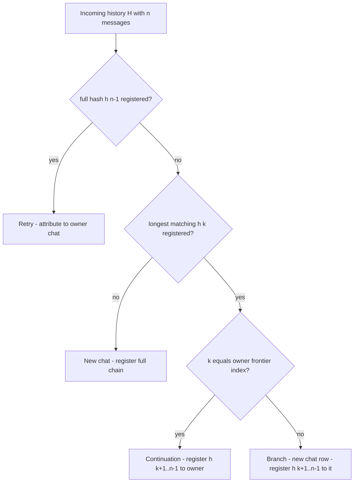

# Plan: rhd_ai_proxy Logging Rework — Branch-Aware Chats + Messages Table

## Goal

Fix over-aggressive chat grouping in `rhd_ai_proxy`'s optional chat logging and make tool
activity queryable:

1. Replace "any shared prefix ⇒ same chat" matching with a **frontier-based classifier**.
   Sub-histories (sub-chats), edited/regenerated histories, and unrelated chats sharing only
   a system prompt no longer merge into one chat row. Branches become independent chat rows
   (no lineage columns, per decision).
2. Add a normalized **`messages` table** with first-class `tool_calls` and tool-result
   (`tool_call_id`) columns, built by diffing request histories and appending assembled
   responses — tool calls and results become directly queryable/joinable without parsing raw
   bodies.
3. The proxy stays fully client-agnostic (external tools, curl, any OpenAI-compatible
   client): identification is content-only. Old logging DBs fail fast (`user_version` guard);
   wipe is acceptable, no migration.

Scope: backend (`packages/rhd_ai_proxy`) + its README only. `frontend-proxy` viewer code is
**out of scope** and is expected to break against the new schema until a follow-up session.

## Current Behavior (verified)

- `src/logging/chat_match.rs`: prefix-hash chain `h_i = blake3(h_{i-1} || canonical(msg_i))`,
  seeded constant. `extract_candidate` requires a JSON object with non-empty `messages`.
- `src/logging/db.rs`: `find_chat_id` probes hashes longest-first against a global
  `prefix_hashes(hash → chat_id)` map — **any** prefix length matches. `register_prefixes`
  re-points shared hashes to the newest chat (`INSERT OR REPLACE`). Consequence: sub-chat with
  subset of parent history is logged into the parent; unrelated chats sharing one system
  message merge; re-pointing contaminates chats bidirectionally.
- `src/logging/capture.rs`: `start_logging` (find chat → create if new → register prefixes →
  insert request + raw body, **four separate transactions**) and `finish_logging`
  (complete_request: status/duration/error/raw response/assembled message).
- `src/logging/sse.rs`: assembles assistant messages from SSE deltas, merges `tool_calls` by
  index (correct), embeds `finish_reason` into the assembled object. `extract_message_json`
  returns `choices[0].message` for non-stream JSON.
- `src/proxy.rs:74-88`: logging starts for completions paths before `extraBody` injection, so
  raw bodies are pre-injection (keep this).
- Tool results flow as `role=tool` messages with `tool_call_id` inside *subsequent* request
  histories (verified in `plugins/rhd_plugin_ai_completions/src/message_conversion.rs`) —
  history diffing is the only capture path for them.

## Architecture

### Classification algorithm (replaces find_chat_id semantics)

For an incoming history `H` of length `n` with hashes `h[0..n-1]`, inside one transaction:

1. **Retry** — if `h[n-1]` is registered to chat `X`: attribute request to `X`, register
   nothing.
2. **Continuation** — else find the longest registered `h[k]` owned by chat `X`. Frontier
   index of `X` = `MAX(len) - 1` over `prefix_hashes` rows of `X`. If `k == frontier(X)`:
   attribute to `X`, register `h[k+1..n-1]` to `X`.
3. **Branch** — if `k < frontier(X)`: create a **new chat row** (title from its own history
   via existing `chat_title`), register `h[k+1..n-1]` to it. Shared `h[0..k]` stay owned by
   `X`. No lineage columns.
4. **New chat** — no hash matches: create chat, register the full chain.

Invariants:

- `prefix_hashes.hash` is single-owner, **first registrant wins, never re-pointed** (drop
  `INSERT OR REPLACE` semantics).
- Probe priority is exactly: retry → longest match → classify by frontier.
- A branch's own frontier starts at its longest registered hash (its creation history
  length - 1), so its subsequent requests classify as continuations of it.



Known content-only limits (documented, accepted):

- Two clients extending byte-identical histories concurrently: first extension claims the
  chat; the later diverger becomes a branch.
- A sub-chat's seed request identical to a parent's already-registered history classifies as
  a retry and is attributed to the parent; all of the sub-chat's subsequent (substantive)
  traffic lands in its own branched chat.

### Schema v2

```sql
CREATE TABLE chats (
    id         INTEGER PRIMARY KEY,
    title      TEXT NOT NULL,
    model      TEXT,
    created_at TEXT NOT NULL,
    updated_at TEXT NOT NULL
);

CREATE TABLE prefix_hashes (
    hash    BLOB PRIMARY KEY,
    chat_id INTEGER NOT NULL REFERENCES chats(id),
    len     INTEGER NOT NULL            -- message count covered: i+1 for h_i
);
CREATE INDEX idx_prefix_hashes_chat ON prefix_hashes(chat_id, len);

CREATE TABLE requests (                -- unchanged shape
    id INTEGER PRIMARY KEY, chat_id INTEGER NOT NULL REFERENCES chats(id),
    ts TEXT NOT NULL, method TEXT NOT NULL, path TEXT NOT NULL, model TEXT,
    stream INTEGER NOT NULL DEFAULT 0, status INTEGER, duration_ms INTEGER,
    error TEXT, response_assembled TEXT
);
CREATE INDEX idx_requests_chat ON requests(chat_id, id);

CREATE TABLE raw (                      -- unchanged
    request_id INTEGER PRIMARY KEY REFERENCES requests(id),
    request_body BLOB NOT NULL, response_body BLOB
);

CREATE TABLE messages (
    id           INTEGER PRIMARY KEY,
    chat_id      INTEGER NOT NULL REFERENCES chats(id),
    seq          INTEGER NOT NULL,      -- 0-based position in the chat sequence
    role         TEXT NOT NULL,
    message_json TEXT NOT NULL,         -- full canonical message, finish_reason stripped
    content      TEXT,                  -- content field as JSON text, NULL when absent/null
    tool_calls   TEXT,                  -- JSON array of calls, assistant messages only
    tool_call_id TEXT,                  -- role=tool rows
    name         TEXT,                  -- optional name field
    source       TEXT NOT NULL CHECK (source IN ('history', 'response')),
    request_id   INTEGER NOT NULL REFERENCES requests(id),
    UNIQUE (chat_id, seq)
);
```

`message_json` is the ground truth used for diff comparisons; `role/content/tool_calls/
tool_call_id/name` are extracted projection columns for queryability.

**Canonical form rule**: canonical serialization (sorted keys, existing `canonical_message`)
with top-level `finish_reason` removed. SSE assembly embeds `finish_reason` inside the
assembled message while history-delivered assistant messages never carry it — stripping it
makes response rows and history rows of the same turn compare equal.

### Message capture semantics

At request start (same transaction as classification):

- Load stored rows `(seq, message_json)` for the chat ordered by `seq`; `m` = stored count.
- Messages `0..=k` are already chain-verified. For `i` in `k+1 .. n-1`:
  - if `i < m` and canonical(history[i]) equals stored[i] → skip (re-delivered);
  - if `i < m` and differs → **truncate-and-replace**: log a warning, delete rows with
    `seq >= i`, then append history[i..n-1] (request history is authoritative; self-heals
    assembly drift);
  - if `i >= m` → append.
- New chats and branch chats append their **full** incoming history (branches duplicate seed
  messages into their own sequence — approved).

At request completion (`finish_logging`):

- Append the assembled assistant message as `source='response'` at `seq = stored_count`,
  `INSERT ... ON CONFLICT (chat_id, seq) DO NOTHING` (first writer wins; a re-delivery via
  the next request's history reconciles ordering anomalies).
- `tool_calls` extracted into its column; `role`/`content`/`name`/`tool_call_id` likewise.
- Failed/unparsable responses insert no message row (request/raw rows still complete).

### Schema lifecycle guard

`LoggingDb::open`:

- `user_version == 0` and no `chats` table → fresh DB: apply schema v2, set
  `PRAGMA user_version = 2`.
- `user_version == 0` and `chats` table exists → old v1 database → return new
  `LoggingError::IncompatibleSchema { path, found }` naming the file and instructing the user
  to delete or move it (fail fast; never auto-delete, never silently corrupt).
- `user_version == 2` → proceed.
- `user_version > 2` → fail fast (newer DB than this binary).

Verify `main.rs` propagates the open error as a startup failure (it should already —
confirm during implementation).

### Concurrency

All writes stay under `Mutex<Connection>`; classification + registration + request insert +
history diff-append run in **one transaction** per request (fixes the current four-transaction
race). Response completion runs its own transaction. WAL + busy timeout unchanged (multiple
proxy processes still supported).

## Implementation Steps

1. **Schema v2 + open guard** (`db.rs`)
   - New DDL with `prefix_hashes.len`, `messages` table, indexes; `user_version` handling per
     above; new `LoggingError::IncompatibleSchema` variant; confirm fail-fast in `main.rs`.
   - Remove `find_chat_id`/`register_prefixes`/`create_chat` public transaction-splitting API
     in favor of the orchestrated method from step 3 (or make them private helpers).
2. **Classifier** (new `src/logging/classify.rs`)
   - `enum Classification { Retry(chat_id), Continuation(chat_id), NewChat(chat_id) }`
     (Branch and NewChat both yield a new chat id; keep variants distinct for logging/tests:
     `Branch { parent, chat_id }`, `NewChat(chat_id)`).
   - `classify(tx, &hashes) -> Classification`: full-hash probe, longest-match probe,
     frontier comparison; registration of only the new hashes per outcome; frontier lookup
     via `MAX(len)` indexed query.
3. **Orchestrated record path** (`db.rs`)
   - `record_request(...) -> RecordOutcome { request_id, chat_id, classification }`:
     single transaction = classify → register → insert request row → insert raw body →
     history diff-append.
4. **Message normalization** (new `src/logging/messages.rs`)
   - Canonical-with-stripped-finish-reason helper (reuse `canonical_message`).
   - Row extraction from a `Value` message (role/content/tool_calls/tool_call_id/name).
   - `append_history(tx, chat_id, request_id, messages, verified_upto)` implementing
     skip / truncate-and-replace / append.
   - `append_response(db, chat_id, request_id, assembled: &Value)` with
     `ON CONFLICT DO NOTHING`.
5. **Capture rewiring** (`capture.rs`)
   - `start_logging` computes hashes once, calls `record_request`, keeps
     `LoggingContext { db, request_id, chat_id, started }`.
   - `finish_logging` parses the assembled `Value` (already produced) and calls
     `append_response` after `complete_request`.
6. **Unit tests** (`classify.rs`, `messages.rs` inline `#[cfg(test)]`)
   - Classifier: retry (incl. retry of an old non-frontier history), continuation, subset →
     branch, same-length divergence → branch, shared-system-message chats stay separate,
     single-owner/no re-point, frontier math.
   - Messages: append/dedup, truncate-and-replace on mismatch, response dedup via conflict,
     tool_calls extraction from assembled values, `role=tool` rows carry `tool_call_id`.
   - Keep each file under 500 lines (project limit); trim/move `db.rs` unit tests that the
     integration suite covers better.
7. **Integration tests** (`tests/logging_tests.rs`)
   - Update `groups_chat_continuations_under_same_chat` (still passes; may need len column
     awareness in assertions).
   - Add: `subset_history_creates_separate_chat` (the reported bug: A = [sys, u1, a1, u2],
     then B = [sys, u1, b1] → two chat rows, B's requests not in A), `edited_history_forks_new_chat`,
     `exact_retry_attributed_to_same_chat`, `tool_calls_and_results_persisted_to_messages`
     (SSE tool-call stream → assistant row with tool_calls column; follow-up request whose
     history contains the role=tool result → row with tool_call_id + content), and
     `old_schema_database_fails_fast` (hand-crafted v1 file → `IncompatibleSchema`).
8. **README rewrite** (`packages/rhd_ai_proxy/README.md`, Chat logging section)
   - New algorithm (retry/continuation/branch/new + frontier), `messages` table and columns,
     canonical/finish_reason rule, known content-only limits, `user_version` wipe policy.
   - One-line note in `memory/frontend/proxy-logs-viewer.md`: viewer is incompatible with
     schema v2 until updated (no code changes there this session).

## File Changes

| File | Change |
|------|--------|
| `packages/rhd_ai_proxy/src/logging/db.rs` | Schema v2, `user_version` guard, `IncompatibleSchema`, orchestrated `record_request`, trimmed old API |
| `packages/rhd_ai_proxy/src/logging/classify.rs` | New — classification + registration logic |
| `packages/rhd_ai_proxy/src/logging/messages.rs` | New — message normalization + append semantics |
| `packages/rhd_ai_proxy/src/logging/mod.rs` | Export new modules |
| `packages/rhd_ai_proxy/src/logging/capture.rs` | Rewire start/finish to new API; context carries chat_id; response append |
| `packages/rhd_ai_proxy/src/logging/chat_match.rs` | Unchanged hash chain; doc comments updated to the frontier model |
| `packages/rhd_ai_proxy/src/logging/sse.rs` | Unchanged (finish_reason stripped at storage boundary, not here) |
| `packages/rhd_ai_proxy/tests/logging_tests.rs` | Updated + new scenario tests |
| `packages/rhd_ai_proxy/README.md` | Chat logging section rewrite |
| `memory/frontend/proxy-logs-viewer.md` | Incompatibility note |

Not changed: `proxy.rs`, `transform.rs`, `config.rs`, `frontend-proxy/` (out of scope).

## Risks & Mitigations

- **Response/history canonical mismatch churn**: vendor quirks could make the assembled
  response never equal the history-delivered version → repeated truncate-replace writes.
  Mitigation: history is authoritative (correct final state), writes are cheap, mismatch is
  warn-logged; if noisy, comparison can be relaxed later without schema change.
- **Seq drift under exotic interleavings**: retried requests completing out of order.
  Mitigation: `ON CONFLICT DO NOTHING` + history reconciliation on the next request makes
  the table converge to the request-history view.
- **`prefix_hashes` growth**: now insertion-bounded (only genuinely new hashes per request)
  versus today's full-chain rewrite — strictly better; probes remain indexed PK lookups.
- **Viewer breakage**: accepted per scope decision; documented in README + memory note.
- **Old-DB UX**: fail-fast error names the file and the remedy; no data loss without an
  explicit user action.

## Success Criteria

- Sub-chat scenario produces two separate chat rows; requests attribute correctly.
- Continuation, retry, edit-fork, and unrelated-shared-system-prompt behaviors match the
  classification table.
- `messages` rows expose `tool_calls` on assistant turns and `tool_call_id` + result content
  on tool turns, joinable per chat in `seq` order, without parsing raw blobs.
- Single-transaction classification (no interleaving misattribution in concurrent tests).
- Old v1 DB file → clear startup error; fresh DB → schema v2 with `user_version = 2`.
- `mise run check`, `mise run test-cargo`, `mise run check-large-files` pass; existing
  proxy tests (non-logging) unchanged and green.
