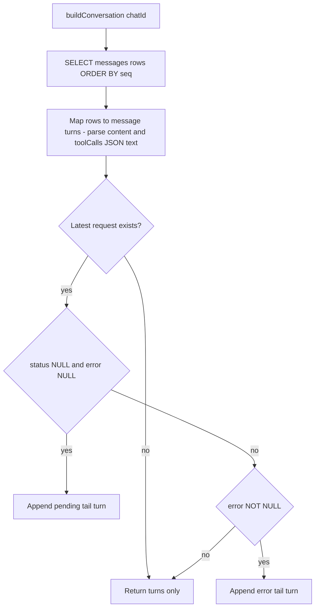

# Plan: frontend-proxy Viewer Adaptation to Logging Schema v2

## Goal

Adapt the proxy-logs viewer (`frontend-proxy/`) to the reworked `rhd_ai_proxy` logging schema
v2 (branch-aware chats + `messages` table, commit `82d5f52`):

1. Read conversations from the normalized **`messages` table** instead of parsing the latest
   request's raw body — tool calls (`tool_calls`) and tool results (`tool_call_id`) become
   first-class, rendered conversation turns.
2. Fail fast on incompatible databases: check `PRAGMA user_version` at open (must be 2) with a
   descriptive error naming the file and the remedy.
3. Update fixtures/tests to schema v2, split the oversized server test file, and refresh all
   stale docs (both READMEs, memory note).

## Current Behavior (verified)

- `src/server/fixture.ts`: duplicates the **v1 DDL** (no `prefix_hashes.len`, no `messages`
  table, no `idx_prefix_hashes_chat`), no `user_version` stamp.
- `src/server/db.ts`: opens the DB without any version check — a v1 file yields confusing
  `no such table: messages` SQL errors mid-request.
- `src/server/queries.ts` `buildConversation`: parses the latest request's raw body for the
  message spine + one synthetic final assistant turn from `response_assembled`; tool-call
  assistant messages render as `—` (content null); tool results only visible inside raw bodies.
- `src/lib/api/schemas.ts`: `ConversationTurn = MessageTurn | AssistantTurn` where
  `AssistantTurn` carries pending/error/content of the latest request.
- `src/lib/components/ConversationView.svelte`: markdown only for the final assistant turn; no
  tool-call or tool-result rendering.
- `src/server/server.test.ts`: 496 lines — new tests would exceed the 500-line project limit.
- Docs stale: `packages/rhd_ai_proxy/README.md` warns the viewer predates v2;
  `memory/frontend/proxy-logs-viewer.md` carries an incompatibility status note.

## Architecture

### Contract (schemas.ts)

Message turns mirror `messages` rows; the synthetic assistant turn is replaced by tail states:

```ts
MessageTurnSchema = z.object({
  kind: z.literal('message'),
  seq: z.number().int().nonnegative(),
  role: z.string(),
  source: z.enum(['history', 'response']),
  content: z.unknown(),                        // parsed messages.content; null when column NULL
  toolCalls: z.array(z.unknown()).nullable(),  // parsed messages.tool_calls; null when NULL
  toolCallId: z.string().nullable(),
  name: z.string().nullable(),
  requestId: z.number().int()
});

PendingTurnSchema = z.object({ kind: z.literal('pending'), requestId: z.number().int() });
ErrorTurnSchema   = z.object({ kind: z.literal('error'),
                               requestId: z.number().int(), error: z.string() });

ConversationTurnSchema = z.union([MessageTurnSchema, PendingTurnSchema, ErrorTurnSchema]);
```

`ChatSummary`, `RequestSummary`, `RequestDetail` unchanged (chats/requests/raw shapes and
`response_assembled` are unchanged in v2).

### Conversation assembly (queries.ts)



- Row mapping: `content`/`tool_calls` columns hold verbatim JSON text (strings quoted) — the
  server JSON.parses them; on parse failure (defensive; the backend always writes valid JSON)
  the raw text passes through.
- Tail semantics: a **pending** tail marks the in-flight latest request; an **error** tail marks
  a failed one. A completed latest request adds no tail — its response row already ends the
  conversation (completed-without-assembly stays visible via the timeline drill-down).
- Chats exist only for parseable completions bodies, so empty `messages` for a chat is rare;
  the conversation degrades to empty + tail.

### Version guard (db.ts)

`EXPECTED_LOGGING_SCHEMA_VERSION = 2` exported from `db.ts` (mirror of the proxy's
`SCHEMA_VERSION`; the viewer must not depend on the Rust crate). After opening,
`PRAGMA user_version` must equal it, else throw naming the file, the found and expected
versions, and the remedy (delete or move the file — the proxy recreates it fresh; history loss
is acceptable for a dev-only debug DB). The guard fires inside the vite plugin's
`configureServer`, so the dev server aborts at startup — the same fail-fast channel as the
existing missing-file error.

### Fixture (fixture.ts)

- Copy the v2 DDL from `packages/rhd_ai_proxy/src/logging/schema.rs` (provenance comment
  updated) and stamp `user_version = EXPECTED_LOGGING_SCHEMA_VERSION`.
- Add `seedMessages(db, chatId, requestId, seeds)` deriving projection columns from full
  message objects the way the backend's `extract_fields` does (content → JSON text unless
  null; tool_calls → JSON text unless empty; role/tool_call_id/name verbatim), seq
  auto-incrementing from `MAX(seq)+1`.

### UI (ConversationView.svelte)

- Message turn: role label + muted **source badge** (`history`/`response`).
  - assistant + string content → markdown (`marked`) — for **all** assistant rows now, not just
    the last (approved decision)
  - assistant + `toolCalls` → tool-call block per call: function name, pretty-printed
    arguments, muted call id
  - role=tool → label `tool: name` (fallback tool_call_id), content pretty JSON or raw text
  - system/user → plain text; non-string content → pretty JSON; null → `—`
- Tail turns reuse the existing pending/error visuals; testids become `turn-pending` /
  `turn-error` (they describe request states, not assistant messages).

## Implementation Steps

1. **fixture.ts** — v2 DDL copy, version stamp via shared const, `seedMessages` helper.
2. **db.ts** — `EXPECTED_LOGGING_SCHEMA_VERSION` + open-time guard.
3. **schemas.ts** — turn model reshape; drop `AssistantTurnSchema`.
4. **queries.ts** — `buildConversation` rewrite (rows + tail); JSON-parse helpers.
5. **Server tests** — split `server.test.ts` (496 lines) into `queries.test.ts` (query
   functions incl. conversation cases) and `server.test.ts` (routes, middleware over HTTP,
   `openLogsDb` incl. version-guard cases, `resolveLogsDir`). New conversation cases: row
   order + parsed content, tool calls/results turns, response-sourced rows, pending/error/no
   tail, empty chat. New guard cases: version 0-with-tables and version 3 files → throw.
6. **ConversationView + component tests** — new rendering rules; update
   `ConversationView.test.ts` turn factories and `ChatDetailView.test.ts` conversation
   fixtures to the new shapes.
7. **Docs** — `frontend-proxy/README.md` (conversation semantics, tool visibility, version
   guard), drop the viewer warning in `packages/rhd_ai_proxy/README.md`, refresh
   `memory/frontend/proxy-logs-viewer.md` (remove incompatibility status, update decisions).
8. **Validation** — `npm --prefix frontend-proxy run check` + `run test`; `mise run check`;
   `wc -l` on changed files < 500.

## File Changes

| File | Change |
|------|--------|
| `frontend-proxy/src/server/fixture.ts` | v2 DDL, version stamp, `seedMessages` |
| `frontend-proxy/src/server/db.ts` | schema version const + open-time guard |
| `frontend-proxy/src/lib/api/schemas.ts` | message/pending/error turn schemas |
| `frontend-proxy/src/server/queries.ts` | `buildConversation` from `messages` + tail logic |
| `frontend-proxy/src/lib/components/ConversationView.svelte` | tool rendering, markdown, badges |
| `frontend-proxy/src/server/queries.test.ts` | New — query tests split out of server.test.ts |
| `frontend-proxy/src/server/server.test.ts` | Slimmed to routes/middleware/db tests |
| `frontend-proxy/src/lib/components/ConversationView.test.ts` | New shapes + tool cases |
| `frontend-proxy/src/lib/components/ChatDetailView.test.ts` | Conversation fixtures reshaped |
| `frontend-proxy/README.md` | Conversation semantics rewrite |
| `packages/rhd_ai_proxy/README.md` | Drop viewer-predates-v2 warning |
| `memory/frontend/proxy-logs-viewer.md` | Status + decisions refresh |

Not changed: `plugin.ts`, `routes.ts`, store, API client, `ChatsList`/`RequestTimeline`/
`RequestDetailView` (the contract areas they consume are untouched).

## Risks & Mitigations

- **JSON-parse assumptions on projection columns** — backend guarantees valid JSON text
  (serde-produced); defensive fallback passes raw text through instead of throwing.
- **Tail-turn rename breaks testids** — contained in frontend-proxy tests, updated in the same
  change.
- **Fixture drift from Rust DDL** — unchanged risk class (deliberate duplication); provenance
  comment points at `schema.rs`.
- **messages empty for weird chats** — degrades to empty conversation + tail; timeline and raw
  drill-down still work.

## Success Criteria

- Viewer serves and renders a schema-v2 DB: conversation turns in seq order with parsed
  content, tool calls on assistant turns, tool results with name/tool_call_id, source badges.
- Latest request in flight → pending tail; failed → error tail; completed → no tail.
- v1/other-version DB file → dev server aborts with a clear error naming file + versions.
- `npm run check` / `npm run test` green in frontend-proxy; `mise run check` green; all
  changed files under 500 lines.
