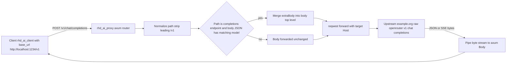

# Plan: `rhd_ai_proxy` — OpenAI-compatible forwarding proxy with per-model `extraBody` injection

## Goal

Create a new workspace bin crate `packages/rhd_ai_proxy` (utility, outside the core product scope) that:

1. Listens on a configured port (e.g. `1234`).
2. Proxies every request to a configured target base URL (e.g. `https://example.org/raw/openrouter/v1`), rewriting the `Host` to the target host and passing all other headers through.
3. Reads the incoming request body, parses it as JSON, and — for OpenAI-compatible completions endpoints — merges the per-model `extraBody` into the top level of the request body before forwarding.
4. Streams the upstream response back to the client (SSE pass-through, no re-parsing).

## Configuration format

```yaml
proxy:
  port: 1234
  target:
    path: https://example.org/raw/openrouter/v1
  models:
    "z-ai/glm-5.3":
      extraBody:
        provider:
          sort: throughput
          max_price: {"prompt": 1, "completion": 2}
```

## Key semantics (confirmed / assumed)

- **Path mapping** (confirmed with user): the incoming path is normalized by stripping a leading `/v1` (if present) and appended to `target.path`. So a caller with `base_url = http://localhost:1234/v1` hitting `/v1/chat/completions` is forwarded to `https://example.org/raw/openrouter/v1/chat/completions`. Query strings are preserved.
- **`extraBody` merge**: the `extraBody` map's keys are merged into the **top level** of the JSON request body (not nested under an `extraBody` key). Example: `{"model": "...", "messages": [...]}` + `extraBody: {provider: {...}}` → `{"model": "...", "messages": [...], "provider": {...}}`.
- **Model matching** (assumption): injection applies when the request body's `model` field exactly matches a key in `proxy.models`. The request example in the task used `gpt-4o` while the config key was `z-ai/glm-5.3`; we treat the example as illustrative and match on the exact model string. Non-matching models and non-JSON bodies are forwarded verbatim.
- **Completions endpoint detection**: injection is attempted only when the normalized path ends with `/chat/completions` or `/completions` and the body parses as a JSON object.
- **Host header**: reqwest/hyper derive `Host` from the target URL automatically; the proxy must simply **not** forward the incoming `host` header. No manual `Host` setting is possible or needed with reqwest.
- **Hop-by-hop headers** (`connection`, `keep-alive`, `proxy-connection`, `te`, `trailer`, `transfer-encoding`, `upgrade`) are stripped in both directions; all other headers pass through unchanged (including `Authorization`).
- **Streaming**: upstream response is piped as a raw byte stream (`reqwest::Response::bytes_stream()` → `axum::body::Body::from_stream`), preserving status code and response headers. No SSE parsing — true pass-through.
- **Bind address**: `127.0.0.1` (hardcoded default; it's a local util). No auth, no TLS termination.

## Architecture



## Files

| File | Purpose |
|------|---------|
| `Cargo.toml` (root) | Add workspace member `packages/rhd_ai_proxy`; add `axum = { version = "0.7", features = ["macros"] }` to `[workspace.dependencies]` (per "shared deps in workspace root" convention) |
| `packages/rhd_ai_proxy/Cargo.toml` | Bin crate: `axum`, `tokio` (workspace), `reqwest` (workspace, `stream` feature already enabled), `serde`, `serde_json`, `serde_yaml`, `bytes`, `futures-util`, `thiserror`, `clap`, `tracing`, `tracing-subscriber` (all workspace); dev-deps for integration tests |
| `packages/rhd_ai_proxy/src/main.rs` | `clap` `--config <path>`; load config; `tracing_subscriber` init; build `ProxyState`; `axum::serve` on `127.0.0.1:{port}`; graceful shutdown on Ctrl-C (pattern from `rhd_mock_ai_provider/src/server.rs`) |
| `packages/rhd_ai_proxy/src/config.rs` | `Config { proxy: Proxy }`, `Proxy { port: u16, target: Target, models: HashMap<String, ModelConfig> }`, `Target { path: String }`, `ModelConfig { extra_body: serde_json::Map<String, Value> }` with `#[serde(rename_all = "camelCase", deny_unknown_fields)]`; `load(path)` + `ProxyError`; validate `target.path` parses as absolute HTTP(S) URL |
| `packages/rhd_ai_proxy/src/transform.rs` | Pure function `inject_extra_body(path, body_bytes, content_type, models) -> Vec<u8>`: normalize path, detect completions endpoint, parse JSON, match `model`, merge `extraBody` keys at top level; on any mismatch/parse failure return original bytes |
| `packages/rhd_ai_proxy/src/proxy.rs` | axum handler on fallback route (all methods/paths): build upstream URL (target base + normalized path + query), copy request headers minus `host`/hop-by-hop, call `transform`, forward via shared `reqwest::Client`, return upstream status + filtered headers + `Body::from_stream(bytes_stream)`; upstream connect error → `502` |
| `packages/rhd_ai_proxy/tests/proxy_tests.rs` | Integration tests (below) |
| `packages/rhd_ai_proxy/README.md` | Purpose, config reference, usage example with `rhd_ai_client` base_url |

All source files well under the 500-line limit.

## Implementation steps

1. **Workspace wiring**: add member + workspace `axum` dep to root `Cargo.toml`. (Optional, out of scope: migrate `rhd_mock_ai_provider` to the workspace `axum` entry.)
2. **Scaffold crate**: `packages/rhd_ai_proxy/Cargo.toml` + empty `src/main.rs` so `cargo check` passes.
3. **`config.rs`**: structs, YAML loading, URL validation; unit tests for the exact example config, unknown-field rejection, missing file, invalid URL.
4. **`transform.rs`**: pure injection logic; unit tests: matching model merges keys at top level and preserves unknown body fields (e.g. `temperature`), non-matching model unchanged, non-completions path unchanged, invalid JSON unchanged, empty `extraBody` no-op.
5. **`proxy.rs`**: forwarding handler; header filtering helper (unit tests for hop-by-hop + host stripping); URL building (unit tests: `/v1/chat/completions` → `.../v1/chat/completions`, `/chat/completions` → same, query preserved, trailing-slash normalization on `target.path`).
6. **`main.rs`**: CLI + tracing + serve loop with graceful shutdown.
7. **Integration tests** (`tests/proxy_tests.rs`) with an in-process axum "echo" upstream that records received `Host`, path, headers, body and can reply JSON or SSE:
   - URL mapping and `Host` rewrite to upstream host.
   - `extraBody` injection end-to-end (echoed body contains merged `provider` object).
   - Non-matching model forwarded byte-identical.
   - SSE streaming: chunks arrive incrementally and `[DONE]` passes through; `content-type: text/event-stream` preserved.
   - Upstream error status + body passthrough; upstream-unreachable → 502.
8. **README** for the crate with the config sample and a run command:
   `cargo run -p rhd_ai_proxy -- --config proxy.yaml`
9. **Validation**: `mise run check-cargo` and `cargo test -p rhd_ai_proxy` (then full `mise run test-cargo`) until green.

## Risks / notes

- **reqwest cannot set `Host` manually** — it is derived from the URI. This satisfies the requirement automatically; the only work is stripping the incoming `host` header.
- **`content-length` on forwarded request**: we buffer + possibly rewrite the body, so set it from the final byte length (reqwest does this when given `body(Vec<u8>)`).
- **Response `content-length`**: pass through only if upstream sent it and we don't alter the response (we don't). SSE responses are chunked and unaffected.
- **Backpressure**: `bytes_stream` → `Body::from_stream` propagates naturally via hyper; no buffering of the full response.
- **Model key with `/`** (`z-ai/glm-5.3`): YAML quoted keys + `HashMap<String, _>` handle this fine.
- Utility crate: no plugin/DB/frontend touchpoints; zero impact on existing crates beyond root `Cargo.toml`.

## Success criteria

- `cargo run -p rhd_ai_proxy -- --config <file>` starts on configured port using the example config verbatim.
- A request from `rhd_ai_client` (`base_url = http://127.0.0.1:1234/v1`) with a configured model reaches the target URL with injected `extraBody` and target `Host`; other headers (e.g. `Authorization`) arrive intact.
- Streaming responses render incrementally at the client (verified by integration test asserting chunked arrival).
- All new unit + integration tests pass; `cargo check` clean for the workspace.

## Commit

Single commit, per convention: `add rhd_ai_proxy bin for openai-compatible proxying with extraBody injection`
