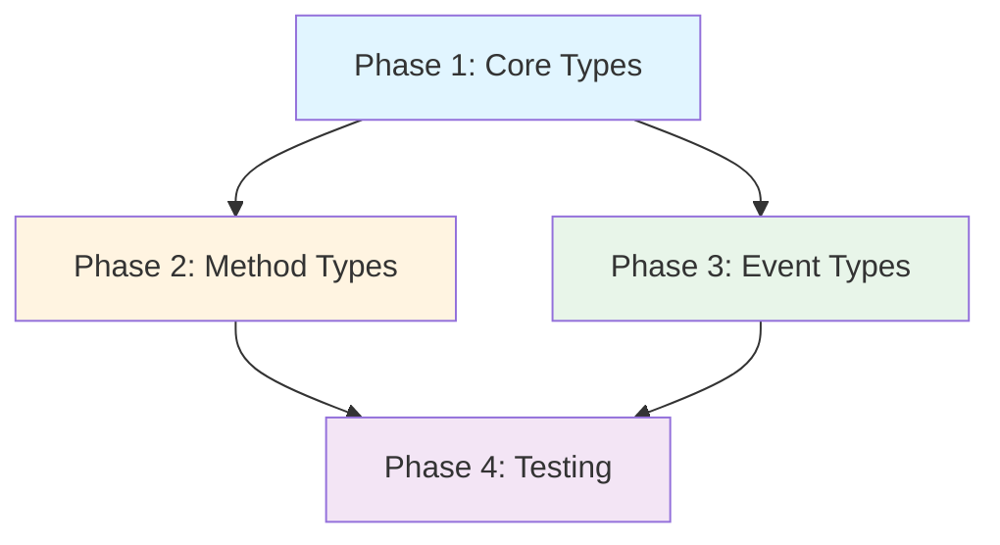

# RHD Chat API Implementation Plan

## Overview

Create a library package `rhd_chat_api` containing all API data types (requests, responses, events) for the chat WebSocket protocol. This package is reusable by Rust clients connecting to the chat server.

## Goals

- Library package with all API types for the chat WebSocket protocol
- Each method has its own file for easy discovery
- Reusable by Rust clients connecting to the server
- Contains shared types: `Chat`, `Message`, error codes
- All types are serializable/deserializable with serde

## Architecture Decisions

### 1. Package Type
- **Library crate** (no binary)
- Contains only data types, no business logic
- Reusable by both server and client implementations
- No dependencies on async runtime or database

### 2. File Organization
- **One file per method** for easy discovery
- Each method file contains `Params` and `Result` structs
- Each event type has its own file
- Shared types in `common.rs`
- Error types in `error.rs`
- Protocol envelope in `protocol.rs`

### 3. Serialization
- All types derive `Serialize`, `Deserialize`, `Debug`, `Clone`
- Use `#[serde(rename_all = "camelCase")]` for JSON field names
- Doc comments include example JSON for each type

## WebSocket API Specification

### Connection

- **Endpoint**: `ws://127.0.0.1:{port}/`
- **Protocol**: JSON over WebSocket
- **No authentication** (local-only server)

### Message Format

All messages are JSON objects with a `type` field:

```json
{
  "type": "request" | "response" | "event",
  ...
}
```

### Client → Server Requests

#### 1. `createChat`
Create a new chat.

**Request:**
```json
{
  "type": "request",
  "id": "uuid-string",
  "method": "createChat",
  "params": {
    "title": "Chat Title",
    "tags": ["tag1", "tag2"]
  }
}
```

**Response:**
```json
{
  "type": "response",
  "id": "uuid-string",
  "success": true,
  "data": {
    "chatId": 123
  }
}
```

#### 2. `listChats`
Get list of all chats, optionally filtered by tags.

**Request:**
```json
{
  "type": "request",
  "id": "uuid-string",
  "method": "listChats",
  "params": {
    "tags": ["tag1", "tag2"]
  }
}
```

**Response:**
```json
{
  "type": "response",
  "id": "uuid-string",
  "success": true,
  "data": {
    "chats": [
      {
        "id": 123,
        "title": "Chat Title",
        "createdAt": "2026-08-20T18:00:00Z",
        "updatedAt": "2026-08-20T18:30:00Z",
        "tags": ["tag1", "tag2"]
      }
    ]
  }
}
```

#### 3. `getChat`
Get chat info and all messages.

**Request:**
```json
{
  "type": "request",
  "id": "uuid-string",
  "method": "getChat",
  "params": {
    "chatId": 123
  }
}
```

**Response:**
```json
{
  "type": "response",
  "id": "uuid-string",
  "success": true,
  "data": {
    "chat": {
      "id": 123,
      "title": "Chat Title",
      "createdAt": "2026-08-20T18:00:00Z",
      "updatedAt": "2026-08-20T18:30:00Z",
      "tags": ["tag1", "tag2"]
    },
    "messages": [
      {
        "id": 456,
        "chatId": 123,
        "role": "user",
        "content": "Hello",
        "createdAt": "2026-08-20T18:00:00Z",
        "reasoningContent": null,
        "tags": ["important"]
      }
    ]
  }
}
```

#### 4. `deleteChat`
Delete a chat and all its messages.

**Request:**
```json
{
  "type": "request",
  "id": "uuid-string",
  "method": "deleteChat",
  "params": {
    "chatId": 123
  }
}
```

**Response:**
```json
{
  "type": "response",
  "id": "uuid-string",
  "success": true,
  "data": {}
}
```

#### 5. `updateChat`
Partially update a chat. All fields are optional — only provided fields are changed. Tags use additive/subtractive arrays to avoid races with other clients.

**Request:**
```json
{
  "type": "request",
  "id": "uuid-string",
  "method": "updateChat",
  "params": {
    "chatId": 123,
    "title": "New Title",
    "addTags": ["new-tag"],
    "removeTags": ["old-tag"]
  }
}
```

**Response:**
```json
{
  "type": "response",
  "id": "uuid-string",
  "success": true,
  "data": {}
}
```

**Behavior:**
- If `title` is provided, update the chat title
- `addTags` appends tags (no-op if tag already exists)
- `removeTags` removes tags (no-op if tag doesn't exist)
- All three fields can be combined in a single call
- Emits `chatUpdated` event to chats list subscribers

#### 6. `addMessage`
Add a new message to a chat.

**Request:**
```json
{
  "type": "request",
  "id": "uuid-string",
  "method": "addMessage",
  "params": {
    "chatId": 123,
    "role": "user",
    "content": "New message",
    "reasoningContent": "Thinking...",
    "tags": ["tag1"]
  }
}
```

**Response:**
```json
{
  "type": "response",
  "id": "uuid-string",
  "success": true,
  "data": {
    "messageId": 789
  }
}
```

#### 7. `updateMessage`
Partially update a message. All fields are optional — only provided fields are changed. Tags use additive/subtractive arrays to avoid races with other clients.

**Request:**
```json
{
  "type": "request",
  "id": "uuid-string",
  "method": "updateMessage",
  "params": {
    "messageId": 456,
    "content": "Updated content",
    "reasoningContent": "Updated reasoning",
    "role": "assistant",
    "addTags": ["new-tag"],
    "removeTags": ["old-tag"]
  }
}
```

**Response:**
```json
{
  "type": "response",
  "id": "uuid-string",
  "success": true,
  "data": {}
}
```

**Behavior:**
- If `content` is provided, update the message content
- If `reasoningContent` is provided, update the reasoning/thinking content
- If `role` is provided, update the message role
- `addTags` appends tags (no-op if tag already exists)
- `removeTags` removes tags (no-op if tag doesn't exist)
- All fields can be combined in a single call
- Emits `messageUpdated` event to chat subscribers

#### 8. `deleteMessage`
Delete a message.

**Request:**
```json
{
  "type": "request",
  "id": "uuid-string",
  "method": "deleteMessage",
  "params": {
    "messageId": 456
  }
}
```

**Response:**
```json
{
  "type": "response",
  "id": "uuid-string",
  "success": true,
  "data": {}
}
```

#### 9. `subscribeChat`
Subscribe to changes in a specific chat (message additions, edits, deletions, tag changes).

**Request:**
```json
{
  "type": "request",
  "id": "uuid-string",
  "method": "subscribeChat",
  "params": {
    "chatId": 123
  }
}
```

**Response:**
```json
{
  "type": "response",
  "id": "uuid-string",
  "success": true,
  "data": {}
}
```

#### 10. `unsubscribeChat`
Unsubscribe from chat changes.

**Request:**
```json
{
  "type": "request",
  "id": "uuid-string",
  "method": "unsubscribeChat",
  "params": {
    "chatId": 123
  }
}
```

**Response:**
```json
{
  "type": "response",
  "id": "uuid-string",
  "success": true,
  "data": {}
}
```

#### 11. `subscribeChatsList`
Subscribe to changes in the chats list (chat created, updated, deleted, tag changes).

**Request:**
```json
{
  "type": "request",
  "id": "uuid-string",
  "method": "subscribeChatsList",
  "params": {}
}
```

**Response:**
```json
{
  "type": "response",
  "id": "uuid-string",
  "success": true,
  "data": {}
}
```

#### 12. `unsubscribeChatsList`
Unsubscribe from chats list changes.

**Request:**
```json
{
  "type": "request",
  "id": "uuid-string",
  "method": "unsubscribeChatsList",
  "params": {}
}
```

**Response:**
```json
{
  "type": "response",
  "id": "uuid-string",
  "success": true,
  "data": {}
}
```

### Server → Client Events

Events are pushed to subscribed clients when changes occur.

#### 1. `chatCreated`
Emitted when a new chat is created. Sent to all clients subscribed to chats list.

```json
{
  "type": "event",
  "event": "chatCreated",
  "data": {
    "chat": {
      "id": 123,
      "title": "New Chat",
      "createdAt": "2026-08-20T18:00:00Z",
      "updatedAt": "2026-08-20T18:00:00Z",
      "tags": ["tag1"]
    }
  }
}
```

#### 2. `chatUpdated`
Emitted when a chat is updated (title changed, tags changed). Sent to all clients subscribed to chats list.

```json
{
  "type": "event",
  "event": "chatUpdated",
  "data": {
    "chat": {
      "id": 123,
      "title": "Updated Title",
      "createdAt": "2026-08-20T18:00:00Z",
      "updatedAt": "2026-08-20T18:30:00Z",
      "tags": ["tag1", "tag2"]
    }
  }
}
```

#### 3. `chatDeleted`
Emitted when a chat is deleted. Sent to all clients subscribed to chats list.

```json
{
  "type": "event",
  "event": "chatDeleted",
  "data": {
    "chatId": 123
  }
}
```

#### 4. `messageAdded`
Emitted when a message is added to a chat. Sent to all clients subscribed to that chat.

```json
{
  "type": "event",
  "event": "messageAdded",
  "data": {
    "chatId": 123,
    "message": {
      "id": 456,
      "chatId": 123,
      "role": "user",
      "content": "New message",
      "createdAt": "2026-08-20T18:00:00Z",
      "reasoningContent": null,
      "tags": ["tag1"]
    }
  }
}
```

#### 5. `messageUpdated`
Emitted when a message is edited. Sent to all clients subscribed to that chat.

```json
{
  "type": "event",
  "event": "messageUpdated",
  "data": {
    "chatId": 123,
    "message": {
      "id": 456,
      "chatId": 123,
      "role": "user",
      "content": "Updated content",
      "createdAt": "2026-08-20T18:00:00Z",
      "reasoningContent": "Updated reasoning",
      "tags": ["tag1"]
    }
  }
}
```

#### 6. `messageDeleted`
Emitted when a message is deleted. Sent to all clients subscribed to that chat.

```json
{
  "type": "event",
  "event": "messageDeleted",
  "data": {
    "chatId": 123,
    "messageId": 456
  }
}
```

### Error Responses

All error responses follow this format:

```json
{
  "type": "response",
  "id": "uuid-string",
  "success": false,
  "errorCode": "CHAT_NOT_FOUND",
  "error": "Chat with ID 123 not found"
}
```

**Error Codes:**
- `CHAT_NOT_FOUND`: Chat does not exist
- `MESSAGE_NOT_FOUND`: Message does not exist
- `INVALID_REQUEST`: Malformed request or missing required fields
- `INTERNAL_ERROR`: Server-side error

## Package Structure

```
packages/rhd_chat_api/
├── Cargo.toml
├── src/
│   ├── lib.rs               # Re-exports all types
│   ├── common.rs            # Shared types: Chat, Message, ChatSummary
│   ├── error.rs             # ErrorCode enum, error response types
│   ├── protocol.rs          # Base message envelope: Request, Response, Event
│   ├── methods/             # One file per method
│   │   ├── mod.rs           # Re-exports all method types
│   │   ├── create_chat.rs
│   │   ├── list_chats.rs
│   │   ├── get_chat.rs
│   │   ├── delete_chat.rs
│   │   ├── update_chat.rs
│   │   ├── add_message.rs
│   │   ├── update_message.rs
│   │   ├── delete_message.rs
│   │   ├── subscribe_chat.rs
│   │   ├── unsubscribe_chat.rs
│   │   ├── subscribe_chats_list.rs
│   │   └── unsubscribe_chats_list.rs
│   └── events/              # One file per event type
│       ├── mod.rs           # Re-exports all event types
│       ├── chat_created.rs
│       ├── chat_updated.rs
│       ├── chat_deleted.rs
│       ├── message_added.rs
│       ├── message_updated.rs
│       └── message_deleted.rs
```

Each method file contains:
- `Params` struct (request parameters)
- `Result` struct (response data)
- Example JSON in doc comments

Each event file contains:
- `Data` struct (event payload)
- Example JSON in doc comments

## Dependencies

```toml
[dependencies]
serde = { version = "1", features = ["derive"] }
serde_json = "1"
chrono = { version = "0.4", features = ["serde"] }
```

## Implementation Phases

### Phase 1: Core Types
**Goal**: Create the package structure and implement shared types.

**Files to create:**
- `packages/rhd_chat_api/Cargo.toml` — Package manifest
- `packages/rhd_chat_api/src/lib.rs` — Re-exports all types
- `packages/rhd_chat_api/src/common.rs` — Shared types: `Chat`, `Message`, `ChatSummary`
- `packages/rhd_chat_api/src/error.rs` — `ErrorCode` enum, error response types
- `packages/rhd_chat_api/src/protocol.rs` — Base message envelope: `Request`, `Response`, `Event`
- `Cargo.toml` — Add package to workspace

**Key decisions:**
- All types derive `Serialize`, `Deserialize`, `Debug`, `Clone`
- Use `#[serde(rename_all = "camelCase")]` for JSON field names
- `chrono::DateTime<Utc>` for timestamps

### Phase 2: Method Types
**Goal**: Implement request/response types for all 12 methods.

**Files to create:**
- `packages/rhd_chat_api/src/methods/mod.rs` — Re-exports all method types
- `packages/rhd_chat_api/src/methods/create_chat.rs` — `CreateChatParams`, `CreateChatResult`
- `packages/rhd_chat_api/src/methods/list_chats.rs` — `ListChatsParams`, `ListChatsResult`
- `packages/rhd_chat_api/src/methods/get_chat.rs` — `GetChatParams`, `GetChatResult`
- `packages/rhd_chat_api/src/methods/delete_chat.rs` — `DeleteChatParams`, `DeleteChatResult`
- `packages/rhd_chat_api/src/methods/update_chat.rs` — `UpdateChatParams`, `UpdateChatResult`
- `packages/rhd_chat_api/src/methods/add_message.rs` — `AddMessageParams`, `AddMessageResult`
- `packages/rhd_chat_api/src/methods/update_message.rs` — `UpdateMessageParams`, `UpdateMessageResult`
- `packages/rhd_chat_api/src/methods/delete_message.rs` — `DeleteMessageParams`, `DeleteMessageResult`
- `packages/rhd_chat_api/src/methods/subscribe_chat.rs` — `SubscribeChatParams`, `SubscribeChatResult`
- `packages/rhd_chat_api/src/methods/unsubscribe_chat.rs` — `UnsubscribeChatParams`, `UnsubscribeChatResult`
- `packages/rhd_chat_api/src/methods/subscribe_chats_list.rs` — `SubscribeChatsListParams`, `SubscribeChatsListResult`
- `packages/rhd_chat_api/src/methods/unsubscribe_chats_list.rs` — `UnsubscribeChatsListParams`, `UnsubscribeChatsListResult`

**Key decisions:**
- Each method has its own file for easy discovery
- Doc comments include example JSON for each type
- Optional fields use `Option<T>`
- Tags use `Vec<String>`

### Phase 3: Event Types
**Goal**: Implement event data types for all 6 event types.

**Files to create:**
- `packages/rhd_chat_api/src/events/mod.rs` — Re-exports all event types
- `packages/rhd_chat_api/src/events/chat_created.rs` — `ChatCreatedData`
- `packages/rhd_chat_api/src/events/chat_updated.rs` — `ChatUpdatedData`
- `packages/rhd_chat_api/src/events/chat_deleted.rs` — `ChatDeletedData`
- `packages/rhd_chat_api/src/events/message_added.rs` — `MessageAddedData`
- `packages/rhd_chat_api/src/events/message_updated.rs` — `MessageUpdatedData`
- `packages/rhd_chat_api/src/events/message_deleted.rs` — `MessageDeletedData`

**Key decisions:**
- Each event type has its own file
- Doc comments include example JSON for each type
- Events reference shared types from `common.rs`

### Phase 4: Testing
**Goal**: Add unit tests for serialization/deserialization.

**Tests to add:**
- Unit tests for all type serialization/deserialization
- Verify JSON field names use camelCase
- Verify optional fields are handled correctly
- Verify error code serialization

## Success Criteria

1. Library package `rhd_chat_api` compiles
2. All 12 method types are implemented with request/response structs
3. All 6 event types are implemented
4. Shared types (`Chat`, `Message`, `ChatSummary`) are defined
5. Error codes are defined
6. Protocol envelope types (`Request`, `Response`, `Event`) are defined
7. All types serialize/deserialize correctly with camelCase field names
8. Each method has its own file for easy discovery
9. All tests pass

## Dependency Graph



## Memory Update

After implementation, update `memory/MEMORY.md` to add `rhd_chat_api` to the list of packages being kept:

```markdown
**Packages being kept (active development):**
- `rhd_util` — Shared error types, utilities, env var substitution
- `rhd_ai` — OpenAI-compatible AI client
- `rhd_db` — SQLite database layer
- `rhd_fsm` — Finite state machine framework
- `rhd_mcp_client` — MCP protocol client for tool usage
- `rhd_chat_api` — API types for chat WebSocket protocol (NEW)
```
