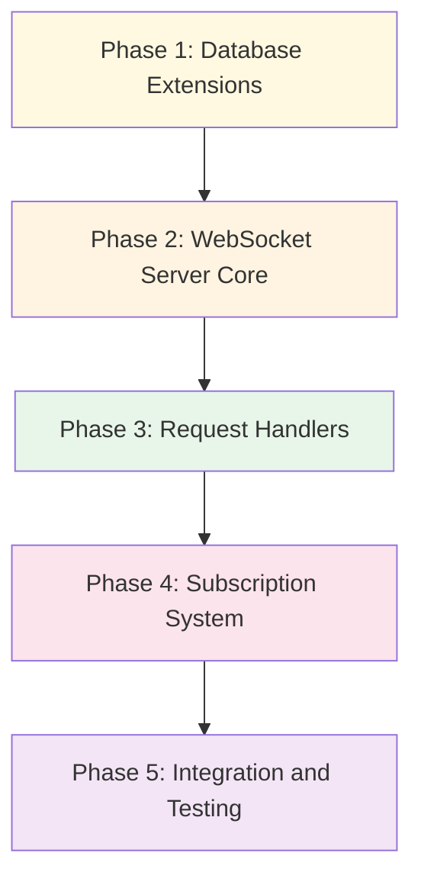

# RHD Chat Server Implementation Plan

## Overview

Create a binary package `rhd_chat_server` that provides a WebSocket server for chat storage and management. This server is part of the new RHD architecture and focuses solely on chat persistence, message editing, and real-time subscriptions — without AI calls or MCP tool execution.

**Note**: The API types are defined in a separate package `rhd_chat_api`. See [rhd-chat-api-implementation.md](rhd-chat-api-implementation.md) for details.

## Goals

- Binary package that starts a WebSocket server
- Uses `rhd_db` for chat and message persistence
- Uses `rhd_chat_api` for all protocol types
- Single responsibility: chat list management, message editing, real-time subscriptions
- No AI integration, no MCP tool execution
- Real-time subscriptions for chat changes and message changes
- Tag support for both chats and messages (list of strings)

## Architecture Decisions

### 1. Package Type
- **Binary crate** with `main.rs` entry point
- Starts WebSocket server on configurable port (default: 8080)
- Uses `tokio` for async runtime
- Uses `tokio-tungstenite` for WebSocket implementation
- Depends on `rhd_chat_api` for all protocol types

### 2. Database Integration
- Reuses existing `rhd_db::ChatDb` for persistence
- Extends database schema to support tags (new tables)
- Adds `reasoning_content` column to messages (if not already present)
- No changes to existing chat/message core functionality

### 3. WebSocket Protocol
- JSON-based protocol (consistent with existing RHD WebSocket protocol)
- Request-response pattern for commands
- Event-based pattern for subscriptions
- All messages use camelCase for JSON fields

### 4. Subscription Model
- Clients can subscribe to specific chat IDs (receive message changes for that chat)
- Clients can subscribe to chats list (receive chat created/updated/deleted events)
- Subscriptions are per-connection, managed server-side
- Events pushed to all subscribed clients when changes occur

### 5. Tag Storage Strategy
- **Separate tables** for tags (normalized approach):
  - `chat_tags` table: `chat_id`, `tag` (composite primary key)
  - `message_tags` table: `message_id`, `tag` (composite primary key)
- Allows efficient querying by tag
- Simplifies tag addition/removal
- Indexes on `tag` column for fast lookups

### 6. Partial Update Strategy
- `updateChat` and `updateMessage` accept only the fields that need changing
- Tags use `addTags` / `removeTags` arrays instead of full replacement
- This prevents race conditions when multiple clients modify tags concurrently

## Database Schema Extensions

### New Tables

```sql
-- Chat tags
CREATE TABLE IF NOT EXISTS chat_tags (
    chat_id INTEGER NOT NULL,
    tag TEXT NOT NULL,
    PRIMARY KEY (chat_id, tag),
    FOREIGN KEY (chat_id) REFERENCES chats(id) ON DELETE CASCADE
);

CREATE INDEX IF NOT EXISTS idx_chat_tags_tag ON chat_tags(tag);

-- Message tags
CREATE TABLE IF NOT EXISTS message_tags (
    message_id INTEGER NOT NULL,
    tag TEXT NOT NULL,
    PRIMARY KEY (message_id, tag),
    FOREIGN KEY (message_id) REFERENCES messages(id) ON DELETE CASCADE
);

CREATE INDEX IF NOT EXISTS idx_message_tags_tag ON message_tags(tag);
```

### Migration Strategy
- Add migration in `rhd_db::chat_db::schema::migrate()` function
- Check if tables exist before creating
- No data loss for existing databases

## WebSocket API

The WebSocket API is defined in the `rhd_chat_api` package. See [rhd-chat-api-implementation.md](rhd-chat-api-implementation.md) for the complete API specification including:
- 12 request methods (createChat, listChats, getChat, deleteChat, updateChat, addMessage, updateMessage, deleteMessage, subscribeChat, unsubscribeChat, subscribeChatsList, unsubscribeChatsList)
- 6 event types (chatCreated, chatUpdated, chatDeleted, messageAdded, messageUpdated, messageDeleted)
- Error codes and response formats

## Package Structure

```
packages/rhd_chat_server/
├── Cargo.toml
├── src/
│   ├── main.rs              # Entry point, server startup
│   ├── config.rs            # Configuration (port, db path)
│   ├── server.rs            # WebSocket server implementation
│   ├── connection.rs        # Per-connection state and message handling
│   ├── subscriptions.rs     # Subscription manager
│   ├── handlers/            # Request handlers
│   │   ├── mod.rs
│   │   ├── chat.rs          # Chat operations (create, list, get, delete, update)
│   │   ├── message.rs       # Message operations (add, update, delete)
│   │   └── subscription.rs  # Subscribe/unsubscribe operations
│   ├── events.rs            # Event broadcasting
│   └── error.rs             # Server error types
```

## Dependencies

```toml
[dependencies]
tokio = { version = "1", features = ["full"] }
tokio-tungstenite = "0.21"
serde = { version = "1", features = ["derive"] }
serde_json = "1"
rhd_chat_api = { path = "../rhd_chat_api" }
rhd_db = { path = "../rhd_db" }
rhd_util = { path = "../rhd_util" }
uuid = { version = "1", features = ["v4"] }
futures-util = "0.3"
```

## Implementation Phases

### Phase 1: Database Extensions
**Goal**: Extend database schema for tags.

**Files to modify:**
- `packages/rhd_db/src/chat_db/schema.rs` — Add tag tables
- `packages/rhd_db/src/chat_db/mod.rs` — Add tag methods
- `packages/rhd_db/src/chat_db/tags.rs` — New file for tag operations

**Key decisions:**
- Tag tables use composite primary keys for efficiency
- Cascade delete ensures tags are removed when chat/message is deleted
- Indexes on tag columns for fast filtering

### Phase 2: WebSocket Server Core
**Goal**: Create the `rhd_chat_server` package and implement basic WebSocket server with connection handling.

**Files to create:**
- `packages/rhd_chat_server/Cargo.toml` — Package manifest (depends on `rhd_chat_api`)
- `packages/rhd_chat_server/src/main.rs` — Entry point (stub)
- `packages/rhd_chat_server/src/config.rs` — Configuration
- `packages/rhd_chat_server/src/server.rs` — Server startup and listener
- `packages/rhd_chat_server/src/connection.rs` — Connection handler
- `packages/rhd_chat_server/src/error.rs` — Server error types
- `Cargo.toml` — Add package to workspace

**Key decisions:**
- Use `tokio-tungstenite` for WebSocket
- Each connection runs in its own task
- Uses types from `rhd_chat_api` for all protocol messages

### Phase 3: Request Handlers
**Goal**: Implement all request handlers for chat and message operations.

**Files to create:**
- `packages/rhd_chat_server/src/handlers/mod.rs`
- `packages/rhd_chat_server/src/handlers/chat.rs`
- `packages/rhd_chat_server/src/handlers/message.rs`

**Key decisions:**
- Each handler is a separate function
- Handlers use types from `rhd_chat_api` for params and results
- Handlers return `Result<T, ServerError>` where T is the result type from `rhd_chat_api`
- Database operations are synchronous (wrapped in `spawn_blocking` if needed)

### Phase 4: Subscription System
**Goal**: Implement subscription mechanism for real-time events.

**Files to create:**
- `packages/rhd_chat_server/src/subscriptions.rs` — Subscription manager
- `packages/rhd_chat_server/src/events.rs` — Event broadcasting
- `packages/rhd_chat_server/src/handlers/subscription.rs` — Subscribe handlers

**Key decisions:**
- Subscription manager is shared across all connections via `Arc<RwLock<...>>`
- Each connection tracks its own subscriptions
- Events use types from `rhd_chat_api::events`
- Events broadcast to all subscribed connections

### Phase 5: Integration and Testing
**Goal**: Wire everything together and add tests.

**Files to modify:**
- `packages/rhd_chat_server/src/main.rs` — Complete implementation
- `packages/rhd_chat_server/src/connection.rs` — Integrate handlers and subscriptions

**Tests to add:**
- Unit tests for tag operations in `rhd_db`
- Unit tests for `rhd_chat_api` serialization/deserialization
- Integration tests for WebSocket protocol
- Tests for subscription broadcasting

## Success Criteria

1. Binary package `rhd_chat_server` compiles and runs
2. WebSocket server accepts connections on configurable port
3. All 12 request methods work correctly (using types from `rhd_chat_api`)
4. All 6 event types are emitted to subscribed clients
5. Tags can be assigned to chats and messages
6. Clients can subscribe to specific chats or chats list
7. Database schema extended with tag tables
8. No AI calls or MCP tool execution in the codebase
9. All tests pass

## Dependency Graph



**Note**: This plan assumes `rhd_chat_api` is already implemented. See [rhd-chat-api-implementation.md](rhd-chat-api-implementation.md) for the API types implementation plan.

## Configuration

The server will be configured via command-line arguments:

```bash
rhd_chat_server --port 8080 --db-path ./rhd_db/chats.db
```

**Options:**
- `--port` — WebSocket server port (default: 8080)
- `--db-path` — Path to SQLite database (default: `./rhd_db/chats.db`)
- `--host` — Host to bind to (default: 127.0.0.1)

## Memory Update

After implementation, update `memory/MEMORY.md` to add `rhd_chat_server` to the list of packages being kept:

```markdown
**Packages being kept (active development):**
- `rhd_util` — Shared error types, utilities, env var substitution
- `rhd_ai` — OpenAI-compatible AI client
- `rhd_db` — SQLite database layer
- `rhd_fsm` — Finite state machine framework
- `rhd_mcp_client` — MCP protocol client for tool usage
- `rhd_chat_server` — WebSocket server for chat storage and management (NEW)
```
