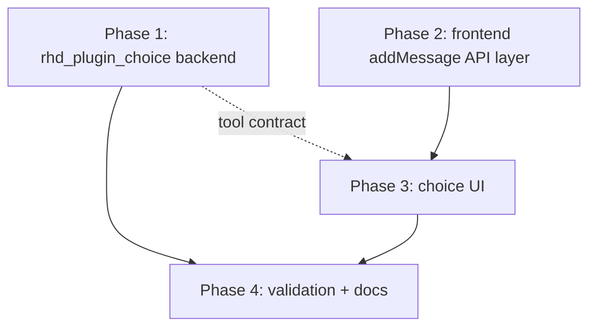

# `rhd_plugin_choice` — Grand Plan

Feature: a chat plugin that provides the `rhd_choice` tool to all chats, plus frontend UI that renders the assistant's question with clickable choice buttons and a free-text input, and answers the tool call on the user's behalf.

> **Sub-plans** (split via plan-split, implement in order):
> [`phase-1-choice-plugin-backend.md`](choice/phase-1-choice-plugin-backend.md) →
> [`phase-2-frontend-add-message-api.md`](choice/phase-2-frontend-add-message-api.md) →
> [`phase-3-frontend-choice-ui.md`](choice/phase-3-frontend-choice-ui.md) →
> [`phase-4-validation-docs.md`](choice/phase-4-validation-docs.md)
>
> Phases 1 and 2 can run in parallel; Phase 3 requires Phase 2; Phase 4 closes
> the feature. Where a sub-plan and this document disagree, the sub-plan wins
> (it is enriched against the actual code).

## Goal

1. **Backend**: new plugin crate `plugins/rhd_plugin_choice` that registers itself with the chat server and adds the `rhd_choice` tool to every chat (newly created and pre-existing). The plugin does **not** handle tool calls — responding is the frontend's responsibility.
2. **Frontend**: detect `rhd_choice` tool calls in finished assistant messages; render the `question` argument and one button per provided option, plus a manual text input; on user action, post a `role:"tool"` message (`toolCallId` set) whose content is the chosen option text or the typed message. The `ai_completions` plugin then sees all tool calls resolved and continues the conversation.

## The Tool Contract (shared interface — single source of truth)

This contract is what Phase 1 implements and Phases 2–3 consume. It must not drift.

- **Tool name**: `rhd_choice`
- **Parameters** (JSON Schema, `camelCase`):
  - `question` (string, required) — the assistant's question to the user
  - `options` (array of strings, required) — the variants the user can choose between
- **Response** (sent by the frontend, not the plugin): `addMessage` with `role: "tool"`, `toolCallId: <the assistant tool call id>`, `content` = the exact text of the chosen option, or the user's manually typed message. Plain text — no JSON envelope, so the model reads it directly.
- **Plugin ID**: `choice` (CLI-overridable via `--plugin-id`)

## Key Architectural Decisions

1. **Plugin registers only; frontend answers.** Per the requirement, the plugin has no `on_tool_call` subscription and no tool handler. The assistant's tool call stays unresolved until a human answers it in the UI. This intentionally blocks the AI tool loop (ai_completions requires all tool calls resolved) until the user decides — which is the point of the feature.
2. **Tool registration on every chat, event-driven.** Follows the `rhd_plugin_todo_list` pattern: `ChatMonitor::subscribe_to_all_chats` + `on_chat_state_change` (spawned, never inline-awaited — see `memory/development.md`), with an in-memory initialized-chats set for dedup. Server-side `addTools` is idempotent (`INSERT OR REPLACE` keyed by chat + plugin + tool name), so plugin restarts are harmless. This covers "all newly created chats" and reconciles pre-existing ones at startup.
3. **No contract system message.** Unlike `todo_list` (which parses free-form content), `rhd_choice` is fully described by its tool definition (name, description, JSON-schema params). The tool description instructs the model when to use it and how to phrase `question`/`options`. Simpler and sufficient.
4. **Tool definition as an embedded template.** New JSON at `templates/mcp_internal/rhd_choice/tool_definition.json`, loaded via `include_dir` like other internal tool templates. Keeps the prompt/contract editable without touching Rust.
5. **Frontend needs a new generic `addMessage` API.** The frontend today only sends queue messages (`addQueueMessage`). A tool result must be a direct, non-queued message with `toolCallId`, so the API layer gains `addMessage(chatId, role, content, toolCallId?, tags?)` (the server's `addMessage` handler is connection-agnostic — no plugin registration required — and rejects `role:"tool"` without `toolCallId`).
6. **Interactive UI only on finished messages.** While a message streams, `toolCalls` arrive as deltas with possibly partial JSON arguments. The choice UI renders only for finalized assistant messages and only while `ChatStore.toolResults` has no entry for that tool call id; once answered, the UI switches to a resolved state showing the answer (derived from the existing `toolResults` map — no extra client state needed).
7. **Dumb components, store-owned actions.** `ChoicePrompt.svelte` receives parsed args + `resolved`/`disabled` props and emits an `onRespond(content)` callback; `Message.svelte` wires per-tool-call callbacks; `ChatView.svelte` passes a handler that calls the new `ChatStore` flow. Consistent with the MobX store + context architecture in `memory/frontend/MEMORY.md`.

## Phases

### Phase 1 — Backend plugin `rhd_plugin_choice`

**Goal**: a runnable plugin binary that registers as plugin `choice` and ensures the `rhd_choice` tool exists on every chat. No tool-call handling.

**Files**:
- `plugins/rhd_plugin_choice/Cargo.toml` — new crate; deps mirror `rhd_plugin_todo_list` (rhd_chat_api, rhd_chat_client, tokio, serde, serde_json, clap, tracing, thiserror, include_dir).
- `plugins/rhd_plugin_choice/src/main.rs` — CLI (`--server-url`, `--plugin-id` default `choice`), tracing init, run loop.
- `plugins/rhd_plugin_choice/src/lib.rs` — module exports for testability.
- `plugins/rhd_plugin_choice/src/plugin.rs` — lifecycle: connect → `registerPlugin` → `getPendingAcks` (ack all) → chat monitor → `on_chat_state_change` → parse tool definition from template → `addTools` once per chat.
- `templates/mcp_internal/rhd_choice/tool_definition.json` — the `rhd_choice` tool definition per the contract above (new file in the shared templates dir).
- `plugins/rhd_plugin_choice/tests/integration_test.rs` — template loads; tool definition is valid JSON; name/parameters match the contract.
- `plugins/rhd_plugin_choice/README.md` — purpose, CLI usage, events/tags (none), configuration, dependencies (per `plugins/README.md` template and the Plugin README Maintenance rule in `memory/development.md`).
- `Cargo.toml` (root) — add `plugins/rhd_plugin_choice` to workspace members.

**Depends on**: nothing. Can run in parallel with Phase 2.

### Phase 2 — Frontend API layer: send tool results

**Goal**: the frontend can post a tool-result message (`role:"tool"` + `toolCallId`) via a store action.

**Files**:
- `frontend/src/lib/api/chatApiImpl.ts` — add `addMessage(chatId, role, content, toolCallId?, tags?)` calling the `addMessage` WebSocket method.
- `frontend/src/lib/api/ChatApi.ts` — extend the DI interface and `defaultChatApi` with `addMessage`.
- `frontend/src/stores/ChatStore.ts` — add a generator flow (e.g. `addToolResult(chatId, toolCallId, content)`) that calls `chatApi.addMessage` with `role:"tool"`, sets `error` on failure.
- `frontend/src/stores/ChatStore.test.ts` — cover the new flow (success posts correct params; failure sets error). Existing store tests build `ChatApi` mocks — add the `addMessage` mock member where the full-interface mocks are constructed.

**Depends on**: nothing (the protocol method already exists server-side). Can run in parallel with Phase 1. Phase 3 depends on this.

### Phase 3 — Frontend choice UI

**Goal**: `rhd_choice` tool calls in finished assistant messages render as an interactive question card: question text, option buttons, manual text input; answered calls render a resolved state.

**Files**:
- `frontend/src/lib/api/schemas.ts` — add `ChoiceToolArgsSchema` (zod: `question: string`, `options: string[]`) for defensive parsing of the tool-call arguments; derived type.
- `frontend/src/lib/components/ChoicePrompt.svelte` — new presentational component: props `{ question, options, resolved: boolean, answer?: string | null, disabled: boolean }`, emits `onRespond(content)`; buttons per option + text input with submit; resolved state shows the chosen answer and hides the controls.
- `frontend/src/lib/components/Message.svelte` — for each finished-message tool call named `rhd_choice`: parse arguments (fall back to the plain `ToolCallMessage` view on parse failure), look up `toolResults.get(id)` for the resolved state, render `ChoicePrompt` (still also rendering the generic collapsible tool-call block for transparency).
- `frontend/src/lib/components/ChatView.svelte` — pass an `onChoiceRespond(toolCallId, content)` handler down through `Message` that invokes the ChatStore flow from Phase 2.
- `frontend/src/lib/components/ChoicePrompt.test.ts` — component tests (rendering, button click emits exact option text, manual input emits typed text, resolved/disabled states).
- `frontend/src/lib/components/Message.test.ts` (new if absent, otherwise extend) — detection logic: `rhd_choice` renders the prompt; other tools unchanged; streaming message does not render interactive UI; answered call renders resolved state.

**Depends on**: Phase 2 (store action + API). Needs Phase 1 only for the contract (already fixed above), not for code.

### Phase 4 — Validation & knowledge base

**Goal**: automated checks green, manual end-to-end walkthrough proven, docs/memory updated.

**Files**:
- `memory/features/plugins.md` — document the choice plugin (product view: what it does, how the user answers, that the frontend owns responses).
- `memory/file-structure.md` — add the new plugin crate and frontend component entries.
- `README.md` (root) — mention `rhd_plugin_choice` in the crate/plugin list if the existing list is kept current.
- `plugins/rhd_plugin_choice/README.md` — final consistency pass (created in Phase 1).

**Checks**: `mise run check` + `cargo test -p rhd_plugin_choice`; `npm run check` + `npm test` in `frontend/`; manual E2E: server + ai_completions + choice plugin + frontend → create chat → assistant emits `rhd_choice` → click an option → assistant continues with the choice as the tool result; repeat with a typed custom answer.

**Depends on**: Phases 1–3.

## Dependency Graph

- **Sequential**: Phase 2 → Phase 3 → Phase 4.
- **Parallelizable**: Phase 1 ∥ Phase 2. Phase 1 ∥ (Phase 2 → Phase 3), since Phase 3 only needs the frozen tool contract.

## Risks / Mitigations

- **Partial arguments during streaming** → interactive UI gated on finished messages only; zod parse with fallback to the generic tool-call view.
- **Multiple `rhd_choice` calls in one message** → each rendered and answered independently (keyed by tool call id).
- **`ChatApi` mock breakage** → Phase 2 updates all test mocks constructing full `ChatApi` objects.
- **Plugin restarts / duplicate `addTools`** → server-side upsert makes re-registration idempotent.
- **Unanswered choice blocks the AI loop** → intended behavior; documented in the plugin README.

## Success Criteria

1. `rhd_plugin_choice` builds and runs; on startup it registers `rhd_choice` in all existing chats, and in every newly created chat (visible in the frontend Tools tab).
2. When the assistant calls `rhd_choice`, the chat UI shows the question with one button per option and a free-text input.
3. Clicking an option posts a tool message whose content is exactly that option's text; submitting the text input posts the typed message; both reference the correct `toolCallId`.
4. After answering, the UI shows the resolved state (no stale buttons), and the assistant continues its response in the same turn flow (tool-loop continuation).
5. `mise run check`, `cargo test -p rhd_plugin_choice`, frontend `npm run check` and `npm test` all pass; plugin README and memory docs updated.
