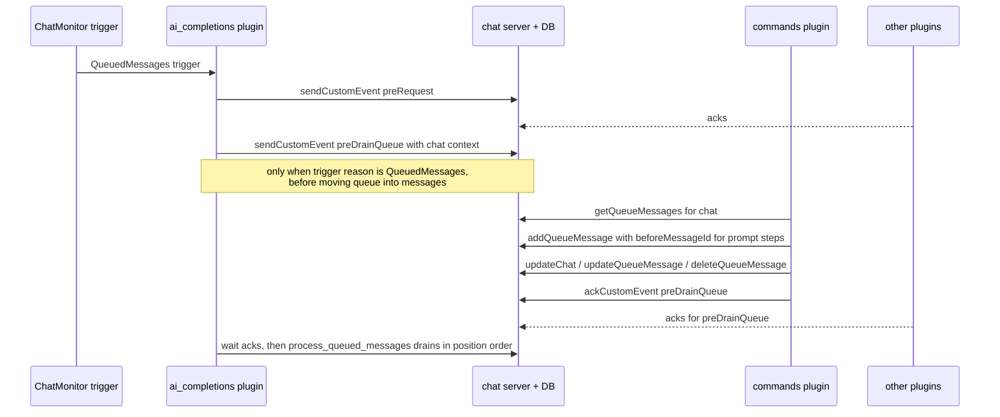

# RHD Plugin Commands — Implementation Plan

## Goal

Introduce slash-commands for queued messages. A new plugin `rhd_plugin_commands` reacts to a new custom event `ai_completions:preDrainQueue` (emitted by the AI completions plugin right before it promotes queued messages into the conversation), executes commands found at the start of queued user messages, and rewrites the queue accordingly:

- `/prompt_example hello` → the prompt file is inserted into the queue **directly before** the command message; the message becomes `hello`.
- `/tags_example /prompt_example` → chat tags applied, prompt inserted, message removed (content became empty).
- Commands may be adjacent (`/a/b`) or whitespace-separated (`/a /b`); leading whitespace is skipped.
- Multi-commands (`multi_example`) expand into a sequence of steps executed in order.

A new positional queue-insertion capability is added to the chat API, because the queue is currently ordered by auto-increment id with no mid-queue insert.

## Sub-plans

Split into phase sub-plans in [`plans/plugin-commands/`](plugin-commands/) (implement in order 1 → 2/3 parallel → 4 → 5):

| Phase | File | Scope |
|---|---|---|
| 1 | [phase-1-positional-queue-insert.md](plugin-commands/phase-1-positional-queue-insert.md) | `position` column + `beforeMessageId` in DB/API/server + tests |
| 2 | [phase-2-pre-drain-queue-event.md](plugin-commands/phase-2-pre-drain-queue-event.md) | `ai_completions:preDrainQueue` emission, ack-wait, ai_completions tests |
| 3 | [phase-3-commands-plugin-scaffold-config-parser.md](plugin-commands/phase-3-commands-plugin-scaffold-config-parser.md) | New crate: scaffold, config model, pure parser + unit tests |
| 4 | [phase-4-commands-plugin-executor-docs.md](plugin-commands/phase-4-commands-plugin-executor-docs.md) | Executor, full lifecycle, plugin README + example config |
| 5 | [phase-5-e2e-validation-memory.md](plugin-commands/phase-5-e2e-validation-memory.md) | Full-stack e2e suite, checks, memory/docs consolidation |

## Approved decisions (from clarification)

| Question | Decision |
|---|---|
| Event name | `ai_completions:preDrainQueue` (consistent with `ai_completions:preRequest`) |
| Insertion mechanism | **New positional insertion API** server-side (no client-side queue rewrite) |
| Unknown `/foo` | Treated as plain text; parsing halts at the first unrecognized token; its text stays verbatim in content |
| Prompt files | Markdown files read verbatim (the `.yaml` in the example was a typo) |
| Scanned messages | Only `role == "user"` queued messages |

## Architecture

### Event flow



### Positional queue insertion design

`messages_queue` gains an internal `position INTEGER NOT NULL` column; reads order by `position ASC, id ASC`. `addQueueMessage` gains an optional `beforeMessageId`:

- **Absent** (today's behavior): append — `position = COALESCE(MAX(position)+1, 1)` within the chat.
- **Present**: the referenced queue message must exist and belong to the same chat (else `invalid_request`). In one transaction: `UPDATE messages_queue SET position = position + 1 WHERE chat_id = ? AND position >= ?`, then insert with the target's old position.

Message **ids are never renumbered** — existing `queueMessageAdded/Updated/Deleted` events and frontend state stay consistent. `position` is deliberately **not exposed** in the wire `Message` payload (it is a server-internal ordering key); the drain, `getQueueMessages`, and chat version bumping behave as before.

Inserting N prompts before the same message sequentially yields config order naturally: each insert shifts the target message (and prior inserts stay before it only if inserted earlier in sequence — prompt 1, then prompt 2 both "before M" produce `[p1, p2, M]`).

### Command semantics

Command name charset `[A-Za-z0-9_]` (validated at startup for config keys). Parsing of a queued user message:

1. Skip leading whitespace. If the next char is not `/` → no commands, message untouched.
2. Read the longest `[A-Za-z0-9_]` run after `/`. If it is a registered command: execute its steps immediately, skip following whitespace, and if the next char is `/` go back to step 2, else the remainder of the string is the message content.
3. If not registered → stop; the remainder (from that `/foo` token on, verbatim) is the message content.

Finalization after all commands in the message ran: if remainder is empty or whitespace-only → `deleteQueueMessage`; otherwise `updateQueueMessage(content = remainder.trim())`. If no command matched at all, the message is left byte-for-byte untouched.

Step execution per occurrence (multi expands steps in order, occurrences run left to right):

| type | Effect |
|---|---|
| `chat_tags` | `updateChat(chat_id, addTags, removeTags)` — additive/subtractive, idempotent |
| `message_tags` | `updateQueueMessage(messageId, addTags, removeTags)` on the carrying message |
| `prompt` | `addQueueMessage(chat_id, role, content = <file verbatim>, tags = ["commands:prompt:<name>"], beforeMessageId = <carrying message id>)`. Default role `user`; `tool` role rejected at startup. The tag survives the drain and gives observability/dedup |

The prompt message tag `commands:prompt:<name>` is a design choice — drop it if undesired (it costs one line).

### Config format (strict, `deny_unknown_fields` where applicable)

```yaml
commands:
  tags_example:
    type: chat_tags
    add: [mcp:common]
    remove: [pause]
  prompt_example: ./commands/prompt.md          # shorthand: prompt with role=user
  system_prompt_example:
    type: prompt
    role: system
    prompt: ./systemPrompts/warhammer.md
  multi_example:
    - type: message_tags
      add: [some_tag]
    - ./commands/prompt.md
    - ./commands/another_prompt.md
```

Serde model: `HashMap<String, CommandDef>` where

```rust
#[serde(untagged)] enum CommandDef { Multi(Vec<CommandStep>), Single(CommandStep) }
#[serde(untagged)] enum CommandStep { PromptPath(String), Spec(CommandSpec) }
#[serde(tag = "type", rename_all = "snake_case", deny_unknown_fields)]
enum CommandSpec { ChatTags { add: Vec<String>, remove: Vec<String> },
                   MessageTags { add, remove },
                   Prompt { role: String /* default user */, prompt: String } }
```

Validation at startup: prompt paths resolved relative to the config directory, files must exist (fail fast, like the system_prompt plugin), contents cached once; command-name keys must match `^[A-Za-z0-9_]+$`; prompt roles restricted to `user`/`system`/`assistant`; `chat_tags`/`message_tags` with both `add` and `remove` empty is an error.

## Phases

### Phase 1 — Positional queue insertion (DB + API + server)

1. `packages/rhd_db/src/chat_db/schema.rs`: `position` column in `CREATE TABLE messages_queue`; migration block (pragma_table_info check like `tool_call_id` at lines ~256–263): `ALTER TABLE messages_queue ADD COLUMN position INTEGER` + backfill `UPDATE messages_queue SET position = id WHERE position IS NULL` (then enforce NOT NULL semantics in code, not DDL, matching existing style).
2. `packages/rhd_db/src/chat_db/messages_queue.rs`:
   - `add_queue_message(..., before_message_id: Option<i64>)` — append = max+1; before = same-chat validation (returns `DbError` if missing/foreign), position shift, insert; all in one tx.
   - `get_queue_messages` / drain-relevant reads: `ORDER BY position ASC, id ASC`.
   - Review vestigial `insert_queue_message` / `update_queue_message_full` — set/default `position` so they don't break ordering.
3. `packages/rhd_chat_api/src/methods/add_queue_message.rs`: `#[serde(default, skip_serializing_if = "Option::is_none")] pub before_message_id: Option<i64>` (wire name `beforeMessageId`) + serialization tests.
4. `packages/rhd_chat_server/src/handlers/queue_message.rs`: pass `params.before_message_id`; on `DbError` for unknown/foreign target → `ErrorResponse::invalid_request`. Event broadcast unchanged.
5. `rhd_chat_client`: confirm `add_queue_message` forwards typed params verbatim (it serializes the struct; likely no change needed).

### Phase 2 — `ai_completions:preDrainQueue`

1. `plugins/rhd_plugin_ai_completions/src/ai_request.rs`: inside the `TriggerReason::QueuedMessages` branch, **before** `process_queued_messages`, `send_custom_event("ai_completions:preDrainQueue", additional {triggerReason}, chat_id)`, then `wait_for_acks_except(&event_id, &[plugin_id], 30s)` — same failure semantics as `preRequest` (timeout → `AiRequestError` → park chat with `ai_completions:error`). Reuse a small helper to avoid duplicating the preRequest send/wait code.
2. Module doc (flow list at top of file) and `plugins/rhd_plugin_ai_completions/README.md`: document the new event, payload, timing, and that it fires only on the queuedMessages path.

### Phase 3 — `rhd_plugin_commands` crate

1. Scaffold `plugins/rhd_plugin_commands/` per `plugins/README.md`: `Cargo.toml` (workspace deps), `src/main.rs` (`--server-url`, `--plugin-id`, `--config` via clap), `src/lib.rs`, add to workspace `members` in root `Cargo.toml`.
2. `src/config.rs`: model + load + validate + prompt cache (mirror `rhd_plugin_system_prompt/src/config.rs` conventions).
3. `src/parser.rs`: pure function `parse_commands(content, registered) -> {steps: Vec<...>, remainder: Option<String>}` — no I/O, heavily unit-tested.
4. `src/executor.rs`: on `ai_completions:preDrainQueue`: extract chat_id (top-level event field), `getQueueMessages`, for each `role == "user"` message run the parser, execute steps (chat_tags / message_tags / prompt-insert), finalize (update or delete). **Always ack** at the end, even on per-message errors (log with chat/message id context; one bad message must not park the chat). Other event names → ack as unhandled (per `plugins/README.md`).
5. Startup: `getPendingAcks` handling — process pending `preDrainQueue` events like live ones (re-parsing is safe for already-stripped messages).
6. Follow the deadlock rule from `memory/development.md`: never block the WS read task (client spawns callbacks; keep handler awaits inside the spawned task).
7. `README.md` (template from `plugins/README.md`) + `config.example.yaml` with sample prompts under the plugin dir.

### Phase 4 — Tests & docs

1. Unit: `rhd_db` queue ordering + before-insert (append, middle, unknown id, cross-chat id, drain order); `rhd_chat_api` serialization; commands `config.rs` (all four shapes + error cases) and `parser.rs` (whitespace, adjacent `/a/b`, unknown stop semantics, multi expansion, empty-remainder, no-`/` fast path).
2. Server handler test: `addQueueMessage` with valid/invalid `beforeMessageId`.
3. E2E (reuse `TestEnv` pattern from `plugins/rhd_plugin_ai_completions/tests/integration_test.rs`, mock AI provider): start ai_completions + commands plugin; queue `"/tags_example /prompt_example hello"` → assert final history = `[prompt..., "hello", ...]` in order, chat has `mcp:common`, not `pause`; queue `"/tags_example /prompt_example"` alone → message consumed, prompt still inserted; `"/foo /tags_example x"` → content starts with `/foo` verbatim, no tags applied; queue with second plain message keeps relative order across drain.
4. ai_completions test: `preDrainQueue` emitted on queuedMessages trigger only (not tool-loop continuation) and drain waits for acks (a dummy plugin that delays ack must delay the mock-AI request).
5. `mise run check-cargo`, `mise run test-cargo` clean.
6. Memory: `memory/features/plugins.md` (new plugin section + preDrainQueue in AI completions section), `memory/configuration.md` (commands config), `memory/MEMORY.md` plugin tree.

## Files touched (summary)

| Area | Files |
|---|---|
| DB | `packages/rhd_db/src/chat_db/schema.rs`, `.../messages_queue.rs`, `.../mod.rs`, queue tests |
| API types | `packages/rhd_chat_api/src/methods/add_queue_message.rs` |
| Server | `packages/rhd_chat_server/src/handlers/queue_message.rs` |
| ai_completions | `src/ai_request.rs`, `README.md`, tests |
| New plugin | `plugins/rhd_plugin_commands/**` + workspace `Cargo.toml` member |
| Memory/docs | `memory/features/plugins.md`, `memory/configuration.md`, `memory/MEMORY.md` |

## Edge cases & known limitations

- **Empty queue / no commands**: plugin just acks; zero churn (fast path: skip messages that don't start with `/` after trim).
- **Commands plugin down**: other plugins auto-ack unhandled events, `preDrainQueue` completes normally, queue drains unmodified. By design.
- **Crash mid-execution** (between prompt-insert and message-update): partially applied commands on that message; recovery via `getPendingAcks` re-parses — remaining unstripped commands would execute again (prompt duplication possible). Window is sub-second; documented limitation (same class as the drain's non-transactional per-message move).
- **Frontend live view**: prompt may briefly render at the queue end until drain (position isn't exposed; the window is milliseconds pre-drain). Reload shows final order.
- **`/tags_example/`** (trailing slash, empty name after) and `/` alone: no registered match → plain text, untouched.
- **Non-user roles, tool_call_id-carrying messages**: never parsed; positional inserts never touch them.
- **Message containing only unknown `/foo`**: untouched, drains as-is to the model.

## Risks

- **serde untagged + deny_unknown_fields** interactions can mask config errors → cover every malformed shape with a failing-parse unit test.
- **Position shifts under concurrent appends**: serialized by the single-mutex DB and one tx per add; chat version bump already covers the whole tx.
- **Ack-wait regression in ai_completions**: any plugin that fails to ack `preDrainQueue` parks chats → audit all existing plugins ack unhandled events (system_prompt, todo_list, mcp, choice do); e2e covers the full set indirectly.
- **30s timeout parity**: reuse the existing constant/pattern rather than inventing a new tuning surface.

## Success criteria

1. `mise run check-cargo` and `mise run test-cargo` pass with the new crate and tests.
2. End-to-end: a queued `"/tags_example /prompt_example hello"` results in an AI request whose user turn is preceded by the prompt message, chat tag effects visible on the chat, and the stored user message reads `hello`.
3. Command-only messages vanish from the queue; unknown commands and non-user messages pass through unchanged.
4. All plugin READMEs and memory docs updated.
