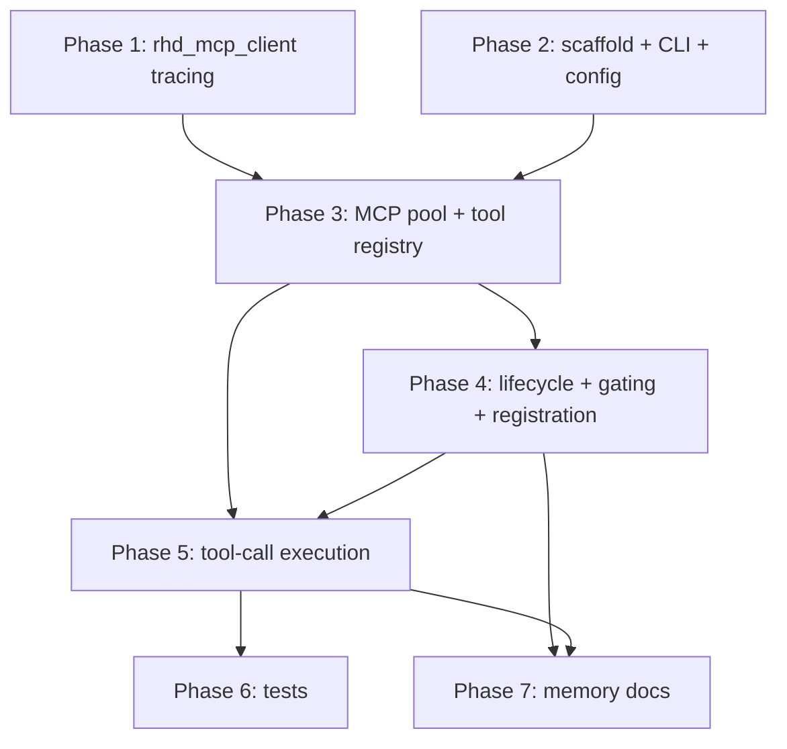

# Grand Plan: `rhd_plugin_mcp` — MCP Servers as Chat Plugins

## Summary

Introduce a new plugin, `rhd_plugin_mcp`, that bridges external MCP (Model Context Protocol) servers into the RHD chat system. The plugin:

1. Accepts standard plugin args (`--server-url`, `--plugin-id`) plus `--worktree <workTreeId>` and `--config <configPath>`.
2. Reads a YAML config listing MCP servers (`cmd`, `args` with `env: VAR` substitution, optional `cwd` defaulting to the plugin's working directory, optional `env` map for the server process, optional `id`, optional `registerOnTag`).
3. Spawns all configured MCP servers at startup and collects their tool definitions.
4. Registers those tools on eligible chats, prefixed with `<name>:` (e.g. `filesystem:read_file`).
5. Subscribes to tool calls for the tools it registered, executes them against the owning MCP server, and pushes results back as `tool`-role messages.
6. Gates chats by worktree tag: with `--worktree X` only chats tagged `worktree:X`; without it, only chats carrying **no** `worktree:*` tag.
7. Additionally gates per-server via `registerOnTag` (e.g. `mcp:common`).

It also migrates `rhd_mcp_client` from `eprintln!`-based debug output to `tracing`, and replaces the stale `memory/features/mcp-tools.md` with an accurate feature-memory file for the new plugin.

## Reused Building Blocks (verified in codebase)

- `rhd_mcp_client::McpClient::connect(cmd, args, cwd, env)` — spawns server, performs `initialize`/`notifications/initialized`, and caches `tools/list` results. `call_tool(name, args_json_str) -> ToolResult`.
- `rhd_chat_client::ChatClient` — `register_plugin`, `get_pending_acks`, `add_tools`, `add_message` (role `tool` + `tool_call_id`), `on_tool_call(chat_id=0, tool_names, cb)` (exact-match filter against event `tool_names`), `on_custom_event` (must ack everything), `create_chat_monitor` / `create_plugins_monitor`.
- `rhd_chat_client::ChatMonitor` — `ChatState { tags, messages, version, ... }`, `on_chat_state_change` callbacks, `subscribe_to_all_chats`; already the canonical event-driven pattern (no polling).
- `rhd_plugin_todo_list` — reference implementation for lifecycle: new-chat detection, tool registration, tool-call handling, duplicate-result guard, ack-all-custom-events.
- `rhd_plugin_system_prompt/src/config.rs` — reference for `--config` YAML loading + startup validation.

## Architectural Decisions

- **AD-1. Tool naming/prefix.** Registered tool name = `{name}:{mcp_tool_name}` (user-specified `<name>:` convention). The optional `id` (defaults to `name`) is the internal identity key for the server entry; config validation rejects duplicate `name`s (prefix collision) and duplicate `id`s. Routing on call: split at first `:`, look up the owning server entry, call the MCP with the bare tool name. This supersedes the stale `{mcp_id}/` convention in `memory/features/mcp-tools.md`.
- **AD-2. Chat gating predicate (AND of two rules).** A server's tools are registered on a chat iff:
  - Worktree rule: `--worktree X` given → chat tags contain `worktree:X`; not given → chat tags contain no tag starting with `worktree:`.
  - Tag rule: server has no `registerOnTag` → always eligible; otherwise chat tags must contain that exact tag.
- **AD-3. Registration is additive and idempotent.** Tools are registered once per (chat, server). If a chat later gains an eligible tag, the remaining servers' tools get registered then. Tools are never unregistered when tags are removed; execution of already-registered tools continues (tracked per-chat registration set) to avoid breaking in-flight conversations.
- **AD-4. Eager server startup.** All configured MCP servers are spawned at plugin startup (per user requirement "read config and start all mcp"). A server that fails to spawn/initialize fails plugin startup with a clear error.
- **AD-5. Serialized calls per server.** `StdioTransport` is a strict request/response line protocol; concurrent `call_tool`s on one server could interleave. Each server handle is wrapped in `tokio::sync::Mutex` so calls to the same MCP server are serialized; different servers run in parallel.
- **AD-6. `env`/`cwd` handling.** Two distinct mechanisms:
  - **Arg substitution:** `args` items are either plain strings or `env: VAR` mappings (serde `untagged`), resolved from the plugin's own environment at config load. Missing env var → hard startup failure naming the server and variable (config-validation convention from `plugins/README.md`).
  - **Server process settings:** each entry may declare an `env:` map (literal key/value pairs injected into the spawned server's environment, on top of the inherited ones) and a `cwd:`. When `cwd` is omitted, the server inherits the plugin's working directory at startup (pass `None` to `McpClient::connect`, which leaves the child's cwd inherited). `cwd` values are used as given (absolute or relative to the plugin's cwd).
  Both map directly onto the existing `McpClient::connect(cmd, args, cwd, env)` signature — no changes needed in `rhd_mcp_client` for this.
- **AD-7. Logging in `rhd_mcp_client`.** Replace the `crate::DEBUG` static + `eprintln!` pair in `transport.rs` with `tracing::debug!` gated by the subscriber's level; add `tracing` as a workspace dep to the crate. Remove the now-unused `DEBUG` static from `lib.rs`. Child-process `stderr` stays inherited (server logs, not crate prints).
- **AD-8. Custom-event etiquette.** The plugin subscribes to `on_custom_event` and acknowledges every event (handling none), so it never blocks `ai_completions:preRequest` coordination. Event callbacks `tokio::spawn` their work (never block the WS read task).
- **AD-9. CLI arg naming.** Existing plugins use `--server-url` (not `--host`); the new plugin follows that convention for consistency. Defaults: `--plugin-id mcp`.

## Phases

### Phase 1 — `rhd_mcp_client` logging migration

**Goal:** Replace prints/`eprintln!` debug output in `rhd_mcp_client` with `tracing`, so the crate is usable from tracing-based plugins.

**Files:**
- `packages/rhd_mcp_client/Cargo.toml` — add `tracing` (workspace dep).
- `packages/rhd_mcp_client/src/transport.rs` — replace the two `DEBUG`-gated `eprintln!` calls with `tracing::debug!` (structured fields: direction + payload).
- `packages/rhd_mcp_client/src/lib.rs` — remove the `pub static DEBUG` (and `AtomicBool` import) if no longer referenced.

**Dependencies:** none (independent of plugin phases; can run in parallel with Phase 2).

### Phase 2 — Plugin crate scaffold, CLI args, and config

**Goal:** A compiling `rhd_plugin_mcp` binary that parses CLI args, loads/validates the YAML config (incl. `env:` resolution), and exits cleanly (no behavior yet).

**Files:**
- `Cargo.toml` (workspace root) — add `plugins/rhd_plugin_mcp` member.
- `plugins/rhd_plugin_mcp/Cargo.toml` — deps: `rhd_chat_api`, `rhd_chat_client`, `rhd_mcp_client`, `tokio`, `serde`, `serde_yaml`, `serde_json`, `clap`, `tracing`, `tracing-subscriber`, `thiserror`.
- `plugins/rhd_plugin_mcp/src/main.rs` — clap `Args { server_url, plugin_id (default "mcp"), worktree: Option<String>, config: String }`; tracing init (same pattern as other plugins).
- `plugins/rhd_plugin_mcp/src/config.rs` — `McpServerConfig { id: Option<String>, name, cmd, args: Vec<ArgValue>, cwd: Option<String> /* default: plugin's cwd (None → inherited) */, env: HashMap<String, String> /* default empty; literal pairs for the server process */, register_on_tag: Option<String> /* registerOnTag */ }` with `deny_unknown_fields` + `rename_all = "camelCase"`; `ArgValue` untagged (string | `{env: VAR}`); `load_config()` resolves `id` default, expands `env:` args, validates duplicate names/ids, clear thiserror variants.
- `plugins/rhd_plugin_mcp/src/lib.rs` — module exports (mirrors other plugins).
- `plugins/rhd_plugin_mcp/README.md` — purpose, CLI usage, config format, gating rules, tags/events (per plugin README template).

**Dependencies:** none (parallel with Phase 1).

### Phase 3 — MCP server pool and tool registry

**Goal:** At startup, spawn all configured servers, collect tool definitions, and build the routing table `{prefix} → (server, bare tool name)` plus chat-facing `ToolDefinition`s (`{name}:{tool}` mapped from MCP `inputSchema` → chat_api `function.parameters`).

**Files:**
- `plugins/rhd_plugin_mcp/src/mcp_pool.rs` — owns `HashMap<id, Mutex<McpClient>>` + per-server tool list; `startup(configs)` spawns/initializes all via `McpClient::connect(cmd, args, cwd, env)` — passing the configured `cwd` (or `None` to inherit the plugin's cwd) and the configured `env` map (fail-fast on any spawn/initialize error); `call_tool(server_id, name, args_json)` serialized per server (AD-5); maps `rhd_mcp_client::ToolDefinition` → `rhd_chat_api::ToolDefinition` with prefixed names (AD-1); exposes tool-name list for subscription and a routing lookup.

**Dependencies:** Phase 2 (config types).

### Phase 4 — Plugin lifecycle, chat gating, and tool registration

**Goal:** Full plugin lifecycle with per-chat, per-server tool registration honoring worktree + `registerOnTag` gating (AD-2, AD-3).

**Files:**
- `plugins/rhd_plugin_mcp/src/gating.rs` — pure predicate functions: `worktree_eligible(chat_tags, worktree: Option<&str>)`, `server_eligible(chat_tags, register_on_tag)`; unit-testable in isolation.
- `plugins/rhd_plugin_mcp/src/plugin.rs` — `run_plugin(args, config, pool)`: connect (retry), `register_plugin`, `get_pending_acks` + ack, create `ChatMonitor`, `subscribe_to_all_chats`, `on_chat_state_change` → compute newly-eligible (chat, server) pairs not yet registered → `add_tools`; per-chat registration set (idempotency); startup reconciliation pass over existing chats; `on_custom_event` ack-all (AD-8); keep-alive loop.
- `plugins/rhd_plugin_mcp/src/main.rs` — wire config → pool → `run_plugin`.

**Dependencies:** Phases 2, 3.

### Phase 5 — Tool-call execution and result push

**Goal:** React to AI tool calls for registered tools, execute against the owning MCP server, and answer every call with a `tool`-role message.

**Files:**
- `plugins/rhd_plugin_mcp/src/tool_handler.rs` — `on_tool_call(chat_id = 0, all_prefixed_tool_names, cb)`: for each matching `tool_call` in the event — verify prefix is registered for that chat (AD-3), duplicate-result guard (existing tool message with same `tool_call_id`), strip prefix, route to pool, `call_tool` with `function.arguments`; on success add message `{role: "tool", tool_call_id, content: result}`; on MCP/protocol error add the error text as tool content (model decides how to handle, matching existing MCP behavior); structured tracing of call + result.
- `plugins/rhd_plugin_mcp/src/plugin.rs` — register the subscription; spawn handler work off the read task.

**Dependencies:** Phases 3, 4.

### Phase 6 — Tests

**Goal:** Confidence in gating, config, and routing logic following project testing conventions.

**Files:**
- `plugins/rhd_plugin_mcp/src/config.rs` (inline `#[cfg(test)]`) — YAML parse incl. the example from the task (extended with `cwd` and server-level `env`), args `env: VAR` resolution (set + missing → error), defaults (`id` → name, `cwd` → None, `env` → empty), duplicate name/id rejection, `deny_unknown_fields`.
- `plugins/rhd_plugin_mcp/src/gating.rs` (inline tests) — truth table: with/without `--worktree`, `worktree:*` presence, `registerOnTag` match/mismatch, AND-composition.
- `plugins/rhd_plugin_mcp/src/mcp_pool.rs` (inline tests) — tool-definition mapping/prefixing and routing lookup (pure parts).
- `plugins/rhd_plugin_mcp/tests/integration_test.rs` — end-to-end against a running chat server + a stub MCP server (spawn a trivial JSON-RPC responder or reuse an existing test harness pattern from `rhd_plugin_todo_list/tests/`), covering registration on eligible/ineligible chats and a tool call round-trip.

**Dependencies:** Phases 1–5.

### Phase 7 — Memory base update

**Goal:** Remove stale knowledge, document the new feature accurately.

**Files:**
- `memory/features/mcp-tools.md` — **delete** (stale).
- `memory/features/mcp-plugin.md` — **new** product-view feature memory: plugin purpose, CLI args, config format with `env:`/`registerOnTag`, `<name>:` tool prefixing, worktree gating behavior, tool-call execution flow, error handling from user perspective.
- `memory/MEMORY.md` — replace the `features/mcp-tools.md` index row with the new file and updated "when to read" description.
- `memory/features/plugins.md` — add an "MCP Plugin" section under Example Plugins; adjust any stale `{mcp_id}/` references.

**Dependencies:** Phases 2–5 (documents final behavior). Can start after Phase 5 design is frozen.

## Dependency Graph

Phases 1 and 2 are independent and can run in parallel. Phase 1 only becomes a hard prerequisite at the point where Phase 3 depends on the crate's final logging interface (behavior-compatible, so integration risk is minimal).

## Success Criteria

1. `cargo check` / `cargo build` clean for the whole workspace; `mise run check-cargo` passes; no file exceeds size limits.
2. `rhd_mcp_client` contains no `print!`/`eprintln!` debug output; wire tracing is controlled by the consumer's `EnvFilter`.
3. `rhd_plugin_mcp --server-url ... --plugin-id mcp --config ... [--worktree W]` starts, spawns every configured MCP server with its resolved `cmd`/`args` (incl. `env: VAR` substitution), `cwd` (defaulting to the plugin's working directory), and `env` map, and registers in the chat server.
4. On a chat tagged `worktree:W` (with `--worktree W`) or an untagged chat (without `--worktree`), all eligible servers' tools appear via `getTools` as `{name}:{tool}`; servers with `registerOnTag` appear only on chats carrying that tag.
5. An AI tool call to `{name}:{tool}` is executed against the right MCP server exactly once (duplicate-result guard) and answered with a `tool`-role message carrying the matching `tool_call_id`; MCP errors surface as tool content, not plugin crashes.
6. `ai_completions:preRequest` does not time out while this plugin is registered (ack-all behavior).
7. All Phase 6 tests pass via `mise run test-cargo`.
8. `memory/features/mcp-tools.md` is gone; `memory/features/mcp-plugin.md` + index/`plugins.md` updates accurately describe the shipped behavior; plugin `README.md` follows the plugin template.
