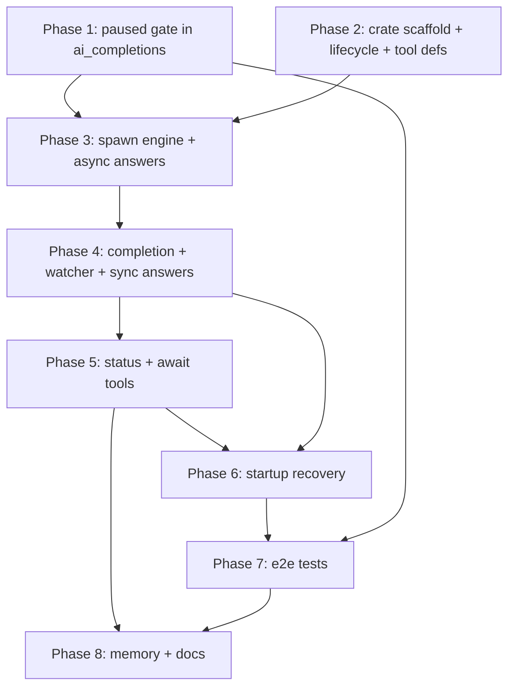

# Grand Plan: `rhd_plugin_sub_chat` — Delegated Subchats

## Summary

Introduce a new plugin, `rhd_plugin_sub_chat`, that lets the assistant in any chat delegate work to a fresh **subchat** — a regular chat created with initial system/user messages and tags, processed by the full existing pipeline (system prompts, MCP tools, todo contracts, AI completions). Three tools are exposed in every chat:

- `rhd_sub_chat` — spawn a subchat with `messages` (roles restricted to `system`/`user`), optional extra `tags`, optional `async` flag. Async mode answers the tool call immediately with a background notice; sync mode parks the caller's tool loop until the subchat goes idle and answers with the subchat's final assistant message.
- `rhd_sub_chat_status` — answer `pending` / `completed` for a direct-child subchat.
- `rhd_sub_chat_await` — answer the last assistant message content when the subchat is completed; hold the call (parking the caller's loop) until then.

Foundation: a platform-level **`paused` chat tag** honored by `ai_completions` (never triggers a request on paused chats). Spawning works as *create paused → populate queue → remove `paused`*, which makes the whole feature crash-safe: the plugin persists no private state, and all unfinished work is reconstructible from chat history and tags after a restart.

No protocol, database, server, or frontend changes are required — every primitive exists today.

## Reused Building Blocks (verified in codebase)

- `rhd_chat_client::ChatClient` — `create_chat` (accepts initial tags atomically), `add_queue_message`, `add_message` (role `tool` + `tool_call_id`), `update_chat` (additive/subtractive tags), `get_messages` (`with_unresolved_tool_calls` filter, server-supported), `list_chats` (tags in summaries), `add_tools`, `on_tool_call(chat_id = 0, tool_names, cb)` (wildcard subscription), `on_custom_event`, `get_pending_acks`.
- `rhd_chat_client::ChatMonitor` — refetches full state (messages, queue count, tags, version) on every mutating event and fires `on_chat_state_change`; `subscribe_to_all_chats` picks up chats the plugin itself creates. Already the canonical event-driven pattern.
- `rhd_plugin_choice/src/plugin.rs` — reference lifecycle: register → drain pending acks → ack-all custom events → monitor → per-chat tool registration with an `initialized_chats` set. Its core idea — **an unresolved tool call parks the parent's tool loop** — is the entire blocking mechanism for sync spawn and await.
- `rhd_plugin_todo_list/src/tool_handler.rs` — reference for answering tool calls: iterate `message.tool_calls`, duplicate-result guard via "a `tool` message with this `tool_call_id` already exists", answer with `add_message(role="tool")`.
- `plugins/rhd_plugin_ai_completions/src/trigger_detection.rs` / `tool_resolution.rs` — trigger gating on error tag and unresolved tool calls; the pure helpers to mirror (not share) in the new plugin.
- `templates/mcp_internal/rhd_choice/tool_definition.json` — tool-definition template layout embedded via `include_dir!`.

## Architectural Decisions

- **AD-1. Blocking = delayed tool-call answer.** Sync spawn and `rhd_sub_chat_await` do not "wait" anywhere actively; they simply omit answering the call. `ai_completions` guarantees the parent loop cannot continue while any tool call is unresolved (same contract the choice plugin uses against humans). This removes any need for new protocol surface and makes parked calls visible in the UI as unresolved tool calls.
- **AD-2. Completion is inferred from chat state, not tagged.** A subchat is **completed** iff: its last message is an `assistant` message with `is_finished = true` and `is_streaming = false`; it has no unresolved tool calls; its queue is empty; and it carries neither `ai_completions:running` nor `ai_completions:error`. The previously considered `ai_completions:finished` tag was rejected: it would need a remove-on-reactivate lifecycle and a version-ordered "finished after my request" comparison, while inference is self-validating, has no stale state, and keeps `ai_completions` untouched beyond AD-3.
- **AD-3. The `paused` tag is a platform feature.** Bare name `paused` (not plugin-namespaced), honored by `ai_completions::trigger_detection` exactly like the error tag: a paused chat never triggers. Users can pause any chat from the UI; removing the tag bumps the chat version and the standard state-change flow resumes processing. Rationale: it turns subchat spawn into a *two-phase activation* (stage paused → atomically activate), which eliminates all ambiguous crash windows, at the cost of one small gate in `ai_completions`.
- **AD-4. Tag scheme on chats.**
  - Caller A (spawner) gets `root:<A>` if and when it first spawns and has no root tag yet.
  - New chat B gets, in the atomic `createChat`: `parent:<A>`, `root:<top>` (inherited from A's existing `root:*` if present — so in a chain A→B→C, C carries `root:<A>`, giving full tree lineage from one tag scan), `sub_chat:call:<toolCallId>` (the link tag binding B to the spawning tool call), user-requested tags, and `paused`.
  - User-supplied tags colliding with reserved shapes (`parent:`, `root:`, `sub_chat:` prefixes, exact `paused`) are a validation error.
  - Tag ordering requirement ("tags before queue") is satisfied structurally: tags land in `createChat`, before any `add_queue_message`.
- **AD-5. Direct-child rule for status/await.** `rhd_sub_chat_status` and `rhd_sub_chat_await` accept only a chat carrying `parent:<callerChatId>`. Grandchildren, siblings, and unrelated chats get a tool error. This also makes cyclic awaits impossible by construction (a child's completion never depends on the parent's loop state), so no explicit ancestor-walk is needed.
- **AD-6. Answer contracts.** Async spawn answers immediately after activation with exactly: `Chat started in background with id <chatId>, use tools rhd_sub_chat_status or rhd_sub_chat_await on it`. Sync spawn and await answer with the subchat's last assistant message `content` verbatim (no wrapper, no reasoning). Status answers exactly `pending` or `completed` — no reason suffix. No timeouts anywhere: a hung/parked subchat keeps waiters pending; fixing it is an operator action per requirements.
- **AD-7. Zero private persistence; full restart recovery.** The plugin reconstructs everything at startup: scan every chat's messages with `with_unresolved_tool_calls`, filter calls to the three tool names, then re-drive. The `<toolCallId>` link tag makes spawn recovery deterministic; `await` args contain the target id directly; `status` is trivially re-answerable. Every answer path shares one idempotency guard (tool result for `tool_call_id` already exists), so duplicate events and recovery scans can overlap safely. If a watched chat was deleted, the failed answer is logged and the waiter dropped — deleted subchats are explicitly the user's problem.
- **AD-8. Event-driven, non-blocking, polite.** All handling runs off `on_tool_call` / `on_chat_state_change` with `tokio::spawn` (never block dispatch); the plugin acknowledges **all** custom events unhandled — otherwise its own subchats' `preRequest` waits would time out and park them with `ai_completions:error`.
- **AD-9. Tools registered in every chat, including subchats.** The choice-style per-chat registration gives recursion for free: a subchat can spawn its own subchats, await them, etc., with no special-casing.
- **AD-10. Title is always generated** (`sub · <first ~40 chars of the first user message>`); no title parameter. Subchats appear as regular chats; frontend tree grouping is deferred.
- **AD-11. `rhd_sub_chat` only spawns new chats** — it never appends to or resumes an existing chat. Multi-round interaction with a subchat happens by awaiting it and… awaiting again only makes sense for human-driven activity; there is no resume API in scope.
- **AD-12. Pure helpers are copied into the plugin crate** (unresolved-tool-call computation, completion predicate) rather than extracted into a shared crate — plugins are self-contained binaries; extraction can follow later if duplication hurts.
- **AD-13. Error policy.** Malformed tool arguments (bad roles, empty `messages`, reserved-tag collisions) → descriptive tool error result, no chat created, parent loop continues so the model can retry. Mid-spawn failure after `createChat` → error result naming the (still-`paused`) subchat id; the chat is not deleted, recovery or an operator can finish the job. A queue that no longer matches the stored arguments prefix while `paused` (human tampering) → refuse to reconcile, error the call, leave the subchat paused.

## Phases

### Phase 1 — `paused` gate in `ai_completions`

**Goal:** The `paused` chat tag suppresses AI completion triggers, and removing it resumes normal flow. Independent, backward-compatible, shippable on its own (a general operator/UI control).

**Files:**
- `plugins/rhd_plugin_ai_completions/src/trigger_detection.rs` — add the paused check alongside the existing error-tag check in `should_trigger`; a pure `has_paused_tag` helper; inline unit tests (paused blocks queued-messages and tool-loop triggers; error + paused precedence irrelevant; unpause restores).
- `plugins/rhd_plugin_ai_completions/src/ai_request.rs` — reference only (no changes): confirms nothing else consults tags for gating.
- `plugins/rhd_plugin_ai_completions/tests/` — extend the existing integration suite with a "paused chat with queued messages never receives a request; unpausing triggers it" scenario.

**Dependencies:** none. Must land before Phase 3 e2e validation (Phase 3 relies on the gate for two-phase activation semantics).

### Phase 2 — Plugin crate scaffold, lifecycle, tool definitions, tag vocabulary

**Goal:** A compiling, running `rhd_plugin_sub_chat` binary that registers with the server, acknowledges all custom events, registers the three tools in every chat (visible in the Tools tab), and does nothing else. Establishes the module skeleton all later phases fill.

**Files:**
- `Cargo.toml` (workspace root) — add `plugins/rhd_plugin_sub_chat` member.
- `plugins/rhd_plugin_sub_chat/Cargo.toml` — deps mirroring the choice plugin (`rhd_chat_api`, `rhd_chat_client`, `tokio`, `serde`, `serde_json`, `clap`, `tracing`, `tracing-subscriber`, `thiserror`, `include_dir`, `chrono` as needed).
- `plugins/rhd_plugin_sub_chat/src/main.rs` — CLI: `--server-url`, `--plugin-id` (default `rhd_plugin_sub_chat`); no config file (no credentials, no settings); tracing init per existing convention.
- `plugins/rhd_plugin_sub_chat/src/lib.rs` — module exports.
- `plugins/rhd_plugin_sub_chat/src/plugin.rs` — lifecycle: connect (retry) → register → drain pending acks → `on_custom_event` ack-all → `ChatMonitor` + `subscribe_to_all_chats` → per-chat `addTools` of the three definitions (initialized-set idempotency, choice pattern) → keep-alive loop.
- `plugins/rhd_plugin_sub_chat/src/tags.rs` — tag vocabulary as one source of truth: `paused` constant, `parent:<id>` / `root:<id>` / `sub_chat:call:<id>` builders and parsers, reserved-shape collision check, root-inheritance resolution helper. Pure, unit-tested.
- `plugins/rhd_plugin_sub_chat/src/templates.rs` — embed and expose the three tool-definition JSONs (`include_dir!`, same pattern as `rhd_plugin_choice`).
- `templates/mcp_internal/rhd_sub_chat/tool_definition.json`, `templates/mcp_internal/rhd_sub_chat_status/tool_definition.json`, `templates/mcp_internal/rhd_sub_chat_await/tool_definition.json` — JSON schemas per the locked contract: `rhd_sub_chat` = `{messages: [{role: system|user, content: string}], tags?: [string], async?: boolean}`, `rhd_sub_chat_status` / `rhd_sub_chat_await` = `{chatId: integer}`; descriptions written to teach the model the delegation contract (roles restricted, async semantics, direct-child rule, completion = final assistant message).
- `plugins/rhd_plugin_sub_chat/README.md` — per the plugin README template: triggers, events, tags added, error handling.

**Dependencies:** none (parallel with Phase 1).

### Phase 3 — Spawn engine and async answer path

**Goal:** `rhd_sub_chat` with `async: true` fully works end-to-end: validation → root resolution → two-phase activation (create paused with all tags → queue messages in order → unpause) → immediate background-notice answer. The subchat then runs through the normal AI pipeline untouched. Sync mode spawns identically but leaves the call unanswered via a placeholder hook into Phase 4's watcher (feature-flagged internal seam, not a stubbed tool).

**Files:**
- `plugins/rhd_plugin_sub_chat/src/spawn.rs` — argument parsing/validation (AD-13 error texts), root inheritance + caller self-tagging (AD-4), `createChat` with the atomic tag set, ordered `add_queue_message` loop, `paused` removal, mid-spawn failure policy; plus the **re-drive primitive** reused by recovery: given (caller chat, tool call, stored args) converge B to "activated" (create-if-missing, reconcile a `paused` queue as prefix of args, unpause).
- `plugins/rhd_plugin_sub_chat/src/handler.rs` — `on_tool_call(0, [rhd_sub_chat], …)`: per-call duplicate-result guard, dispatch to `spawn.rs`, answer async calls with the exact AD-6 string; sync calls → hand off to the watcher seam.
- `plugins/rhd_plugin_sub_chat/src/reply.rs` — shared answering utilities: "does a `tool` result for this `tool_call_id` already exist?" guard (todo_list pattern) and `add_message(role="tool", tool_call_id, content)`; used by every phase from here on.
- `plugins/rhd_plugin_sub_chat/src/plugin.rs` — wire the subscription; work spawned off the dispatch path.

**Dependencies:** Phase 2 (scaffold, tags, templates, definitions). Requires Phase 1 deployed for the two-phase activation guarantee to hold under e2e.

### Phase 4 — Completion detection, watcher, and sync answer path

**Goal:** The plugin watches activated subchats; when one satisfies the completion predicate (AD-2), every waiter's tool call is answered with the subchat's last assistant message content. Sync `rhd_sub_chat` now completes its loop: caller parks at the unresolved call, resumes when the subchat finishes.

**Files:**
- `plugins/rhd_plugin_sub_chat/src/completion.rs` — pure predicate over chat state (last-message shape, unresolved-call scan, queue count, running/error tags): the single place AD-2 is encoded; exhaustive inline unit tests.
- `plugins/rhd_plugin_sub_chat/src/watcher.rs` — in-memory `subChatId → [Waiter { parentChatId, toolCallId }]` map behind an async lock; registration API used by phases 3–6; a `ChatMonitor.on_chat_state_change` hook that evaluates only watched chats and broadcasts answers to all waiters through `reply.rs` (guarded, idempotent); waiter-drop on failed answers (deleted chats).
- `plugins/rhd_plugin_sub_chat/src/handler.rs` — sync path completion: replace the Phase 3 seam with real watcher registration.
- `plugins/rhd_plugin_sub_chat/src/plugin.rs` — install the state-change hook (single callback, fan-in to the watcher).

**Dependencies:** Phase 3 (spawn produces watched subchats; `reply.rs` exists).

### Phase 5 — Status and await tools

**Goal:** `rhd_sub_chat_status` and `rhd_sub_chat_await` answer per contract: fresh evaluation (status) or watcher registration with immediate-answer-if-already-complete (await); both enforcing the direct-child rule with clear error results (AD-5).

**Files:**
- `plugins/rhd_plugin_sub_chat/src/handler.rs` — subscribe the two remaining tool names; parse `chatId`; locate the target chat's current state (monitor cache, falling back to `getChat`); enforce `parent:<callerChatId>`; status → `pending`/`completed` from `completion.rs`; await → answer-now or register waiter (reuses everything from Phase 4).
- `plugins/rhd_plugin_sub_chat/src/tags.rs` — direct-child predicate helper if not already present.
- `plugins/rhd_plugin_sub_chat/src/templates.rs` / tool definitions — already shipped in Phase 2; no schema change.

**Dependencies:** Phase 4 (predicate + watcher). Independent of recovery; can run parallel with Phase 6 in principle but is ordered first for e2e completeness.

### Phase 6 — Startup recovery (re-drive unfinished tool calls)

**Goal:** After a plugin or server restart, all unfinished subchat work resumes with no lost or duplicated answers — proving AD-7. Runs once at startup, before the keep-alive loop.

**Files:**
- `plugins/rhd_plugin_sub_chat/src/recovery.rs` — iterate monitored chats; `getMessages(chatId, withUnresolvedToolCalls)`; filter to the three tool names; skip calls already answered (`reply.rs` guard); dispatch per call: unresolved `rhd_sub_chat` → look up B by `sub_chat:call:<toolCallId>` in `listChats` and re-drive via Phase 3's converge primitive (absent → full spawn; paused → prefix-reconcile queue then unpause; mismatched queue → error answer, leave paused; activated → sync: register waiter or answer if complete; async: answer the background notice late); unresolved `rhd_sub_chat_await` → revalidate direct-child → register or answer; unresolved `rhd_sub_chat_status` → answer fresh.
- `plugins/rhd_plugin_sub_chat/src/plugin.rs` — invoke recovery after monitor subscription; guard the race between live events and recovery with the shared idempotency guards.
- `plugins/rhd_plugin_sub_chat/src/spawn.rs` — (from Phase 3) converge primitive is the only reused piece; no new logic here beyond what Phase 3 already factored.

**Dependencies:** Phases 3–5 (needs spawn primitives, watcher, and all three call shapes defined).

### Phase 7 — End-to-end test suite

**Goal:** Lock the complete contract with mock-AI-provider e2e tests mirroring `plugins/rhd_plugin_ai_completions/tests/tool_call_e2e_test.rs` infrastructure, covering the scenarios the unit layers cannot: cross-plugin timing and restart re-drive.

**Files:**
- `plugins/rhd_plugin_sub_chat/tests/sub_chat_e2e_test.rs` — scenarios: sync round-trip (parent tool call → subchat answer → parent receives content verbatim → parent loop continues); async (immediate exact notice; `status` goes `pending` → `completed`; `await` returns final content); parked subchat (`ai_completions:error`) stays `pending`, un-parking resolves a live await; validation errors answered without spawning; non-direct-child status/await error; nested spawn (B spawns C; A cannot await C); recovery after killing the plugin mid-spawn while `paused` (re-drive completes queue in order and activates — assert no duplicate messages); a paused chat never triggers `ai_completions` (Phase 1 integration from the consumer side).
- Possibly a shared `tests/common/` module if the existing harness helpers need extraction (pattern exists under `plugins/rhd_plugin_mcp/tests/common`).

**Dependencies:** Phases 1–6 (tests the assembled feature).

### Phase 8 — Memory and documentation update

**Goal:** Knowledge base reflects the shipped feature so future work builds on facts, not guesses.

**Files:**
- `memory/features/plugins.md` — new "Sub Chat Plugin" section (tools, spawn/activation protocol, tags incl. link tag, completion semantics, recovery model); extend the AI Completions section's Chat Tags list with the `paused` gate behavior.
- `memory/architecture.md` (or `protocols.md` note, whichever the librarian convention favors) — one line: `paused` is a server-visible tag with cross-plugin meaning.
- `memory/configuration.md` — example `rhd start` children entry for the new plugin (no config file, `--server-url`/`--plugin-id`).
- `README.md` (repo root) — add the plugin to the plugins overview alongside existing entries.

**Dependencies:** Phase 5 at minimum for stable behavior; ideally after Phase 7 confirms the contract. No code coupling.

## Dependency Graph

Parallelization notes:
- Phases 1 and 2 are fully independent of each other and of everything else — the only true parallel start. Phase 1 is independently shippable (a useful operator control even without subchats).
- Phase 5 is small and sits after Phase 4 because it reuses the predicate and the watcher; Phase 6 then needs all three call shapes defined.
- Phase 8 can begin drafting once Phase 5 lands; final wording should wait for Phase 7 green.

## Success Criteria

The grand plan is complete when all of the following hold:

1. **Checks:** workspace builds clean; `mise run check-cargo` and frontend checks (untouched here) pass; the code-splitting convention (>400-line files) respected in the new crate.
2. **Paused gate:** a chat carrying `paused` never triggers `ai_completions` (queued messages or tool-loop state); removing the tag resumes the standard flow.
3. **Spawn contract:** `rhd_sub_chat` (both modes) creates the subchat with `parent:`/`root:`/`sub_chat:call:`/user tags atomically before queueing; starting messages land in queue order with roles restricted to `system`/`user`; the subchat runs the full pipeline and is visible in the UI as a regular chat; the async answer matches the locked wording exactly, including the new chat id and the pointer to status/await tools.
4. **Sync/await contract:** the caller's tool loop demonstrably parks at the unanswered call and resumes exactly when the completion predicate (AD-2) first holds, answering with the last assistant `content` verbatim; every waiter of a subchat is answered once and only once.
5. **Status contract:** answers are literal `pending` / `completed`, evaluated fresh; parked-errored subchats read as `pending` indefinitely and flip correctly after an operator clears the error tag and the subchat next goes idle.
6. **Scope rule:** status/await on anything that is not a direct child of the caller (grandchild, sibling, unrelated chat) returns a tool error; nesting (B spawning and awaiting C) works otherwise.
7. **Recovery:** killing the plugin at any point of the spawn sequence and restarting it converges to the correct end state — no duplicate messages in the subchat, no orphaned unanswered calls, paused subchats are completed and activated, already-answered calls are never re-answered.
8. **Coordination:** with the plugin registered, `ai_completions:preRequest` / `preDrainQueue` never time out anywhere (ack-all), including inside subchats.
9. **Tests:** the Phase 7 e2e file passes via `mise run test-cargo`; unit coverage exists for tags parsing, completion predicate, queue reconciliation, and answer idempotency.
10. **Docs:** plugin README follows the template; `memory/` updated as described in Phase 8.

## Explicitly Out of Scope

- Frontend presentation of chat trees (grouping, filtering, indenting) — subchats show as regular chats with tags; revisit later.
- Deletion protection or cascade behavior for subchats (deleting a watched subchat is the user's problem; may be constrained in a future plan).
- Resuming/appending messages to an existing subchat via `rhd_sub_chat` (spawn-new-only).
- Await timeouts, cancellation, depth or fanout limits on nesting.
- Streaming partial subchat results into the parent; the parent sees only the final answer.
- Any change to the WebSocket protocol, database schema, or frontend.
