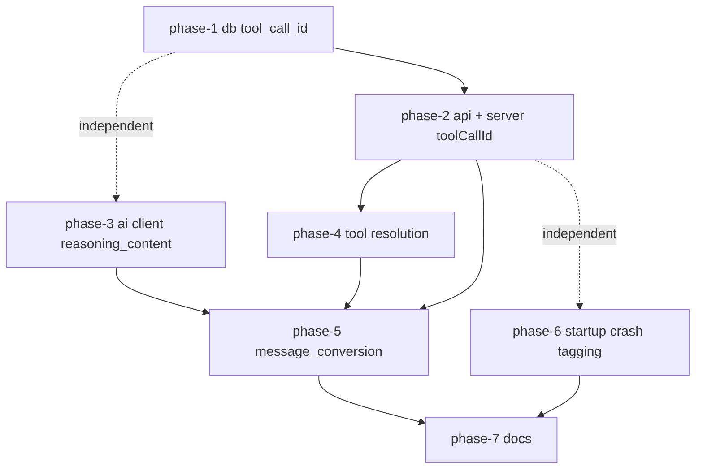

# AI Request Tool Calls & Reasoning — Sub-Plans Index

Source milestone plan: [`ai-request-tool-calls-and-reasoning-plan.md`](../ai-request-tool-calls-and-reasoning-plan.md)

This folder splits the milestone plan (phases P1–P9) into seven implementable sub-plans.
Each sub-plan is self-contained: it lists the exact files, functions, code, and tests to
write, and can be implemented without re-reading the milestone plan (the design decisions
D1–D7 it encodes are restated where needed).

## Mapping: milestone phase → sub-plan

| Milestone | Sub-plan | Scope (crates) |
|---|---|---|
| P1 | [phase-1-db-tool-call-id.md](phase-1-db-tool-call-id.md) | `rhd_db`: `tool_call_id` column + migration + plumbing |
| P2 + P3 | [phase-2-api-server-tool-call-id.md](phase-2-api-server-tool-call-id.md) | `rhd_chat_api` + `rhd_chat_server`: `toolCallId` on the wire + handlers + validation |
| P4 | [phase-3-ai-client-reasoning-content.md](phase-3-ai-client-reasoning-content.md) | `rhd_ai_client`: `reasoning_content` on `ChatMessage::Assistant` |
| P5 | [phase-4-tool-call-resolution.md](phase-4-tool-call-resolution.md) | plugin: real `has_unresolved_tool_calls` / `all_tool_calls_resolved` (D4 gate) |
| P6 + P8 | [phase-5-message-conversion.md](phase-5-message-conversion.md) | plugin: `message_conversion` module, request parking, queue `tool_call_id` carry |
| P7 | [phase-6-startup-crash-tagging.md](phase-6-startup-crash-tagging.md) | plugin: startup reconciliation of crashed chats (D6) |
| P9 | [phase-7-documentation.md](phase-7-documentation.md) | docs: plugin README + plugins README |

P2 and P3 are merged because they form one vertical slice: the `toolCallId` field added to
the API types in P2 is consumed by the server converters/handlers in P3, and neither is
testable end-to-end without the other. P8 is merged into the P6 sub-plan because both touch
`ai_request.rs` and only make sense together (a queued tool message must carry its id so it
passes the new D4 validation).

## Dependency graph



- **phase-1 → phase-2**: phase-2's server handlers pass `tool_call_id` to the DB functions
  created in phase-1. (Phase-1 already appends `None` at the server call sites so the
  workspace compiles after every phase.)
- **phase-2 → phase-4**: resolution matches `Message.tool_call_id` on `tool` messages, which
  only exists after phase-2.
- **phase-3 + phase-4 → phase-5**: `build_chat_messages` needs the `reasoning_content` field
  on `ChatMessage::Assistant` (phase-3) and the working D4 trigger gate (phase-4) as a hard
  prerequisite — shipping the converter without the gate would park every mid-loop chat
  (see milestone plan "Risks / Notes" on ordering).
- **phase-6's production code is independent** of phases 1–5 (it only uses existing
  `is_streaming` / `is_finished` / `update_chat` machinery) and can run in parallel with
  them; its **test fixtures** reference `tool_call_id`, so land it after phase-2 (or
  omit that field from the fixtures if pulled forward).
- **phase-7 (docs) last**, after the behavior is settled.

## Execution order

Sequential: **1 → 2 → 3 → 4 → 5 → 6 → 7** (phase-6 may be pulled forward and done in
parallel with 2–5; phase-3 may be done in parallel with 1–2).

## Validation (run after every phase)

```bash
mise run check-cargo
mise run test-cargo
mise run check-large-files   # must stay green; phase-5 brings ai_request.rs back under 500 lines
```

## Commit convention

Per [`memory/development.md`](../../memory/development.md): short lowercase messages, e.g.
`add tool_call_id column to chat db`, `pass tool_call_id through chat api and server`,
`send assistant reasoning_content from ai client`, `implement real tool call resolution`,
`add message_conversion module with integrity gate`, `tag crashed chats at plugin startup`,
`document tool call request fidelity`.
